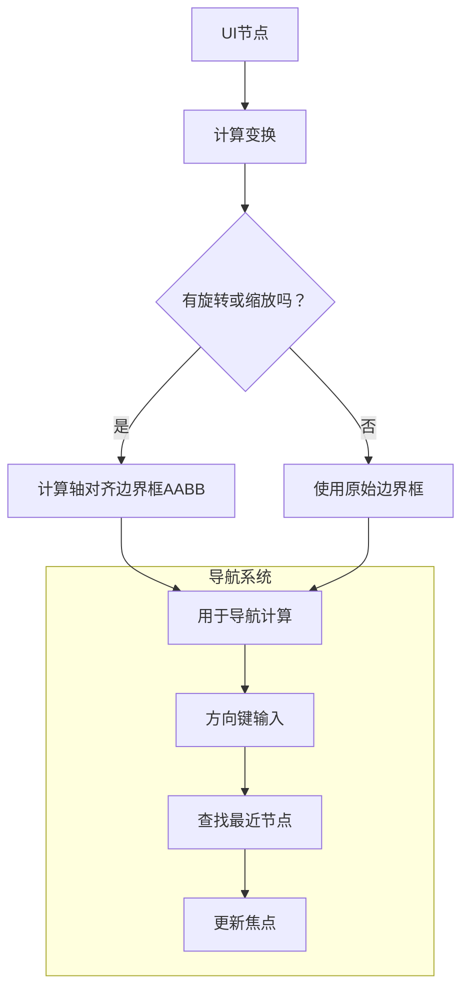

+++
title = "#22399 Directional navigation now considers UiTransform rotation"
date = "2026-01-07T00:00:00"
draft = false
template = "pull_request_page.html"
in_search_index = false

[extra]
current_language = "zh-cn"
available_languages = {"en" = { name = "English", url = "/pull_request/bevy/2026-01/pr-22399-en-20260108" }, "zh-cn" = { name = "中文", url = "/pull_request/bevy/2026-01/pr-22399-zh-cn-20260107" }}
+++

# Title

## 基本信息
- **标题**: Directional navigation now considers UiTransform rotation  
- **PR链接**: https://github.com/bevyengine/bevy/pull/22399
- **作者**: snk-git-hub
- **状态**: 已合并
- **标签**: C-Bug, A-UI, S-Ready-For-Final-Review, D-Straightforward
- **创建时间**: 2026-01-06T06:24:09Z
- **合并时间**: 2026-01-07T22:47:43Z
- **合并者**: cart

## 描述翻译
### 目标
修复 #22234
方向性导航系统在计算导航到哪个节点时忽略了 `UiTransform` 的旋转和缩放。这导致当节点被旋转或缩放时，导航会选中错误的节点，因为系统使用的是未经旋转的布局位置，而非用户看到的视觉位置。

### 解决方案
- 添加了 `get_rotated_bounds()` 辅助函数来计算旋转矩形的轴对齐边界框
- 更新了 `get_navigable_nodes()`，在创建 `FocusableArea` 结构体时应用来自 `UiGlobalTransform` 的旋转和缩放变换
- 更新了 `entity_to_camera_and_focusable_area()` 以应用旋转和缩放变换
- 使用 `bevy_math::ops` 替代 `f32` 方法进行确定性三角函数计算

该修复确保方向性导航使用节点的视觉位置（经过变换后），而不仅仅是布局位置，因此用户可以导航到他们在屏幕上实际看到的按钮。

### 测试
- 使用 `auto_directional_navigation` 示例进行了测试 - 导航在散乱按钮布局中正常工作


## 本次 Pull Request 的故事

### 问题背景
在 Bevy 的 UI 系统中，`auto_directional_navigation` 功能允许用户使用方向键在 UI 元素之间导航。然而，该功能存在一个明显缺陷：它只考虑 UI 元素的原始布局位置，而没有考虑应用在元素上的 `UiTransform` 变换，特别是旋转和缩放。

这意味着如果一个按钮被旋转了 90 度，导航系统仍然会按照它原始未旋转的位置来计算应该导航到哪个方向。从用户视角看，这是错误的，因为用户看到的是按钮在屏幕上的视觉位置，而不是它在布局坐标系中的理论位置。

### 解决方案分析
修复的核心思想很简单：在计算导航时，需要将 UI 元素的变换（旋转和缩放）考虑进去。具体来说，需要计算 UI 元素经过变换后的轴对齐边界框（axis-aligned bounding box, AABB），然后使用这个变换后的边界框进行导航计算。

主要修改集中在 `auto_directional_navigation.rs` 文件中的两个关键函数：
1. `AutoDirectionalNavigator::get_navigable_nodes()`
2. `AutoDirectionalNavigator::entity_to_camera_and_focusable_area()`

这两个函数之前都只使用了变换的平移部分，而忽略了旋转和缩放：
```rust
// 之前：旋转和缩放被忽略
let (_scale, _rotation, translation) = transform.to_scale_angle_translation();
Some(FocusableArea {
    entity,
    position: translation * computed.inverse_scale_factor(),
    size: computed.size() * computed.inverse_scale_factor(),
})
```

### 实现细节
修复方案添加了一个新的辅助函数 `get_rotated_bounds()`，用于计算旋转矩形的边界框：
```rust
fn get_rotated_bounds(size: Vec2, rotation: f32) -> Vec2 {
    if rotation == 0.0 {
        return size;
    }
    let cos_r = ops::cos(rotation).abs();
    let sin_r = ops::sin(rotation).abs();
    Vec2::new(
        size.x * cos_r + size.y * sin_r,
        size.x * sin_r + size.y * cos_r,
    )
}
```

这个函数的数学原理是：当一个矩形旋转时，它在 X 轴上的投影宽度等于原始宽度乘以旋转角余弦的绝对值加上原始高度乘以旋转角正弦的绝对值。对于 Y 轴同理。

在应用这个函数时，代码需要先应用缩放变换，然后计算旋转后的边界：
```rust
// 之后：应用缩放和旋转
let (scale, rotation, translation) = transform.to_scale_angle_translation();
let scaled_size = computed.size() * computed.inverse_scale_factor() * scale;
let rotated_size = get_rotated_bounds(scaled_size, rotation);
Some(FocusableArea {
    entity,
    position: translation * computed.inverse_scale_factor(),
    size: rotated_size,
})
```

这里有几个重要的技术细节：
1. **缩放的应用顺序**：先应用 `inverse_scale_factor()` 来补偿 UI 系统的全局缩放，然后再应用节点的局部缩放
2. **旋转的处理**：旋转是在缩放之后应用的，这意味着如果同时有缩放和旋转，旋转会影响缩放后的尺寸
3. **确定性计算**：使用了 `bevy_math::ops::cos` 和 `bevy_math::ops::sin` 而不是 `f32` 的三角函数，这确保了在不同平台上的确定性行为

### 测试验证
为了验证修复的有效性，作者更新了示例文件，为第 5 个按钮（索引 4）添加了旋转和缩放变换：
```rust
let transform = if i == 4 {
    UiTransform {
        scale: Vec2::splat(1.2),  // 放大到 1.2 倍
        rotation: Rot2::FRAC_PI_2, // 旋转 90 度
        ..default()
    }
} else {
    UiTransform::IDENTITY
};
```

这个测试用例明确展示了修复前后的区别：在修复前，导航系统会错误地选择基于未旋转位置的相邻按钮；修复后，导航会正确地选择用户看到的视觉相邻按钮。

### 架构影响
这个修复影响了 UI 导航系统的核心计算逻辑，但保持了 API 的向后兼容性。修改是局部的，只影响导航计算过程中的边界框计算，不改变任何公开的接口或数据结构。

从性能角度看，新增的旋转边界计算会增加一些计算开销，但这是必要的正确性开销。对于大多数 UI 场景，这个额外的计算开销可以忽略不计。

### 经验教训
这个 PR 展示了一个常见的图形系统问题：局部坐标系和全局坐标系之间的转换。在 UI 系统中，经常需要处理多个层次的变换：
1. 布局系统计算的原始位置和大小
2. 节点自身的变换（平移、旋转、缩放）
3. 父容器的变换
4. 相机/视口的变换

导航系统需要考虑所有这些变换，才能提供符合用户直觉的导航体验。这个修复正确地处理了第 2 层的变换（节点自身的旋转和缩放），但值得注意的是，它可能还需要进一步考虑第 3 层（父容器变换）的影响。

## 视觉表示



## 关键文件更改

### 1. `crates/bevy_ui/src/auto_directional_navigation.rs` (+21/-6)

**更改概述**：添加了旋转边界计算功能并更新了导航计算逻辑。

**关键修改**：
```rust
// 新增的辅助函数
fn get_rotated_bounds(size: Vec2, rotation: f32) -> Vec2 {
    if rotation == 0.0 {
        return size;
    }
    let cos_r = ops::cos(rotation).abs();
    let sin_r = ops::sin(rotation).abs();
    Vec2::new(
        size.x * cos_r + size.y * sin_r,
        size.x * sin_r + size.y * cos_r,
    )
}

// 在 get_navigable_nodes 中的使用
let (scale, rotation, translation) = transform.to_scale_angle_translation();
let scaled_size = computed.size() * computed.inverse_scale_factor() * scale;
let rotated_size = get_rotated_bounds(scaled_size, rotation);
Some(FocusableArea {
    entity,
    position: translation * computed.inverse_scale_factor(),
    size: rotated_size,
})
```

**与 PR 目的的关系**：这是修复的核心实现，确保导航计算时考虑 UI 元素的视觉变换。

### 2. `examples/ui/auto_directional_navigation.rs` (+11/-1)

**更改概述**：更新示例以测试旋转和缩放 UI 元素的导航。

**关键修改**：
```rust
let transform = if i == 4 {
    UiTransform {
        scale: Vec2::splat(1.2),
        rotation: Rot2::FRAC_PI_2,
        ..default()
    }
} else {
    UiTransform::IDENTITY
};
```

**与 PR 目的的关系**：提供了一个直观的测试用例，展示修复后的正确行为。

## 延伸阅读

1. **Bevy UI 系统文档**：了解 Bevy UI 的变换系统和布局系统
2. **轴对齐边界框（AABB）算法**：理解旋转物体边界框计算的数学原理
3. **图形变换矩阵**：深入学习 2D/3D 图形中的变换原理
4. **确定性游戏开发**：了解为什么使用 `bevy_math::ops` 而不是标准库三角函数

相关资源：
- [Bevy UI 教程](https://bevyengine.org/learn/quick-start/getting-started/ui/)
- [2D 旋转和边界框计算](https://en.wikipedia.org/wiki/Rotation_matrix)
- [游戏开发中的确定性物理](https://gafferongames.com/post/fix_your_timestep/)