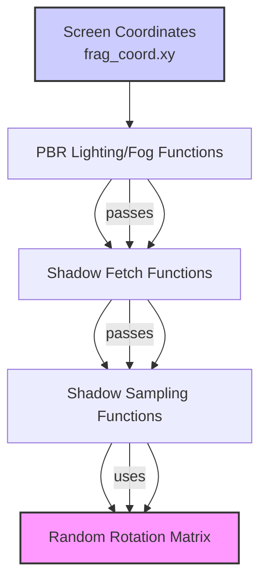

+++
title = "#22400 Reduce aliasing and Moiré patterns in temporal shadow filtering"
date = "2026-01-06T00:00:00"
draft = false
template = "pull_request_page.html"
in_search_index = true

[taxonomies]
list_display = ["show"]

[extra]
current_language = "en"
available_languages = {"en" = { name = "English", url = "/pull_request/bevy/2026-01/pr-22400-en-20260106" }, "zh-cn" = { name = "中文", url = "/pull_request/bevy/2026-01/pr-22400-zh-cn-20260106" }}
labels = ["A-Rendering", "C-Refinement"]
+++

# Title
Reduce aliasing and Moiré patterns in temporal shadow filtering

## Basic Information
- **Title**: Reduce aliasing and Moiré patterns in temporal shadow filtering
- **PR Link**: https://github.com/bevyengine/bevy/pull/22400
- **Author**: superdump
- **Status**: MERGED
- **Labels**: A-Rendering, S-Ready-For-Final-Review, C-Refinement
- **Created**: 2026-01-06T08:10:27Z
- **Merged**: 2026-01-06T20:37:48Z
- **Merged By**: alice-i-cecile

## Description

# Objective

- Reduce aliasing and Moiré patterns in temporal shadow filtering

## Solution

- Use interleaved gradient noise based on screen UV not light local UV

NOTE: It only affects **`ShadowFilteringMethod::Temporal` or non-temporal PCSS**

## Testing

Tested with `pcss` and `shadow_biases` examples. The latter was more useful - see showcase section.

NOTE: It only affects **`ShadowFilteringMethod::Temporal` or non-temporal PCSS**

However, this touches more code paths and all combinations need testing:
- Light types:
  - Point
  - Spot
  - Directional
- Shadow mapping
- Soft shadows (PCSS)
- Transmission
- Distance fog

---

## Showcase

`main`:


`PR`:


It also makes the full temporal mode where the noise patterns change each frame look much better, especially with TAA enabled. That is however a bit difficult to illustrate due to the animation aspect.

## The Story of This Pull Request

The problem was visual artifacts in Bevy's shadow rendering system, specifically aliasing and Moiré patterns that appeared when using temporal shadow filtering or PCSS (Percentage-Closer Soft Shadows). These artifacts manifested as distracting, repetitive patterns in shadows that degraded visual quality. The issue was particularly noticeable in the `shadow_biases` example, where the structured noise patterns created unnatural-looking shadows.

The root cause was in how the temporal filtering noise was generated. Previously, the system used light-local UV coordinates to seed the interleaved gradient noise function that determines sampling patterns for temporal shadow filtering. This approach caused problems because light-space coordinates can change rapidly across screen space, especially for directional lights with large shadow maps. When the noise pattern varies too quickly relative to screen pixels, it creates visible Moiré patterns and aliasing artifacts.

The solution changed the noise generation to use screen-space UV coordinates (`frag_coord.xy`) instead of light-local coordinates. This ensures the noise pattern is stable in screen space, which aligns better with how temporal anti-aliasing (TAA) and other screen-space effects work. The change required modifying multiple shader functions to pass the screen coordinates through the shadow sampling pipeline.

The implementation involved updating four WGSL shader files to propagate the screen coordinates through the shadow sampling system. The key technical insight was that the `random_rotation_matrix` function, which generates the sampling pattern for temporal filtering, needed to be seeded with screen-space coordinates rather than light-space coordinates. This required modifying the function signatures at multiple levels:

1. At the highest level, functions like `fetch_point_shadow` and `fetch_directional_shadow` needed to accept screen coordinates as parameters
2. These coordinates then needed to be passed down through intermediate functions like `sample_shadow_map_pcss` and `sample_shadow_cubemap_jittered`
3. Finally, the `random_rotation_matrix` function uses these screen coordinates to generate consistent noise patterns across the screen

An important aspect of this change is that it only affects specific shadow filtering methods. The PR description emphasizes twice that it only impacts `ShadowFilteringMethod::Temporal` or non-temporal PCSS. This selective impact is important because other filtering methods like hardware PCF or Gaussian filtering don't use the same temporal sampling patterns and therefore don't need this change.

The implementation also maintains backward compatibility for non-temporal shadow filtering paths. For example, in `shadow_sampling.wgsl`, the `sample_shadow_map_jimenez_fourteen` function still accepts a `temporal` boolean parameter that controls whether temporal filtering is applied, and the screen coordinates are only used for the noise generation when temporal filtering is active.

One interesting implementation detail is in `shadow_sampling.wgsl` where the order of operations was adjusted in `sample_shadow_cubemap_jittered`. Previously, the function computed the orthonormal basis first, then generated the rotation matrix. The updated version generates the rotation matrix first (using screen coordinates), then computes the basis. This reorganization doesn't change the mathematical outcome but makes the code flow more logical since the rotation matrix generation now depends on the screen coordinates parameter.

The impact of this change is significant visual improvement. The before-and-after screenshots show a clear reduction in structured noise patterns in the shadows. The shadows appear more natural and less "patterned," which is particularly important for temporal filtering where these patterns would otherwise create distracting temporal artifacts when combined with TAA. The change makes the temporal mode "look much better, especially with TAA enabled," as noted in the PR description.

From an architectural perspective, this change demonstrates good practice in shader programming: using stable screen-space coordinates for noise generation rather than derivatives of world-space or light-space coordinates that can vary unpredictably across the screen. This approach aligns with techniques used in other temporal rendering methods where screen-space stability is crucial for good temporal convergence.

## Visual Representation



## Key Files Changed

1. **`crates/bevy_pbr/src/render/shadows.wgsl`** (+59/-9)
   - Modified shadow fetching functions to accept screen coordinates parameter
   - Updated `fetch_point_shadow`, `fetch_spot_shadow`, `fetch_directional_shadow`, and `sample_directional_cascade` to pass `frag_coord_xy` to sampling functions
   - Added `frag_coord_xy` parameter to function signatures and propagated through cascade blending

   Key changes:
   ```wgsl
   // Before:
   fn fetch_point_shadow(light_id: u32, frag_position: vec4<f32>, surface_normal: vec3<f32>) -> f32
   
   // After:
   fn fetch_point_shadow(
       light_id: u32,
       frag_position: vec4<f32>,
       surface_normal: vec3<f32>,
       frag_coord_xy: vec2<f32>,
   ) -> f32
   ```

2. **`crates/bevy_pbr/src/render/shadow_sampling.wgsl`** (+24/-14)
   - Modified sampling functions to accept screen coordinates for noise generation
   - Updated `sample_shadow_map_jimenez_fourteen` to use `frag_coord_xy` instead of `light_local * shadow_map_size`
   - Updated `sample_shadow_cubemap_jittered` to use `frag_coord_xy` instead of fixed `vec2(1.0)`
   - Propagated screen coordinates through PCSS and temporal filtering paths

   Key changes:
   ```wgsl
   // Before:
   let rotation_matrix = random_rotation_matrix(light_local * shadow_map_size, temporal);
   
   // After:
   let rotation_matrix = random_rotation_matrix(frag_coord_xy, temporal);
   ```

3. **`crates/bevy_pbr/src/render/pbr_functions.wgsl`** (+9/-7)
   - Updated calls to shadow fetching functions to pass `in.frag_coord.xy`
   - Modified point light, spot light, and directional light shadow fetching
   - Updated fog rendering to use screen coordinates for directional shadow sampling

   Key changes:
   ```wgsl
   // Before:
   shadow = shadows::fetch_point_shadow(light_id, in.world_position, in.world_normal);
   
   // After:
   shadow = shadows::fetch_point_shadow(light_id, in.world_position, in.world_normal, in.frag_coord.xy);
   ```

4. **`crates/bevy_pbr/src/volumetric_fog/volumetric_fog.wgsl`** (+10/-9)
   - Updated volumetric fog shadow fetching functions to accept screen coordinates
   - Modified `fetch_point_shadow_without_normal` and `fetch_spot_shadow_without_normal`
   - Ensured consistency with main shadow rendering pipeline

   Key changes:
   ```wgsl
   // Before:
   shadow = fetch_point_shadow_without_normal(light_id, vec4(P_world, 1.0));
   
   // After:
   shadow = fetch_point_shadow_without_normal(light_id, vec4(P_world, 1.0), position.xy);
   ```

## Further Reading

1. **Interleaved Gradient Noise**: The technique used for generating screen-space noise patterns
   - Original presentation: "Interleaved Gradient Noise" by Jorge Jimenez (Call of Duty: Advanced Warfare)
   - Useful for reducing banding and temporal artifacts in real-time rendering

2. **Temporal Shadow Filtering**: 
   - Jimenez, J., et al. "Next Generation Post Processing in Call of Duty: Advanced Warfare" (SIGGRAPH 2014)
   - Discusses temporal reprojection techniques for shadows and other effects

3. **PCSS (Percentage-Closer Soft Shadows)**:
   - Fernando, R. "Percentage-Closer Soft Shadows" (SIGGRAPH 2005)
   - The algorithm for rendering soft shadows with variable penumbra size

4. **WGSL Shader Programming**:
   - WebGPU Shading Language specification
   - Bevy's rendering architecture and shader pipeline

5. **Temporal Anti-Aliasing (TAA)**:
   - Karis, B. "High-Quality Temporal Supersampling" (SIGGRAPH 2014)
   - How temporal techniques combine with shadow filtering for better visual quality