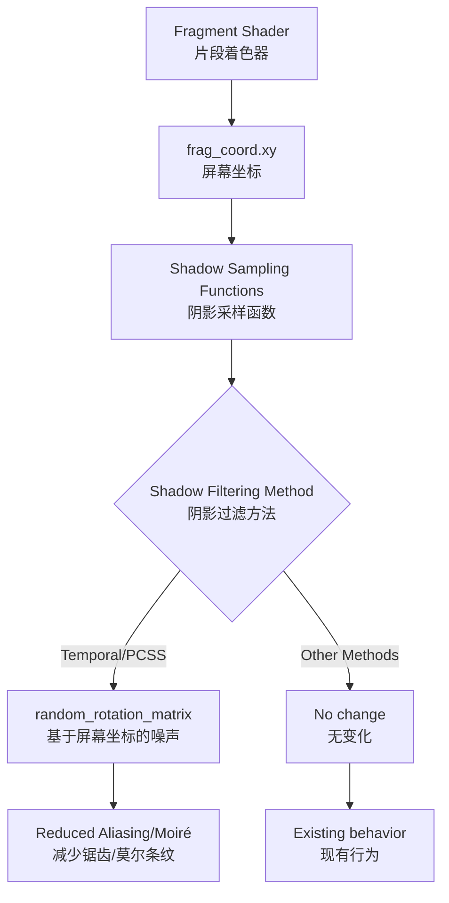

+++
title = "#22400 Reduce aliasing and Moiré patterns in temporal shadow filtering"
date = "2026-01-06T00:00:00"
draft = false
template = "pull_request_page.html"
in_search_index = false

[extra]
current_language = "zh-cn"
available_languages = {"en" = { name = "English", url = "/pull_request/bevy/2026-01/pr-22400-en-20260106" }, "zh-cn" = { name = "中文", url = "/pull_request/bevy/2026-01/pr-22400-zh-cn-20260106" }}
labels = ["A-Rendering", "C-Refinement"]
+++

# Title
Reduce aliasing and Moiré patterns in temporal shadow filtering

## Basic Information
- **Title**: Reduce aliasing and Moiré patterns in temporal shadow filtering
- **PR Link**: https://github.com/bevyengine/bevy/pull/22400
- **Author**: superdump
- **Status**: MERGED
- **Labels**: A-Rendering, S-Ready-For-Final-Review, C-Refinement
- **Created**: 2026-01-06T08:10:27Z
- **Merged**: 2026-01-06T20:37:48Z
- **Merged By**: alice-i-cecile

## Description Translation

### 目标
- 减少时间性阴影过滤（temporal shadow filtering）中的锯齿（aliasing）和莫尔条纹（Moiré patterns）

### 解决方案
- 使用基于屏幕UV的交错梯度噪声（interleaved gradient noise），而非基于光源局部UV的噪声

注意：这仅影响 **`ShadowFilteringMethod::Temporal` 或非时间性的PCSS**

### 测试
使用 `pcss` 和 `shadow_biases` 示例进行了测试。后者更有用——参见展示部分。

注意：这仅影响 **`ShadowFilteringMethod::Temporal` 或非时间性的PCSS**

然而，这涉及更多代码路径，需要测试所有组合：
- 光源类型：
  - 点光源（Point）
  - 聚光灯（Spot）
  - 平行光（Directional）
- 阴影映射（Shadow mapping）
- 软阴影（PCSS）
- 透射（Transmission）
- 距离雾（Distance fog）

---

### 展示
`main`分支：


`PR`分支：


这也让完整的时间性模式（即噪声图案每帧变化）看起来更好，尤其是在启用TAA时。但由于涉及动画，这一点较难展示。

## The Story of This Pull Request

这个PR解决了一个在时间性阴影过滤中常见的视觉伪影问题。具体来说，当使用时间性累积（temporal accumulation）或PCSS（Percentage-Closer Soft Shadows）进行阴影过滤时，屏幕空间会出现明显的锯齿和莫尔条纹图案。这些伪影主要源于阴影采样时使用的随机旋转矩阵的噪声生成方式。

原实现使用基于光源局部UV坐标（light local UV）的交错梯度噪声来生成随机旋转矩阵。这种方法的问题在于，当多个片段映射到阴影贴图的同一区域时，它们会获得相似的噪声值，导致屏幕上出现重复的噪声图案。这些重复图案在静止或缓慢移动时特别明显，形成了视觉上的莫尔条纹。

解决方案是将噪声生成的基础从光源局部UV坐标改为屏幕空间UV坐标。这样，每个屏幕像素都会获得独特的噪声值，即使它们映射到阴影贴图的同一区域。这种改变使噪声图案在屏幕空间更加均匀分布，有效减少了重复图案和莫尔条纹。

在技术实现上，这个PR修改了阴影采样函数，将屏幕坐标（`frag_coord.xy`）作为新参数传递到阴影采样管线中。具体改动包括：

1. **更新阴影采样函数的签名**：在`shadows.wgsl`中，为点光源、聚光灯和平行光的阴影采样函数增加了`frag_coord_xy`参数。

2. **修改噪声生成**：在`shadow_sampling.wgsl`中，将`random_rotation_matrix`函数的输入从`light_local * shadow_map_size`改为`frag_coord_xy`。这个变化影响了时间性过滤（temporal filtering）和非时间性PCSS两种模式。

3. **传播屏幕坐标**：在`pbr_functions.wgsl`和`volumetric_fog.wgsl`中，将屏幕坐标从片段着色器输入传递到阴影采样函数调用。

值得注意的是，这个修改仅影响使用`ShadowFilteringMethod::Temporal`或非时间性PCSS的渲染路径。其他阴影过滤方法（如高斯过滤或硬件PCF）不受影响，因为它们不使用随机旋转矩阵进行采样。

从架构角度看，这个PR展示了如何在渲染管线中传递额外数据以改进特定效果。屏幕坐标作为片段着色器的内置属性，在大多数渲染场景中都是可用的，因此这个修改的侵入性相对较小。然而，由于阴影采样在多个地方被调用（包括主光照通道和体积雾计算），需要更新多个函数签名和调用点。

性能方面，这个修改对GPU性能的影响可以忽略不计。只是改变了随机旋转矩阵的输入参数，没有增加额外的纹理采样或复杂计算。视觉质量的提升则相当显著，特别是在静态场景或缓慢移动的相机视角下。

这个PR的技术决策基于对时间性抗锯齿和阴影过滤的深入理解。交错梯度噪声是一种常用于时间性渲染的噪声技术，它能在帧间产生稳定的随机模式。通过将噪声模式锚定到屏幕空间而非纹理空间，可以获得更均匀的分布，减少视觉伪影。

## Visual Representation



## Key Files Changed

### 1. `crates/bevy_pbr/src/render/shadows.wgsl` (+59/-9)
这个文件包含了阴影采样的主要函数。修改为所有阴影采样函数添加了`frag_coord_xy`参数，并将其传递到底层采样函数。

关键修改：
```wgsl
// Before:
fn fetch_point_shadow(light_id: u32, frag_position: vec4<f32>, surface_normal: vec3<f32>) -> f32 {
    // ... 
    return sample_shadow_cubemap(frag_ls * flip_z, distance_to_light, depth, light_id);
}

// After:
fn fetch_point_shadow(
    light_id: u32,
    frag_position: vec4<f32>,
    surface_normal: vec3<f32>,
    frag_coord_xy: vec2<f32>,
) -> f32 {
    // ...
    return sample_shadow_cubemap(frag_ls * flip_z, distance_to_light, depth, light_id, frag_coord_xy);
}
```

### 2. `crates/bevy_pbr/src/render/shadow_sampling.wgsl` (+24/-14)
这个文件包含了阴影采样的具体实现。核心修改是将`random_rotation_matrix`的输入从光源局部UV改为屏幕坐标。

关键修改：
```wgsl
// Before (在sample_shadow_map_jimenez_fourteen函数中):
let shadow_map_size = vec2<f32>(textureDimensions(view_bindings::directional_shadow_textures));
let rotation_matrix = random_rotation_matrix(light_local * shadow_map_size, temporal);

// After:
let rotation_matrix = random_rotation_matrix(frag_coord_xy, temporal);
```

### 3. `crates/bevy_pbr/src/render/pbr_functions.wgsl` (+9/-7)
这个文件是PBR光照计算的主入口点。修改更新了所有阴影采样函数调用，传递了`in.frag_coord.xy`参数。

关键修改示例：
```wgsl
// Before:
shadow = shadows::fetch_point_shadow(light_id, in.world_position, in.world_normal);

// After:
shadow = shadows::fetch_point_shadow(light_id, in.world_position, in.world_normal, in.frag_coord.xy);
```

### 4. `crates/bevy_pbr/src/volumetric_fog/volumetric_fog.wgsl` (+10/-9)
这个文件处理体积雾的渲染。修改更新了体积雾中的阴影采样函数调用，传递了屏幕坐标。

关键修改：
```wgsl
// Before:
shadow = fetch_point_shadow_without_normal(light_id, vec4(P_world, 1.0));

// After:
shadow = fetch_point_shadow_without_normal(light_id, vec4(P_world, 1.0), position.xy);
```

## Further Reading

1. **时间性抗锯齿（Temporal Anti-Aliasing）**：
   - [Temporal Anti-Aliasing in The Witness](http://advances.realtimerendering.com/s2015/The%20Real-time%20Volumetric%20Cloudscapes%20of%20Horizon%20-%20Zero%20Dawn%20-%20ARTR.pdf)
   - [A Survey of Temporal Anti-Aliasing Techniques](https://dl.acm.org/doi/10.1145/3450301)

2. **交错梯度噪声（Interleaved Gradient Noise）**：
   - [Interleaved Gradient Noise: A Simple and Practical Noise Pattern for Rendering](https://blog.selfshadow.com/publications/s2013-shading-course/bluehole/s2013_pbs_bluehole_notes.pdf)
   - [使用IGN进行时间性重投影](https://developer.nvidia.com/gpugems/gpugems3/part-iv-image-effects/chapter-27-motion-blur-post-processing-effect)

3. **PCSS阴影技术**：
   - [Percentage-Closer Soft Shadows](http://developer.download.nvidia.com/shaderlibrary/docs/shadow_PCSS.pdf)
   - [PCSS实现细节](https://developer.nvidia.com/gpugems/gpugems2/part-ii-shading-lighting-and-shadows/chapter-17-efficient-soft-edged-shadows-using)

4. **WebGPU Shading Language (WGSL)**：
   - [WGSL规范](https://www.w3.org/TR/WGSL/)
   - [Bevy渲染引擎的着色器架构](https://bevyengine.org/learn/quick-start/getting-started/systems/#shaders)