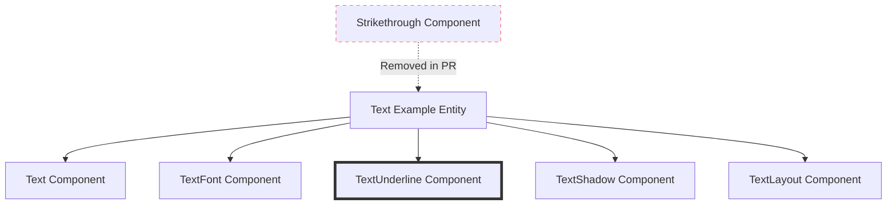

+++
title = "#22401 Remove `Strikethrough` from the `text` example"
date = "2026-01-06T00:00:00"
draft = false
template = "pull_request_page.html"
in_search_index = true

[taxonomies]
list_display = ["show"]

[extra]
current_language = "en"
available_languages = {"en" = { name = "English", url = "/pull_request/bevy/2026-01/pr-22401-en-20260106" }, "zh-cn" = { name = "中文", url = "/pull_request/bevy/2026-01/pr-22401-zh-cn-20260106" }}
labels = ["D-Trivial", "C-Examples", "A-Text"]
+++

# Title: Remove `Strikethrough` from the `text` example

## Basic Information
- **Title**: Remove `Strikethrough` from the `text` example
- **PR Link**: https://github.com/bevyengine/bevy/pull/22401
- **Author**: ickshonpe
- **Status**: MERGED
- **Labels**: D-Trivial, C-Examples, S-Ready-For-Final-Review, A-Text
- **Created**: 2026-01-06T09:48:17Z
- **Merged**: 2026-01-06T20:12:17Z
- **Merged By**: alice-i-cecile

## Description Translation
The PR description is already in English:

# Objective

Remove the `Strikethrough` from the "hello bevy" message in the `text` example. Should only be underlined.

## The Story of This Pull Request

This PR addresses a minor but noticeable issue in Bevy's UI text example where the displayed text had both strikethrough and underline formatting applied. The example was intended to demonstrate text rendering with only underline formatting, but the strikethrough component was incorrectly included.

Looking at the example code in `examples/ui/text.rs`, we can see the setup function creates a text entity with multiple text styling components:

```rust
commands.spawn((
    Text::new("hello bevy"),
    TextFont {
        font: asset_server.load("fonts/FiraSans-Bold.ttf"),
        font_size: 67.0,
        ..default()
    },
    Strikethrough,  // This line is being removed
    TextShadow::default(),
    TextLayout::new_with_justify(Justify::Center),
));
```

The issue is straightforward: the `Strikethrough` component was included in the bundle of components for the text entity, which resulted in the text having both strikethrough and underline effects when only underline was intended. This creates confusion for developers examining the example to understand how text formatting works in Bevy's UI system.

The root of this issue likely came from how the example evolved over time. When examining the code structure, we can see that the `TextUnderline` component is actually added separately in a different part of the same setup function:

```rust
commands.spawn((
    TextUnderline { color: Color::BLACK, thickness: 2.0 },
    // ... other components
));
```

This separation of underline and strikethrough components demonstrates an important aspect of Bevy's ECS (Entity Component System) architecture: different text formatting effects are implemented as separate, independent components that can be added or removed from entities as needed. This modular approach allows for flexible combination of text effects but requires careful composition to achieve the intended visual result.

The fix is minimal - simply removing the `Strikethrough` component from the entity's component bundle. This change ensures that when developers run the example, they see text with only underline formatting as intended, which provides a clearer demonstration of how to use the `TextUnderline` component independently.

From an engineering perspective, this change highlights the importance of keeping examples clean and focused. Examples serve as reference implementations and learning tools, so their behavior should match their stated purpose. When examples contain unintended or confusing behavior, developers may misinterpret how to use the API correctly.

The PR also demonstrates good development hygiene. Even though this is a one-line change, it improves the quality of the codebase by ensuring the example accurately demonstrates the intended functionality. This type of maintenance work, while small, contributes to the overall quality and usability of the framework.

## Visual Representation



## Key Files Changed

**File: `examples/ui/text.rs`**
1. **What changed and why**: The `Strikethrough` component was removed from the text entity in the setup function. This change ensures the example only displays underlined text as intended, rather than having both strikethrough and underline effects.

2. **Code snippets showing the changes**:

**Before:**
```rust
commands.spawn((
    Text::new("hello bevy"),
    TextFont {
        font: asset_server.load("fonts/FiraSans-Bold.ttf"),
        font_size: 67.0,
        ..default()
    },
    Strikethrough,
    TextShadow::default(),
    // Set the justification of the Text
    TextLayout::new_with_justify(Justify::Center),
));
```

**After:**
```rust
commands.spawn((
    Text::new("hello bevy"),
    TextFont {
        font: asset_server.load("fonts/FiraSans-Bold.ttf"),
        font_size: 67.0,
        ..default()
    },
    TextShadow::default(),
    // Set the justification of the Text
    TextLayout::new_with_justify(Justify::Center),
));
```

3. **How these changes relate to the overall purpose**: The removal of the `Strikethrough` component aligns the example's visual output with its intended purpose of demonstrating underlined text. This provides a clearer, more focused example for developers learning Bevy's text rendering system.

## Further Reading

1. **Bevy Text Documentation**: The official Bevy documentation for text rendering and UI components provides comprehensive information about available text formatting options.

2. **Bevy ECS Patterns**: Understanding Bevy's Entity Component System architecture helps in comprehending how different text effects are implemented as separate components.

3. **UI Styling in Game Engines**: Comparing Bevy's approach to text styling with other game engines (Unity's TextMeshPro, Godot's Label nodes) can provide context for design decisions in text rendering systems.

4. **Rust Traits and Components**: The implementation of text effects as components follows Rust's type system patterns, making it useful to understand how traits and structs are used in ECS architectures.