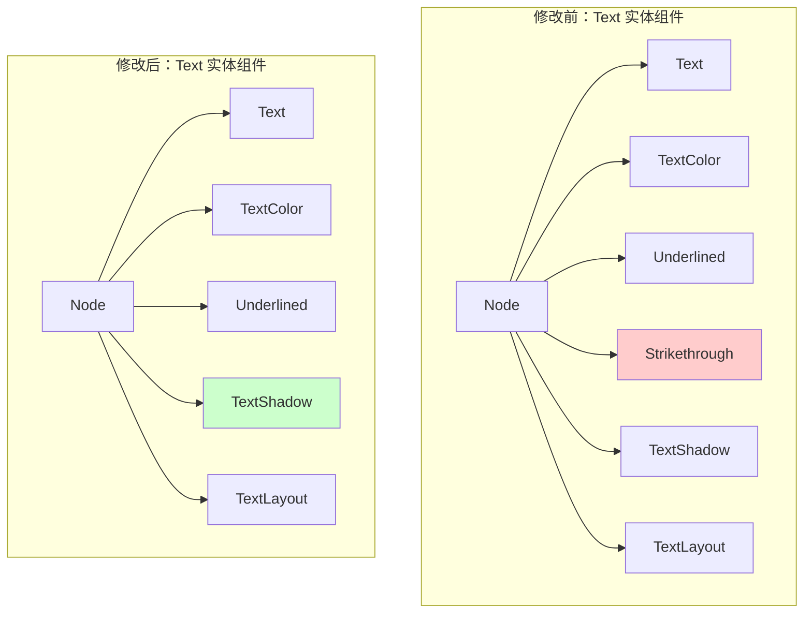

+++
title = "#22401 Remove `Strikethrough` from the `text` example"
date = "2026-01-06T00:00:00"
draft = false
template = "pull_request_page.html"
in_search_index = false

[extra]
current_language = "zh-cn"
available_languages = {"en" = { name = "English", url = "/pull_request/bevy/2026-01/pr-22401-en-20260106" }, "zh-cn" = { name = "中文", url = "/pull_request/bevy/2026-01/pr-22401-zh-cn-20260106" }}
labels = ["D-Trivial", "C-Examples", "A-Text"]
+++

# Title
## Basic Information
- **Title**: Remove `Strikethrough` from the `text` example
- **PR Link**: https://github.com/bevyengine/bevy/pull/22401
- **Author**: ickshonpe
- **Status**: MERGED
- **Labels**: D-Trivial, C-Examples, S-Ready-For-Final-Review, A-Text
- **Created**: 2026-01-06T09:48:17Z
- **Merged**: 2026-01-06T20:12:17Z
- **Merged By**: alice-i-cecile

## Description Translation
### 目标
从 `text` 示例中的“hello bevy”消息里移除 `Strikethrough`（删除线）。应该只有下划线。

## The Story of This Pull Request

这个 PR 处理的是一个示例代码中的准确性问题。在 `examples/ui/text.rs` 这个文件中，存在一个 UI 文本示例，旨在展示 Bevy 引擎的文本渲染与样式能力。该示例创建了一个包含多种样式（如字体、字号、颜色、阴影、布局等）的文本实体。然而，在这个综合性的演示中，一个本应只展示下划线 (`Underlined`) 效果的文本，却被错误地同时附加了删除线 (`Strikethrough`) 效果。

这个问题的性质很直接：示例代码没有准确反映其设计意图。当开发者运行 `text` 示例来学习如何为文本应用特定样式时，他们会看到一个同时具有下划线和删除线的“hello bevy”文本。这可能会造成混淆，让开发者不确定哪一部分代码对应哪个视觉效果，尤其是当示例的目标是清晰地展示各项独立功能时。

解决方案同样直接：从构建该文本实体的组件列表中移除 `Strikethrough` 组件。在 Bevy 的 ECS（实体组件系统）架构中，组件的存在与否直接决定了实体的行为与表现。要移除一个视觉效果，只需从实体上移除对应的组件。因此，修复方法就是从生成文本的 `commands.spawn` 语句中，删除作为子组件的 `Strikethrough` 这一行。

这种修改模式在基于组件的架构中非常典型和高效。它不涉及修改任何系统逻辑或资源处理，纯粹是通过调整实体组合方式来达到预期效果。这体现了 ECS 的核心优势之一：通过组合（而非继承）来定义行为，使得功能的增删变得非常简单和清晰。

从代码维护和文档的角度看，这次修改虽然微小，但很重要。示例代码是项目重要的文档形式之一，它们应该准确、简洁，并且目的明确。一个多余的 `Strikethrough` 组件虽然不会导致功能错误，但会降低示例的教学价值。修正它确保了示例的纯粹性，让开发者能够获得预期的学习体验。这也反映了项目对代码质量细节的关注，即使是示例文件也会得到维护。

## Visual Representation

该 PR 修改的核心是改变了 `Text` 实体所包含的组件集合。下图描述了修改前后的组件变化：



图中，红色高亮的 `Strikethrough` 组件在修改后被移除，使得实体组件集合与“仅显示下划线”的设计目标保持一致。

## Key Files Changed

**`examples/ui/text.rs` (+0/-1)**
1.  **修改描述与原因**：
    移除了 `text` 示例中文本实体上多余的 `Strikethrough` 组件。这是为了让示例的视觉效果与其代码意图（只展示下划线）保持一致，提升示例的准确性和教学价值。

2.  **代码修改片段**：
    ```rust
    // File: examples/ui/text.rs
    // 修改前 (部分代码):
    commands.spawn((
        TextBundle::from_section(
            "hello bevy!",
            TextStyle {
                font: asset_server.load("fonts/FiraSans-Bold.ttf"),
                font_size: 67.0,
                ..default()
            },
        )
        .with_style(Style {
            align_self: AlignSelf::Center,
            ..default()
        }),
        Underlined,
        Strikethrough, // <-- 此行被移除
        TextShadow::default(),
        TextLayout::new_with_justify(Justify::Center),
    ));
    ```
    ```rust
    // File: examples/ui/text.rs
    // 修改后 (部分代码):
    commands.spawn((
        TextBundle::from_section(
            "hello bevy!",
            TextStyle {
                font: asset_server.load("fonts/FiraSans-Bold.ttf"),
                font_size: 67.0,
                ..default()
            },
        )
        .with_style(Style {
            align_self: AlignSelf::Center,
            ..default()
        }),
        Underlined,
        // Strikethrough 组件已移除
        TextShadow::default(),
        TextLayout::new_with_justify(Justify::Center),
    ));
    ```

3.  **与 PR 目标的关联**：
    这个删除操作直接实现了 PR 的唯一目标：从示例中移除 `Strikethrough` 效果，使文本仅保留 `Underlined` 样式。

## Further Reading
*   **Bevy UI 示例**: 浏览 `examples/ui/` 目录下的其他示例，可以全面了解 Bevy 的 UI 系统能力。
*   **Bevy 组件（Components）文档**: 理解 ECS 中组件的概念是使用 Bevy 的基础。可以查阅官方手册的 ECS 章节。
*   **Text 与样式组件**: 在 Bevy 的 API 文档中查看 `bevy::text` 模块，了解 `Underlined`、`Strikethrough`、`TextShadow` 等所有可用的文本样式组件。

# Full Code Diff
```
diff --git a/examples/ui/text.rs b/examples/ui/text.rs
index 65f525994594d..e7c3f371ffafd 100644
--- a/examples/ui/text.rs
+++ b/examples/ui/text.rs
@@ -40,7 +40,6 @@ fn setup(mut commands: Commands, asset_server: Res<AssetServer>) {
             font_size: 67.0,
             ..default()
         },
-        Strikethrough,
         TextShadow::default(),
         // Set the justification of the Text
         TextLayout::new_with_justify(Justify::Center),
```