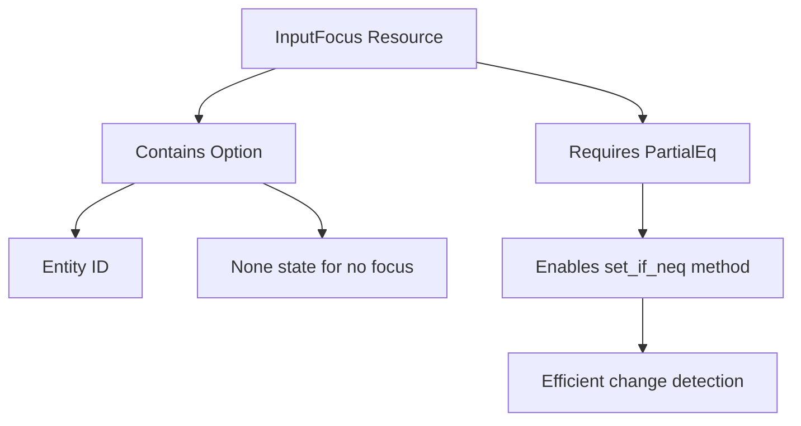

+++
title = "#22402 Derive `PartialEq` for `InputFocus`"
date = "2026-01-06T00:00:00"
draft = false
template = "pull_request_page.html"
in_search_index = true

[taxonomies]
list_display = ["show"]

[extra]
current_language = "en"
available_languages = {"en" = { name = "English", url = "/pull_request/bevy/2026-01/pr-22402-en-20260106" }, "zh-cn" = { name = "中文", url = "/pull_request/bevy/2026-01/pr-22402-zh-cn-20260106" }}
labels = ["C-Feature", "D-Trivial", "A-Text"]
+++

# Title
## Basic Information
- **Title**: Derive `PartialEq` for `InputFocus`
- **PR Link**: https://github.com/bevyengine/bevy/pull/22402
- **Author**: Shatur
- **Status**: MERGED
- **Labels**: C-Feature, D-Trivial, S-Ready-For-Final-Review, A-Text
- **Created**: 2026-01-06T11:04:04Z
- **Merged**: 2026-01-06T20:11:33Z
- **Merged By**: alice-i-cecile

## Description Translation
**Objective**

- Right now you can't do the the following:
```rust
focus.set_if_neq(InputFocus(Some(trigger.entity)));
```

**Solution**

- Derive `PartialEq` for `InputFocus`

## The Story of This Pull Request

This is a straightforward but necessary fix that addresses a missing implementation detail in Bevy's input focus system. The PR adds the `PartialEq` trait derivation to the `InputFocus` struct, enabling a common Bevy pattern for conditionally setting resources.

The problem stems from how Bevy's change detection system works. In Bevy, resources can be conditionally updated using the `set_if_neq` method, which only applies the new value if it differs from the current one. This pattern helps avoid triggering unnecessary system runs when values don't change. However, for `set_if_neq` to work, the resource type must implement `PartialEq` so the system can compare values for equality.

The `InputFocus` struct is a resource that tracks which entity currently has input focus—crucial for handling text input, UI interactions, and other focus-sensitive operations. Without `PartialEq`, developers couldn't use the standard `set_if_neq` pattern when updating focus state, forcing them to either always trigger change detection or use less efficient workarounds.

The solution is minimal and correct: adding `PartialEq` to the derive macro list. This change aligns `InputFocus` with other Bevy resources that already implement equality comparisons. Since `InputFocus` wraps an `Option<Entity>` and both `Option` and `Entity` already implement `PartialEq`, deriving the trait is safe and automatically generates the correct equality comparison.

This fix demonstrates an important principle in Rust game engine development: when a type represents state that changes over time, providing equality comparisons enables efficient change detection patterns. The one-line change significantly improves ergonomics for developers working with input focus, allowing them to write cleaner, more idiomatic Bevy code that properly leverages the engine's change detection system.

## Visual Representation



## Key Files Changed

**crates/bevy_input_focus/src/lib.rs** (+1/-1)

This file contains the `InputFocus` struct definition. The change adds `PartialEq` to the derive macro, enabling equality comparisons for focus state.

```rust
// File: crates/bevy_input_focus/src/lib.rs
// Before:
#[derive(Clone, Debug, Default, Resource)]
#[cfg_attr(
    feature = "bevy_reflect",
    derive(Reflect),
)]

// After:
#[derive(Clone, Debug, Default, Resource, PartialEq)]
#[cfg_attr(
    feature = "bevy_reflect",
    derive(Reflect),
)]
```

The change is minimal—just adding `PartialEq` to the derive attributes. This automatically implements the `PartialEq` trait for `InputFocus` based on its single field (`Option<Entity>`), which already has `PartialEq` implementations for both `Option` and `Entity`. This enables the `set_if_neq` pattern shown in the PR description.

## Further Reading

- [Bevy Change Detection Documentation](https://bevyengine.org/learn/book/programming/change-detection/)
- [Rust PartialEq Trait Documentation](https://doc.rust-lang.org/std/cmp/trait.PartialEq.html)
- [Bevy Resources and Change Detection](https://bevy-cheatbook.github.io/programming/res.html)
- [Derive Macros in Rust](https://doc.rust-lang.org/reference/procedural-macros.html#derive-macros)

# Full Code Diff
```diff
diff --git a/crates/bevy_input_focus/src/lib.rs b/crates/bevy_input_focus/src/lib.rs
index fac16f62209bd..cef184a43dfa0 100644
--- a/crates/bevy_input_focus/src/lib.rs
+++ b/crates/bevy_input_focus/src/lib.rs
@@ -85,7 +85,7 @@ use bevy_reflect::{prelude::*, Reflect};
 ///     world.insert_resource(InputFocus::from_entity(entity));
 /// }
 /// ```
-#[derive(Clone, Debug, Default, Resource)]
+#[derive(Clone, Debug, Default, Resource, PartialEq)]
 #[cfg_attr(
     feature = "bevy_reflect",
     derive(Reflect),
```