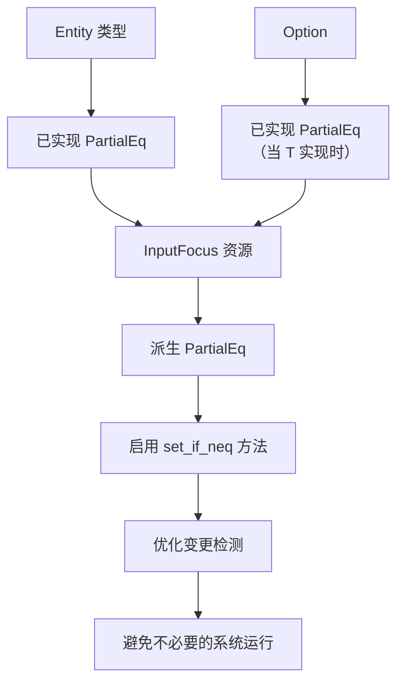

+++
title = "#22402 Derive `PartialEq` for `InputFocus`"
date = "2026-01-06T00:00:00"
draft = false
template = "pull_request_page.html"
in_search_index = false

[extra]
current_language = "zh-cn"
available_languages = {"en" = { name = "English", url = "/pull_request/bevy/2026-01/pr-22402-en-20260106" }, "zh-cn" = { name = "中文", url = "/pull_request/bevy/2026-01/pr-22402-zh-cn-20260106" }}
labels = ["C-Feature", "D-Trivial", "A-Text"]
+++

# Title

## Basic Information
- **Title**: Derive `PartialEq` for `InputFocus`
- **PR Link**: https://github.com/bevyengine/bevy/pull/22402
- **Author**: Shatur
- **Status**: MERGED
- **Labels**: C-Feature, D-Trivial, S-Ready-For-Final-Review, A-Text
- **Created**: 2026-01-06T11:04:04Z
- **Merged**: 2026-01-06T20:11:33Z
- **Merged By**: alice-i-cecile

## Description Translation
### 目的
- 目前你无法进行如下操作：
```rust
focus.set_if_neq(InputFocus(Some(trigger.entity)));
```

### 解决方案
- 为 `InputFocus` 派生 `PartialEq`

## The Story of This Pull Request

这个Pull Request解决的是一个非常具体但影响API可用性的问题。在Bevy引擎中，`InputFocus` 是一个用于追踪哪个实体（Entity）当前接收输入焦点的资源（Resource）。它的定义是一个简单的包装类型，内部包含一个 `Option<Entity>`。

问题的核心在于变更检测（change detection）的优化。Bevy的 `DetectChanges` trait 提供了一个 `set_if_neq` 方法。这个方法的作用是：只有当传入的新值与当前值不同时，才更新资源并触发变更检测。这是一种常见的优化模式，可以避免在值实际未改变的情况下，不必要地触发后续的系统（system）调度和运行。

然而，使用 `set_if_neq` 有一个前提条件：它依赖于类型的 `PartialEq` 实现来进行相等性比较。在修改之前，`InputFocus` 结构体只派生（derive）了 `Clone`, `Debug`, `Default`，以及被标记为 `Resource`。它缺少 `PartialEq` 的派生。因此，开发者试图编写 `focus.set_if_neq(InputFocus(Some(trigger.entity)));` 这样的代码时，编译器会报错，因为 `InputFocus` 类型不支持 `!=` 比较操作。

开发者面临的困境是：要么放弃使用 `set_if_neq` 的优化，直接使用 `.set(...)` 方法（这可能导致无效的变更检测），要么就需要自己手动实现 `PartialEq`。对于这样一个内部仅包装了标准库类型的结构体，手动实现既冗余又容易出错。

解决方案直接而优雅：在 `InputFocus` 的派生属性列表中添加 `PartialEq`。由于 `InputFocus` 的字段 `0` 是 `Option<Entity>`，而 `Entity` 和 `Option` 都已经实现了 `PartialEq`，Rust编译器可以自动、正确地为 `InputFocus` 生成所需的相等性比较逻辑。这个改动完全符合“零成本抽象”的原则——它没有引入任何运行时开销，只是让编译器为我们生成必要的代码，从而开放了已有优化API的使用权限。

这个修改虽然只有一行，但它完整地解决了一个API缺口（API gap）。它使得 `InputFocus` 资源的管理模式与其他实现了 `PartialEq` 的资源保持一致，允许开发者采用最佳实践来编写高性能的代码。这也体现了Rust派生宏（derive macro）的实用价值：通过声明意图，让编译器处理样板代码，既安全又便捷。

## Visual Representation



## Key Files Changed

- `crates/bevy_input_focus/src/lib.rs` (+1/-1)
  - **改动说明与原因**：此文件定义了 `InputFocus` 结构体。修改为其派生属性列表增加了 `PartialEq`，使其能够参与相等性比较，从而支持 `DetectChanges::set_if_neq` 等方法。
  - **关键代码修改**：
```rust
// File: crates/bevy_input_focus/src/lib.rs
// 修改前：
#[derive(Clone, Debug, Default, Resource)]
// 修改后：
#[derive(Clone, Debug, Default, Resource, PartialEq)]
```
  - **与PR目的的关系**：这是实现本PR目标的唯一且必要的改动。通过派生 `PartialEq`，直接解决了无法使用 `focus.set_if_neq(...)` 的问题。

## Further Reading
- **Bevy 官方文档 - 变更检测 (Change Detection)**: 了解 `DetectChanges` trait、`set_if_neq` 方法以及如何利用它们优化应用性能。
- **Rust 官方文档 - `PartialEq` Trait**: 理解 `PartialEq` 的语义、如何手动实现以及自动派生的规则。
- **Bevy 官方文档 - 资源 (Resources)**: 学习如何在Bevy中声明、存储和访问全局状态。