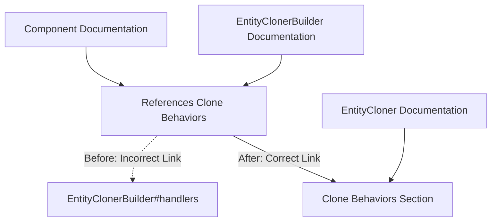

+++
title = "#22404 Update the doc link for Clone Behaviors section of `EntityCloner`"
date = "2026-01-06T00:00:00"
draft = false
template = "pull_request_page.html"
in_search_index = true

[taxonomies]
list_display = ["show"]

[extra]
current_language = "en"
available_languages = {"en" = { name = "English", url = "/pull_request/bevy/2026-01/pr-22404-en-20260106" }, "zh-cn" = { name = "中文", url = "/pull_request/bevy/2026-01/pr-22404-zh-cn-20260106" }}
labels = ["C-Docs", "A-ECS"]
+++

# Title

## Basic Information
- **Title**: Update the doc link for Clone Behaviors section of `EntityCloner`
- **PR Link**: https://github.com/bevyengine/bevy/pull/22404
- **Author**: WaterWhisperer
- **Status**: MERGED
- **Labels**: C-Docs, A-ECS, S-Ready-For-Final-Review
- **Created**: 2026-01-06T13:30:32Z
- **Merged**: 2026-01-06T20:11:33Z
- **Merged By**: alice-i-cecile

## Description Translation

# Objective

Fixes #22302

## Solution

Replace doc comments "[Handlers section of `EntityClonerBuilder`](crate::entity::EntityClonerBuilder#handlers)" with "[Clone Behaviors section of `EntityCloner`](crate::entity::EntityCloner#clone-behaviors)"

## Testing

Checked the updated document locally, now successfully points to the correct location

## The Story of This Pull Request

This PR addresses a documentation issue in the Bevy engine's ECS (Entity Component System). The problem was straightforward: documentation comments were pointing to a non-existent or incorrect anchor link, which would lead developers to the wrong section of the documentation.

The issue (#22302) was likely discovered when someone tried to follow a documentation link that didn't work as expected. In a complex system like Bevy's ECS, accurate documentation links are essential because they help developers understand how different parts of the system interact, particularly when dealing with advanced features like entity cloning.

The EntityCloner system in Bevy allows developers to clone entities with customizable behaviors for how components should be handled during the cloning process. This is particularly important for components that might have special requirements—for example, components that manage resources or have unique ownership semantics. The `ComponentCloneBehavior` enum provides several options for controlling how components are cloned: `Default` uses the standard clone implementation, `None` skips cloning entirely, and `Custom` allows for custom cloning logic.

The documentation was incorrectly pointing to a "Handlers section" of `EntityClonerBuilder`, but the actual documentation for clone behaviors is in the `EntityCloner` struct's documentation under the "Clone Behaviors" section. This kind of misdirected link is more than just a minor annoyance—it breaks the flow of learning and makes the system harder to understand for developers who rely on documentation to navigate complex APIs.

The fix implemented in this PR is minimal but important. It updates four documentation comments across two files to point to the correct location. Each change follows the same pattern: replacing the old link `crate::entity::EntityClonerBuilder#handlers` with the correct link `crate::entity::EntityCloner#clone-behaviors`.

This type of fix demonstrates a good practice in maintaining documentation: ensuring that internal links remain accurate as the codebase evolves. When APIs change or documentation is reorganized, it's easy for these internal references to become outdated. Regular auditing of documentation links helps maintain the quality of the developer experience.

The implementation is straightforward because it only involves changing string literals in documentation comments. However, it's worth noting that the developer tested the changes locally to verify that the links now work correctly—this is a good practice when fixing documentation issues, as it ensures the problem is actually resolved.

From an engineering perspective, this PR highlights the importance of documentation maintenance as part of the software development lifecycle. Even simple documentation errors can create friction for developers trying to use or contribute to a project. In a game engine like Bevy, where the ECS is a core architectural pattern, clear and accurate documentation is essential for helping developers understand how to use the system effectively.

The changes affect two key aspects of the ECS: the component system documentation and the entity cloning system documentation. Both are important parts of Bevy's architecture that developers need to understand to build efficient games.

## Visual Representation



## Key Files Changed

### `crates/bevy_ecs/src/component/mod.rs`
**What changed and why**: Updated documentation links in the `Component` trait implementation to point to the correct location for clone behavior documentation. The documentation explains how `ComponentCloneBehavior` affects handler priority during entity cloning operations.

**Code snippets**:
```rust
// Before:
/// See [Handlers section of `EntityClonerBuilder`](crate::entity::EntityClonerBuilder#handlers) to understand how this affects handler priority.

// After:
/// See [Clone Behaviors section of `EntityCloner`](crate::entity::EntityCloner#clone-behaviors) to understand how this affects handler priority.
```

### `crates/bevy_ecs/src/entity/clone_entities.rs`
**What changed and why**: Updated documentation links in the `EntityClonerBuilder` implementation to point to the correct "Clone Behaviors" section instead of the non-existent "Handlers section." This ensures developers reading about how to override clone behaviors can find the relevant documentation.

**Code snippets**:
```rust
// Before:
/// See [Handlers section of `EntityClonerBuilder`](EntityClonerBuilder#handlers) to understand how this affects handler priority.

// After:
/// See [Clone Behaviors section of `EntityCloner`](EntityCloner#clone-behaviors) to understand how this affects handler priority.
```

## Further Reading

1. [Bevy ECS Documentation](https://docs.rs/bevy_ecs/latest/bevy_ecs/) - Official documentation for Bevy's Entity Component System
2. [Rust Documentation Comments Guide](https://doc.rust-lang.org/rustdoc/how-to-write-documentation.html) - Best practices for writing effective documentation in Rust
3. [Entity Cloning in ECS Patterns](https://en.wikipedia.org/wiki/Entity_component_system#Common_implementation_patterns) - General concepts about entity management in ECS architectures
4. [Bevy Book - ECS Chapter](https://bevyengine.org/learn/book/ecs/) - Comprehensive guide to using ECS in Bevy