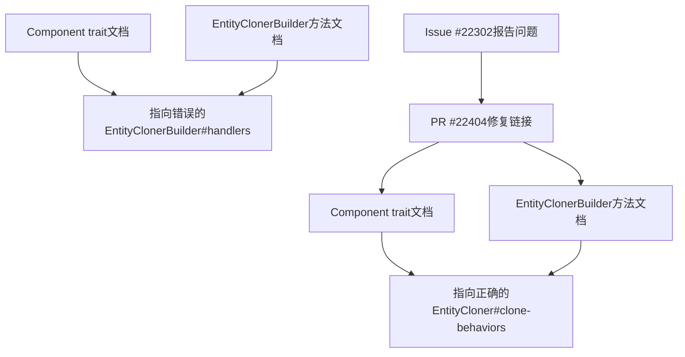

+++
title = "#22404 Update the doc link for Clone Behaviors section of `EntityCloner"
date = "2026-01-06T00:00:00"
draft = false
template = "pull_request_page.html"
in_search_index = false

[extra]
current_language = "zh-cn"
available_languages = {"en" = { name = "English", url = "/pull_request/bevy/2026-01/pr-22404-en-20260106" }, "zh-cn" = { name = "中文", url = "/pull_request/bevy/2026-01/pr-22404-zh-cn-20260106" }}
+++

# Update the doc link for Clone Behaviors section of `EntityCloner`

## Basic Information
- **标题**: Update the doc link for Clone Behaviors section of `EntityCloner`
- **PR链接**: https://github.com/bevyengine/bevy/pull/22404
- **作者**: WaterWhisperer
- **状态**: 已合并
- **标签**: C-Docs, A-ECS, S-Ready-For-Final-Review
- **创建时间**: 2026-01-06T13:30:32Z
- **合并时间**: 2026-01-06T20:11:33Z
- **合并者**: alice-i-cecile

## 描述翻译

### 目标
修复 #22302

### 解决方案
将文档注释 "[Handlers section of `EntityClonerBuilder`](crate::entity::EntityClonerBuilder#handlers)" 替换为 "[Clone Behaviors section of `EntityCloner`](crate::entity::EntityCloner#clone-behaviors)"

### 测试
在本地检查了更新后的文档，现在成功指向了正确的位置

## 这个PR的故事

这个PR是一个典型的文档修复案例，展示了在软件开发过程中保持文档准确性的重要性。故事始于一个GitHub Issue（#22302），报告了Bevy ECS模块中的文档链接指向了错误的位置。

在Bevy的ECS系统中，`EntityCloner`和`EntityClonerBuilder`是两个关键组件，用于实体（entity）的克隆操作。`ComponentCloneBehavior`定义了组件在克隆时的行为方式，而相关的文档链接应该指向`EntityCloner`中专门讨论"Clone Behaviors"的部分。然而，在之前的版本中，这些链接错误地指向了`EntityClonerBuilder`的"Handlers"部分。

问题的核心在于文档内部链接的准确性。当开发者阅读`Component` trait的文档或`EntityClonerBuilder`的方法文档时，他们需要参考正确的部分来理解克隆行为如何影响处理器的优先级。错误的链接会导致开发者导航到不相关的内容，增加了理解系统行为的难度。

从技术角度来看，这个修复涉及修改两处文档注释：
1. `Component` trait的`clone_behavior`方法文档
2. `EntityClonerBuilder`中两个相关方法的文档

这些修改虽然看似简单，但对于维护代码库的可读性和开发者体验至关重要。准确的文档链接能够帮助开发者快速找到相关信息，减少上下文切换的成本。

这个修复的实现非常直接：作者识别了所有需要更新的文档链接，将它们统一指向正确的锚点（anchor）。在Git diff中可以看到，每个修改都只是替换了链接的目标位置，保持了原有的文档结构和内容。

从工程实践的角度来看，这个PR展示了几个重要原则：
1. **文档与代码同步**：即使是最小的文档错误也应该及时修复
2. **内部链接的一致性**：保持文档内部引用的一致性有助于维护整体的可导航性
3. **最小化变更**：修复只涉及必要的更改，没有引入无关的修改

虽然这个PR的改动很小，但它对开发者体验有实际的影响。当开发者尝试理解Bevy ECS中复杂的实体克隆机制时，准确的文档链接能够提供正确的上下文，帮助他们更快地掌握系统的设计意图和工作原理。

## 可视化表示



## 关键文件更改

### 1. `crates/bevy_ecs/src/component/mod.rs` (+2/-2)
**修改原因**：修复`Component` trait文档中错误的内部链接

**关键修改**：
```rust
// 修改前：
/// See [Handlers section of `EntityClonerBuilder`](crate::entity::EntityClonerBuilder#handlers) to understand how this affects handler priority.

// 修改后：
/// See [Clone Behaviors section of `EntityCloner`](crate::entity::EntityCloner#clone-behaviors) to understand how this affects handler priority.
```

这个修改位于`Component` trait的文档注释中，影响了两个位置：第436行和第559行。两个位置都从指向`EntityClonerBuilder#handlers`改为指向`EntityCloner#clone-behaviors`。

### 2. `crates/bevy_ecs/src/entity/clone_entities.rs` (+2/-2)
**修改原因**：修复`EntityClonerBuilder`方法文档中错误的内部链接

**关键修改**：
```rust
// 修改前：
/// See [Handlers section of `EntityClonerBuilder`](EntityClonerBuilder#handlers) to understand how this affects handler priority.

// 修改后：
/// See [Clone Behaviors section of `EntityCloner`](EntityCloner#clone-behaviors) to understand how this affects handler priority.
```

这个修改位于`EntityClonerBuilder`的`override_clone_behavior`和`override_clone_behavior_with_id`方法的文档注释中。两个方法都从指向自身类型的handlers部分改为指向`EntityCloner`的clone-behaviors部分。

## 进一步阅读

1. **Bevy ECS文档**：了解Bevy的实体组件系统设计
   - https://bevyengine.org/learn/book/ecs/

2. **Rust文档注释指南**：学习如何编写有效的文档注释，包括内部链接
   - https://doc.rust-lang.org/rustdoc/how-to-write-documentation.html

3. **语义化版本控制中的文档更新**：理解文档更新在软件维护中的角色
   - https://semver.org/

4. **Bevy实体克隆系统**：深入了解`EntityCloner`和`EntityClonerBuilder`的工作原理
   - 查看`crates/bevy_ecs/src/entity/clone_entities.rs`源码

# 完整代码差异
```diff
diff --git a/crates/bevy_ecs/src/component/mod.rs b/crates/bevy_ecs/src/component/mod.rs
index 395cb7db919e7..c0c877c4da1c6 100644
--- a/crates/bevy_ecs/src/component/mod.rs
+++ b/crates/bevy_ecs/src/component/mod.rs
@@ -433,7 +433,7 @@ use core::{fmt::Debug, marker::PhantomData, ops::Deref};
 /// You can specify how the [`Component`] is cloned when deriving it.
 ///
 /// Your options are the functions and variants of [`ComponentCloneBehavior`]
-/// See [Handlers section of `EntityClonerBuilder`](crate::entity::EntityClonerBuilder#handlers) to understand how this affects handler priority.
+/// See [Clone Behaviors section of `EntityCloner`](crate::entity::EntityCloner#clone-behaviors) to understand how this affects handler priority.
 /// ```
 /// # use bevy_ecs::prelude::*;
 ///
@@ -556,7 +556,7 @@ pub trait Component: Send + Sync + 'static {
 
     /// Called when registering this component, allowing to override clone function (or disable cloning altogether) for this component.
     ///
-    /// See [Handlers section of `EntityClonerBuilder`](crate::entity::EntityClonerBuilder#handlers) to understand how this affects handler priority.
+    /// See [Clone Behaviors section of `EntityCloner`](crate::entity::EntityCloner#clone-behaviors) to understand how this affects handler priority.
     #[inline]
     fn clone_behavior() -> ComponentCloneBehavior {
         ComponentCloneBehavior::Default
diff --git a/crates/bevy_ecs/src/entity/clone_entities.rs b/crates/bevy_ecs/src/entity/clone_entities.rs
index 824775fb7b4b0..7b1884e54e5d1 100644
--- a/crates/bevy_ecs/src/entity/clone_entities.rs
+++ b/crates/bevy_ecs/src/entity/clone_entities.rs
@@ -836,7 +836,7 @@ impl<'w, Filter: CloneByFilter> EntityClonerBuilder<'w, Filter> {
     /// Overrides the [`ComponentCloneBehavior`] for a component in this builder.
     /// This handler will be used to clone the component instead of the global one defined by the [`EntityCloner`].
     ///
-    /// See [Handlers section of `EntityClonerBuilder`](EntityClonerBuilder#handlers) to understand how this affects handler priority.
+    /// See [Clone Behaviors section of `EntityCloner`](EntityCloner#clone-behaviors) to understand how this affects handler priority.
     pub fn override_clone_behavior<T: Component>(
         &mut self,
         clone_behavior: ComponentCloneBehavior,
@@ -852,7 +852,7 @@ impl<'w, Filter: CloneByFilter> EntityClonerBuilder<'w, Filter> {
     /// Overrides the [`ComponentCloneBehavior`] for a component with the given `component_id` in this builder.
     /// This handler will be used to clone the component instead of the global one defined by the [`EntityCloner`].
     ///
-    /// See [Handlers section of `EntityClonerBuilder`](EntityClonerBuilder#handlers) to understand how this affects handler priority.
+    /// See [Clone Behaviors section of `EntityCloner`](EntityCloner#clone-behaviors) to understand how this affects handler priority.
     pub fn override_clone_behavior_with_id(
         &mut self,
         component_id: ComponentId,
```