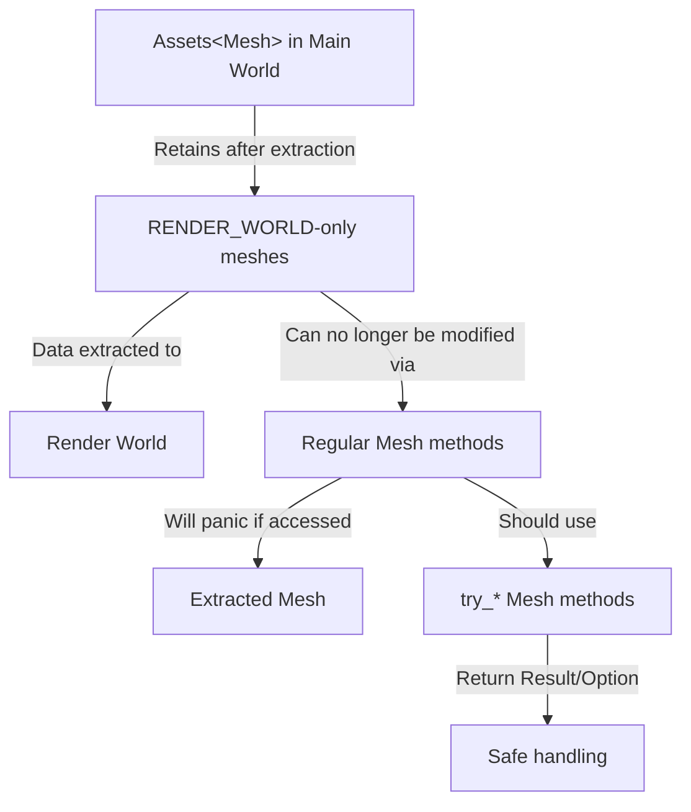

+++
title = "#22407 docs: adds migration guide for Assets<Mesh> retaining render_world only meshes"
date = "2026-01-07T00:00:00"
draft = false
template = "pull_request_page.html"
in_search_index = true

[taxonomies]
list_display = ["show"]

[extra]
current_language = "en"
available_languages = {"en" = { name = "English", url = "/pull_request/bevy/2026-01/pr-22407-en-20260107" }, "zh-cn" = { name = "中文", url = "/pull_request/bevy/2026-01/pr-22407-zh-cn-20260107" }}
labels = ["C-Docs", "A-Rendering", "A-Picking"]
+++

# Title
docs: adds migration guide for Assets<Mesh> retaining render_world only meshes

## Basic Information
- **Title**: docs: adds migration guide for Assets<Mesh> retaining render_world only meshes
- **PR Link**: https://github.com/bevyengine/bevy/pull/22407
- **Author**: kfc35
- **Status**: MERGED
- **Labels**: C-Docs, A-Rendering, S-Needs-Review, A-Picking
- **Created**: 2026-01-07T02:07:59Z
- **Merged**: 2026-01-07T05:42:46Z
- **Merged By**: alice-i-cecile

## Description Translation

This is targeting `release-0.18.0`, NOT `main`!

# Objective

- Fixes #22206

## Solution

- Adds a migration guide for the changes in #21732. As someone not too familiar with mesh stuff, I'd appreciate a review from someone more familiar with the changes and mesh things!

FYI @robtfm @beicause

## The Story of This Pull Request

The PR addresses a documentation gap that emerged from a significant change in Bevy's rendering architecture. In PR #21732, the team modified how the `Assets<Mesh>` resource handles meshes marked with `RenderAssetUsages::RENDER_WORLD`. Previously, once these meshes were extracted to the render world, they would be removed from the main world's `Assets<Mesh>` collection. This meant that any subsequent attempts to access such meshes in the main world would fail, but at least they wouldn't panic.

In Bevy 0.18, this behavior changed: `Assets<Mesh>` now retains all meshes, including those marked as `RENDER_WORLD`-only, even after their data has been extracted. This architectural shift improves consistency but introduces a new problem: attempting to modify or access the data of an extracted mesh from the main world is now invalid, since the mesh data physically resides in the render world.

The solution implemented in #21732 was to add new `try_*` methods to the `Mesh` struct that return a `Result<..., MeshAccessError>`. These methods check whether the mesh data is still available in the main world and return an `Err(MeshAccessError::ExtractedToRenderWorld)` if it's not. This provides a safe way to handle the case where mesh data might have been extracted.

This PR #22407 adds the necessary migration guide to document this breaking change. The guide serves as a critical resource for developers upgrading from Bevy 0.17 to 0.18, helping them understand why their code might start panicking and how to fix it.

The migration guide takes a straightforward approach: it lists every affected `Mesh` method and its corresponding `try_*` equivalent. For methods that don't have a `try_*` version, it explicitly notes that they will now panic if called on an extracted mesh. The guide is comprehensive, covering mesh attribute operations, index manipulations, normal computations, transformations, and morph target features.

The key insight here is that developers need to change their mindset when working with meshes. Previously, they could assume that if they had a reference to a `Mesh` in `Assets<Mesh>`, the mesh data was accessible. Now they must consider that the mesh might have been extracted, and they need to handle this possibility explicitly using the new `try_*` methods.

The guide also clarifies an important distinction: some `try_*` methods return `Result<..., MeshAccessError>` while others return `Option<...>`. This reflects different failure modes - some operations are fundamentally invalid on extracted meshes (returning an error), while others can be attempted but might fail (returning `None`).

This documentation addition is particularly important because the change affects a wide range of mesh operations, and without proper guidance, developers would face confusing panics when upgrading. By providing a clear, exhaustive list of affected methods and their replacements, the migration guide reduces friction during the upgrade process and helps developers write more robust code that properly handles the render world extraction lifecycle.

## Visual Representation



## Key Files Changed

**File:** `release-content/migration-guides/assets_mesh_try_functions.md` (+125/-0)

This is a new file created to document the migration from Bevy 0.17 to 0.18 for mesh handling. The file provides a comprehensive list of `Mesh` methods that need to be updated when working with meshes that might be `RENDER_WORLD`-only.

Key content includes:

1. **Explanation of the change**: Describes how `Assets<Mesh>` now retains `RENDER_WORLD`-only meshes after extraction
2. **Migration instructions**: Shows side-by-side comparisons of old methods and their new `try_*` equivalents
3. **Error handling notes**: Explains that the new methods return `Result<..., MeshAccessError>` or `Option<...>`
4. **Panic warnings**: Identifies methods without `try_*` equivalents that will now panic on extracted meshes

The file structure is straightforward:
- A title and reference to the implementing PR (#21732)
- A brief explanation of the behavioral change
- Comprehensive migration tables showing 0.17 methods and their 0.18 replacements
- Clear warnings about methods that will panic

```markdown
---
title: "Use `Mesh::try_* mesh` functions for `Assets<Mesh>` entries when there can be `RenderAssetUsages::RENDER_WORLD`-only meshes."
pull_requests: [21732]
---

Previously, the `Assets<Mesh>` resource would not retain `RenderAssetUsages::RENDER_WORLD`-only
meshes once their data was extracted.

In 0.18, `Assets<Mesh>` retains `RenderAssetUsages::RENDER_WORLD`-only meshes, even after their data
is extracted. To handle such meshes, `Mesh` now contains `Mesh::try_*` functions which return a
`Result<..., MeshAccessError>`. These functions return an
`Err(MeshAccessError,ExtractedToRenderWorld)` when the mesh has already been extracted.

If `Assets<Mesh>` can contain `RenderAssetUsages::RENDER_WORLD`-only meshes, the following `Mesh`
functions should be changed to their `try_*` equivalent and handled appropriately:

[Comprehensive list of method replacements follows...]
```

## Further Reading

1. **Bevy Render World Architecture**: Understanding Bevy's ECS architecture and the separation between main world and render world is essential for grasping why this change was necessary.

2. **Rust Error Handling Patterns**: The migration to `try_*` methods follows Rust's error handling best practices. Resources on `Result` and `Option` types in Rust would help developers adapt to the new patterns.

3. **Bevy Asset System**: The `Assets<T>` resource and asset handling in Bevy provide context for why mesh retention behavior changed.

4. **PR #21732**: The implementation PR that introduced the behavioral change and the `try_*` methods. Reviewing this PR provides technical details about the implementation.

5. **Issue #22206**: The original issue requesting this migration guide, which may contain additional context about user confusion and pain points during migration.