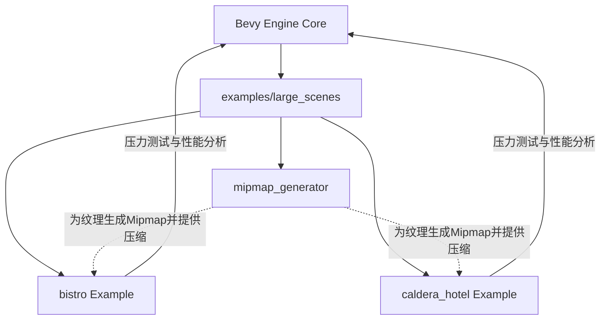

+++
title = "#22409 Large scenes"
date = "2026-01-09T00:00:00"
draft = false
template = "pull_request_page.html"
in_search_index = false

[extra]
current_language = "zh-cn"
available_languages = {"zh-cn" = { name = "中文", url = "/pull_request/bevy/2026-01/pr-22409-zh-cn-20260109" }}
labels = ["A-Rendering", "C-Examples", "C-Testing", "X-Blessed"]
+++

# Title

## Basic Information
- **Title**: Large scenes
- **PR Link**: https://github.com/bevyengine/bevy/pull/22409
- **Author**: DGriffin91
- **Status**: MERGED
- **Labels**: A-Rendering, C-Examples, C-Testing, S-Ready-For-Final-Review, X-Blessed
- **Created**: 2026-01-07T04:36:19Z
- **Merged**: 2026-01-09T01:23:52Z
- **Merged By**: alice-i-cecile

## Description Translation
目标

将 https://github.com/DGriffin91/bevy_bistro_scene 和 https://github.com/DGriffin91/bevy_caldera_scene 移动到 bevy 仓库中，以便于更简单的测试。

这同时也在新的 `large_scene` 文件夹中添加了 https://github.com/DGriffin91/bevy_mod_mipmap_generator，因为 GPU 纹理获取的缓存局部性很重要。这个东西最终可能会作为 bevy 的一部分更通用地提供。但现在想先快速做一个基础版本。

不太确定这些 readme 应该是什么样子。我基本上就是把它们复制过来，做了一些小的调整。

这个 PR 只是一个初始起点，它没有解决自动获取所需资产的问题。

## The Story of This Pull Request

这个 PR 的核心目标是引入标准化的、高性能的大型场景作为 Bevy 生态系统中的测试和基准测试资产。开发者 DGriffin91 之前维护了两个独立的外部仓库来存放复杂的 3D 场景（Bistro 和 Caldera Hotel）。这些场景对于测试 Bevy 渲染引擎在压力条件下的性能、功能正确性和扩展性至关重要。

然而，将这些资产保持为外部依赖带来了一些问题。首先，它使得对 Bevy 核心的更改进行测试变得复杂，因为需要同步管理外部仓库。其次，它不利于社区贡献者和核心开发者快速运行一致的、可重复的基准测试。最后，一个集成的、统一的测试套件对于持续集成和回归测试流水线来说是更可取的。

因此，解决这个问题的直接方法是将这些场景示例及其相关工具直接集成到官方的 Bevy 仓库中。这不仅仅是一个简单的文件移动操作，而是涉及构建一个可配置的、健壮的测试框架，能够支持多种渲染路径和质量预设。

为了确保这些大型场景的纹理能以最优方式被 GPU 处理，PR 中还引入了一个关键的伴随工具：`mipmap_generator`。在实时渲染中，Mipmap（渐进纹理）对于避免远处纹理的走样和优化纹理缓存至关重要。同时，对纹理进行块压缩（如 BCn 格式）可以显著减少 GPU 内存占用和带宽使用，从而提升性能。`mipmap_generator` 插件正是为了解决这两个问题：在运行时或资产加载时为纹理生成 Mipmap 链，并可选地将其压缩为 GPU 友好的 BCn 格式。考虑到压缩过程可能非常耗时，该工具还实现了磁盘缓存机制，避免在每次运行示例时重复进行昂贵的压缩计算。

让我们看看具体的解决方案。PR 在 `examples/large_scenes/` 目录下创建了三个新的 Cargo 工作空间成员：
1.  `bistro`: 基于 NVIDIA 的 Amazon Lumberyard Bistro 场景。
2.  `caldera_hotel`: 基于 Activision 的 Caldera 场景中的酒店建筑。
3.  `mipmap_generator`: 一个可复用的插件，用于生成 Mipmap 和进行纹理压缩。

两个场景示例都展示了高度可配置的渲染设置。它们通过 `argh` 库提供了丰富的命令行参数，允许用户轻松地开关各种渲染功能和性能优化技术。例如：
- `--deferred`: 切换到延迟着色（deferred shading）渲染路径。
- `--no-frustum-culling`: 禁用视锥体剔除，迫使渲染器处理场景中的所有物体，以此对批处理和绘制调用提交系统施加压力。
- `--no-automatic-batching`: 禁用自动批处理，测试大量独立绘制调用的开销。
- `--no-view-occlusion-culling` 和 `--no-shadow-occlusion-culling`: 分别禁用相机和方向光的 GPU 遮挡剔除。
- `--no-cpu-culling`: 禁用 CPU 端的裁剪。
- `--minimal`: 禁用后处理效果（如泛光、环境光遮蔽、抗锯齿）和阴影，提供一个基线性能对比。

这种设计使得这些示例不仅仅是视觉展示，更是强大的性能剖析和引擎压力测试工具。它们还内置了一个基准测试系统（按 `B` 键触发），可以自动在几个预设的相机点位间切换，测量平均帧时间、1%低帧率和1%高帧率，并报告场景中网格和材质的统计信息，为性能分析提供了量化数据。

`mipmap_generator` 插件的实现展示了一种处理动态资产处理的模式。它定义了一个 `GetImages` trait，任何需要生成 Mipmap 的材质都可以实现这个 trait 来提供其关联的纹理句柄。插件通过监听材质资产事件来触发处理流程。对于每个需要处理的纹理，它会创建一个异步计算任务，在后台线程中执行耗时的 Mipmap 生成和压缩操作，避免阻塞主线程。它还考虑到了纹理的原始格式（R8, Rg8, Rgba8 等），并将其转换为合适的 BCn 格式（BC4, BC5, BC7 等）。磁盘缓存功能通过计算输入图像和处理设置的哈希值来实现，将压缩后的二进制数据存储为文件，后续运行中若哈希匹配则直接加载，极大地提升了迭代开发时的启动速度。

从技术角度看，这个 PR 的影响是多方面的。首先，它为标准化的性能测试和回归测试提供了高质量的资产。其次，`mipmap_generator` 为解决 Bevy 社区中一个常见需求（运行时 Mipmap 生成）提供了一个实用的、生产就绪的参考实现。最后，这些示例代码本身也是学习如何在 Bevy 中配置复杂渲染管线、处理大型场景和实现性能测试工具的绝佳资源。

当然，作者也明确指出这只是个起点。未来，像 `mipmap_generator` 这样的功能可能会被整合到 Bevy 核心中，或者有更优的解决方案（如使用预先压缩好的 KTX2 格式资产）。资产的管理目前也是手动的，未来可能需要更自动化的流水线。但这个 PR 成功地建立了一个坚实的基础，使得 Bevy 引擎处理大型、复杂场景的能力可以持续地被评估和优化。

## Visual Representation



## Key Files Changed

1.  **`examples/large_scenes/mipmap_generator/src/lib.rs` (+954/-0)**
    *   **描述**：这是新增的 Mipmap 生成器插件的核心实现。它提供了在运行时为纹理生成 Mipmap 和进行 BCn 格式压缩的功能，并支持磁盘缓存。
    *   **关键代码**：
        ```rust
        // 核心特性：定义了一个 trait，让材质可以声明其依赖的纹理
        pub trait GetImages {
            fn get_images(&self) -> Vec<&Handle<Image>>;
        }

        // 为 StandardMaterial 实现 GetImages
        impl GetImages for StandardMaterial {
            fn get_images(&self) -> Vec<&Handle<Image>> {
                vec![
                    &self.base_color_texture,
                    &self.emissive_texture,
                    &self.metallic_roughness_texture,
                    &self.normal_map_texture,
                    &self.occlusion_texture,
                ]
                .into_iter()
                .flatten()
                .collect()
            }
        }

        // 主要的系统函数：监听材质事件，为需要处理的纹理创建异步任务
        pub fn generate_mipmaps<M: Material + GetImages>(
            mut commands: Commands,
            mut material_events: MessageReader<AssetEvent<M>>,
            // ... 其他参数
        ) {
            // ... 逻辑：检查事件，获取材质，遍历其纹理。
            // 如果纹理没有Mipmap且格式兼容，则创建异步任务
            let task = thread_pool.spawn(async move {
                match generate_mips_texture(&mut image, &settings.clone(), &mut added_cache_size) {
                    Ok(_) => (),
                    Err(e) => warn!("{}", e),
                }
                TaskData { added_cache_size, image }
            });
            // ...
        }
        ```
    *   **与PR目标的关系**：此插件是支撑两个大型场景示例高效运行的关键组件，确保了它们的纹理在GPU上具有最佳的性能表现（Mipmap和压缩），并通过缓存机制提升了开发迭代速度。

2.  **`examples/large_scenes/bistro/src/main.rs` (+638/-0)**
    *   **描述**：Bistro 场景示例的入口点。它加载 Bistro 场景，配置光照、相机、后处理，并处理用户输入和基准测试逻辑。
    *   **关键代码**：
        ```rust
        // 使用 argh 解析命令行参数
        #[derive(FromArgs, Resource, Clone)]
        pub struct Args {
            #[argh(switch)] no_frustum_culling: bool,
            #[argh(switch)] no_automatic_batching: bool,
            #[argh(switch)] deferred: bool,
            // ... 其他选项
        }

        // 在 setup 系统中根据参数条件式地插入组件
        cam.insert_if(DepthPrepass, || args.deferred)
            .insert_if(DeferredPrepass, || args.deferred)
            .insert_if(OcclusionCulling, || !args.no_view_occlusion_culling)
            .insert_if(NoFrustumCulling, || args.no_frustum_culling)
            .insert_if(NoAutomaticBatching, || args.no_automatic_batching);
        ```
    *   **与PR目标的关系**：作为集成的两个大型测试场景之一，它提供了一个复杂、逼真的外部环境，用于测试 Bevy 渲染器的性能和正确性。

3.  **`examples/large_scenes/caldera_hotel/src/main.rs` (+609/-0)**
    *   **描述**：Caldera Hotel 场景示例的入口点。结构与 Bistro 示例类似，但包含一个独特功能：可以为场景中的每个独立网格分配随机生成的材质，用于测试材质系统和纹理系统的压力。
    *   **关键代码**：
        ```rust
        // 在场景加载后处理的系统中，为每个唯一网格分配随机材质
        pub fn assign_rng_materials(
            scene_ready: On<SceneInstanceReady>,
            mut commands: Commands,
            mut materials: ResMut<Assets<StandardMaterial>>,
            // ... 其他参数
            args: Res<Args>,
        ) {
            if !args.random_materials { return; }
            // ... 遍历所有网格，为每个唯一网格创建一个随机材质
            // ... 然后将该材质应用到所有使用该网格的实例上
        }
        ```
    *   **与PR目标的关系**：作为另一个大型场景，它增加了测试的多样性。其“随机材质”功能特别适用于测试渲染器在处理大量唯一材质和纹理时的表现。

4.  **`examples/large_scenes/mipmap_generator/examples/test_compression.rs` (+142/-0)**
    *   **描述**：一个用于测试 `mipmap_generator` 插件压缩功能的独立示例。它创建了几个使用不同通道数（R, RG, RGBA）纹理的平面，并应用插件进行压缩，便于验证压缩功能是否正常工作。
    *   **关键代码**：
        ```rust
        fn create_test_image(size: u32, cx: f32, cy: f32, channels: u32) -> Image {
            // 生成一个曼德博分形图案作为测试纹理数据
            let data: Vec<u8> = (0..size * size)
                .flat_map(|id| {
                    // ... 分形计算逻辑
                    let mut values = vec![0xFF - (count * 2) as u8];
                    if channels > 1 { values.push(0xFF - (count * 5) as u8); }
                    if channels > 2 { values.push(0xFF - (count * 13) as u8); values.push(u8::MAX); }
                    values
                })
                .collect();
            // 构建 Image 资产
            Image { texture_descriptor: ..., data: Some(data), ..Default::default() }
        }
        ```
    *   **与PR目标的关系**：提供了对 `mipmap_generator` 插件核心功能的单元测试和视觉验证，确保其可靠性和正确性。

5.  **`examples/large_scenes/mipmap_generator/README.md` (+96/-0)**
    *   **描述**：`mipmap_generator` 插件的详细文档。说明了其用途、支持的格式、使用方法、如何扩展自定义材质，并明确指出了其定位（主要用于原型/测试）以及更优的替代方案（如使用 `CompressedImageSaver` 或预先处理好的 KTX2 文件）。
    *   **与PR目标的关系**：良好的文档对于任何开源工具都至关重要。这份 README 帮助用户理解插件的设计初衷、正确使用方法以及其局限性，促进了插件的可用性和可维护性。

## Further Reading

1.  **Bevy 官方文档与示例**：深入了解 Bevy 的渲染管线、资产系统和 ECS 架构。
    *   [Bevy 官方教程](https://bevyengine.org/learn/)
    *   [Bevy GitHub 仓库中的其他示例](https://github.com/bevyengine/bevy/tree/latest/examples)

2.  **图形学技术：Mipmap 与纹理压缩**
    *   **Mipmap**: 了解其在抗锯齿（Aliasing）和提升缓存效率方面的原理。
    *   **纹理块压缩 (Block Compression, BCn formats)**: 学习 BC1-BC7 等格式的特点、适用场景（如法线、颜色、带有透明度的纹理）以及其对内存带宽的优化。

3.  **游戏引擎渲染优化技术**
    *   **视锥体剔除 (Frustum Culling)**
    *   **遮挡剔除 (Occlusion Culling)**
    *   **批处理 (Batching)**
    *   **延迟着色 (Deferred Shading)** 与前向着色 (Forward Shading) 的对比。

4.  **相关工具**
    *   **Intel Texture Works 插件** 或 **ARM ASTC 编码器**：用于离线纹理压缩。
    *   **Basis Universal**: 一种支持多种输出格式（包括 ETC1S, UASTC）的超级压缩纹理格式。
    *   **glTF 生态系统工具** (如 `gltf-pipeline`, `gltf-transform`): 用于处理和优化 glTF 资产。