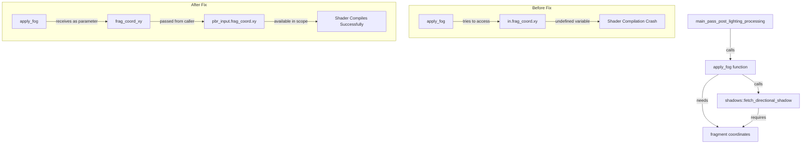

+++
title = "#22411 Fix shader crash in `apply_fog`"
date = "2026-01-07T00:00:00"
draft = false
template = "pull_request_page.html"
in_search_index = true

[taxonomies]
list_display = ["show"]

[extra]
current_language = "en"
available_languages = {"en" = { name = "English", url = "/pull_request/bevy/2026-01/pr-22411-en-20260107" }, "zh-cn" = { name = "中文", url = "/pull_request/bevy/2026-01/pr-22411-zh-cn-20260107" }}
+++

# Title
Fix shader crash in `apply_fog`

## Basic Information
- **Title**: Fix shader crash in `apply_fog`
- **PR Link**: https://github.com/bevyengine/bevy/pull/22411
- **Author**: aevyrie
- **Status**: MERGED
- **Labels**: None
- **Created**: 2026-01-07T07:30:43Z
- **Merged**: 2026-01-07T09:04:03Z
- **Merged By**: superdump

## Description Translation

# Objective

- Fix #22406

## Solution

- Pass missing fragment coordinate into the function.

## Testing

- Deferred and atmospheric fog examples no longer fail.

## The Story of This Pull Request

This PR addresses a specific shader compilation crash in Bevy's physically-based rendering (PBR) system. The issue occurred when fog was enabled in deferred rendering or atmospheric fog scenarios, causing the shader to fail at compile time due to a missing parameter.

The root cause was in the `apply_fog` function in `pbr_functions.wgsl`. This function needed fragment coordinate data for shadow calculations but was trying to access it from an undefined variable. Specifically, the function attempted to use `in.frag_coord.xy`, but the `in` variable wasn't available in the function's scope.

The solution is straightforward: modify the function signature to accept fragment coordinates as a parameter and update all call sites to provide this data. The `apply_fog` function now takes a `frag_coord_xy: vec2<f32>` parameter. Inside the function, when calling `shadows::fetch_directional_shadow`, the code now uses the passed `frag_coord_xy` parameter instead of the undefined `in.frag_coord.xy`.

The calling code in `main_pass_post_lighting_processing` was updated to pass `pbr_input.frag_coord.xy` to the `apply_fog` function. This ensures the function has access to the fragment coordinates it needs for shadow sampling operations.

This fix is minimal and focused. It doesn't change any rendering logic or algorithms, just corrects a variable scope issue that prevented the shader from compiling. The approach preserves the existing architecture and doesn't introduce any new abstractions or complexity.

The testing confirms the fix resolves the issue in both deferred and atmospheric fog examples, which previously would fail to run due to shader compilation errors.

## Visual Representation



## Key Files Changed

**crates/bevy_pbr/src/render/pbr_functions.wgsl** (+15/-3)

This WGSL shader file contains the core PBR rendering functions. The changes fix a shader compilation crash by correcting a function signature and parameter passing issue.

Key modifications:

1. **Function signature update**: The `apply_fog` function now accepts an additional `frag_coord_xy` parameter.
   
```wgsl
// Before:
fn apply_fog(fog_params: mesh_view_types::Fog, input_color: vec4<f32>, fragment_world_position: vec3<f32>, view_world_position: vec3<f32>) -> vec4<f32> {

// After:
fn apply_fog(
    fog_params: mesh_view_types::Fog,
    input_color: vec4<f32>,
    fragment_world_position: vec3<f32>,
    view_world_position: vec3<f32>,
    frag_coord_xy: vec2<f32>,
) -> vec4<f32> {
```

2. **Parameter usage fix**: The shadow sampling function call now uses the passed parameter instead of an undefined variable.

```wgsl
// Before:
shadow = shadows::fetch_directional_shadow(i, fragment_world_position_vec4, view_direction_normal, view_z, in.frag_coord.xy);

// After:
shadow = shadows::fetch_directional_shadow(i, fragment_world_position_vec4, view_direction_normal, view_z, frag_coord_xy);
```

3. **Call site update**: The function call in `main_pass_post_lighting_processing` now provides the required fragment coordinates.

```wgsl
// Before:
output_color = apply_fog(view_bindings::fog, output_color, pbr_input.world_position.xyz, view_bindings::view.world_position.xyz);

// After:
output_color = apply_fog(
    view_bindings::fog,
    output_color,
    pbr_input.world_position.xyz,
    view_bindings::view.world_position.xyz,
    pbr_input.frag_coord.xy,
);
```

## Further Reading

- [WGSL (WebGPU Shading Language) Specification](https://www.w3.org/TR/WGSL/) - The shader language used by Bevy's rendering system
- [Bevy PBR (Physically Based Rendering) Documentation](https://bevyengine.org/learn/book/getting-started/3d-rendering/) - Overview of Bevy's PBR implementation
- [Shader Compilation and Debugging in Graphics Programming](https://github.com/gfx-rs/wgpu/wiki/Debugging-wgpu-Applications) - Techniques for debugging shader compilation issues
- [Deferred Rendering Techniques](https://learnopengl.com/Advanced-Lighting/Deferred-Shading) - Background on deferred rendering which was affected by this bug