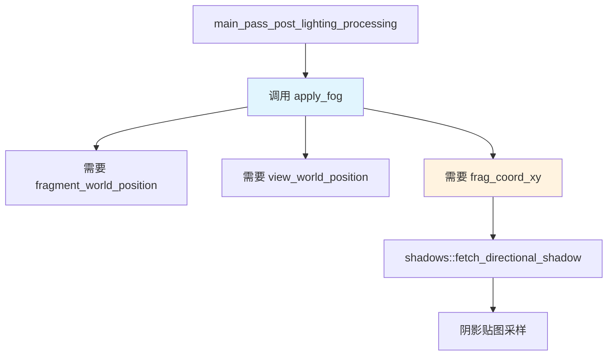

+++
title = "#22411 Fix shader crash in `apply_fog"
date = "2026-01-07T00:00:00"
draft = false
template = "pull_request_page.html"
in_search_index = false

[extra]
current_language = "zh-cn"
available_languages = {"en" = { name = "English", url = "/pull_request/bevy/2026-01/pr-22411-en-20260107" }, "zh-cn" = { name = "中文", url = "/pull_request/bevy/2026-01/pr-22411-zh-cn-20260107" }}
+++

# 标题

## 基本信息
- **标题**: Fix shader crash in `apply_fog`
- **PR链接**: https://github.com/bevyengine/bevy/pull/22411
- **作者**: aevyrie
- **状态**: 已合并
- **标签**: 无
- **创建时间**: 2026-01-07T07:30:43Z
- **合并时间**: 2026-01-07T09:04:03Z
- **合并人**: superdump

## 描述翻译
修复 #22406 中报告的问题。

### 解决方案
向函数中传递缺失的片段坐标（fragment coordinate）参数。

### 测试
延迟渲染（deferred）和大气雾（atmospheric fog）示例不再出现故障。

## 本次 PR 的技术分析

这是一个典型的着色器参数传递错误修复案例。问题出现在 Bevy 的物理渲染（PBR）着色器中，具体在 `apply_fog` 函数实现上。

### 问题根因分析
在最初的实现中，`apply_fog` 函数被设计为需要片段坐标（fragment coordinate）来支持雾效计算中的阴影采样。然而，在函数的参数列表中，这个必需的 `frag_coord_xy` 参数被遗漏了。

当 `DISTANCE_FOG` 宏被定义，且启用雾效的材质需要调用 `apply_fog` 函数时，`shadows::fetch_directional_shadow` 函数需要一个 `vec2<f32>` 类型的片段坐标参数来进行阴影贴图采样。原始代码试图使用 `in.frag_coord.xy`，但在 `apply_fog` 函数的上下文中，`in` 结构体并不可用。

这是一个典型的跨函数参数传递不完整的问题。虽然 `apply_fog` 函数内部需要这个参数，但调用方没有提供，而函数签名也没有声明需要这个参数。

### 解决方案实现
修复方案直接明了：更新 `apply_fog` 函数的签名，添加缺失的 `frag_coord_xy: vec2<f32>` 参数，同时在所有调用站点更新参数传递。

具体更改包括：
1. 修改 `apply_fog` 函数签名，添加 `frag_coord_xy: vec2<f32>` 参数
2. 在函数内部，将 `shadows::fetch_directional_shadow` 调用的第四个参数从 `in.frag_coord.xy` 改为传入的 `frag_coord_xy`
3. 在 `main_pass_post_lighting_processing` 函数中调用 `apply_fog` 时，传递正确的片段坐标 `pbr_input.frag_coord.xy`

这种修复方式遵循了 WGSL 着色语言的标准参数传递模式。通过显式声明所有必需的参数，确保函数在不同上下文中的可移植性和正确性。

### 技术细节说明
在 Bevy 的渲染管线中，雾效计算需要访问多个空间坐标：
- `fragment_world_position`: 片段在世界空间中的位置
- `view_world_position`: 摄像机在世界空间中的位置  
- `frag_coord_xy`: 片段在屏幕空间中的坐标（用于阴影采样）

`shadows::fetch_directional_shadow` 函数需要屏幕空间坐标来查询阴影贴图。这是实现基于屏幕空间的阴影技术（screen-space shadows）的标准做法，可以高效地确定当前片段是否处于阴影中。

从工程角度看，这个问题的出现暴露了着色器开发中的一个常见陷阱：当函数实现需要访问特定上下文中的变量时，必须确保这些变量通过参数显式传递，而不是隐式依赖外部作用域。在 WGSL 中，没有全局变量（除了 uniform 和 storage 资源），因此参数传递是函数间数据交换的唯一方式。

### 影响范围
这个修复解决了两个关键示例的崩溃问题：
- **延迟渲染示例**：在延迟渲染路径中，雾效计算需要正确的参数传递
- **大气雾示例**：专门展示大气散射和雾效的示例，直接依赖 `apply_fog` 函数

虽然问题表现为示例崩溃，但这个修复实际上影响所有使用 `DISTANCE_FOG` 功能并启用了雾效的材质。没有这个修复，任何试图使用雾效的场景都可能遇到着色器编译错误或运行时错误。

### 代码质量考量
从代码维护角度，这个修复采用了最小修改原则（minimal change principle）：
- 只修改必要的地方
- 保持函数接口的一致性
- 不引入不必要的重构

这种保守的修复方式对于着色器代码特别重要，因为着色器编译错误通常难以调试，且微小的语法错误就会导致整个渲染管线失败。

## 可视化关系



## 关键文件变更

### `crates/bevy_pbr/src/render/pbr_functions.wgsl` (+15/-3)

这个文件包含 Bevy 的物理渲染着色器函数。具体更改发生在雾效计算相关的函数中。

**修改前:**
```wgsl
fn apply_fog(fog_params: mesh_view_types::Fog, input_color: vec4<f32>, fragment_world_position: vec3<f32>, view_world_position: vec3<f32>) -> vec4<f32> {
    // ...
    shadow = shadows::fetch_directional_shadow(i, fragment_world_position_vec4, view_direction_normal, view_z, in.frag_coord.xy);
    // ...
}

// 调用处
output_color = apply_fog(view_bindings::fog, output_color, pbr_input.world_position.xyz, view_bindings::view.world_position.xyz);
```

**修改后:**
```wgsl
fn apply_fog(
    fog_params: mesh_view_types::Fog,
    input_color: vec4<f32>,
    fragment_world_position: vec3<f32>,
    view_world_position: vec3<f32>,
    frag_coord_xy: vec2<f32>,  // 新增参数
) -> vec4<f32> {
    // ...
    shadow = shadows::fetch_directional_shadow(i, fragment_world_position_vec4, view_direction_normal, view_z, frag_coord_xy);  // 使用传入的参数
    // ...
}

// 调用处
output_color = apply_fog(
    view_bindings::fog,
    output_color,
    pbr_input.world_position.xyz,
    view_bindings::view.world_position.xyz,
    pbr_input.frag_coord.xy,  // 传递片段坐标
);
```

**更改说明:**
1. 函数签名中添加了 `frag_coord_xy: vec2<f32>` 参数
2. 内部调用 `shadows::fetch_directional_shadow` 时使用传入的 `frag_coord_xy` 而不是不存在的 `in.frag_coord.xy`
3. 调用站点现在显式传递 `pbr_input.frag_coord.xy` 作为参数

## 延伸阅读

1. **WGSL 着色语言规范**: [WebGPU Shading Language](https://www.w3.org/TR/WGSL/)
2. **Bevy 渲染管线文档**: [Bevy Render Pipeline](https://bevy-cheatbook.github.io/rendering/pipeline.html)
3. **基于屏幕空间的阴影技术**: [Screen Space Shadows](https://learnopengl.com/Guest-Articles/2021/Scene/Screen-Space-Shadows)
4. **延迟渲染中的雾效实现**: [Fog in Deferred Rendering](https://lettier.github.io/3d-game-shaders-for-beginners/fog.html)

# 完整代码差异
```
diff --git a/crates/bevy_pbr/src/render/pbr_functions.wgsl b/crates/bevy_pbr/src/render/pbr_functions.wgsl
index f62d85c155b33..c53820ab0ba0a 100644
--- a/crates/bevy_pbr/src/render/pbr_functions.wgsl
+++ b/crates/bevy_pbr/src/render/pbr_functions.wgsl
@@ -761,7 +761,13 @@ fn apply_pbr_lighting(
 #endif // PREPASS_FRAGMENT
 
 #ifdef DISTANCE_FOG
-fn apply_fog(fog_params: mesh_view_types::Fog, input_color: vec4<f32>, fragment_world_position: vec3<f32>, view_world_position: vec3<f32>) -> vec4<f32> {
+fn apply_fog(
+    fog_params: mesh_view_types::Fog,
+    input_color: vec4<f32>,
+    fragment_world_position: vec3<f32>,
+    view_world_position: vec3<f32>,
+    frag_coord_xy: vec2<f32>,
+) -> vec4<f32> {
     let view_to_world = fragment_world_position.xyz - view_world_position.xyz;
 
     // `length()` is used here instead of just `view_to_world.z` since that produces more
@@ -795,7 +801,7 @@ fn apply_fog(fog_params: mesh_view_types::Fog, input_color: vec4<f32>, fragment_
             // Sample shadow map to attenuate inscattering in shadowed areas
             var shadow: f32 = 1.0;
             if ((light.flags & mesh_view_types::DIRECTIONAL_LIGHT_FLAGS_SHADOWS_ENABLED_BIT) != 0u) {
-                shadow = shadows::fetch_directional_shadow(i, fragment_world_position_vec4, view_direction_normal, view_z, in.frag_coord.xy);
+                shadow = shadows::fetch_directional_shadow(i, fragment_world_position_vec4, view_direction_normal, view_z, frag_coord_xy);
             }
             scattering += scattering_contribution * shadow;
         }
@@ -878,7 +884,13 @@ fn main_pass_post_lighting_processing(
 #ifdef DISTANCE_FOG
     // fog
     if ((pbr_input.material.flags & pbr_types::STANDARD_MATERIAL_FLAGS_FOG_ENABLED_BIT) != 0u) {
-        output_color = apply_fog(view_bindings::fog, output_color, pbr_input.world_position.xyz, view_bindings::view.world_position.xyz);
+        output_color = apply_fog(
+            view_bindings::fog,
+            output_color,
+            pbr_input.world_position.xyz,
+            view_bindings::view.world_position.xyz,
+            pbr_input.frag_coord.xy,
+        );
     }
 #endif  // DISTANCE_FOG
```