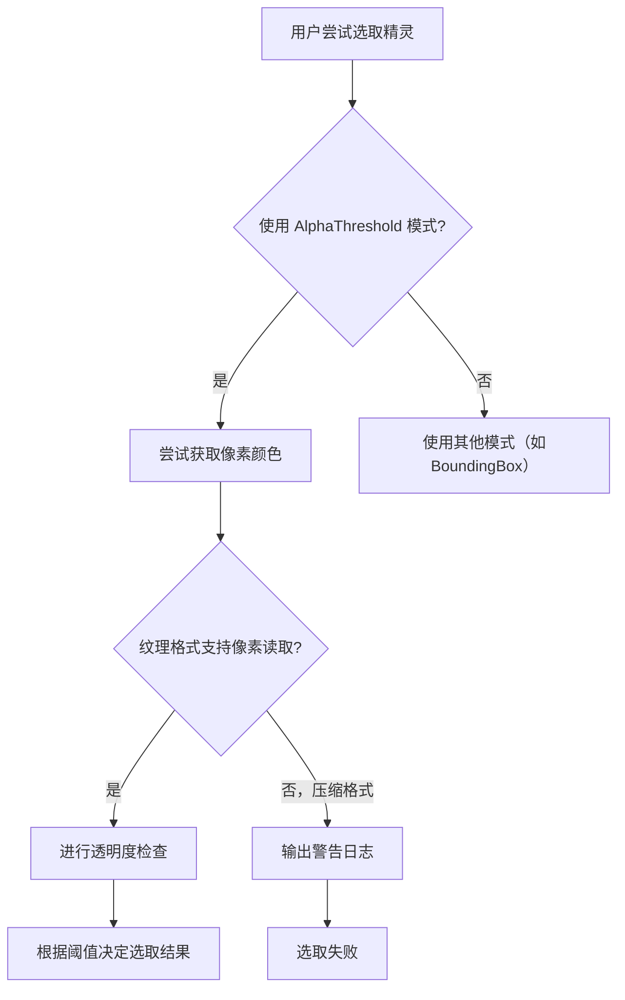

+++
title = "#22414 Add warning log for sprite picking failure on compressed textures"
date = "2026-01-07T00:00:00"
draft = false
template = "pull_request_page.html"
in_search_index = false

[extra]
current_language = "zh-cn"
available_languages = {"en" = { name = "English", url = "/pull_request/bevy/2026-01/pr-22414-en-20260107" }, "zh-cn" = { name = "中文", url = "/pull_request/bevy/2026-01/pr-22414-zh-cn-20260107" }}
+++

# Add warning log for sprite picking failure on compressed textures

## 基本信息

- **标题**: Add warning log for sprite picking failure on compressed textures
- **PR链接**: https://github.com/bevyengine/bevy/pull/22414
- **作者**: mirsella
- **状态**: 已合并
- **标签**: C-Usability, S-Ready-For-Final-Review, A-Picking
- **创建时间**: 2026-01-07T09:49:02Z
- **合并时间**: 2026-01-07T20:52:09Z
- **合并者**: alice-i-cecile

## 描述翻译

### Objective（目标）

修复 https://github.com/bevyengine/bevy/issues/22413
根据这个issue：
> 目前，在 SpritePickingMode::AlphaThreshold 模式下，对于像 bc7、uastc 等图像格式，精灵选取（sprite picking）会静默失败，因为无法在内存中获取压缩图像的特定位置的像素alpha值。当前代码会中断循环并静默跳过该精灵的选取。
https://github.com/bevyengine/bevy/pull/20574 已使其不再崩溃。

当遇到此问题时，很难调试为什么精灵选取不工作，我认为一个警告（warn）日志会很有用。

### Solution（解决方案）

添加一个 warn! 日志。

### Testing（测试）

在我自己的项目上进行了测试。

这个日志信息合适吗？

谢谢。

## 这个PR的故事

这个PR解决了一个困扰开发者的实际问题：当使用压缩纹理格式时，精灵选取功能会静默失败，且难以调试。

### 问题与背景

在 Bevy 引擎中，`SpritePickingMode::AlphaThreshold` 模式用于基于像素透明度进行精确的精灵选取。其工作原理是检查鼠标光标下像素的 alpha 值是否超过设定阈值。然而，当纹理使用压缩格式（如 BC7、UASTC 等）时，图像数据在内存中以压缩形式存储，无法直接访问单个像素值。`get_color_at` 方法在这种情况下会返回 `TextureAccessError::UnsupportedTextureFormat` 错误。

在 PR #20574 之前，遇到此错误会导致 panic。该PR修复了 panic，但处理方式是简单地中断选取循环并返回 `false`（即选取失败），没有任何提示。对于开发者而言，这表现为精灵突然无法被选取，但没有任何错误信息，调试起来非常困难。

### 解决方案

作者采取了一个直接且实用的方案：在错误处理分支中添加一个 `warn!` 日志。这样当选取因不支持的纹理格式而失败时，控制台会输出清晰的警告信息，明确指出问题所在，并给出建议的解决方案。

### 具体实现

实现涉及两个文件。首先，需要在 `bevy_sprite` crate 中添加 `bevy_log` 依赖以使用日志宏。

**Cargo.toml 变更**：
```toml
# 添加依赖
bevy_log = { path = "../bevy_log", version = "0.18.0-dev" }
```

**核心逻辑在 `picking_backend.rs`**：

修改位于 `sprite_picking` 函数内部，处理 `image.get_color_at` 调用结果的部分。原先的代码在错误时直接中断循环并返回 `false`：

```rust
// 之前的代码（简化示意）
let Ok(color) = image.get_color_at(...) else {
    // We don't know how to interpret the pixel.
    break 'valid_pixel false;
};
```

修改后，代码对错误进行了模式匹配。当错误类型为 `TextureAccessError::UnsupportedTextureFormat` 时，输出警告日志：

```rust
// 修改后的代码
let color = match image.get_color_at(...) {
    Ok(color) => color,
    Err(TextureAccessError::UnsupportedTextureFormat(format)) => {
        warn!(
            "Failed to get pixel color for sprite picking on entity {:?}: unsupported texture format {:?}. \
            This is often caused by the use of a compressed texture format. \
            Consider using `SpritePickingMode::BoundingBox`.",
            entity,
            format
        );
        break 'valid_pixel false;
    }
    Err(_) => break 'valid_pixel false,
};
```

### 技术细节与工程考量

1.  **精准的错误处理**：代码没有笼统地捕获所有错误，而是专门处理 `UnsupportedTextureFormat` 类型，这确保了警告信息只在遇到压缩纹理问题时触发，对于其他类型的错误（可能是真正的bug）则静默处理。

2.  **有用的日志信息**：警告信息包含几个关键部分：
    *   失败的操作和涉及的实体
    *   不支持的纹理格式
    *   问题根源的解释（压缩纹理）
    *   可行的解决方案建议（改用 `BoundingBox` 模式）
    
    这大大降低了调试难度。

3.  **向后兼容**：这个改动是完全向后兼容的。它没有改变任何API或行为，只是添加了日志输出。不会影响现有代码的运行。

4.  **性能影响**：添加日志调用对性能的影响可以忽略不计，因为只有在选取失败且是因为特定原因时才会触发。

### 影响与总结

这个PR虽然改动很小，但体现了良好的软件工程实践：**让失败变得明显**。静默失败是难以调试的错误来源。通过添加一个清晰的警告，开发者可以立即识别问题，理解原因，并知道如何解决。

这个改动也展示了如何在错误处理中提供上下文信息，这对于库的使用者非常有价值。从更广的角度看，它加强了 Bevy 引擎的可用性和开发者体验。

## 视觉表示



## 关键文件变更

### 1. `crates/bevy_sprite/Cargo.toml`
**变更**：添加 `bevy_log` 依赖。
```toml
# 添加行
bevy_log = { path = "../bevy_log", version = "0.18.0-dev" }
```
**原因**：为了在代码中使用 `warn!` 日志宏，需要引入日志库依赖。

### 2. `crates/bevy_sprite/src/picking_backend.rs`
**变更**：在 `sprite_picking` 函数中，当无法获取像素颜色时添加警告日志。

**修改前**：
```rust
// 导入部分没有 bevy_log 和 TextureAccessError
// ...
let Ok(color) = image.get_color_at(
    cursor_pixel_space.x as u32,
    cursor_pixel_space.y as u32,
) else {
    // We don't know how to interpret the pixel.
    break 'valid_pixel false;
};
```

**修改后**：
```rust
// 导入添加了 bevy_log 和 TextureAccessError
use bevy_image::{prelude::*, TextureAccessError};
use bevy_log::warn;
// ...
let color = match image.get_color_at(
    cursor_pixel_space.x as u32,
    cursor_pixel_space.y as u32,
) {
    Ok(color) => color,
    Err(TextureAccessError::UnsupportedTextureFormat(format)) => {
        warn!(
            "Failed to get pixel color for sprite picking on entity {:?}: unsupported texture format {:?}. \
            This is often caused by the use of a compressed texture format. \
            Consider using `SpritePickingMode::BoundingBox`.",
            entity,
            format
        );
        break 'valid_pixel false;
    }
    Err(_) => break 'valid_pixel false,
};
```

**与PR目标的关系**：这是实现PR目标的核心代码变更，通过添加警告日志，使得压缩纹理导致的选取失败变得可见且易于调试。

## 扩展阅读

1.  **Bevy Picking 系统**：了解 Bevy 的实体选取（Picking）系统如何工作，以及不同的 `SpritePickingMode`。
2.  **纹理压缩格式**：了解 BC7、UASTC 等纹理压缩格式及其在游戏开发中的应用，理解为什么这些格式无法进行直接的像素读取。
3.  **Rust 错误处理最佳实践**：学习 Rust 中如何使用 `Result` 和 `match` 进行精细的错误处理，以及如何提供有用的错误信息。
4.  **日志记录在库开发中的重要性**：了解为什么在库代码中添加适当的日志记录（尤其是警告和错误级别）对于改善开发者体验至关重要。