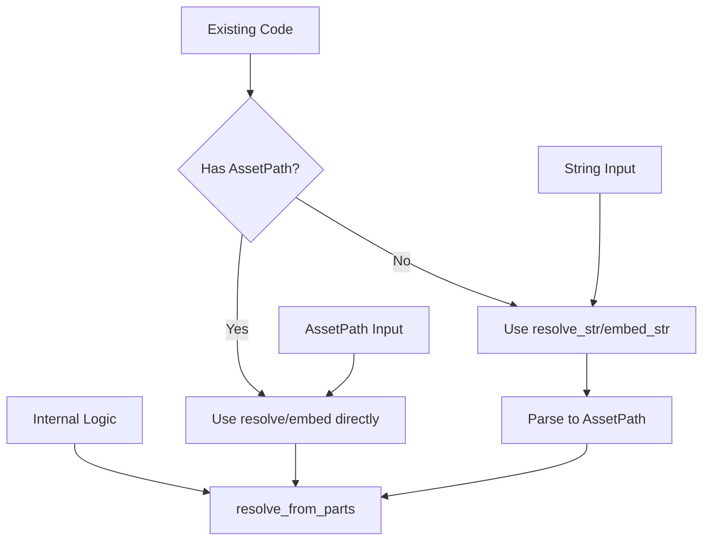

+++
title = "#22416 Add AssetPath::resolve_path and resolve_embed_path methods"
date = "2026-01-08T00:00:00"
draft = false
template = "pull_request_page.html"
in_search_index = true

[taxonomies]
list_display = ["show"]

[extra]
current_language = "en"
available_languages = {"en" = { name = "English", url = "/pull_request/bevy/2026-01/pr-22416-en-20260108" }, "zh-cn" = { name = "中文", url = "/pull_request/bevy/2026-01/pr-22416-zh-cn-20260108" }}
labels = ["A-Assets", "C-Code-Quality", "C-Usability", "D-Straightforward"]
+++

# Title: Add AssetPath::resolve_path and resolve_embed_path methods

## Basic Information
- **Title**: Add AssetPath::resolve_path and resolve_embed_path methods
- **PR Link**: https://github.com/bevyengine/bevy/pull/22416
- **Author**: Eyad3skr
- **Status**: MERGED
- **Labels**: A-Assets, C-Code-Quality, C-Usability, S-Ready-For-Final-Review, X-Uncontroversial, D-Straightforward
- **Created**: 2026-01-07T12:27:38Z
- **Merged**: 2026-01-08T19:03:17Z
- **Merged By**: alice-i-cecile

## Description Translation

# Objective

Fixes #22239

## Solution

- Added `resolve_path(&AssetPath)` - equivalent to `resolve(&str)`
- Added `resolve_embed_path(&AssetPath)` - equivalent to `resolve_embed(&str)`
- Refactored `resolve_internal` to use shared `resolve_from_parts` helper
- Added unit tests for equivalence
- All semantic edge cases preserved (eg., label-only, or leading /)
- No behavior changes to existing methods

## Testing

- Added 2 new equivalence tests proving `resolve_path() ≡ resolve(&path.to_string())`
- All 20 tests pass: `cargo test -p bevy_asset --lib path::tests`
- Test covers: relative paths, labels, leading /, explicit sources, RFC 1808 embed behavior

### How to test

```
cargo test -p bevy_asset --lib path::tests
```

---

## The Story of This Pull Request

This PR addresses a common pattern in Bevy's asset system where developers need to resolve one AssetPath relative to another. Previously, the API only provided string-based resolution methods, which meant that when you already had an AssetPath object, you had to convert it back to a string, parse it again, and then perform the resolution. This was inefficient and verbose.

The core problem was that `AssetPath::resolve(&str)` and `AssetPath::resolve_embed(&str)` required string inputs, even when the caller already had an AssetPath object. Consider this common scenario: you have a base AssetPath and want to resolve a relative AssetPath against it. You'd need to call `base.resolve(&other_path.to_string())`, which involves unnecessary string allocation and parsing overhead.

The solution introduces two new methods: `resolve(&AssetPath)` and `resolve_embed(&AssetPath)`. These work identically to their string-based counterparts but take AssetPath objects directly, avoiding the intermediate string conversion. To maintain backward compatibility, the existing string methods were renamed to `resolve_str` and `resolve_embed_str`.

The implementation was refactored to extract the common resolution logic into a new private method `resolve_from_parts`. This method handles the actual path resolution logic, which both the string-based and AssetPath-based methods now call. This approach ensures consistent behavior across both APIs and reduces code duplication.

Let's examine the key implementation details. The `resolve_from_parts` method takes these parameters:
- `replace`: a boolean indicating whether to use RFC 1808 semantics (removing the file portion for embedded paths)
- `source`: an optional explicit source name
- `rpath`: the path to resolve
- `rlabel`: an optional label

The method handles several edge cases:
1. Label-only paths: If the relative path contains only a label (like `#label`), it replaces the base path's label
2. Absolute paths: Paths starting with `/` are treated as rooted at the asset source
3. Explicit sources: Paths with a source prefix (like `custom://path`) replace the entire base source
4. Path normalization: Relative segments (`.` and `..`) are properly handled

Here's how the new AssetPath-based method works:

```rust
pub fn resolve(&self, path: &AssetPath<'_>) -> AssetPath<'static> {
    let is_label_only = matches!(path.source(), AssetSourceId::Default)
        && path.path().as_os_str().is_empty()
        && path.label().is_some();

    if is_label_only {
        self.clone_owned()
            .with_label(path.label().unwrap().to_owned())
    } else {
        let explicit_source = match path.source() {
            AssetSourceId::Default => None,
            AssetSourceId::Name(name) => Some(name.as_ref()),
        };

        self.resolve_from_parts(false, explicit_source, path.path(), path.label())
    }
}
```

The method first checks if the input path is label-only by verifying it has the default source, an empty path, and a label. If so, it simply clones the base path with the new label. Otherwise, it extracts the source (if any) and delegates to `resolve_from_parts`.

The existing string-based methods were updated to use the same infrastructure:

```rust
pub fn resolve_str(&self, path: &str) -> Result<AssetPath<'static>, ParseAssetPathError> {
    self.resolve_internal(path, false)
}
```

The `resolve_internal` method now parses the string and then calls `resolve_from_parts`, ensuring both code paths produce identical results.

The PR includes comprehensive test coverage, with each test case verifying both the string-based and AssetPath-based methods produce the same output. For example:

```rust
#[test]
fn resolve_full_path() {
    let base = AssetPath::from("alice/bob#carol");
    assert_eq!(
        base.resolve_str("/joe/next").unwrap(),
        AssetPath::from("joe/next")
    );
    assert_eq!(
        base.resolve(&AssetPath::parse("/joe/next")),
        AssetPath::from("joe/next")
    );
}
```

This testing approach validates that the new methods are truly equivalent to the old ones, just more efficient when you already have an AssetPath object.

The changes also required updates to existing code that used the string-based methods. In `bevy_gltf` and the asset decompression example, calls to `resolve_embed` were updated to `resolve_embed_str` to maintain the same string-based behavior while freeing up the shorter method names for the new AssetPath-based versions.

The PR includes a migration guide explaining that `AssetPath::resolve` and `resolve_embed` now take `&AssetPath` directly, and the previous string-based APIs have been renamed to `resolve_str` and `resolve_embed_str`. This is a breaking change, but it's justified by the improved API ergonomics and performance.

From a technical perspective, this PR demonstrates several good practices:
1. **API design**: When adding new methods, consider whether existing method names should be repurposed for better ergonomics
2. **Code reuse**: Extract shared logic into helper methods to maintain consistency
3. **Testing**: Add equivalence tests to ensure new implementations match old behavior
4. **Documentation**: Update examples and migration guides for breaking changes

The refactoring improves performance for common use cases while maintaining full backward compatibility through renamed methods. Developers who have AssetPath objects can now resolve them more efficiently, while code that works with strings continues to work with the `_str` suffix.

## Visual Representation



## Key Files Changed

### 1. `crates/bevy_asset/src/path.rs` (+360/-129)
This is the main file containing the AssetPath implementation. The changes include:
- Added new `resolve` and `resolve_embed` methods that take `&AssetPath`
- Renamed existing string-based methods to `resolve_str` and `resolve_embed_str`
- Added `resolve_from_parts` helper method for shared logic
- Updated documentation with new examples
- Added comprehensive tests for both old and new APIs

Key code changes:
```rust
// Before:
pub fn resolve(&self, path: &str) -> Result<AssetPath<'static>, ParseAssetPathError> {
    self.resolve_internal(path, false)
}

// After:
pub fn resolve(&self, path: &AssetPath<'_>) -> AssetPath<'static> {
    // New implementation using AssetPath directly
}

pub fn resolve_str(&self, path: &str) -> Result<AssetPath<'static>, ParseAssetPathError> {
    self.resolve_internal(path, false)
}
```

### 2. `release-content/migration-guides/assetpath-resolve-semantics.md` (+8/-0)
Added a migration guide explaining the breaking change:
```markdown
`AssetPath::resolve` and `AssetPath::resolve_embed` no longer accept `&str` and now take `&AssetPath` directly. The previous string-based APIs have been renamed to `resolve_str` and `resolve_embed_str`.
```

### 3. `crates/bevy_gltf/src/loader/mod.rs` (+2/-2)
Updated two calls from `resolve_embed` to `resolve_embed_str`:
```rust
// Before:
let image_path = gltf_path
    .resolve_embed(uri)
    .map_err(|err| GltfError::InvalidImageUri(uri.to_owned(), err))?;

// After:
let image_path = gltf_path
    .resolve_embed_str(uri)
    .map_err(|err| GltfError::InvalidImageUri(uri.to_owned(), err))?;
```

### 4. `examples/asset/asset_decompression.rs` (+1/-1)
Similar update from `resolve_embed` to `resolve_embed_str`:
```rust
// Before:
let contained_path = compressed_path
    .resolve_embed(uncompressed_file_name)
    .map_err(|_| GzAssetLoaderError::IndeterminateFilePath)?;

// After:
let contained_path = compressed_path
    .resolve_embed_str(uncompressed_file_name)
    .map_err(|_| GzAssetLoaderError::IndeterminateFilePath)?;
```

## Further Reading

1. **RFC 1808**: The standard for relative URLs that inspired the `resolve_embed` semantics
2. **Bevy Asset System Documentation**: For understanding AssetPath and asset loading
3. **API Design Patterns**: For learning about breaking changes and migration strategies
4. **Rust Performance Optimization**: For understanding the benefits of avoiding unnecessary allocations