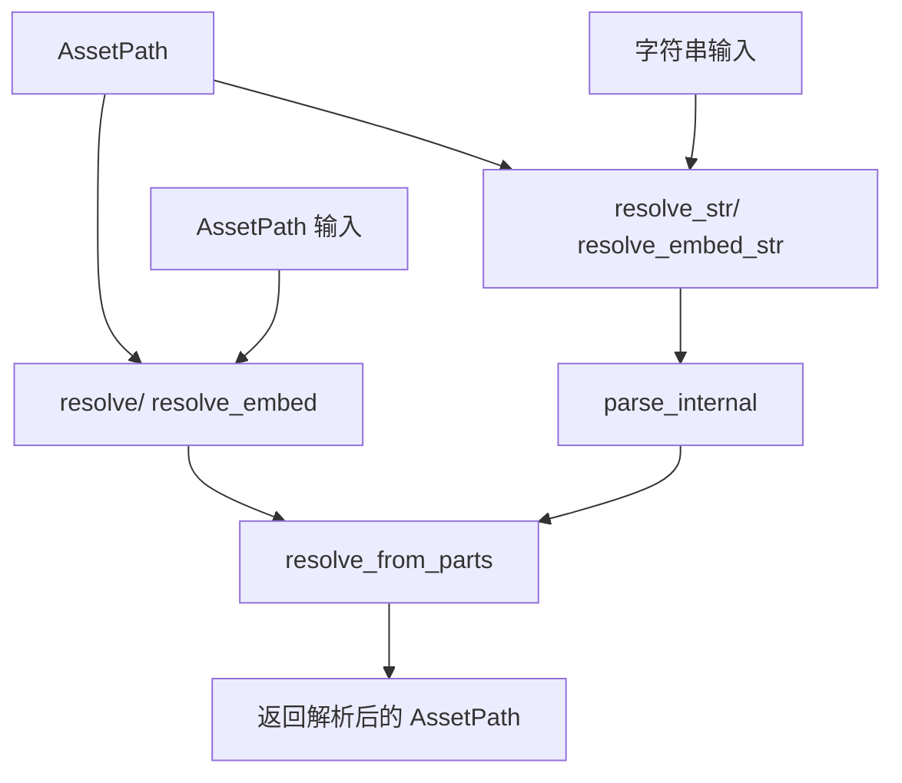

+++
title = "#22416 Add AssetPath::resolve_path and resolve_embed_path methods"
date = "2026-01-08T00:00:00"
draft = false
template = "pull_request_page.html"
in_search_index = false

[extra]
current_language = "zh-cn"
available_languages = {"en" = { name = "English", url = "/pull_request/bevy/2026-01/pr-22416-en-20260108" }, "zh-cn" = { name = "中文", url = "/pull_request/bevy/2026-01/pr-22416-zh-cn-20260108" }}
labels = ["A-Assets", "C-Code-Quality", "C-Usability", "D-Straightforward"]
+++

# Title
Add AssetPath::resolve_path and resolve_embed_path methods

## Basic Information
- **Title**: Add AssetPath::resolve_path and resolve_embed_path methods
- **PR Link**: https://github.com/bevyengine/bevy/pull/22416
- **Author**: Eyad3skr
- **Status**: MERGED
- **Labels**: A-Assets, C-Code-Quality, C-Usability, S-Ready-For-Final-Review, X-Uncontroversial, D-Straightforward
- **Created**: 2026-01-07T12:27:38Z
- **Merged**: 2026-01-08T19:03:17Z
- **Merged By**: alice-i-cecile

## Description Translation
**目标** (Objective)

修复 #22239

**解决方案** (Solution)

- 添加了 `resolve_path(&AssetPath)` - 等同于 `resolve(&str)`
- 添加了 `resolve_embed_path(&AssetPath)` - 等同于 `resolve_embed(&str)`
- 重构了 `resolve_internal` 以使用共享的 `resolve_from_parts` 辅助函数
- 添加了单元测试来验证等价性
- 所有语义边缘情况都保留（例如：仅标签、前导斜杠）
- 现有方法的行为没有改变

**测试** (Testing)

- 添加了2个新的等价性测试，证明 `resolve_path() ≡ resolve(&path.to_string())`
- 所有20个测试通过：`cargo test -p bevy_asset --lib path::tests`
- 测试覆盖：相对路径、标签、前导斜杠、显式资源源、RFC 1808 嵌入行为

**如何测试** (How to test)

```
cargo test -p bevy_asset --lib path::tests
```

---

## The Story of This Pull Request

### The Problem and Context

在 Bevy 的资产系统中，`AssetPath` 结构体提供了 `resolve` 和 `resolve_embed` 方法来解析相对路径。这些方法原本只接受字符串参数（`&str`），这意味着当开发者已经有一个 `AssetPath` 实例时，仍然需要先将其转换为字符串，再由这些方法重新解析。这个过程既低效又冗余。

具体来说，使用场景是这样的：假设你有一个基础路径 `base_path: AssetPath` 和一个相对路径 `relative_path: AssetPath`，你想要将它们组合起来。原本的做法是：
```rust
let resolved = base_path.resolve(&relative_path.to_string());
```
这里存在两个问题：首先，`to_string()` 进行了不必要的字符串分配；其次，`resolve` 内部需要重新解析这个字符串。这是一个典型的 API 设计问题——当调用者已经持有结构化的数据时，API 却要求他们将数据序列化为字符串。

### The Solution Approach

这个 PR 的解决方案直接而有效：为 `AssetPath` 添加接受 `&AssetPath` 参数的新方法，同时保留原有字符串接口以向后兼容。具体方法是：
1. 添加 `resolve(&AssetPath)` 和 `resolve_embed(&AssetPath)` 方法
2. 将原有的字符串方法重命名为 `resolve_str` 和 `resolve_embed_str`
3. 重构内部实现，提取通用逻辑到 `resolve_from_parts` 函数中，避免代码重复

这种设计保持了 API 的清晰性：当你有字符串时使用 `*_str` 方法，当你有 `AssetPath` 时直接使用新方法。这种模式在 Rust 生态系统中很常见，例如 `Path` 和 `PathBuf` 也提供了类似的方法。

### The Implementation

核心实现位于 `crates/bevy_asset/src/path.rs`。原有的 `resolve` 和 `resolve_embed` 方法被重命名为 `resolve_str` 和 `resolve_embed_str`，并继续处理字符串解析。新添加的 `resolve` 和 `resolve_embed` 方法直接接受 `&AssetPath` 参数。

关键的技术决策是提取了一个共享的辅助函数 `resolve_from_parts`，它处理实际的路径解析逻辑。这个函数接受分解后的路径组成部分：基础路径、是否替换最后一部分（RFC 1808 语义）、源、路径和标签。这样，无论是从字符串解析还是直接从 `AssetPath` 获取这些部分，都能复用相同的解析逻辑。

```rust
fn resolve_from_parts(
    &self,
    replace: bool,           // 是否应用 RFC 1808 语义（移除最后一个路径组件）
    source: Option<&str>,    // 显式指定的源
    rpath: &Path,           // 要解析的路径
    rlabel: Option<&str>,   // 标签
) -> AssetPath<'static>
```

新方法首先检查是否为"仅标签"情况（只有标签，没有源和路径）。如果是，就直接替换基础路径的标签。否则，调用 `resolve_from_parts` 进行完整的路径解析。

### Technical Insights

这个实现展示了几个重要的软件工程原则：

1. **避免不必要的分配**：新方法避免了 `to_string()` 调用，减少了内存分配和字符串解析开销。
2. **DRY（Don't Repeat Yourself）原则**：通过提取 `resolve_from_parts` 函数，避免了 `resolve_internal` 和 `resolve`/`resolve_embed` 之间的代码重复。
3. **向后兼容性**：通过重命名而非替换原有方法，确保了现有代码继续工作，同时提供了迁移路径。
4. **清晰的语义**：方法名清晰地表达了它们的用途，`*_str` 后缀表明需要字符串解析。

RFC 1808 语义（嵌入式资源解析）的处理也得到了保持。当 `replace` 为 `true` 时，如果基础路径不以斜杠结尾，会移除最后一个路径组件。这在处理嵌入在资产文件（如 GLTF）中的相对路径时非常重要，因为这些路径相对于包含它们的文件所在的目录，而不是文件本身。

### The Impact

这个 PR 带来了几个具体的改进：

1. **性能提升**：避免了不必要的字符串分配和解析，对于频繁调用的路径解析操作，这可以带来可观的性能改进。
2. **API 改进**：提供了更符合直觉的 API，当开发者已经持有 `AssetPath` 时，可以直接使用，无需转换。
3. **代码质量**：通过重构减少了代码重复，使维护更加容易。
4. **迁移指南**：PR 包含了迁移指南文档，帮助用户平滑过渡到新 API。

在实际使用中，Bevy 的 GLTF 加载器和资产解压示例已经更新使用新的 `resolve_embed_str` 方法，展示了如何迁移现有代码。

## Visual Representation



## Key Files Changed

### 1. `crates/bevy_asset/src/path.rs` (+360/-129)
**修改原因**：这是核心修改文件，实现了新的 `resolve` 和 `resolve_embed` 方法，并重构了内部实现。

**关键修改**：

```rust
// 添加新方法
pub fn resolve(&self, path: &AssetPath<'_>) -> AssetPath<'static> {
    let is_label_only = matches!(path.source(), AssetSourceId::Default)
        && path.path().as_os_str().is_empty()
        && path.label().is_some();

    if is_label_only {
        self.clone_owned()
            .with_label(path.label().unwrap().to_owned())
    } else {
        let explicit_source = match path.source() {
            AssetSourceId::Default => None,
            AssetSourceId::Name(name) => Some(name.as_ref()),
        };

        self.resolve_from_parts(false, explicit_source, path.path(), path.label())
    }
}

// 重命名原有方法
pub fn resolve_str(&self, path: &str) -> Result<AssetPath<'static>, ParseAssetPathError> {
    self.resolve_internal(path, false)
}
```

### 2. `release-content/migration-guides/assetpath-resolve-semantics.md` (+8/-0)
**修改原因**：添加迁移指南，帮助用户从旧的字符串 API 迁移到新的 `AssetPath` API。

**关键内容**：
```markdown
---
title: "`AssetPath::resolve` and `resolve_embed` now take `&AssetPath`"
pull_requests: [22416]
---

`AssetPath::resolve` and `AssetPath::resolve_embed` no longer accept `&str` and now take `&AssetPath` directly. The previous string-based APIs have been renamed to `resolve_str` and `resolve_embed_str`.

This change avoids unnecessary string allocation and parsing when an `AssetPath` is already available. To migrate, pass an `AssetPath` directly to `resolve` or `resolve_embed`; when working with strings, use the corresponding `*_str` methods instead.
```

### 3. `crates/bevy_gltf/src/loader/mod.rs` (+2/-2)
**修改原因**：更新 GLTF 加载器以使用新的 `resolve_embed_str` 方法，保持相同功能但使用正确的 API 名称。

**关键修改**：
```rust
// 之前
let buffer_path = load_context
    .path()
    .resolve_embed(uri)
    .map_err(|err| GltfError::InvalidBufferUri(uri.to_owned(), err))?;

// 之后
let buffer_path = load_context
    .path()
    .resolve_embed_str(uri)
    .map_err(|err| GltfError::InvalidBufferUri(uri.to_owned(), err))?;
```

### 4. `examples/asset/asset_decompression.rs` (+1/-1)
**修改原因**：更新资产解压示例，同样从 `resolve_embed` 改为 `resolve_embed_str`。

**关键修改**：
```rust
// 之前
let contained_path = compressed_path
    .resolve_embed(uncompressed_file_name)
    .map_err(|_| GzAssetLoaderError::IndeterminateFilePath)?;

// 之后
let contained_path = compressed_path
    .resolve_embed_str(uncompressed_file_name)
    .map_err(|_| GzAssetLoaderError::IndeterminateFilePath)?;
```

## Further Reading

1. **Rust API 设计指南**：了解如何设计既高效又易于使用的 API
2. **RFC 1808 - Relative Uniform Resource Locators**：理解嵌入式资源路径解析的语义
3. **Bevy 资产系统文档**：深入学习 Bevy 的资产管理系统
4. **性能优化模式**：学习如何避免不必要的内存分配和计算