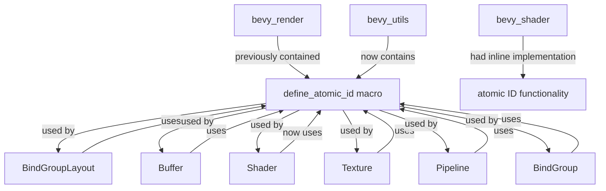

+++
title = "#22417 move define_atomic_id to bevy_utils"
date = "2026-01-08T00:00:00"
draft = false
template = "pull_request_page.html"
in_search_index = true

[taxonomies]
list_display = ["show"]

[extra]
current_language = "en"
available_languages = {"en" = { name = "English", url = "/pull_request/bevy/2026-01/pr-22417-en-20260108" }, "zh-cn" = { name = "中文", url = "/pull_request/bevy/2026-01/pr-22417-zh-cn-20260108" }}
labels = ["A-Rendering", "C-Code-Quality", "M-Migration-Guide", "D-Straightforward"]
+++

# Title

## Basic Information
- **Title**: move define_atomic_id to bevy_utils
- **PR Link**: https://github.com/bevyengine/bevy/pull/22417
- **Author**: atlv24
- **Status**: MERGED
- **Labels**: A-Rendering, C-Code-Quality, S-Ready-For-Final-Review, M-Migration-Guide, D-Straightforward
- **Created**: 2026-01-07T13:25:03Z
- **Merged**: 2026-01-08T05:32:04Z
- **Merged By**: alice-i-cecile

## Description Translation

# Objective

- When I made bevy_shader, I inlined the define_atomic_id macro because I wasn't sure if one usage was enough justification for kicking it into utils
- ~~bevy_material needs this in several places too, so let's kick it out in preparation. 3 usages outside bevy_render is enough justification~~ it's not actually needed for bevy_material

## Solution

- Move file

## Testing

- Examples, clippy, etc.

## The Story of This Pull Request

This PR addresses code duplication and organization by moving the `define_atomic_id` macro from a render-specific module to a more general utility location. The author initially implemented the macro inline in `bevy_shader` because they weren't sure if a single usage justified creating a dedicated utility. However, as they started working on `bevy_material`, they realized the macro could be useful in multiple places, which would justify moving it to `bevy_utils`.

The core technical problem was simple: the same code for generating unique atomic IDs was duplicated in multiple places. Specifically, `bevy_shader` had an inline implementation of the same pattern that was defined in `bevy_render::render_resource::resource_macros`. This duplication violates DRY principles and makes maintenance harder.

The solution approach is straightforward: move the macro from `bevy_render` to `bevy_utils` and update all import statements. The author initially thought `bevy_material` would also need this macro, but later realized it didn't, which they noted in the PR description. However, the move was still justified by the existing usage pattern.

The implementation shows a typical refactoring process. The macro definition itself was moved from `crates/bevy_render/src/render_resource/resource_macros.rs` to `crates/bevy_utils/src/atomic_id.rs`. The macro provides a convenient way to create globally unique ID types using atomic counters:

```rust
#[macro_export]
macro_rules! define_atomic_id {
    ($atomic_id_type:ident) => {
        // Macro implementation that creates a unique ID type
    }
}
```

The macro generates an ID type that wraps a `NonZero<u32>` and ensures uniqueness by incrementing a static atomic counter each time a new ID is created. This pattern is used throughout Bevy's renderer for various resource IDs like `BindGroupLayoutId`, `BufferId`, `ShaderId`, and `TextureId`.

The technical insight here is about code organization patterns in large Rust projects. When a utility is used by multiple crates, it should live in a shared location rather than being duplicated or buried in a specific module. The `bevy_utils` crate serves as a collection point for such cross-cutting concerns.

The impact of this change is primarily on code quality and maintainability. Developers who need to create unique ID types can now import `bevy_utils::define_atomic_id` instead of duplicating the implementation. The migration guide was added to help users update their code when upgrading Bevy versions.

An interesting implementation detail is how the author handled the `bevy_shader` crate. Previously, `bevy_shader` had an inlined version of the same functionality. After the refactor, it now uses the shared macro from `bevy_utils`. This required adding `bevy_utils` as a dependency to `bevy_shader`, which was previously not needed.

The refactoring follows clean engineering practices: the macro implementation didn't change, only its location. All tests and examples continue to work unchanged, which shows the change was purely organizational without functional impact.

## Visual Representation



## Key Files Changed

**crates/bevy_shader/src/shader.rs** (+2/-28)
This file saw the most significant change. Previously, it contained an inline implementation of the atomic ID pattern. After the refactor, it now imports and uses the shared `define_atomic_id` macro from `bevy_utils`.

Before:
```rust
#[derive(Copy, Clone, Hash, Eq, PartialEq, PartialOrd, Ord, Debug)]
pub struct ShaderId(NonZero<u32>);

impl ShaderId {
    #[expect(
        clippy::new_without_default,
        reason = "Implementing the `Default` trait on atomic IDs would imply that two `<AtomicIdType>::default()` equal each other. By only implementing `new()`, we indicate that each atomic ID created will be unique."
    )]
    pub fn new() -> Self {
        use core::sync::atomic::{AtomicU32, Ordering};
        static COUNTER: AtomicU32 = AtomicU32::new(1);
        let counter = COUNTER.fetch_add(1, Ordering::Relaxed);
        Self(NonZero::<u32>::new(counter).unwrap_or_else(|| {
            panic!("The system ran out of unique `{}`s.", stringify!(ShaderId));
        }))
    }
}
// More implementation code...
```

After:
```rust
use bevy_utils::define_atomic_id;

define_atomic_id!(ShaderId);
```

**release-content/migration-guides/define_atomic_id.md** (+6/-0)
This new file was added to document the breaking change and help users migrate their code.

```markdown
---
title: "`define_atomic_id` now lives in `bevy_utils`"
pull_requests: [22417]
---

`define_atomic_id` was moved out of `bevy_render` and into `bevy_utils`. If you were using `bevy::render::define_atomic_id`, you can update to `bevy::utils::define_atomic_id`.
```

**crates/bevy_render/src/render_resource/bind_group_layout.rs** (+2/-1)
This file changed its import statement from the local `define_atomic_id` to the one from `bevy_utils`.

Before:
```rust
use crate::{define_atomic_id, renderer::WgpuWrapper};
```

After:
```rust
use crate::renderer::WgpuWrapper;
use bevy_utils::define_atomic_id;
```

**crates/bevy_render/src/render_resource/bind_group.rs** (+1/-1)
Similar import update.

Before:
```rust
use crate::{
    define_atomic_id,
    // other imports
};
```

After:
```rust
use bevy_utils::define_atomic_id;
```

**crates/bevy_render/src/render_resource/buffer.rs** (+1/-1)
Another import update following the same pattern.

**crates/bevy_render/src/render_resource/resource_macros.rs → crates/bevy_utils/src/atomic_id.rs**
The macro was moved from the render module to the utils module. The file was renamed and moved, but the macro implementation remained identical.

**crates/bevy_utils/src/lib.rs**
Added the new module to the crate's exports:
```rust
mod atomic_id;
```

**crates/bevy_shader/Cargo.toml**
Added `bevy_utils` as a dependency since the crate now uses the macro from there:
```toml
bevy_utils = { path = "../bevy_utils", version = "0.18.0-dev" }
```

## Further Reading

- Rust's `std::sync::atomic` module documentation for understanding atomic operations
- Bevy's ECS (Entity Component System) architecture to understand how IDs are used throughout the engine
- Macros in Rust: `macro_rules!` and procedural macros for code generation patterns
- The DRY (Don't Repeat Yourself) principle in software engineering
- Bevy's module structure and crate organization patterns