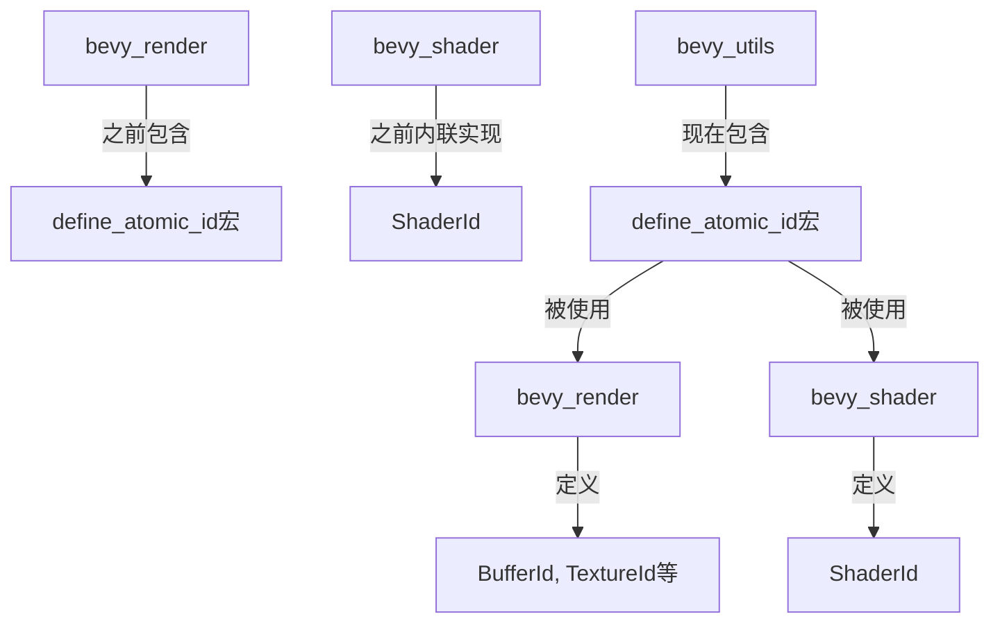

+++
title = "#22417 move define_atomic_id to bevy_utils"
date = "2026-01-08T00:00:00"
draft = false
template = "pull_request_page.html"
in_search_index = false

[extra]
current_language = "zh-cn"
available_languages = {"en" = { name = "English", url = "/pull_request/bevy/2026-01/pr-22417-en-20260108" }, "zh-cn" = { name = "中文", url = "/pull_request/bevy/2026-01/pr-22417-zh-cn-20260108" }}
labels = ["A-Rendering", "C-Code-Quality", "M-Migration-Guide", "D-Straightforward"]
+++

# Title

## Basic Information
- **Title**: move define_atomic_id to bevy_utils
- **PR Link**: https://github.com/bevyengine/bevy/pull/22417
- **Author**: atlv24
- **Status**: MERGED
- **Labels**: A-Rendering, C-Code-Quality, S-Ready-For-Final-Review, M-Migration-Guide, D-Straightforward
- **Created**: 2026-01-07T13:25:03Z
- **Merged**: 2026-01-08T05:32:04Z
- **Merged By**: alice-i-cecile

## Description Translation
**目标**
- 在我创建 bevy_shader 时，我内联了 define_atomic_id 宏，因为我不确定一个用例是否足以将其移至 utils
- ~~bevy_material 在多个地方也需要这个宏，所以让我们将其移出作为准备。3个 bevy_render 之外的用例足以证明这个决定是正确的~~ 实际上 bevy_material 并不需要它

**解决方案**
- 移动文件

**测试**
- 示例，clippy 等

## The Story of This Pull Request

这个PR处理的是一个代码组织和复用的问题。开发者面临的情况是：`define_atomic_id` 这个宏最初定义在 `bevy_render` crate 中，用于生成具有原子唯一性的ID类型。当开发 `bevy_shader` 时，需要相同的功能，开发者当时选择在内联实现，而不是依赖 `bevy_render` 的宏，因为他们不确定单个外部用例是否值得将宏移至共享位置。

后来，考虑到可能有更多模块需要这个功能，开发者重新评估了这个决定。虽然最初的假设是 `bevy_material` 也需要这个宏，但实际检查发现并不需要。然而，此时已经有 `bevy_render` 和 `bevy_shader` 两个crate在使用这个功能，这为将其移动到共享的 `bevy_utils` crate 提供了足够的理由。

解决方案是直接的：将宏定义文件从 `bevy_render/src/render_resource/resource_macros.rs` 移动到 `bevy_utils/src/atomic_id.rs`，然后更新所有使用这个宏的地方，将导入路径从 `crate::define_atomic_id` 或 `bevy_render::define_atomic_id` 改为 `bevy_utils::define_atomic_id`。

这个改变带来了几个技术优势。首先，它消除了代码重复：`bevy_shader` 中之前内联实现的 `ShaderId` 现在可以使用宏，与 `bevy_render` 中其他ID类型（如 `BufferId`、`TextureId` 等）的实现方式保持一致。其次，它提高了代码的可维护性，因为宏的更新只需在一个地方进行。第三，它使宏更容易被其他crate发现和使用，因为 `bevy_utils` 是专门用于共享实用功能的crate。

这个PR还包含一个重要的维护性工作：创建了迁移指南，通知用户如果他们在自己的代码中使用了这个宏，需要更新导入路径。这是向后兼容性考虑的一个重要部分。

从工程角度看，这个改变展示了良好的代码组织原则。当功能被多个模块使用时，将其移动到共享位置是合理的。尽管这个宏本身并不复杂，但集中管理可以避免未来的代码重复和不一致。

## Visual Representation



## Key Files Changed

### `crates/bevy_utils/src/atomic_id.rs` (+94/-0)
这个文件是从 `bevy_render` 移动过来的宏定义文件。关键变化是添加了文档注释，说明宏的功能。

**关键代码片段：**
```rust
/// Defines an id type which guarantees global uniqueness via atomics on a static global.
#[macro_export]
macro_rules! define_atomic_id {
    ($atomic_id_type:ident) => {
        #[derive(Copy, Clone, Hash, Eq, PartialEq, PartialOrd, Ord, Debug)]
        pub struct $atomic_id_type(core::num::NonZero<u32>);

        impl $atomic_id_type {
            #[expect(
                clippy::new_without_default,
                reason = "Implementing the `Default` trait on atomic IDs would imply that two `<AtomicIdType>::default()` equal each other. By only implementing `new()`, we indicate that each atomic ID created will be unique."
            )]
            pub fn new() -> Self {
                use core::sync::atomic::{AtomicU32, Ordering};
                static COUNTER: AtomicU32 = AtomicU32::new(1);
                let counter = COUNTER.fetch_add(1, Ordering::Relaxed);
                Self(core::num::NonZero::<u32>::new(counter).unwrap_or_else(|| {
                    panic!(
                        "The system ran out of unique `{}`s.",
                        stringify!($atomic_id_type)
                    );
                }))
            }
        }
        // ... 其他实现
    };
}
```

### `crates/bevy_shader/src/shader.rs` (+2/-28)
这个文件的变化最大，删除了内联的 `ShaderId` 实现，改为使用宏。

**之前：**
```rust
#[derive(Copy, Clone, Hash, Eq, PartialEq, PartialOrd, Ord, Debug)]
pub struct ShaderId(NonZero<u32>);

impl ShaderId {
    #[expect(
        clippy::new_without_default,
        reason = "Implementing the `Default` trait on atomic IDs would imply that two `<AtomicIdType>::default()` equal each other. By only implementing `new()`, we indicate that each atomic ID created will be unique."
    )]
    pub fn new() -> Self {
        use core::sync::atomic::{AtomicU32, Ordering};
        static COUNTER: AtomicU32 = AtomicU32::new(1);
        let counter = COUNTER.fetch_add(1, Ordering::Relaxed);
        Self(NonZero::<u32>::new(counter).unwrap_or_else(|| {
            panic!("The system ran out of unique `{}`s.", stringify!(ShaderId));
        }))
    }
}
// ... From trait 实现
```

**之后：**
```rust
use bevy_utils::define_atomic_id;

define_atomic_id!(ShaderId);
```

### `crates/bevy_render/src/render_resource/` 下的多个文件
这些文件更新了导入语句，从使用本地宏改为使用 `bevy_utils` 中的宏。

**示例变化（bind_group.rs）：**
```rust
// 之前：
use crate::define_atomic_id;

// 之后：
use bevy_utils::define_atomic_id;
```

### `release-content/migration-guides/define_atomic_id.md` (+6/-0)
新增的迁移指南，通知用户宏的位置变化。

```markdown
---
title: "`define_atomic_id` now lives in `bevy_utils`"
pull_requests: [22417]
---

`define_atomic_id` was moved out of `bevy_render` and into `bevy_utils`. If you were using `bevy::render::define_atomic_id`, you can update to `bevy::utils::define_atomic_id`.
```

## Further Reading

1. **Rust宏系统**：了解Rust的声明宏（macro_rules!）和过程宏
2. **原子操作**：学习Rust中的原子类型（AtomicU32等）和内存排序（Ordering）
3. **Bevy引擎架构**：了解Bevy的模块化设计和crate组织原则
4. **代码重构最佳实践**：学习如何安全地进行代码重构和创建迁移指南
5. **NonZero类型**：了解Rust中NonZero类型的内存布局优势