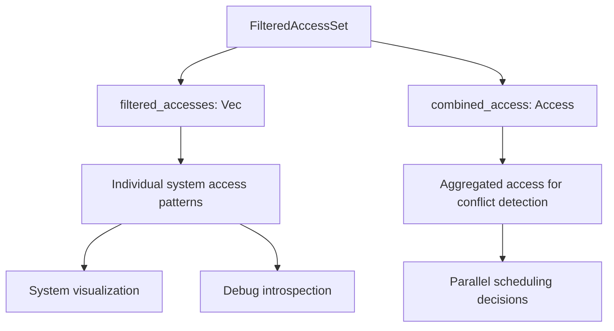

+++
title = "#22423 允许读取`FilteredAccessSet`的独立访问权限"
date = "2026-01-08T00:00:00"
draft = false
template = "pull_request_page.html"
in_search_index = false

[extra]
current_language = "zh-cn"
available_languages = {"en" = { name = "English", url = "/pull_request/bevy/2026-01/pr-22423-en-20260108" }, "zh-cn" = { name = "中文", url = "/pull_request/bevy/2026-01/pr-22423-zh-cn-20260108" }}
+++

# Title

## Basic Information
- **标题**: 允许读取`FilteredAccessSet`的独立访问权限
- **PR链接**: https://github.com/bevyengine/bevy/pull/22423  
- **作者**: andriyDev
- **状态**: 已合并
- **标签**: C-Feature, D-Trivial, A-ECS, S-Ready-For-Final-Review
- **创建时间**: 2026-01-08T08:23:16Z
- **合并时间**: 2026-01-08T09:19:06Z
- **合并者**: alice-i-cecile

## 描述翻译

### Objective 目标

- `FilteredAccessSet`没有提供访问单个过滤器的方法。这对于内省系统的访问模式（例如，在调度器中可视化系统）来说是不便的。

### Solution 解决方案

- 为`filtered_accesses`添加getter方法。

## The Story of This Pull Request

这次PR的改动源于一个具体的工程需求：在Bevy的ECS（Entity Component System）中，开发者需要能够检查和分析系统的访问模式。具体来说，`FilteredAccessSet`类型用于管理一组`FilteredAccess`对象，这些对象描述了系统对组件数据的访问权限。然而，在PR之前，这个结构体只提供了对聚合后的合并访问权限（combined access）的访问方法，而没有暴露内部各个独立过滤器的访问权限。

在实际开发中，这种限制带来了不便。例如，当开发者需要在调度器中可视化各个系统的数据访问模式时，他们需要查看每个系统具体的`FilteredAccess`条目。没有直接访问这些条目的方法，开发者就无法实现这样的内省功能。这个问题虽然不大，但对于调试、性能分析和系统理解来说是一个实实在在的障碍。

开发者andriyDev识别到了这个需求并提出了直接的解决方案：为`FilteredAccessSet`添加一个getter方法，返回对内部`filtered_accesses`字段的引用。这是一个典型的"暴露现有数据"类型的改动，不需要改变现有逻辑，只需要添加必要的访问方法。

从技术实现角度看，这个改动非常简洁。`FilteredAccessSet`在`crates/bevy_ecs/src/query/access.rs`中定义，它内部维护了两个关键字段：
- `filtered_accesses: Vec<FilteredAccess>` - 存储所有独立的过滤器
- `combined_access: Access<ComponentId>` - 所有过滤器的合并访问权限

之前已经有`combined_access()`方法来获取合并后的访问权限，但缺少获取原始过滤器列表的方法。新的`filtered_accesses()`方法填补了这个空白。

这个实现有几个值得注意的技术细节：
1. 方法使用了`#[inline]`属性，这是一个合理的优化，因为getter方法通常很短小，内联可以避免函数调用开销
2. 返回类型是`&[FilteredAccess]`，即切片的不可变引用，这既避免了所有权转移，又保持了数据的不可变性
3. 方法名称使用了复数形式`filtered_accesses()`，与字段名称一致，符合Rust的命名惯例

从架构角度看，这个改动保持了Bevy ECS模块的完整性。`FilteredAccessSet`是查询系统（query system）和调度系统（schedule system）之间的关键桥梁，它记录了哪些系统可以并行运行（基于它们的访问权限是否冲突）。暴露内部过滤器使得更高级的分析工具成为可能，而不会破坏现有的并行调度逻辑。

这个PR展示了良好的API设计原则：当数据结构内部有对开发者有用的信息时，应该提供安全的访问方法。虽然直接暴露字段在简单情况下可以接受，但提供方法允许未来在不破坏API的情况下改变内部表示。在这个案例中，返回切片引用是安全的，因为调用者无法修改内部数据（除非有内部可变性，但这里没有）。

从工程实践的角度看，这个PR也体现了"小改动，大价值"的理念。添加一个简单的getter方法只需要6行代码（包括文档注释），但它为系统可视化、调试工具和性能分析工具奠定了基础。这种改动通常风险低、收益明显，是开源项目中常见的贡献类型。

## Visual Representation



## Key Files Changed

### `crates/bevy_ecs/src/query/access.rs` (+6/-0)

这个文件包含了`FilteredAccessSet`结构体的定义和实现。改动非常简单，只添加了一个新的公共方法。

**关键修改：**

```rust
// 在现有代码中新增的方法：
/// Returns a reference to the filtered accesses of the set.
#[inline]
pub fn filtered_accesses(&self) -> &[FilteredAccess] {
    &self.filtered_accesses
}
```

**上下文说明：**

这个方法被添加在现有的`combined_access()`方法之后，保持了API的一致性。从代码结构看，`FilteredAccessSet`现在提供了两种视角的数据访问：
1. 通过`combined_access()`获取合并后的、用于冲突检测的访问权限
2. 通过新的`filtered_accesses()`获取原始的、独立的访问权限列表

**为什么这个改动是安全的：**
- 返回的是不可变引用，调用者不能修改内部数据
- 方法不会转移所有权，保持了`FilteredAccessSet`对数据的所有权
- 没有改变任何现有行为，只是增加了读取能力

## Further Reading

1. **Bevy ECS文档** - 了解Bevy的实体组件系统架构：https://bevyengine.org/learn/book/ecs/
2. **Rust所有权和借用** - 理解为什么返回`&[FilteredAccess]`是安全的设计：https://doc.rust-lang.org/book/ch04-00-understanding-ownership.html
3. **系统调度和并行执行** - 了解`FilteredAccessSet`在Bevy调度器中的作用：https://bevyengine.org/learn/book/advanced/ecs/systems/
4. **API设计原则** - 关于何时以及如何暴露内部数据的思考：https://rust-lang.github.io/api-guidelines/

# Full Code Diff
```diff
diff --git a/crates/bevy_ecs/src/query/access.rs b/crates/bevy_ecs/src/query/access.rs
index 6a0e77a632c03..65966518ada54 100644
--- a/crates/bevy_ecs/src/query/access.rs
+++ b/crates/bevy_ecs/src/query/access.rs
@@ -1322,6 +1322,12 @@ impl FilteredAccessSet {
         &self.combined_access
     }
 
+    /// Returns a reference to the filtered accesses of the set.
+    #[inline]
+    pub fn filtered_accesses(&self) -> &[FilteredAccess] {
+        &self.filtered_accesses
+    }
+
     /// Returns `true` if this and `other` can be active at the same time.
     ///
     /// Access conflict resolution happen in two steps:
```