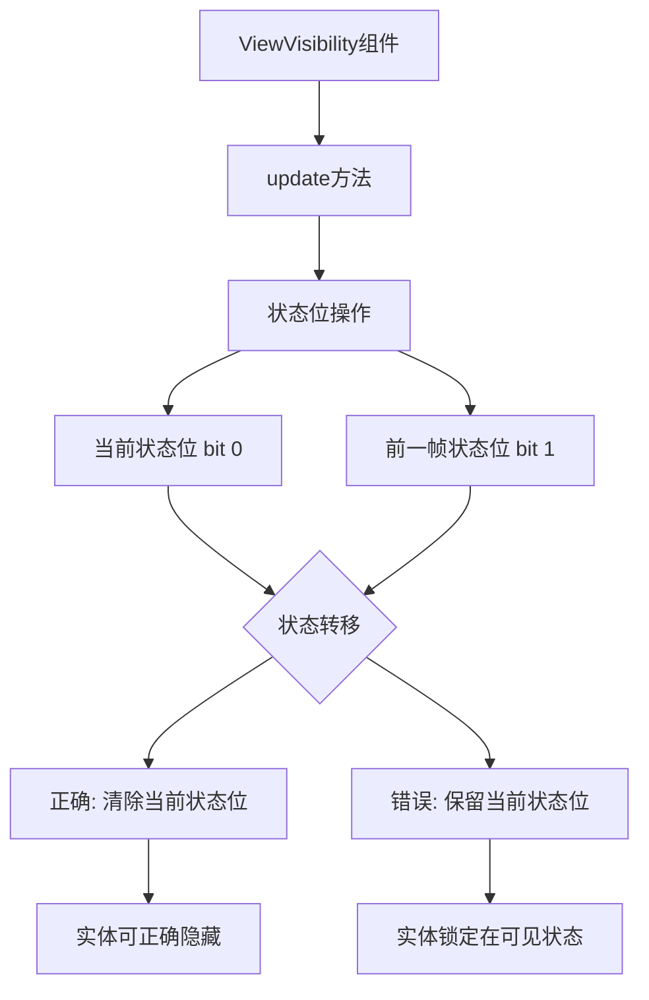

+++
title = "#22425 Fix Visibility Latching Bug"
date = "2026-01-08T00:00:00"
draft = false
template = "pull_request_page.html"
in_search_index = false

[extra]
current_language = "zh-cn"
available_languages = {"en" = { name = "English", url = "/pull_request/bevy/2026-01/pr-22425-en-20260108" }, "zh-cn" = { name = "中文", url = "/pull_request/bevy/2026-01/pr-22425-zh-cn-20260108" }}
+++

# 标题

## 基本信息
- **标题**: Fix Visibility Latching Bug
- **PR 链接**: https://github.com/bevyengine/bevy/pull/22425
- **作者**: aevyrie
- **状态**: 已合并
- **标签**: C-Bug, A-Rendering, P-Critical, S-Needs-Review
- **创建时间**: 2026-01-08T11:04:30Z
- **合并时间**: 2026-01-08T17:22:44Z
- **合并者**: alice-i-cecile

## 描述翻译

**目标**
- 修复当实体变为可见后，会持续保持可见状态而无法隐藏的问题
- 该问题在 #22226 中引入

**解决方案**
- 确保在状态转移时清除当前状态位
- 添加回归测试

## 该 Pull Request 的故事

这个 PR 解决了 Bevy 渲染系统中一个关键的可见性计算错误。问题出现在 `ViewVisibility` 组件的 `update` 方法中，这是一个用于管理实体可见性状态的核心组件。

**问题和背景**
问题出现在 #22226 引入的更改中，影响了 `ViewVisibility::update()` 方法的实现。这个方法是可见性系统处理每一帧可见性状态转移的核心逻辑。原本的设计是使用位操作来管理两个状态位：最低位（bit 0）表示当前帧的可见性，次低位（bit 1）表示前一帧的可见性。每次系统更新时，需要将当前状态转移到前一帧状态，并准备新的当前状态。

错误的实现在状态转移时没有正确清除当前状态位。具体来说，原代码 `self.0 = (self.0 & !2) | ((self.0 & 1) << 1)` 执行以下操作：
1. 清除前一帧状态位（bit 1）
2. 将当前状态位（bit 0）的值移到前一帧状态位
3. 但保留了当前的当前状态位

这意味着一旦实体被设置为可见，其当前状态位将始终保持为1，无法被重置为隐藏状态，导致实体"锁定"在可见状态。

**解决方案**
修复方案很简单但关键：在状态转移时清除当前状态位。新的实现 `self.0 = (self.0 & 1) << 1` 执行以下操作：
1. 获取当前状态位（bit 0）的值
2. 将其左移一位到前一帧状态位（bit 1）
3. 自动将当前状态位（bit 0）设置为0（因为表达式没有设置这一位）

这种设计假设可见性系统会在需要时显式设置当前可见性状态。通过清除当前状态位，确保了每个新帧开始时实体都处于隐藏状态，除非可见性计算系统明确将其标记为可见。

**实现细节**
核心修改只有一行代码，但为了确保修复的可靠性，PR 还添加了一个完整的回归测试 `view_visibility_lifecycle`。这个测试模拟了实体可见性状态的完整生命周期：

1. 初始状态为隐藏
2. 设置为可见
3. 返回隐藏状态
4. 验证状态转换和变化检测是否正确工作

测试使用了 Bevy 的 ECS 系统和自定义资源来控制和观察可见性状态的变化。特别重要的是测试验证了 `Changed<ViewVisibility>` 查询能够正确检测到状态变化，这对依赖可见性变化的游戏逻辑至关重要。

**技术见解**
这个错误揭示了状态机设计中一个常见问题：状态转移时必须明确处理所有状态位的清理。在位操作中，很容易忽略某些位的清理，导致状态污染。特别是在性能关键的渲染系统中，使用位操作进行状态管理很常见，但需要格外小心。

可见性系统使用这种双帧状态设计的原因是为了支持变化检测和插值。前一帧状态可以用于检测可见性何时改变，也可以用于动画或其他需要历史状态的功能。

**影响**
这个修复解决了渲染系统中一个严重问题，确保实体可见性可以正确地从可见切换到隐藏。对于任何依赖实体可见性控制的游戏功能（如隐藏UI元素、动态加载/卸载场景部分、特效管理等），这个修复都是必要的。

从工程角度看，这个 PR 展示了几个良好实践：
1. 最小化修复：只修改必要的一行代码
2. 添加回归测试：确保问题不会再次出现
3. 清晰的提交信息：明确问题来源和解决方案

## 可视化表示



## 关键文件更改

**crates/bevy_camera/src/visibility/mod.rs** (+120/-2)

这是唯一被修改的文件，包含两个关键更改：

1. **修复 `ViewVisibility::update()` 方法**：
```rust
// 修复前：
#[inline]
fn update(&mut self) {
    // Copy the first bit (current) to the second bit position (previous)
    // Clear the second bit, then set it based on the first bit
    self.0 = (self.0 & !2) | ((self.0 & 1) << 1);
}

// 修复后：
#[inline]
fn update(&mut self) {
    // Copy the first bit (current) to the second bit position (previous)
    // and clear the first bit (current).
    self.0 = (self.0 & 1) << 1;
}
```

这个更改是 PR 的核心修复。原代码没有清除当前状态位，导致一旦实体变为可见就永远保持可见。

2. **添加回归测试 `view_visibility_lifecycle`**：
测试验证了可见性状态的完整生命周期：
- 实体可以从隐藏变为可见
- 实体可以从可见变回隐藏
- 变化检测系统能正确识别这些状态变化

测试模拟了四个帧的状态变化，验证每个阶段的状态正确性。测试设计使用了自定义资源和系统来精确控制可见性状态的变化，并观察系统的响应。

## 进一步阅读

1. **Bevy 可见性系统文档**：
   - [Visibility and Culling](https://bevyengine.org/learn/quick-start/introduction/visibility-and-culling/) - Bevy 官方文档中的可见性和剔除介绍

2. **相关 PR 和问题**：
   - PR #22226 - 引入此错误的原始更改
   - [Bevy ECS 变化检测](https://bevyengine.org/learn/book/ecs/change-detection/) - Bevy ECS 的变化检测机制

3. **位操作在状态管理中的应用**：
   - [Bit manipulation for state machines](https://en.wikipedia.org/wiki/Bit_manipulation) - 位操作在状态机设计中的通用模式

4. **回归测试最佳实践**：
   - [Test-Driven Development](https://en.wikipedia.org/wiki/Test-driven_development) - 测试驱动开发方法，特别关注防止回归

---

# 完整代码差异

```
diff --git a/crates/bevy_camera/src/visibility/mod.rs b/crates/bevy_camera/src/visibility/mod.rs
index 8be719f4949e7..bbd33c912b1da 100644
--- a/crates/bevy_camera/src/visibility/mod.rs
+++ b/crates/bevy_camera/src/visibility/mod.rs
@@ -217,8 +217,8 @@ impl ViewVisibility {
     #[inline]
     fn update(&mut self) {
         // Copy the first bit (current) to the second bit position (previous)
-        // Clear the second bit, then set it based on the first bit
-        self.0 = (self.0 & !2) | ((self.0 & 1) << 1);
+        // and clear the first bit (current).
+        self.0 = (self.0 & 1) << 1;
     }
 }
 
@@ -1055,4 +1055,122 @@ mod test {
             world.entity(entity_clone).get::<VisibilityClass>().unwrap();
         assert_eq!(entity_clone_visibility_class.len(), 1);
     }
+
+    #[test]
+    fn view_visibility_lifecycle() {
+        let mut app = App::new();
+        app.add_plugins((
+            TaskPoolPlugin::default(),
+            bevy_asset::AssetPlugin::default(),
+            bevy_mesh::MeshPlugin,
+            bevy_transform::TransformPlugin,
+            VisibilityPlugin,
+        ));
+
+        #[derive(Resource, Default)]
+        struct ManualMark(bool);
+        #[derive(Resource, Default)]
+        struct ObservedChanged(bool);
+        app.init_resource::<ManualMark>();
+        app.init_resource::<ObservedChanged>();
+
+        app.add_systems(
+            PostUpdate,
+            (
+                (|mut q: Query<&mut ViewVisibility>, mark: Res<ManualMark>| {
+                    if mark.0 {
+                        for mut v in &mut q {
+                            v.set_visible();
+                        }
+                    }
+                })
+                .in_set(VisibilitySystems::CheckVisibility),
+                (|q: Query<(), Changed<ViewVisibility>>, mut observed: ResMut<ObservedChanged>| {
+                    if !q.is_empty() {
+                        observed.0 = true;
+                    }
+                })
+                .after(VisibilitySystems::MarkNewlyHiddenEntitiesInvisible),
+            ),
+        );
+
+        let entity = app.world_mut().spawn(ViewVisibility::HIDDEN).id();
+
+        // Advance system ticks and clear spawn change
+        app.update();
+        app.world_mut().resource_mut::<ObservedChanged>().0 = false;
+
+        // Frame 1: do nothing
+        app.update();
+        {
+            assert!(
+                !app.world()
+                    .entity(entity)
+                    .get::<ViewVisibility>()
+                    .unwrap()
+                    .get(),
+                "Frame 1: should be hidden"
+            );
+            assert!(
+                !app.world().resource::<ObservedChanged>().0,
+                "Frame 1: should not be changed"
+            );
+        }
+
+        // Frame 2: set entity as visible
+        app.world_mut().resource_mut::<ManualMark>().0 = true;
+        app.update();
+        {
+            assert!(
+                app.world()
+                    .entity(entity)
+                    .get::<ViewVisibility>()
+                    .unwrap()
+                    .get(),
+                "Frame 2: should be visible"
+            );
+            assert!(
+                app.world().resource::<ObservedChanged>().0,
+                "Frame 2: should be changed"
+            );
+        }
+
+        // Frame 3: do nothing
+        app.world_mut().resource_mut::<ManualMark>().0 = false;
+        app.world_mut().resource_mut::<ObservedChanged>().0 = false;
+        app.update();
+        {
+            assert!(
+                !app.world()
+                    .entity(entity)
+                    .get::<ViewVisibility>()
+                    .unwrap()
+                    .get(),
+                "Frame 3: should be hidden"
+            );
+            assert!(
+                app.world().resource::<ObservedChanged>().0,
+                "Frame 3: should be changed"
+            );
+        }
+
+        // Frame 4: do nothing
+        app.world_mut().resource_mut::<ManualMark>().0 = false;
+        app.world_mut().resource_mut::<ObservedChanged>().0 = false;
+        app.update();
+        {
+            assert!(
+                !app.world()
+                    .entity(entity)
+                    .get::<ViewVisibility>()
+                    .unwrap()
+                    .get(),
+                "Frame 4: should be hidden"
+            );
+            assert!(
+                !app.world().resource::<ObservedChanged>().0,
+                "Frame 4: should not be changed"
+            );
+        }
+    }
 }
```