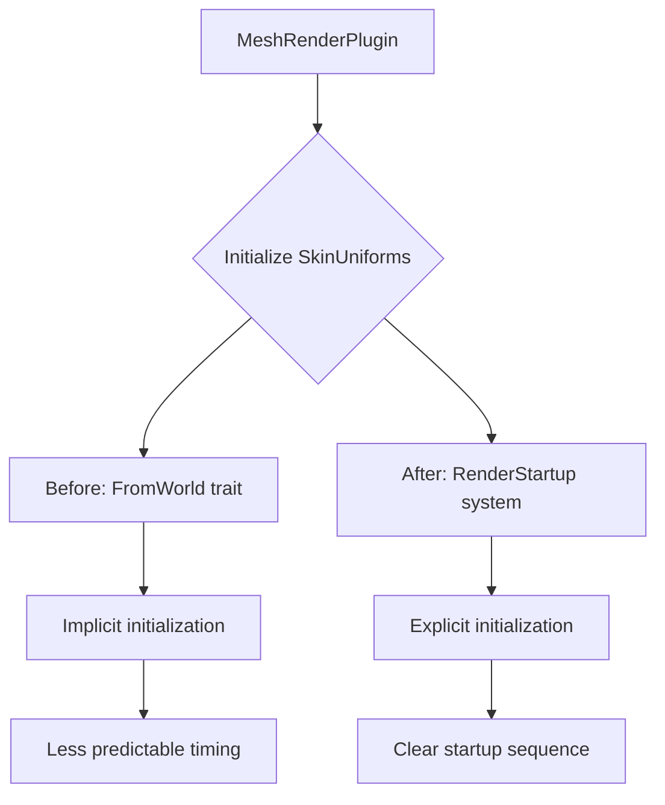

+++
title = "#22427 SkinUniforms to RenderStartup"
date = "2026-01-08T00:00:00"
draft = false
template = "pull_request_page.html"
in_search_index = true

[taxonomies]
list_display = ["show"]

[extra]
current_language = "en"
available_languages = {"en" = { name = "English", url = "/pull_request/bevy/2026-01/pr-22427-en-20260108" }, "zh-cn" = { name = "中文", url = "/pull_request/bevy/2026-01/pr-22427-zh-cn-20260108" }}
labels = ["A-Rendering", "D-Straightforward"]
+++

# Title
SkinUniforms to RenderStartup

## Basic Information
- **Title**: SkinUniforms to RenderStartup
- **PR Link**: https://github.com/bevyengine/bevy/pull/22427
- **Author**: atlv24
- **Status**: MERGED
- **Labels**: A-Rendering, S-Ready-For-Final-Review, D-Straightforward
- **Created**: 2026-01-08T14:03:24Z
- **Merged**: 2026-01-08T19:08:16Z
- **Merged By**: alice-i-cecile

## Description Translation
# Objective

- Merge a good change from #21543

## Solution

- cherry pick the 1448bb5a058935c516ddeefdd9b3cedbc5cef7bc commit

## Testing

- many_foxes and 3d_scene run

## The Story of This Pull Request

This pull request represents a straightforward but important refactoring in Bevy's rendering system. The change moves the initialization of the `SkinUniforms` resource from being an implicitly initialized resource using the `FromWorld` trait to an explicitly scheduled system in the `RenderStartup` schedule. This is a cherry-pick of a change from PR #21543, indicating it's a proven improvement that needed to be integrated into the main codebase.

The core problem being addressed is one of initialization timing and clarity in the render app's startup flow. In Bevy, resources can be initialized in different ways: either through `FromWorld` which runs when the resource is first requested, or through explicit systems that run in specific schedules like `RenderStartup`. The `FromWorld` approach, while convenient, can lead to less predictable initialization order and makes the startup sequence less explicit.

The solution approach is simple but effective: convert the `FromWorld` implementation into a regular function and schedule it explicitly. This makes the initialization of skin-related GPU buffers more transparent and aligns with Bevy's evolving patterns for render resource initialization. The technical implementation involves two main changes:

1. Extract the initialization logic from `impl FromWorld for SkinUniforms` into a standalone function `skin_uniforms_from_world`
2. Replace `.init_resource::<SkinUniforms>()` with `.add_systems(RenderStartup, skin_uniforms_from_world)` in the plugin setup

The `skin_uniforms_from_world` function performs the same operations as before: it creates GPU buffers for skin joint matrices, determining whether to use uniform or storage buffers based on device limits, and initializes the data structures needed to manage skinning data. The key difference is that this initialization now happens predictably at render startup rather than on first use.

From an architectural perspective, this change improves code clarity and maintainability. Explicit system scheduling makes the initialization order more obvious and easier to reason about. It also aligns with Bevy's preference for explicit systems over implicit `FromWorld` initialization for render resources, which helps maintain consistency across the codebase.

The impact of this change is primarily on code organization rather than runtime behavior. The same GPU buffers are created at the same point in the application lifecycle (render startup), but now through a more explicit mechanism. This makes the code easier to understand for developers working on the rendering system and reduces potential issues with initialization order dependencies.

## Visual Representation



## Key Files Changed

### `crates/bevy_pbr/src/render/mesh.rs`
**What changed**: The plugin initialization was modified to use an explicit system instead of `init_resource` with `FromWorld`.

**Key modification**:
```rust
// Before:
.init_resource::<SkinUniforms>()

// After:
.add_systems(RenderStartup, skin_uniforms_from_world)
```

**Why this matters**: This makes the initialization of skin uniforms explicit in the render startup flow, improving code clarity and predictability.

### `crates/bevy_pbr/src/render/skin.rs`
**What changed**: The `FromWorld` implementation was converted to a standalone system function.

**Key modification**:
```rust
// Before:
impl FromWorld for SkinUniforms {
    fn from_world(world: &mut World) -> Self {
        // ... initialization logic
        Self {
            // ... fields
        }
    }
}

// After:
pub fn skin_uniforms_from_world(world: &mut World) {
    // ... same initialization logic
    let res = SkinUniforms {
        // ... fields
    };
    world.insert_resource(res);
}
```

**Why this matters**: This separates the initialization logic from the trait implementation, allowing it to be scheduled explicitly. The function performs the same operations: creating GPU buffers for skin joint matrices and initializing the management structures.

## Further Reading

1. Bevy's [Render Schedules documentation](https://bevyengine.org/learn/advanced-topics/schedules/) for understanding how systems are organized in the render app
2. The original PR #21543 for context on why this pattern change was implemented
3. Bevy's [Resources documentation](https://bevyengine.org/learn/advanced-topics/resources/) for understanding different approaches to resource initialization
4. WebGPU [Buffer Usage documentation](https://www.w3.org/TR/webgpu/#buffer-usage) for context on UNIFORM vs STORAGE buffer usage decisions