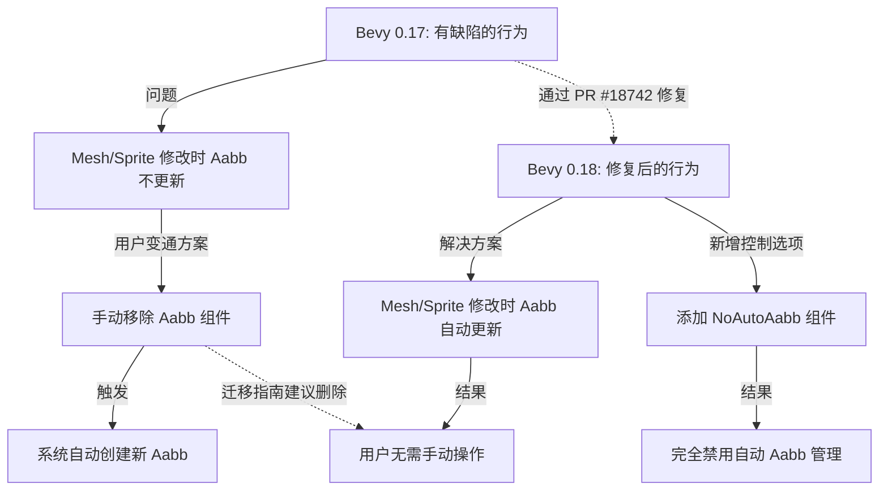

+++
title = "#22429"
date = "2026-01-08T00:00:00"
draft = false
template = "pull_request_page.html"
in_search_index = false

[extra]
current_language = "zh-cn"
available_languages = {"en" = { name = "English", url = "/pull_request/bevy/2026-01/pr-22429-en-20260108" }, "zh-cn" = { name = "中文", url = "/pull_request/bevy/2026-01/pr-22429-zh-cn-20260108" }}
+++

# Title

## 基本信息
- **Title**: 0.18: Add migration guide for automatic `Aabb` updates
- **PR Link**: https://github.com/bevyengine/bevy/pull/22429
- **Author**: greeble-dev
- **Status**: MERGED
- **Labels**: C-Docs, A-Rendering, S-Ready-For-Final-Review
- **Created**: 2026-01-08T14:22:42Z
- **Merged**: 2026-01-08T18:40:17Z
- **Merged By**: alice-i-cecile

## 描述翻译
为 #18742 添加迁移指南。

我不完全确定是否必要，但这被 https://github.com/bevyengine/bevy/pull/21837#discussion_r2617521376 所暗示。

## 这个拉取请求的故事

这个拉取请求（PR）是关于文档的。具体来说，它为一个重要的引擎行为变更添加了一份迁移指南。这个变更在之前的 PR #18742 中实现，但为了确保用户升级时能平滑过渡，文档必须跟进。这个案例很好地说明了在功能开发完成后，文档工作的重要性。

故事始于一个长期存在的问题。在 Bevy 0.17 中，引擎会自动为包含网格（`Mesh`）或精灵（`Sprite`）的实体创建一个 `Aabb`（Axis-Aligned Bounding Box，轴对齐包围盒）组件。这个 `Aabb` 在渲染流水线中被用于视锥体剔除（frustum culling）以提高性能，也被用于拾取（picking）系统。然而，存在一个缺陷：如果实体所持有的 `Mesh` 或 `Sprite` 在运行时被动态修改（例如，顶点位置改变），已存在的 `Aabb` 组件**不会**自动重新计算以匹配新的几何形状。这会导致 `Aabb` 过时，进而引发可见性判断错误和拾取功能失效。

为了解决这个缺陷，开发者采用了变通方案。最常见的方法是在修改网格后，手动移除该实体的 `Aabb` 组件。由于 Bevy 会自动为没有 `Aabb` 的网格/精灵实体创建一个新的，所以移除后再创建的逻辑间接实现了“更新”。社区通过 Issue #4294 报告了这个问题，并在 PR #18742 中得到了修复。

现在，进入本次 PR 的上下文。当 PR #18742 在 0.18 版本中合并后，`Aabb` 的自动更新机制被修复了。这意味着用户之前那些手动移除或更新 `Aabb` 的代码变成了不必要的，甚至是冗余的。然而，如果用户直接升级到 0.18 而没有修改代码，他们可能意识不到可以删除这些变通代码，或者可能困惑于为什么他们手动的 `Aabb` 操作与新的自动逻辑产生了意料之外的交互。

因此，作者 `greeble-dev` 被提示需要编写一份迁移指南。提示来自于另一个 PR 的讨论，其中社区成员认为需要为这个行为变更提供指导。这就是本次 PR 的价值所在：它是一座桥梁，连接了底层引擎的修复与上层用户代码的适配。

迁移指南的解决方案很直接。它没有修改任何功能代码，而是创建了一个新的 Markdown 文件，清晰地说明了问题、变更以及用户应如何行动。

指南首先明确了背景：Bevy 会自动为网格和精灵实体创建 `Aabb` 以用于可见性和拾取。然后它点明了从 0.17 到 0.18 的核心变更：`Aabb` 现在会在网格或精灵被修改后**自动更新**。这解决了 Issue #4294。

接着，指南通过代码对比给出了最实用的建议。对于曾经使用“手动移除 `Aabb`”作为变通方案的用户，他们现在可以安全地删除那行移除组件的代码。系统会自动处理更新，让代码更简洁。

```rust
// 0.17: 修改网格后，需要移除 `Aabb` 以便它根据修改后的网格自动重新创建。
mesh.insert_attribute(Mesh::ATTRIBUTE_POSITION, new_positions);
entity.remove::<Aabb>(); // <-- 这行在 0.18 可以删除

// 0.18: `Aabb` 会被自动更新，无需手动干预。
mesh.insert_attribute(Mesh::ATTRIBUTE_POSITION, new_positions);
```

最后，指南还介绍了为满足高级控制需求而新增的功能。在修复自动更新的同时，PR #18742 也引入了一个 `NoAutoAabb` 标记组件。如果用户在某些特殊场景下不希望系统自动管理某个实体的 `Aabb`（无论创建还是更新），他们可以手动插入这个组件来完全禁用自动机制。这体现了良好 API 设计的平衡：在提供强大自动功能的同时，也为需要精确控制的用户留出了出口。

从技术角度看，这份指南虽然内容简短，但它精准地捕捉了一个重要的行为变化（breaking change）并提供了明确的升级路径。它帮助用户清理掉过时的变通代码，并介绍了新的控制选项，确保了从 0.17 到 0.18 的升级过程更顺畅、更可预测。对于开源项目而言，这类文档对于维护良好的用户体验和社区信任至关重要。

## 视觉呈现



## 关键文件更改

- `release-content/migration-guides/automatic_aabb_updates.md` (+28/-0)

**描述**：
这是本次PR创建的唯一文件。它是一个全新的迁移指南文档，旨在指导用户适应Bevy 0.18中关于`Aabb`组件自动更新行为的变更。该文档解释了旧版本的问题、新版本的修复方法，并提供了代码示例说明如何更新用户代码。

**代码详情**：
文件是新建的，因此没有“之前”的版本。以下是文件的完整内容：

```markdown
---
title: Automatic `Aabb` updates for sprites and meshes
pull_requests: [18742]
---

Bevy automatically creates an `Aabb` component for entities containing a mesh
or sprite - the `Aabb` is then used for visibility and picking.

In 0.17 the `Aabb` [was not updated](https://github.com/bevyengine/bevy/issues/4294)
if the mesh or sprite was modified. This has been fixed in 0.18. If you were working around the issue by manually updating or removing the
`Aabb`, then the workaround is no longer needed.

```rust
// 0.17: Modify the mesh, and remove the `Aabb` so that it's automatically
// recreated from the modified mesh.
mesh.insert_attribute(Mesh::ATTRIBUTE_POSITION, new_positions);
entity.remove::<Aabb>();

// 0.18: The `Aabb` will be automatically updated.
mesh.insert_attribute(Mesh::ATTRIBUTE_POSITION, new_positions);
```

For users who want more control, 0.18 also adds a `NoAutoAabb` component. This
will disable both automatic creation and automatic update of `Aabb` components.

```rust
entity.insert(NoAutoAabb);
```
```

**与PR目的的关系**：
这个文件直接实现了本次PR的核心目标：提供迁移指南。它清晰地阐述了问题背景、版本间的行为差异，并给出了具体的代码迁移示例和新增功能的用法，完美地服务于帮助用户从0.17升级到0.18的文档需求。

## 进一步阅读

1.  **PR #18742**: 本次迁移指南所对应的功能实现PR。阅读它可以详细了解`Aabb`自动更新以及`NoAutoAabb`组件是如何被添加到引擎中的。
2.  **Issue #4294**: [`Aabb` not updated on mesh or sprite change](https://github.com/bevyengine/bevy/issues/4294) - 原始的问题报告，包含了用户遇到的具体场景和讨论。
3.  **Bevy 迁移指南概览**: 了解 Bevy 项目中其他迁移指南的写法和涵盖的范围，有助于理解项目对版本升级兼容性的重视。