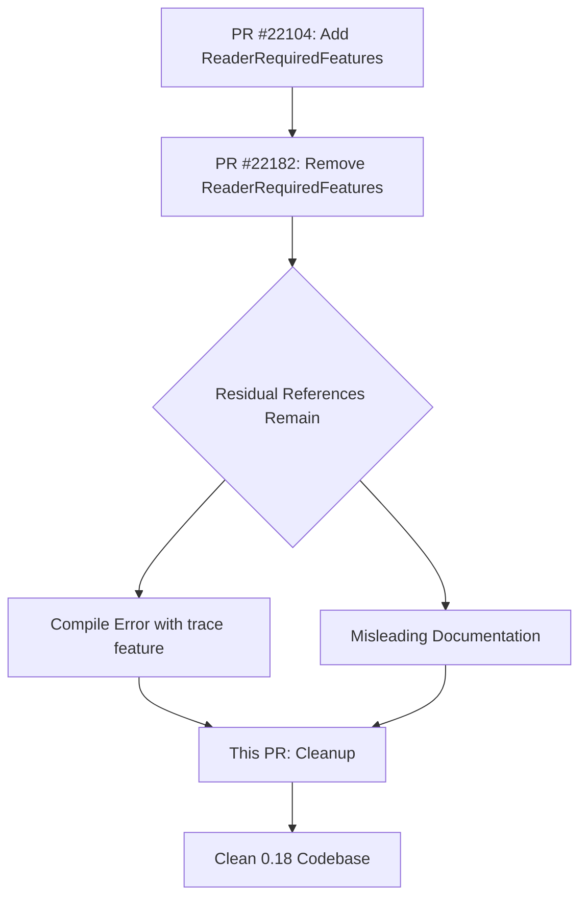

+++
title = "#22430 0.18: Remove references to `ReaderRequiredFeatures`"
date = "2026-01-08T00:00:00"
draft = false
template = "pull_request_page.html"
in_search_index = true

[taxonomies]
list_display = ["show"]

[extra]
current_language = "en"
available_languages = {"en" = { name = "English", url = "/pull_request/bevy/2026-01/pr-22430-en-20260108" }, "zh-cn" = { name = "中文", url = "/pull_request/bevy/2026-01/pr-22430-zh-cn-20260108" }}
labels = ["C-Bug", "C-Docs", "A-Assets"]
+++

# Title: 0.18: Remove references to `ReaderRequiredFeatures`

## Basic Information
- **Title**: 0.18: Remove references to `ReaderRequiredFeatures`
- **PR Link**: https://github.com/bevyengine/bevy/pull/22430
- **Author**: greeble-dev
- **Status**: MERGED
- **Labels**: C-Bug, C-Docs, A-Assets, S-Ready-For-Final-Review, P-Compile-Failure
- **Created**: 2026-01-08T14:48:46Z
- **Merged**: 2026-01-08T20:22:28Z
- **Merged By**: alice-i-cecile

## Description
`ReaderRequiredFeatures` was added by #22104 and removed by #22182, but [some references](https://github.com/bevyengine/bevy/pull/22182#issuecomment-3723854168) snuck into the 0.18 branch. This was causing a compile error if the `trace` feature was enabled, and some release content was misleading.

## The Story of This Pull Request

This PR addresses a cleanup task that emerged from the development cycle for Bevy 0.18. The core issue was that a feature, `ReaderRequiredFeatures`, which was introduced and then subsequently removed during the development process, left behind residual references in the codebase. These references caused a compile-time failure when the `trace` feature was enabled, and also resulted in misleading documentation.

The problem originated from PR #22104, which added `ReaderRequiredFeatures` to the asset system. This change was part of an effort to make asset reading more flexible by allowing asset loaders to specify what kind of seeking capabilities they require from readers. However, this approach was later reverted in PR #22182, which removed the `ReaderRequiredFeatures` entirely from the main codebase. Despite this removal, some references managed to persist in the 0.18 branch, likely due to merge conflicts or incomplete cleanup during the revert process.

The most critical issue was in `crates/bevy_asset/src/server/loaders.rs`, where the `InstrumentedAssetLoader` struct's implementation still included a `reader_required_features` method. This method was trying to delegate to the wrapped loader's `reader_required_features` method, but since that trait method no longer existed (it was removed along with `ReaderRequiredFeatures`), the code failed to compile when the `trace` feature was enabled because the `InstrumentedAssetLoader` is only compiled with that feature.

Additionally, the documentation system contained two migration guide files that were now obsolete. These files were explaining how to migrate code to use `ReaderRequiredFeatures`, which was no longer relevant since the feature had been removed. Keeping these files would mislead developers trying to understand the migration path to Bevy 0.18.

The solution was straightforward: completely remove all remaining references to `ReaderRequiredFeatures`. This involved:

1. Removing the unused import and method implementation from `loaders.rs`
2. Deleting the two migration guide files that discussed the now-removed feature
3. Updating the release notes to acknowledge that they were outdated and to correctly reference the PR that removed the feature

The implementation change in `loaders.rs` was minimal but critical. The `InstrumentedAssetLoader` is a wrapper that adds tracing instrumentation to asset loaders when the `trace` feature is enabled. Since the underlying `AssetLoader` trait no longer had a `reader_required_features` method after PR #22182, the wrapper's implementation of that method became invalid and needed to be removed.

From a technical perspective, this cleanup highlights an important aspect of software development: when features are removed, it's crucial to ensure all references are cleaned up, not just in the main code paths but also in conditional compilation blocks and documentation. The `trace` feature being optional meant that the compilation error only manifested when that feature was enabled, which could easily be missed during testing if the feature wasn't actively used in all test configurations.

The impact of this PR is primarily about maintaining code correctness and documentation accuracy. By removing these residual references, the codebase compiles correctly in all feature configurations, and developers aren't misled by documentation describing features that no longer exist. This kind of cleanup is essential for maintaining a stable and understandable codebase, especially during major version transitions like the 0.18 release.

## Visual Representation



## Key Files Changed

### 1. `crates/bevy_asset/src/server/loaders.rs` (+0/-5)
**What changed**: Removed the `reader_required_features` method implementation from `InstrumentedAssetLoader` and the corresponding import.

**Why**: The `ReaderRequiredFeatures` type and associated trait methods were removed in PR #22182, but this implementation remained, causing compilation errors when the `trace` feature was enabled.

**Code changes**:
```rust
// Before (with trace feature enabled):
#[cfg(feature = "trace")]
use {
    crate::io::ReaderRequiredFeatures,  // This import is no longer valid
    alloc::string::ToString,
    bevy_tasks::ConditionalSendFuture,
    tracing::{info_span, instrument::Instrument},
};

// In the InstrumentedAssetLoader implementation:
fn reader_required_features(settings: &Self::Settings) -> ReaderRequiredFeatures {
    T::reader_required_features(settings)  // This method no longer exists on T
}

// After:
#[cfg(feature = "trace")]
use {
    alloc::string::ToString,
    bevy_tasks::ConditionalSendFuture,
    tracing::{info_span, instrument::Instrument},
};

// The reader_required_features method is completely removed
```

### 2. `release-content/migration-guides/reader_required_features.md` (+0/-36)
**What changed**: This entire migration guide file was deleted.

**Why**: The file explained how to migrate code to use `ReaderRequiredFeatures`, which was removed from Bevy 0.18. Keeping it would mislead developers.

### 3. `release-content/migration-guides/readers_impl_async_seek.md` (+0/-52)
**What changed**: This entire migration guide file was deleted.

**Why**: This file also referenced `ReaderRequiredFeatures` and was made obsolete by the removal of that feature.

### 4. `release-content/release-notes/optional_asset_reader_seek.md` (+4/-2)
**What changed**: Updated the metadata and added a note indicating the release note was outdated.

**Why**: The release note needed to reflect that the feature described (related to `ReaderRequiredFeatures`) was changed by a different PR (#22182) and was no longer accurate.

**Code changes**:
```markdown
<!-- Before: -->
---
title: The `AssetReader` trait can now (optionally) support seeking any direction.
authors: ["@andriyDev"]
pull_requests: []
---

<!-- After: -->
---
title: The `AssetReader` trait can now (optionally) support seeking any direction.
authors: ["@andriyDev", "@cart"]
pull_requests: [22182]
---

_TODO: This release note is not up to date with the changes in https://github.com/bevyengine/bevy/pull/22182._
```

## Further Reading

1. **PR #22104**: The original PR that introduced `ReaderRequiredFeatures` - useful for understanding the initial motivation and implementation.
2. **PR #22182**: The PR that removed `ReaderRequiredFeatures` - provides context on why the feature was removed and what replaced it.
3. [Bevy's Asset System Documentation](https://bevyengine.org/learn/quick-start/assets/) - For understanding the broader context of asset loading in Bevy.
4. [Conditional Compilation in Rust](https://doc.rust-lang.org/reference/conditional-compilation.html) - To understand how features like `trace` work in Rust and why the compile error was conditional.
5. [Bevy's Migration Guide Process](https://github.com/bevyengine/bevy/blob/main/docs/plugins_guidelines.md#migration-guides) - For understanding how migration guides are structured and maintained in the Bevy ecosystem.