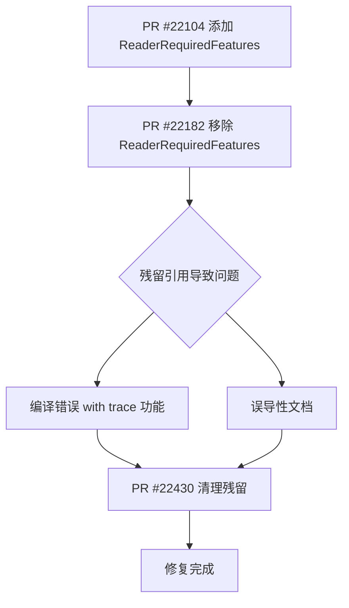

+++
title = "#22430 0.18: Remove references to `ReaderRequiredFeatures"
date = "2026-01-08T00:00:00"
draft = false
template = "pull_request_page.html"
in_search_index = false

[extra]
current_language = "zh-cn"
available_languages = {"en" = { name = "English", url = "/pull_request/bevy/2026-01/pr-22430-en-20260108" }, "zh-cn" = { name = "中文", url = "/pull_request/bevy/2026-01/pr-22430-zh-cn-20260108" }}
+++

# 0.18：移除对 `ReaderRequiredFeatures` 的引用

## 基本信息
- **标题**: 0.18: Remove references to `ReaderRequiredFeatures`
- **PR链接**: https://github.com/bevyengine/bevy/pull/22430
- **作者**: greeble-dev
- **状态**: 已合并
- **标签**: C-Bug, C-Docs, A-Assets, S-Ready-For-Final-Review, P-Compile-Failure
- **创建时间**: 2026-01-08T14:48:46Z
- **合并时间**: 2026-01-08T20:22:28Z
- **合并者**: alice-i-cecile

## 描述翻译
`ReaderRequiredFeatures` 由 #22104 添加并由 #22182 移除，但[一些引用](https://github.com/bevyengine/bevy/pull/22182#issuecomment-3723854168)潜入了 0.18 分支。这导致启用 `trace` 功能时出现编译错误，并且一些发布内容存在误导性。

## 本次 PR 的技术故事

### 问题和背景
在 Bevy 0.18 的开发周期中，资产系统经历了一次关于寻址功能的设计迭代。初始实现 #22104 引入了 `ReaderRequiredFeatures` 类型，用于允许资产读取器可选地支持不同方向的寻址操作。这个设计允许某些只支持前向寻址的读取器（如 HTTP 流）也能正常工作，同时为需要任意寻址的资产加载器提供支持。

然而，这个设计很快在 #22182 中被移除，因为团队决定采用更简单的方法。但在合并过程中，0.18 分支中遗留了部分对 `ReaderRequiredFeatures` 的引用。这导致了一个具体问题：当启用 `trace` 功能时，代码会因为引用不存在的类型而无法编译。

问题的技术背景涉及 Bevy 的资产加载系统。`InstrumentedAssetLoader` 是一个包装器，用于在启用跟踪功能时提供性能分析。当 `trace` 功能启用时，它会被编译并需要实现 `AssetLoader` trait 的所有方法，包括已被移除的 `reader_required_features` 方法。

### 解决方案
解决方案是清理性的：移除所有对已删除类型的引用。这包括：
1. 从 `InstrumentedAssetLoader` 的实现中移除 `reader_required_features` 方法
2. 删除相关的导入语句
3. 更新文档和迁移指南以反映当前状态

这是一个直接的技术债务清理工作。没有引入新功能或复杂逻辑，只是确保代码库在类型被移除后保持一致性。

### 实现细节
在 `crates/bevy_asset/src/server/loaders.rs` 中，有两个关键变化：
1. 移除了对 `crate::io::ReaderRequiredFeatures` 的条件导入
2. 移除了 `InstrumentedAssetLoader` 中 `reader_required_features` 方法的实现

这些变化确保了当 `trace` 功能启用时，代码能够正确编译。由于 `ReaderRequiredFeatures` 类型已不存在，实现其方法签名不再有意义。

文档方面的变化同样重要。两个迁移指南文件被完全删除，因为它们描述的 API 更改已被撤销。这些指南原本帮助用户适配 #22104 引入的变化，但由于这些变化在 #22182 中被回滚，指南变得过时且具有误导性。

发布说明文件也进行了更新，添加了注释说明其内容与 #22182 的变化不同步。这防止了用户误解当前版本的实现。

### 技术洞察
这个 PR 展示了软件开发中常见的情况：设计决策的迭代和清理工作的重要性。初始设计尝试为资产读取器提供更灵活的寻址能力，但可能因为复杂性或实际需求不足而被放弃。

从技术角度看，`InstrumentedAssetLoader` 的结构值得注意。它使用装饰器模式包装其他 `AssetLoader` 实现，添加跟踪功能。这种设计允许在条件编译下添加功能，而不影响核心逻辑。

移除 `reader_required_features` 方法的影响是直接的：现在所有资产加载器都不需要指定读取器所需的寻址能力。这简化了 API，但可能意味着某些只支持前向寻址的读取器现在需要实现完整的 `AsyncSeek` trait。

### 影响
主要影响包括：
1. 修复了启用 `trace` 功能时的编译错误
2. 消除了文档中的误导信息
3. 保持了代码库在 0.18 分支中的一致性

从工程角度看，这个 PR 强调了及时清理技术债务的重要性。残留的引用不仅导致编译错误，还可能误导贡献者了解当前 API 设计。

另一个重要方面是版本管理。由于这些变化发生在 0.18 开发分支中，确保所有相关文档和代码在发布前同步至关重要，避免用户遇到不一致的体验。

## 可视化表示



## 关键文件变更

### 1. `crates/bevy_asset/src/server/loaders.rs`
**变更描述**: 移除了对已删除类型的引用，修复了启用 `trace` 功能时的编译错误。

**代码变更**:
```rust
// 变更前（部分）:
#[cfg(feature = "trace")]
use {
    crate::io::ReaderRequiredFeatures,  // 这一行被移除
    alloc::string::ToString,
    bevy_tasks::ConditionalSendFuture,
    tracing::{info_span, instrument::Instrument},
};

// 在 InstrumentedAssetLoader 实现中:
fn reader_required_features(settings: &Self::Settings) -> ReaderRequiredFeatures {
    T::reader_required_features(settings)  // 整个方法被移除
}

// 变更后:
#[cfg(feature = "trace")]
use {
    alloc::string::ToString,
    bevy_tasks::ConditionalSendFuture,
    tracing::{info_span, instrument::Instrument},
};

// InstrumentedAssetLoader 不再实现 reader_required_features 方法
```

**关联性**: 这是修复编译错误的核心变更，确保代码在 `ReaderRequiredFeatures` 类型被移除后仍能正常编译。

### 2. `release-content/migration-guides/reader_required_features.md`
**变更描述**: 完全删除此迁移指南，因为它描述的 API 更改已被撤销。

**关联性**: 文档清理的一部分，避免用户被过时的迁移指南误导。

### 3. `release-content/migration-guides/readers_impl_async_seek.md`
**变更描述**: 完全删除此迁移指南，因为它描述的 API 更改已被撤销。

**关联性**: 文档清理的一部分，避免用户被过时的迁移指南误导。

### 4. `release-content/release-notes/optional_asset_reader_seek.md`
**变更描述**: 更新发布说明，注明其内容与后续更改不同步。

**代码变更**:
```markdown
<!-- 变更前: -->
---
title: The `AssetReader` trait can now (optionally) support seeking any direction.
authors: ["@andriyDev"]
pull_requests: []
---

<!-- 变更后: -->
---
title: The `AssetReader` trait can now (optionally) support seeking any direction.
authors: ["@andriyDev", "@cart"]
pull_requests: [22182]
---

_TODO: This release note is not up to date with the changes in https://github.com/bevyengine/bevy/pull/22182._
```

**关联性**: 防止用户误解发布说明，明确指示其内容需要更新。

## 进一步阅读建议

1. **Bevy 资产系统文档**: 了解 Bevy 的资产加载和读取器系统的基础知识
2. **Rust 条件编译**: 理解 `#[cfg(feature = "trace")]` 等属性在 Rust 中的使用
3. **装饰器模式**: 学习 `InstrumentedAssetLoader` 使用的设计模式
4. **PR #22104 和 #22182**: 查看最初引入和后来移除 `ReaderRequiredFeatures` 的完整上下文
5. **Rust 的 trait 系统**: 理解 `AssetLoader` trait 和其方法在派生类型中的实现方式

对于 Bevy 贡献者，这个 PR 展示了保持分支同步和及时清理技术债务的重要性，特别是在快速迭代的开发周期中。