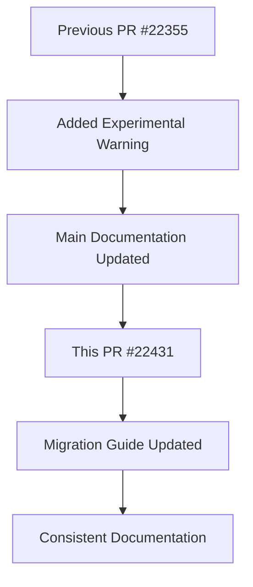

+++
title = "#22431 0.18: Add experimental warning to glTF coordinate conversion migration guide"
date = "2026-01-08T00:00:00"
draft = false
template = "pull_request_page.html"
in_search_index = true

[taxonomies]
list_display = ["show"]

[extra]
current_language = "en"
available_languages = {"en" = { name = "English", url = "/pull_request/bevy/2026-01/pr-22431-en-20260108" }, "zh-cn" = { name = "中文", url = "/pull_request/bevy/2026-01/pr-22431-zh-cn-20260108" }}
labels = ["C-Docs", "A-glTF"]
+++

# Title

## Basic Information
- **Title**: 0.18: Add experimental warning to glTF coordinate conversion migration guide
- **PR Link**: https://github.com/bevyengine/bevy/pull/22431
- **Author**: greeble-dev
- **Status**: MERGED
- **Labels**: C-Docs, S-Ready-For-Final-Review, A-glTF
- **Created**: 2026-01-08T15:06:53Z
- **Merged**: 2026-01-08T18:43:26Z
- **Merged By**: alice-i-cecile

## Description Translation

Following on from #22355, add the same experimental warning to the migration guide.

```
CAUTION: The options are experimental, and their behavior may change in future versions.
```

## The Story of This Pull Request

This PR addresses a straightforward but important documentation requirement in the Bevy engine. The context involves the ongoing evolution of glTF coordinate conversion features introduced in Bevy 0.17. These features allow developers to control how 3D models are oriented when loaded from glTF files, specifically aligning the model's forward direction with Bevy's coordinate system.

The core problem was that the migration guide for these coordinate conversion options lacked a clear warning about their experimental status. While PR #22355 had already added this warning to the main documentation, the migration guide remained unchanged. This created a potential inconsistency where users reading the migration guide might not realize that these features are still subject to change.

The solution approach was minimal and surgical: copy the exact warning text from the previous PR into the migration guide. This ensures consistency across all relevant documentation. The author took a pragmatic approach - rather than rewriting or rephrasing, they used the same wording that had already been approved and merged elsewhere in the codebase.

Looking at the implementation, the change involves just three lines in the markdown file. The key modification adds a clear cautionary note immediately after the introductory paragraph:

```
_CAUTION: The options are experimental, and their behavior may change in future versions._
```

This placement is strategic - it appears right after the explanation of what changed between Bevy 0.17 and 0.18, ensuring users see the warning before they proceed to use these features.

An interesting technical insight here is the use of italics (`_`) for the warning rather than bold or a more formal admonition style. This keeps the warning visible but not overly intrusive, maintaining the document's readability while still conveying important information.

The impact of this change is primarily about managing user expectations. By clearly marking these features as experimental, the documentation helps prevent users from building critical functionality on APIs that may change in future releases. This is particularly important for migration guides, where users are actively making decisions about updating their codebase.

From an engineering perspective, this PR demonstrates good documentation hygiene. It shows attention to detail in ensuring consistent messaging across the entire documentation set. While the change itself is small, it contributes to a better user experience by preventing confusion and setting clear expectations about feature stability.

## Visual Representation



## Key Files Changed

### `release-content/migration-guides/gltf-coordinate-conversion.md` (+5/-2)

**What changed and why**: This migration guide documents changes to glTF coordinate conversion options between Bevy 0.17 and 0.18. The PR adds an experimental warning to clarify that these options are not yet stable and may change in future versions.

**Key modifications**:
```markdown
# Before:
**Bevy 0.17** added experimental options for coordinate conversion of glTF
files - `GltfPlugin::use_model_forward_direction` and
`GltfLoaderSettings::use_model_forward_direction`. In **Bevy 0.18** these
options have changed. The options are disabled by default, so if you haven't
enabled them then your glTFs will work the same as before.

# After:
**Bevy 0.17** added options for coordinate conversion of glTF files -
`GltfPlugin::use_model_forward_direction` and
`GltfLoaderSettings::use_model_forward_direction`. In **Bevy 0.18** these
options have changed. The options are disabled by default, so if you haven't
enabled them then your glTFs will work the same as before.

_CAUTION: The options are experimental, and their behavior may change in
future versions._
```

**How these changes relate to the overall purpose**: The warning ensures users understand the experimental nature of the coordinate conversion options when reading the migration guide, maintaining consistency with other documentation that already includes this warning.

## Further Reading

1. [Bevy Documentation: API Stability](https://bevyengine.org/learn/contributing/policies/#api-stability) - Understand Bevy's approach to API stability and experimental features
2. [glTF Specification](https://www.khronos.org/gltf/) - Official glTF format documentation
3. [PR #22355](https://github.com/bevyengine/bevy/pull/22355) - The previous PR that added the same warning to other documentation
4. [Coordinate Systems in 3D Graphics](https://en.wikipedia.org/wiki/Cartesian_coordinate_system) - Background on coordinate system transformations in 3D graphics

# Full Code Diff
```
diff --git a/release-content/migration-guides/gltf-coordinate-conversion.md b/release-content/migration-guides/gltf-coordinate-conversion.md
index df688a6bac990..f83a26e16e09d 100644
--- a/release-content/migration-guides/gltf-coordinate-conversion.md
+++ b/release-content/migration-guides/gltf-coordinate-conversion.md
@@ -3,12 +3,15 @@ title: glTF Coordinate Conversion
 pull_requests: [20394]
 ---
 
-**Bevy 0.17** added experimental options for coordinate conversion of glTF
-files - `GltfPlugin::use_model_forward_direction` and
+**Bevy 0.17** added options for coordinate conversion of glTF files -
+`GltfPlugin::use_model_forward_direction` and
 `GltfLoaderSettings::use_model_forward_direction`. In **Bevy 0.18** these
 options have changed. The options are disabled by default, so if you haven't
 enabled them then your glTFs will work the same as before.
 
+_CAUTION: The options are experimental, and their behavior may change in
+future versions._
+
 The goal of coordinate conversion is to take objects that face forward in the
 glTF and change them to match the direction of Bevy's `Transform::forward`.
 Conversion is necessary because glTF's standard scene forward is +Z, while
```