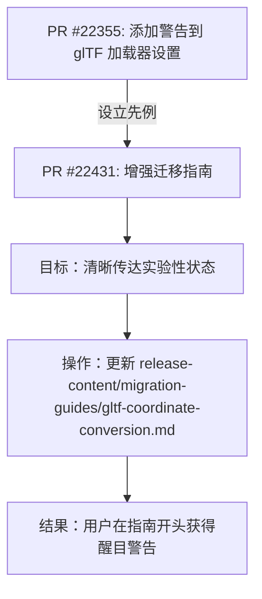

+++
title = "#22431 0.18: Add experimental warning to glTF coordinate conversion migration guide"
date = "2026-01-08T00:00:00"
draft = false
template = "pull_request_page.html"
in_search_index = false

[extra]
current_language = "zh-cn"
available_languages = {"en" = { name = "English", url = "/pull_request/bevy/2026-01/pr-22431-en-20260108" }, "zh-cn" = { name = "中文", url = "/pull_request/bevy/2026-01/pr-22431-zh-cn-20260108" }}
+++

# Title

## 基本信息
- **标题**: 0.18: Add experimental warning to glTF coordinate conversion migration guide
- **PR链接**: https://github.com/bevyengine/bevy/pull/22431
- **作者**: greeble-dev
- **状态**: 已合并
- **标签**: C-Docs, S-Ready-For-Final-Review, A-glTF
- **创建时间**: 2026-01-08T15:06:53Z
- **合并时间**: 2026-01-08T18:43:26Z
- **合并者**: alice-i-cecile

## 描述翻译

继 #22355 之后，在迁移指南中添加相同的实验性警告。

```
CAUTION: The options are experimental, and their behavior may change in future versions.
```

## 关于这个Pull Request的故事

这个Pull Request的故事是关于文档维护的连续性和清晰性。事情的开端是Bevy 0.17版本引入了一个与glTF坐标转换相关的新功能。具体来说，`GltfPlugin` 和 `GltfLoaderSettings` 新增了 `use_model_forward_direction` 这个配置选项。这个选项的目的是为了解决glTF标准（使用+Z作为前向）与Bevy的`Transform`系统（使用-Y作为前向）之间的差异。默认情况下此选项是关闭的，以保持向后兼容性。

在引入新功能时，开发团队将其标记为“实验性（experimental）”。这是一个重要的工程实践，意味着该功能的API或行为在未来的版本中可能会发生不兼容的更改，为团队收集反馈和迭代设计留出了空间。然而，仅仅在代码中标记是不够的，用户阅读的官方文档也必须清晰地传达这一状态。

这就是问题所在。最初的迁移指南文档（`gltf-coordinate-conversion.md`）提到了这些选项是“实验性的”，但这个描述被埋没在段落中，不够醒目。随着Bevy 0.18版本对这些选项的行为进行了调整（正如迁移指南本身所述），确保用户在使用前明确知晓其“实验性”状态变得更为重要。一个未充分警示的用户可能会基于当前实验性功能的行为构建应用，并在未来版本变更时面临意外的破坏。

因此，这个PR的目标非常明确且具体：增强文档中的警告，使其更加突出和清晰。解决方案是直接的文档更新，没有涉及任何代码逻辑的修改。开发者（greeble-dev）采取了与之前另一个相关PR（#22355）一致的做法，将一句醒目的警告语以斜体格式插入到迁移指南的开头部分。

让我们看一下具体的实现。修改非常简洁，只涉及一个文件的三行变化。关键的改动有两处：
1.  第一处是将原文“added experimental options for...”中的“experimental”一词移除。这初看可能令人疑惑，但其实是为了配合第二处修改，使表述更清晰。
2.  第二处，也是核心的修改，是在介绍段落之后，正文解释之前，插入了一个独立的警告块：
    `_CAUTION: The options are experimental, and their behavior may change in future versions._`

这个实现的精妙之处在于其清晰的分离性。现在，文档的结构变为：首先说明“Bevy 0.17增加了某些选项”，然后立即用一个独立的、格式突出的框体警告用户“这些选项是实验性的，行为在未来可能改变”，最后再详细解释这些选项的目的和用法。这种结构比将“experimental”这个词混在叙述句中要有效得多，大大降低了用户忽略这一关键信息的可能性。

从工程角度看，这个微小的PR体现了对用户体验和API稳定性的重视。它不是一个功能开发，而是一次预防性的维护。通过明确的文档警告，团队管理了用户对于实验性功能的期望，减少了未来因API变更而导致用户困惑或抱怨的可能性。这也展示了Bevy团队在版本迭代过程中对细节的关注，即使是文档的表述也力求精确和一致（参考了#22355的相同做法）。

最终，这个更改被迅速审查并合并，完善了Bevy 0.18版本发布前的文档准备工作，确保了用户在阅读坐标转换迁移指南时能获得清晰、无歧义的风险提示。

## 视觉表示



## 关键文件更改

**1. `release-content/migration-guides/gltf-coordinate-conversion.md` (+5/-2)**
   - **修改描述与原因**：此文件是glTF坐标转换功能的迁移指南。为了明确告知用户相关配置选项 (`use_model_forward_direction`) 处于实验阶段，其行为在未来版本可能变更，在此指南的开头部分添加了一个醒目的警告区块。
   - **代码片段**:
     ```markdown
     # 修改前：
     **Bevy 0.17** added experimental options for coordinate conversion of glTF
     files - `GltfPlugin::use_model_forward_direction` and
     `GltfLoaderSettings::use_model_forward_direction`. In **Bevy 0.18** these
     options have changed. The options are disabled by default, so if you haven't
     enabled them then your glTFs will work the same as before.
     
     The goal of coordinate conversion is to take objects that face forward in the
     ```

     ```markdown
     # 修改后：
     **Bevy 0.17** added options for coordinate conversion of glTF files -
     `GltfPlugin::use_model_forward_direction` and
     `GltfLoaderSettings::use_model_forward_direction`. In **Bevy 0.18** these
     options have changed. The options are disabled by default, so if you haven't
     enabled them then your glTFs will work the same as before.
     
     _CAUTION: The options are experimental, and their behavior may change in
     future versions._
     
     The goal of coordinate conversion is to take objects that face forward in the
     ```
   - **与PR目标的关联**：这是本次PR的核心且唯一的修改。通过添加格式化的警告文本，直接实现了在关键文档中高亮提示实验性风险的目的。

## 延伸阅读

1.  **关联PR #22355**: https://github.com/bevyengine/bevy/pull/22355
    *   这是本次PR的前置参考，它向 `GltfLoaderSettings` 的文档中添加了相同的实验性警告。了解它可以获得更完整的背景。
2.  **Bevy 官方迁移指南**：https://bevyengine.org/learn/migration-guides/
    *   这是所有Bevy版本迁移指南的入口点，有助于理解此类文档的上下文和格式。
3.  **glTF 坐标系规范 (Khronos Group)**: https://github.com/KhronosGroup/glTF/blob/master/specification/2.0/README.md#coordinate-system-and-units
    *   了解glTF标准为何使用+Z作为前向，这是Bevy坐标转换功能需要解决的问题根源。

# Full Code Diff
diff --git a/release-content/migration-guides/gltf-coordinate-conversion.md b/release-content/migration-guides/gltf-coordinate-conversion.md
index df688a6bac990..f83a26e16e09d 100644
--- a/release-content/migration-guides/gltf-coordinate-conversion.md
+++ b/release-content/migration-guides/gltf-coordinate-conversion.md
@@ -3,12 +3,15 @@ title: glTF Coordinate Conversion
 pull_requests: [20394]
 ---
 
-**Bevy 0.17** added experimental options for coordinate conversion of glTF
-files - `GltfPlugin::use_model_forward_direction` and
+**Bevy 0.17** added options for coordinate conversion of glTF files -
+`GltfPlugin::use_model_forward_direction` and
 `GltfLoaderSettings::use_model_forward_direction`. In **Bevy 0.18** these
 options have changed. The options are disabled by default, so if you haven't
 enabled them then your glTFs will work the same as before.
 
+_CAUTION: The options are experimental, and their behavior may change in
+future versions._
+
 The goal of coordinate conversion is to take objects that face forward in the
 glTF and change them to match the direction of Bevy's `Transform::forward`.
 Conversion is necessary because glTF's standard scene forward is +Z, while