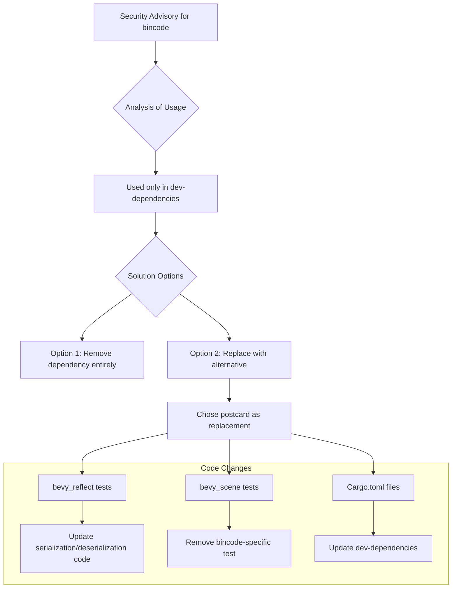

+++
title = "#22434 Remove bincode dev dependency"
date = "2026-01-08T00:00:00"
draft = false
template = "pull_request_page.html"
in_search_index = true

[taxonomies]
list_display = ["show"]

[extra]
current_language = "en"
available_languages = {"en" = { name = "English", url = "/pull_request/bevy/2026-01/pr-22434-en-20260108" }, "zh-cn" = { name = "中文", url = "/pull_request/bevy/2026-01/pr-22434-zh-cn-20260108" }}
labels = ["C-Code-Quality", "A-Reflection", "C-Testing", "A-Scenes", "D-Straightforward"]
+++

# Title
Remove bincode dev dependency

## Basic Information
- **Title**: Remove bincode dev dependency
- **PR Link**: https://github.com/bevyengine/bevy/pull/22434
- **Author**: mockersf
- **Status**: MERGED
- **Labels**: C-Code-Quality, S-Ready-For-Review, A-Reflection, C-Testing, A-Scenes, X-Uncontroversial, D-Straightforward
- **Created**: 2026-01-08T18:48:51Z
- **Merged**: 2026-01-08T20:47:55Z
- **Merged By**: alice-i-cecile

## Description Translation
The PR description is already in English, so it's included as-is:

```
# Objective

- bincode has an advisory
- Fixes #22432 
- alternative to and closes #22433 

## Solution

- bincode is only used in test for a non describing binary format
- use another instead, like postcard
```

## The Story of This Pull Request

This pull request addresses a security concern in the Bevy game engine's development dependencies. The issue was straightforward: the `bincode` crate had a security advisory against it, but it was only being used in test code as a binary serialization format for testing purposes. Since there was no production dependency on `bincode`, the solution was simple - replace it with another binary serialization crate that doesn't have security issues.

The problem originated from GitHub's automated security scanning, which detected the advisory for `bincode` and flagged it in issue #22432. The advisory meant that using `bincode` could potentially expose the codebase to security vulnerabilities. However, looking at the actual usage revealed that `bincode` was only included as a `dev-dependency` - meaning it was only used for tests and development, not in the actual production code of Bevy.

The developer considered two possible approaches: one was to simply remove the `bincode` dependency entirely (as attempted in PR #22433), and the other was to replace it with an alternative crate that serves the same testing purpose without the security concerns. This PR takes the replacement approach, choosing `postcard` as the alternative binary serialization format for the tests.

The implementation required changes in two main areas: the reflection system tests and the scene serialization tests. In both cases, the tests were using `bincode` to verify that serialization and deserialization work correctly with binary formats. The key insight was that the specific binary format didn't matter for the tests - what mattered was testing that the serialization infrastructure could handle binary data correctly.

Looking at the code changes, we can see the pattern clearly. In the reflection tests, the serialization test was updated from using `bincode::serde::encode_to_vec` to using `postcard` with a custom serializer:

```rust
// Before (using bincode):
let config = bincode::config::standard().with_fixed_int_encoding();
let bytes = bincode::serde::encode_to_vec(&serializer, config).unwrap();

// After (using postcard):
let mut postcard = postcard::Serializer {
    output: postcard::ser_flavors::AllocVec::default(),
};
serializer.serialize(&mut postcard).unwrap();
let bytes = postcard::ser_flavors::Flavor::finalize(postcard.output).unwrap();
```

Similarly, the deserialization test was updated from `bincode::serde::seed_decode_from_slice` to `postcard::Deserializer::from_bytes`:

```rust
// Before (using bincode):
let config = bincode::config::standard().with_fixed_int_encoding();
let (dynamic_output, _read_bytes) =
    bincode::serde::seed_decode_from_slice(deserializer, &input, config).unwrap();

// After (using postcard):
let dynamic_output = deserializer
    .deserialize(&mut postcard::Deserializer::from_bytes(&input))
    .unwrap();
```

An important technical detail is that the expected binary data in the tests had to be updated because `postcard` produces different binary output than `bincode`. `postcard` uses a more compact representation, which is actually beneficial for the tests since it results in smaller test data arrays. The updated test data shows this clearly - the `postcard` output is significantly more compact than the `bincode` output.

In the scene serialization tests, the approach was different. Instead of replacing `bincode` with `postcard` in the existing test, the entire test (`should_roundtrip_bincode`) was removed. This is because `bevy_scene` already had a `postcard` dev-dependency and tests for it, so adding another test with `postcard` would have been redundant. The removal of the `bincode`-specific test was the cleanest solution.

The changes demonstrate good software engineering practices: addressing security advisories promptly, understanding the actual risk (dev-dependency vs production dependency), choosing the simplest effective solution, and maintaining test coverage with equivalent functionality. The PR also shows awareness of the broader context - there was already a `postcard` dev-dependency in `bevy_scene`, so the solution leveraged existing infrastructure rather than adding unnecessary complexity.

## Visual Representation



## Key Files Changed

### `crates/bevy_reflect/Cargo.toml`
**Change**: Updated dev-dependencies to replace `bincode` with `postcard`.

**Code snippet**:
```toml
# Before:
bincode = { version = "2.0", features = ["serde"] }

# After:
postcard = { version = "1.0", features = ["alloc"] }
```

**Why**: Removes the dependency with a security advisory while maintaining test functionality with an alternative binary serialization format.

### `crates/bevy_reflect/src/serde/ser/mod.rs`
**Change**: Updated serialization test to use `postcard` instead of `bincode`.

**Code snippet**:
```rust
// Before (partial):
let serializer = ReflectSerializer::new(&input, &registry);
let config = bincode::config::standard().with_fixed_int_encoding();
let bytes = bincode::serde::encode_to_vec(&serializer, config).unwrap();

// After (partial):
let serializer = ReflectSerializer::new(&input, &registry);
let mut postcard = postcard::Serializer {
    output: postcard::ser_flavors::AllocVec::default(),
};
serializer.serialize(&mut postcard).unwrap();
let bytes = postcard::ser_flavors::Flavor::finalize(postcard.output).unwrap();
```

**Why**: Maintains test coverage for binary serialization without using a crate with security advisories.

### `crates/bevy_reflect/src/serde/de/mod.rs`
**Change**: Updated deserialization test to use `postcard` instead of `bincode`.

**Code snippet**:
```rust
// Before (partial):
let config = bincode::config::standard().with_fixed_int_encoding();
let (dynamic_output, _read_bytes) =
    bincode::serde::seed_decode_from_slice(deserializer, &input, config).unwrap();

// After (partial):
let dynamic_output = deserializer
    .deserialize(&mut postcard::Deserializer::from_bytes(&input))
    .unwrap();
```

**Why**: Maintains test coverage for binary deserialization without using a crate with security advisories.

### `crates/bevy_scene/Cargo.toml`
**Change**: Removed `bincode` dev-dependency.

**Code snippet**:
```toml
# Before (partial):
[dev-dependencies]
postcard = { version = "1.0", features = ["alloc"] }
bincode = { version = "2.0", features = ["serde"] }

# After (partial):
[dev-dependencies]
postcard = { version = "1.0", features = ["alloc"] }
```

**Why**: Removes unnecessary dependency with security advisory when an alternative (`postcard`) is already available and tested.

### `crates/bevy_scene/src/serde.rs`
**Change**: Removed the `should_roundtrip_bincode` test function entirely.

**Code snippet**:
```rust
// Removed: 44 lines of test code for bincode roundtripping
```

**Why**: The test was specific to `bincode` serialization, and since `bincode` is being removed as a dependency, the test is no longer relevant. The crate already has `postcard` tests for similar functionality.

## Further Reading

1. **Postcard crate documentation**: https://docs.rs/postcard
2. **bincode security advisory**: The specific advisory mentioned in the PR (details would be in the linked issue #22432)
3. **Rust security advisory database**: https://rustsec.org/
4. **Serde framework for serialization**: https://serde.rs/ (both bincode and postcard are Serde-compatible formats)
5. **Bevy Engine's reflection system**: Understanding how Bevy uses reflection for serialization and scenes