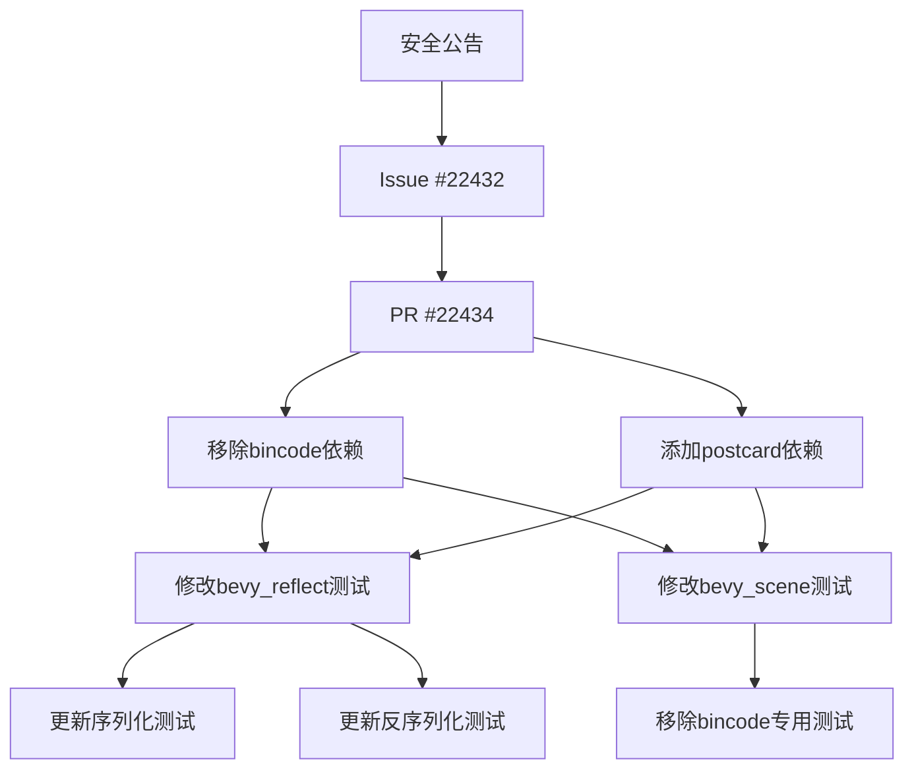

+++
title = "#22434 Remove bincode dev dependency"
date = "2026-01-08T00:00:00"
draft = false
template = "pull_request_page.html"
in_search_index = false

[extra]
current_language = "zh-cn"
available_languages = {"en" = { name = "English", url = "/pull_request/bevy/2026-01/pr-22434-en-20260108" }, "zh-cn" = { name = "中文", url = "/pull_request/bevy/2026-01/pr-22434-zh-cn-20260108" }}
+++

# Remove bincode dev dependency

## 基本信息
- **标题**: Remove bincode dev dependency
- **PR链接**: https://github.com/bevyengine/bevy/pull/22434
- **作者**: mockersf
- **状态**: MERGED
- **标签**: C-Code-Quality, S-Ready-For-Review, A-Reflection, C-Testing, A-Scenes, X-Uncontroversial, D-Straightforward
- **创建时间**: 2026-01-08T18:48:51Z
- **合并时间**: 2026-01-08T20:47:55Z
- **合并者**: alice-i-cecile

## 描述翻译

### 目标

- bincode 有一个安全公告（advisory）
- 修复 #22432
- 替代并关闭 #22433

### 解决方案

- bincode 仅用于测试中，用于一个非描述性的二进制格式
- 使用其他替代方案，比如 postcard

## 这个Pull Request的故事

### 问题和背景

这个PR的根源是一个安全通知。bincode库被发现有安全公告（advisory），这给依赖它的项目带来了潜在风险。在Bevy项目中，bincode被用作开发依赖（dev dependency），仅用于测试代码中。具体来说，它被用于测试反射（reflection）和场景（scene）系统的二进制序列化功能。

问题的核心是：虽然bincode只是在测试中使用，但安全公告仍然需要被解决。用户提交了issue #22432来报告这个问题，同时也有另一个PR #22433尝试解决同样的问题。这个PR作者选择了不同的解决方案。

### 解决方案方法

作者选择了postcard作为bincode的替代品。Postcard是一个轻量级的序列化格式，专为嵌入式系统设计，但同样适用于常规应用。选择postcard有几个原因：

1. 它没有已知的安全问题
2. 它已经在bevy_scene的测试中被使用（从Cargo.toml可以看到postcard已经是dev-dependency）
3. 它是一个简单的二进制格式，与bincode在测试中的用途相似

技术上看，这个替换是直接的：在Cargo.toml中移除bincode依赖，添加postcard依赖，然后修改测试代码以使用postcard的API而不是bincode的API。

### 实现细节

实现分为几个部分，主要集中在测试代码的修改上：

1. **依赖管理**：在两个crate的Cargo.toml中更新依赖
2. **测试数据更新**：因为bincode和postcard生成不同的二进制输出，测试中的硬编码字节数组需要更新
3. **API适配**：将bincode的序列化/反序列化调用替换为postcard的对应调用

在bevy_reflect中，修改了序列化和反序列化的测试。原来的bincode配置使用了固定整数编码（fixed int encoding），而postcard有自己的序列化方式。

在bevy_scene中，作者直接移除了`should_roundtrip_bincode`测试，而不是将它改为使用postcard。这可能是因为bevy_scene已经有其他的序列化测试覆盖了类似的功能。

### 技术见解

这个PR展示了几个有用的工程实践：

1. **最小化变更**：作者没有重写整个测试逻辑，只是替换了序列化库，保持了测试的意图不变
2. **测试数据维护**：当替换序列化格式时，必须更新测试中硬编码的预期字节数组。作者提供了完整的postcard序列化输出
3. **依赖管理**：安全公告需要及时响应，即使对于仅用于测试的依赖

值得注意的是，postcard和bincode的API设计不同。bincode提供了高级的`encode_to_vec`和`decode_from_slice`函数，而postcard需要显式地创建序列化器和反序列化器。这反映了两个库的不同设计哲学。

### 影响

这个PR的主要影响是消除了一个已知的安全风险。从代码质量角度看，它使代码库更加安全，而且由于bincode只用于测试，这个变更不会影响生产代码的功能。

此外，使用postcard可能还有其他好处：
- postcard设计用于no_std环境，可能使Bevy的未来嵌入式使用更容易
- 减少依赖数量，简化依赖树
- postcard可能比bincode更轻量级

从工程角度看，这个PR展示了如何安全地替换依赖，同时保持测试覆盖率的完整性。

## 可视化表示



## 关键文件更改

### 1. `crates/bevy_reflect/Cargo.toml`
**更改说明**：将开发依赖中的bincode替换为postcard
```toml
# 修改前：
[dev-dependencies]
bincode = { version = "2.0", features = ["serde"] }

# 修改后：
[dev-dependencies]
postcard = { version = "1.0", features = ["alloc"] }
```

### 2. `crates/bevy_reflect/src/serde/de/mod.rs`
**更改说明**：更新反序列化测试以使用postcard而不是bincode
```rust
// 修改前：
let config = bincode::config::standard().with_fixed_int_encoding();
let (dynamic_output, _read_bytes) =
    bincode::serde::seed_decode_from_slice(deserializer, &input, config).unwrap();

// 修改后：
let dynamic_output = deserializer
    .deserialize(&mut postcard::Deserializer::from_bytes(&input))
    .unwrap();
```

### 3. `crates/bevy_reflect/src/serde/ser/mod.rs`
**更改说明**：更新序列化测试以使用postcard而不是bincode
```rust
// 修改前：
let serializer = ReflectSerializer::new(&input, &registry);
let config = bincode::config::standard().with_fixed_int_encoding();
let bytes = bincode::serde::encode_to_vec(&serializer, config).unwrap();

// 修改后：
let serializer = ReflectSerializer::new(&input, &registry);

let mut postcard = postcard::Serializer {
    output: postcard::ser_flavors::AllocVec::default(),
};
serializer.serialize(&mut postcard).unwrap();
let bytes = postcard::ser_flavors::Flavor::finalize(postcard.output).unwrap();
```

### 4. `crates/bevy_scene/Cargo.toml`
**更改说明**：移除bincode开发依赖（postcard已存在）
```toml
# 修改前：
[dev-dependencies]
bincode = { version = "2.0", features = ["serde"] }

# 修改后：
# bincode依赖被完全移除
```

### 5. `crates/bevy_scene/src/serde.rs`
**更改说明**：移除专门的bincode往返测试
```rust
// 整个测试函数被移除：
#[test]
fn should_roundtrip_bincode() {
    // ... 测试实现 ...
}
```

## 进一步阅读

1. **Postcard文档**：https://docs.rs/postcard
2. **Bincode安全公告**：了解具体的安全问题详情
3. **Rust序列化比较**：了解不同序列化库（bincode, postcard, serde_json等）的权衡
4. **Bevy反射系统**：了解Bevy的反射和序列化如何工作