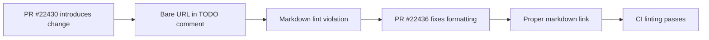

+++
title = "#22436 0.18: Fix markdown lint in `optional_asset_reader_seek.md` release note"
date = "2026-01-08T00:00:00"
draft = false
template = "pull_request_page.html"
in_search_index = true

[taxonomies]
list_display = ["show"]

[extra]
current_language = "en"
available_languages = {"en" = { name = "English", url = "/pull_request/bevy/2026-01/pr-22436-en-20260108" }, "zh-cn" = { name = "中文", url = "/pull_request/bevy/2026-01/pr-22436-zh-cn-20260108" }}
labels = ["C-Bug", "C-Docs", "A-Assets"]
+++

# Title
## Basic Information
- **Title**: 0.18: Fix markdown lint in `optional_asset_reader_seek.md` release note
- **PR Link**: https://github.com/bevyengine/bevy/pull/22436
- **Author**: greeble-dev
- **Status**: MERGED
- **Labels**: C-Bug, C-Docs, A-Assets, S-Needs-Review
- **Created**: 2026-01-08T21:18:37Z
- **Merged**: 2026-01-08T21:19:27Z
- **Merged By**: alice-i-cecile

## Description Translation
Fix markdown lint that slipped into #22430.

I have not tested this locally - I'm relying on CI to verify.

## The Story of This Pull Request

This pull request is a straightforward documentation fix that addresses a minor but important issue in the project's release notes. The problem was a markdown lint violation in the file `optional_asset_reader_seek.md`. Specifically, a raw URL was present in a comment without being properly formatted as a markdown link. This violates markdown best practices and the project's linting rules, which expect URLs in documentation to be formatted as links for better readability and consistency.

The context here is that the Bevy project maintains high standards for code and documentation quality, including automated linting checks in their CI pipeline. The PR #22430, which introduced changes to this release note, accidentally left a bare URL in a `TODO` comment. This is a common oversight when quickly editing documentation files, but it's precisely the kind of issue that automated linting is designed to catch.

The developer, greeble-dev, identified the problem and submitted a minimal fix. The solution approach was simple and direct: convert the plain URL `https://github.com/bevyengine/bevy/pull/22182` into a proper markdown link `[#22182](https://github.com/bevyengine/bevy/pull/22182)`. This change aligns with markdown conventions and the project's documentation style guide.

From a technical perspective, this fix demonstrates the importance of consistent documentation formatting. While the change itself is trivial, it ensures that the release notes maintain a professional appearance and comply with the project's linting standards. The developer explicitly mentioned relying on CI to verify the fix, which indicates trust in the project's automated testing and linting infrastructure. This is a practical approach for minor documentation fixes where local testing might be unnecessary.

The impact of this change is minimal but positive. It prevents the markdown linter from failing on this file, which could otherwise block CI pipelines or cause confusion for contributors. By maintaining clean linting results, the project reduces noise in automated checks and sets a good example for documentation quality.

## Visual Representation



## Key Files Changed

**File:** `release-content/release-notes/optional_asset_reader_seek.md`

1. **Change Description**: The file contained a `TODO` comment with a plain URL. This was changed to a properly formatted markdown link to fix a markdown lint violation.

2. **Code Snippet**:
```markdown
# File: release-content/release-notes/optional_asset_reader_seek.md

# Before:
_TODO: This release note is not up to date with the changes in https://github.com/bevyengine/bevy/pull/22182._

# After:
_TODO: This release note is not up to date with the changes in [#22182](https://github.com/bevyengine/bevy/pull/22182)._
```

3. **Relation to PR Purpose**: This single-line change is the entirety of the PR. It fixes the markdown lint issue by converting a bare URL into a markdown link, which is the standard format for referencing pull requests in Bevy's documentation.

## Further Reading

- [Markdown Guide: Links](https://www.markdownguide.org/basic-syntax/#links)
- [Bevy Contribution Guide](https://github.com/bevyengine/bevy/blob/main/CONTRIBUTING.md)
- [CommonMark Specification](https://spec.commonmark.org/)

# Full Code Diff
```diff
diff --git a/release-content/release-notes/optional_asset_reader_seek.md b/release-content/release-notes/optional_asset_reader_seek.md
index 380d19368146b..05cc96fe1c7a4 100644
--- a/release-content/release-notes/optional_asset_reader_seek.md
+++ b/release-content/release-notes/optional_asset_reader_seek.md
@@ -4,7 +4,7 @@ authors: ["@andriyDev", "@cart"]
 pull_requests: [22182]
 ---
 
-_TODO: This release note is not up to date with the changes in https://github.com/bevyengine/bevy/pull/22182._
+_TODO: This release note is not up to date with the changes in [#22182](https://github.com/bevyengine/bevy/pull/22182)._
 
 In Bevy 0.15, we replaced the `AsyncSeek` super trait on `Reader` with `AsyncSeekForward`. This
 allowed our `Reader` trait to apply to more cases (e.g., it could allow cases like an HTTP request,
```