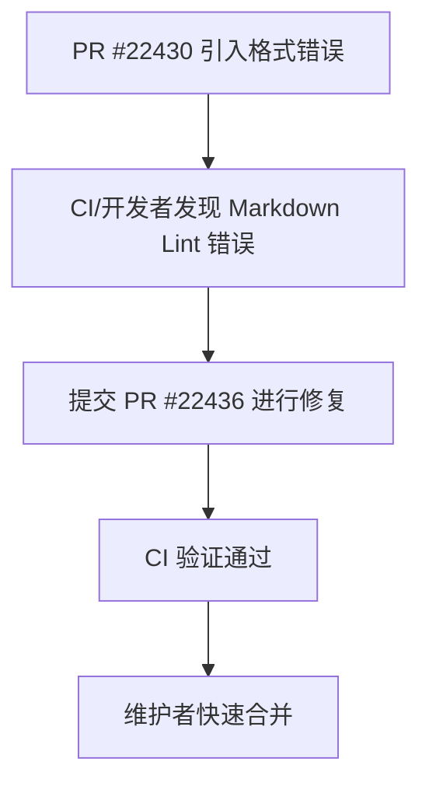

+++
title = "#22436 0.18: Fix markdown lint in `optional_asset_reader_seek.md` release note"
date = "2026-01-08T00:00:00"
draft = false
template = "pull_request_page.html"
in_search_index = false

[extra]
current_language = "zh-cn"
available_languages = {"en" = { name = "English", url = "/pull_request/bevy/2026-01/pr-22436-en-20260108" }, "zh-cn" = { name = "中文", url = "/pull_request/bevy/2026-01/pr-22436-zh-cn-20260108" }}
+++

# 0.18: Fix markdown lint in `optional_asset_reader_seek.md` release note

## 基本信息
- **标题**: 0.18: Fix markdown lint in `optional_asset_reader_seek.md` release note
- **PR链接**: https://github.com/bevyengine/bevy/pull/22436
- **作者**: greeble-dev
- **状态**: 已合并
- **标签**: C-Bug, C-Docs, A-Assets, S-Needs-Review
- **创建时间**: 2026-01-08T21:18:37Z
- **合并时间**: 2026-01-08T21:19:27Z
- **合并者**: alice-i-cecile

## 描述翻译
修复在 #22430 中引入的 markdown 格式问题。

我没有在本地测试这个修改——我依赖 CI 来验证。

## 本次 Pull Request 的经过

这个 PR 的故事很短，但展示了在大型协作项目中维护代码和文档质量的标准流程。事件始于 PR #22430 被合并之后。该 PR 对版本说明文档进行了一些修改，但在合并过程中，一个微小的 Markdown 格式问题被忽略了。具体来说，是在文档内引用另一个 PR 链接时，使用了纯 URL 而非正确的 Markdown 链接语法。

这个问题很可能是在后续的自动化检查（例如 CI 中的 Markdown 格式检查工具或 linter）中被发现的。在 Bevy 这类注重质量的工程化项目中，通常会配置这样的工具来确保文档风格的一致性、链接的有效性以及可读性。一个格式错误的链接虽然不会破坏构建或运行时功能，但它会影响文档的渲染效果（例如在某些 Markdown 解析器中无法被正确识别为可点击的链接）和项目整体的专业形象。

作者 greeble-dev 注意到了这个问题并快速提交了修复。从 PR 描述来看，作者没有在本地进行完整测试，而是选择直接提交并依赖持续集成（CI）流水线来验证更改的正确性。这是一个合理的做法，因为此类纯文本修复的风险极低，且 CI 能够快速提供关于 Markdown 格式的反馈。这种做法也符合高效协作的原则：快速修复明确的问题，将验证工作交给自动化工具。

合并者 alice-i-cecile 在 PR 创建后不到一分钟就将其合并，这进一步证实了这是一个简单、明确且必要的修复。整个流程体现了一个成熟的开源项目对细节的关注：即使是一个拼写或格式错误，也会被迅速识别和纠正。这维护了代码库的整洁度，并确保了所有贡献者（包括通过阅读版本来了解变更的用户）都能获得格式良好、无错误的文档。

从技术角度看，修复本身很简单，就是将裸 URL 文本替换为标准的 `[链接文字](URL)` Markdown 语法。这种语法能确保链接在 GitHub 的 Markdown 渲染器、文档生成工具以及其他编辑器中都能被正确识别和展示为超链接，提高了文档的可读性和可访问性。

## 视觉表示



## 关键文件更改

本次 PR 只修改了一个文件，即版本说明文档。

- `release-content/release-notes/optional_asset_reader_seek.md` (+1/-1)

这个文件包含了对 Bevy 0.18 版本中 `AssetReader` 相关变更的说明。修复的内容是文档内部一个待办事项（TODO）注释中的链接格式。

1.  **修改描述及原因**：修复了一个 Markdown 链接的格式。原代码中使用的是纯文本 URL，这不符合标准的 Markdown 链接语法，可能导致某些解析工具无法将其识别为可点击链接，也影响了一致性。修改后使用了正确的 `[text](url)` 格式。
2.  **代码片段对比**：

```markdown
# 文件: release-content/release-notes/optional_asset_reader_seek.md
# 修改前:
_TODO: This release note is not up to date with the changes in https://github.com/bevyengine/bevy/pull/22182._

# 修改后:
_TODO: This release note is not up to date with the changes in [#22182](https://github.com/bevyengine/bevy/pull/22182)._
```

3.  **与 PR 整体目的的关联**：本次 PR 的唯一目的就是修正这个格式问题，以确保文档质量和 Markdown 语法的规范性。这行修改就是 PR 的全部内容。

## 延伸阅读

1.  **Markdown 官方基础语法**：了解标准的 Markdown 链接、图片等语法规则。
2.  **Bevy 贡献指南**：了解 Bevy 项目对代码和文档提交的规范要求。
3.  **关于持续集成（CI）中的 Linting**：学习如何在 CI 流水线中集成 Markdown 链接检查（例如 `markdown-link-check`）、拼写检查或格式美化工具，以自动捕获此类问题。