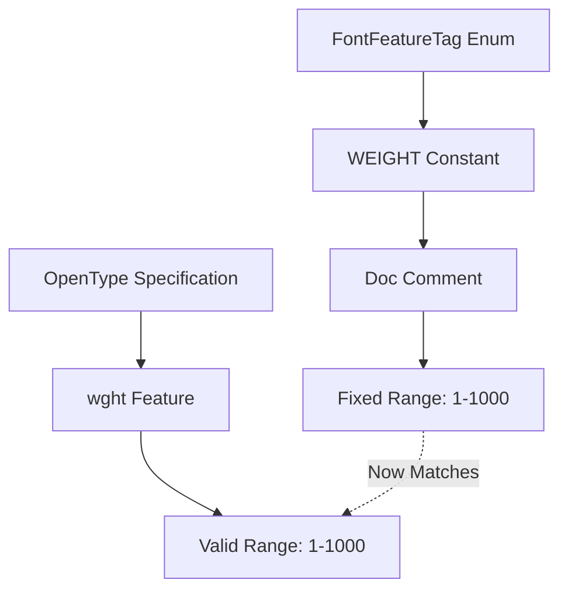

+++
title = "#22441 wght font feature tag comment fix"
date = "2026-01-09T00:00:00"
draft = false
template = "pull_request_page.html"
in_search_index = true

[taxonomies]
list_display = ["show"]

[extra]
current_language = "en"
available_languages = {"en" = { name = "English", url = "/pull_request/bevy/2026-01/pr-22441-en-20260109" }, "zh-cn" = { name = "中文", url = "/pull_request/bevy/2026-01/pr-22441-zh-cn-20260109" }}
labels = ["C-Docs", "D-Trivial", "A-Text"]
+++

# Title

## Basic Information
- **Title**: wght font feature tag comment fix
- **PR Link**: https://github.com/bevyengine/bevy/pull/22441
- **Author**: ickshonpe
- **Status**: MERGED
- **Labels**: C-Docs, D-Trivial, S-Ready-For-Final-Review, A-Text
- **Created**: 2026-01-08T23:31:28Z
- **Merged**: 2026-01-09T00:33:21Z
- **Merged By**: alice-i-cecile

## Description Translation

# Objective

The doc comment gives the valid range as 0 to 1000, but it should be 1 to 1000.

## Solution

Change it to "1 to 1000".

## The Story of This Pull Request

This pull request addresses a small but significant documentation error in Bevy's text rendering system. The issue was discovered in the `FontFeatureTag::WEIGHT` constant, which represents the OpenType font feature for controlling stroke thickness (commonly known as weight or `wght`).

The problem was straightforward: the documentation comment incorrectly stated that valid values for the weight feature ranged from 0 to 1000, when in fact the correct range is 1 to 1000 inclusive. While this might seem like a minor detail, accurate documentation is crucial for developers working with font rendering. Setting a weight of 0 would be invalid according to the OpenType specification and could lead to unexpected behavior or rendering errors.

The developer recognized this discrepancy and submitted a fix. The solution involved a single-line change to the documentation comment, correcting the valid value range and adding the word "inclusive" to be explicit about the boundary conditions. This change ensures that developers using Bevy's text system have accurate information about valid parameter ranges when working with font features.

The implementation change is minimal but important. In font rendering systems, weight values typically represent the thickness of strokes in font glyphs, with 1 being the lightest and 1000 being the boldest. A value of 0 would make no practical sense in this context, as it would imply no stroke thickness at all.

This correction aligns Bevy's documentation with the OpenType specification and prevents potential confusion for developers who might otherwise attempt to use an invalid value. The fix also maintains consistency with other font feature documentation in the same file, where value ranges are clearly specified.

## Visual Representation



## Key Files Changed

### `crates/bevy_text/src/text.rs`

This file contains the `FontFeatureTag` enum and its associated constants for OpenType font features. The change specifically corrects the documentation for the `WEIGHT` constant.

**Before:**
```rust
/// Varies the stroke thickness. Values must be in the range of 0 to 1000.
pub const WEIGHT: FontFeatureTag = FontFeatureTag::new(b"wght");
```

**After:**
```rust
/// Varies the stroke thickness. Valid values are in the range of 1 to 1000, inclusive.
pub const WEIGHT: FontFeatureTag = FontFeatureTag::new(b"wght");
```

The change updates the valid range from "0 to 1000" to "1 to 1000, inclusive". This correction ensures that developers have accurate information about acceptable values for the weight font feature.

## Further Reading

1. OpenType Specification - Font Features: https://docs.microsoft.com/en-us/typography/opentype/spec/features_pt
2. W3C CSS Fonts Module Level 4 - Font Weight: https://www.w3.org/TR/css-fonts-4/#font-weight-prop
3. Bevy Text Documentation: https://docs.rs/bevy_text/latest/bevy_text/
4. Microsoft Typography - OpenType Layout Tags: https://docs.microsoft.com/en-us/typography/opentype/spec/featuretags

# Full Code Diff
diff --git a/crates/bevy_text/src/text.rs b/crates/bevy_text/src/text.rs
index 12d4bbf143dec..800fd61307d6f 100644
--- a/crates/bevy_text/src/text.rs
+++ b/crates/bevy_text/src/text.rs
@@ -588,7 +588,7 @@ impl FontFeatureTag {
     /// same width.
     pub const TABULAR_FIGURES: FontFeatureTag = FontFeatureTag::new(b"tnum");
 
-    /// Varies the stroke thickness. Values must be in the range of 0 to 1000.
+    /// Varies the stroke thickness. Valid values are in the range of 1 to 1000, inclusive.
     pub const WEIGHT: FontFeatureTag = FontFeatureTag::new(b"wght");
 
     /// Varies the width of text from narrower to wider. Must be a value greater than 0. A value of