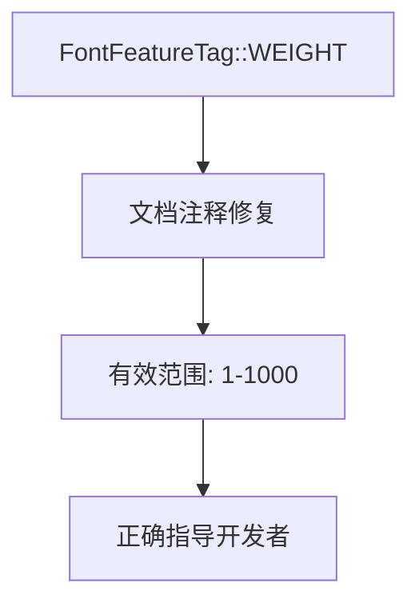

+++
title = "#22441 wght font feature tag comment fix"
date = "2026-01-09T00:00:00"
draft = false
template = "pull_request_page.html"
in_search_index = false

[extra]
current_language = "zh-cn"
available_languages = {"en" = { name = "English", url = "/pull_request/bevy/2026-01/pr-22441-en-20260109" }, "zh-cn" = { name = "中文", url = "/pull_request/bevy/2026-01/pr-22441-zh-cn-20260109" }}
+++

# wght font feature tag comment fix

## 基本信息
- **标题**: wght font feature tag comment fix
- **PR 链接**: https://github.com/bevyengine/bevy/pull/22441
- **作者**: ickshonpe
- **状态**: 已合并
- **标签**: C-Docs, D-Trivial, S-Ready-For-Final-Review, A-Text
- **创建时间**: 2026-01-08T23:31:28Z
- **合并时间**: 2026-01-09T00:33:21Z
- **合并者**: alice-i-cecile

## 描述翻译

# 目标

文档注释给出的有效范围是 0 到 1000，但应该是 1 到 1000。

## 解决方案

将其改为 "1 到 1000"。

## 本次 Pull Request 的完整说明

这个 PR 解决了一个文档注释中的错误。在 Bevy 引擎的文本系统中，`FontFeatureTag::WEIGHT` 常量用于控制字体的笔画粗细（stroke thickness），这是一个 OpenType 字体特性。文档注释原本错误地将有效范围指定为 0 到 1000，但实际上该特性的有效范围是 1 到 1000（包含边界值）。

这个错误虽然很小，但对于开发者使用这个 API 时可能会造成混淆。如果开发者按照错误的文档将值设为 0，字体渲染系统可能无法正确解释这个值，导致意外的渲染结果或错误。

从技术角度看，`FontFeatureTag` 是一个表示 OpenType 字体特性标签的结构体，它通过四个字节的标识符来指定特定的字体特性。`WEIGHT` 特性对应的是 "wght" 标签，用于控制字重（weight）的变化。在 OpenType 规范中，wght 特性的有效值范围确实是 1 到 1000。

PR 的作者 ickshonpe 发现这个问题后，提交了一个最小化的修复：只修改了一行文档注释。这个修复是直接的，将原本的 "Values must be in the range of 0 to 1000" 改为 "Valid values are in the range of 1 to 1000, inclusive."。修改后的描述更加精确，明确指出了有效值范围（valid values），并且强调了包含边界值（inclusive）。

这种文档修复虽然简单，但对于维护代码库的准确性很重要。准确的文档能帮助开发者正确使用 API，减少调试时间。特别是在游戏引擎这样的底层系统中，即使是文档中的小错误也可能导致开发者花费不必要的时间排查问题。

从工程实践角度看，这个 PR 体现了几个良好的开发习惯：
1. 即使是很小的文档错误也值得修复
2. 提交的修改精确针对问题，不引入无关变更
3. 使用了明确、精确的语言来描述有效范围

该修复被迅速合并（从创建到合并仅约1小时），表明这是一个清晰、正确的修改，得到了维护者的认可。标签中的 "D-Trivial"（琐碎级别）和 "C-Docs"（文档类别）准确反映了这个 PR 的性质。

## 可视化表示



## 关键文件更改

### `crates/bevy_text/src/text.rs` (+1/-1)

这个文件包含了文本渲染相关的核心类型定义。具体修改是针对 `FontFeatureTag::WEIGHT` 常量的文档注释。

**修改前:**
```rust
/// Varies the stroke thickness. Values must be in the range of 0 to 1000.
pub const WEIGHT: FontFeatureTag = FontFeatureTag::new(b"wght");
```

**修改后:**
```rust
/// Varies the stroke thickness. Valid values are in the range of 1 to 1000, inclusive.
pub const WEIGHT: FontFeatureTag = FontFeatureTag::new(b"wght");
```

修改说明：
1. 将 "Values must be in the range of 0 to 1000" 改为 "Valid values are in the range of 1 to 1000, inclusive."
2. 这个改动纠正了有效值范围的下限，从 0 改为 1
3. 修改后的描述更加精确，使用了 "Valid values" 明确表示这是有效值范围，并添加了 "inclusive" 说明包含边界值

这个修改直接对应 PR 的目标：修复 wght 字体特性标签的文档注释错误。

## 扩展阅读

对于想了解更多相关概念的开发者，可以参考以下资源：

1. **OpenType 字体特性规范**: 了解 OpenType 字体特性标签系统，包括 "wght" 标签的详细规范
2. **Microsoft OpenType 文档**: 官方文档中关于字体特性的说明，包括有效值范围的定义
3. **Bevy 引擎文本系统文档**: 了解 Bevy 中文本渲染的整体架构和字体特性的使用方式
4. **typography 基础知识**: 理解字重（font weight）在排版设计中的意义和应用

这些资源可以帮助开发者更好地理解字体渲染技术，以及如何在游戏引擎中正确使用字体特性。

# 完整代码差异
```diff
diff --git a/crates/bevy_text/src/text.rs b/crates/bevy_text/src/text.rs
index 12d4bbf143dec..800fd61307d6f 100644
--- a/crates/bevy_text/src/text.rs
+++ b/crates/bevy_text/src/text.rs
@@ -588,7 +588,7 @@ impl FontFeatureTag {
     /// same width.
     pub const TABULAR_FIGURES: FontFeatureTag = FontFeatureTag::new(b"tnum");
 
-    /// Varies the stroke thickness. Values must be in the range of 0 to 1000.
+    /// Varies the stroke thickness. Valid values are in the range of 1 to 1000, inclusive.
     pub const WEIGHT: FontFeatureTag = FontFeatureTag::new(b"wght");
 
     /// Varies the width of text from narrower to wider. Must be a value greater than 0. A value of
```