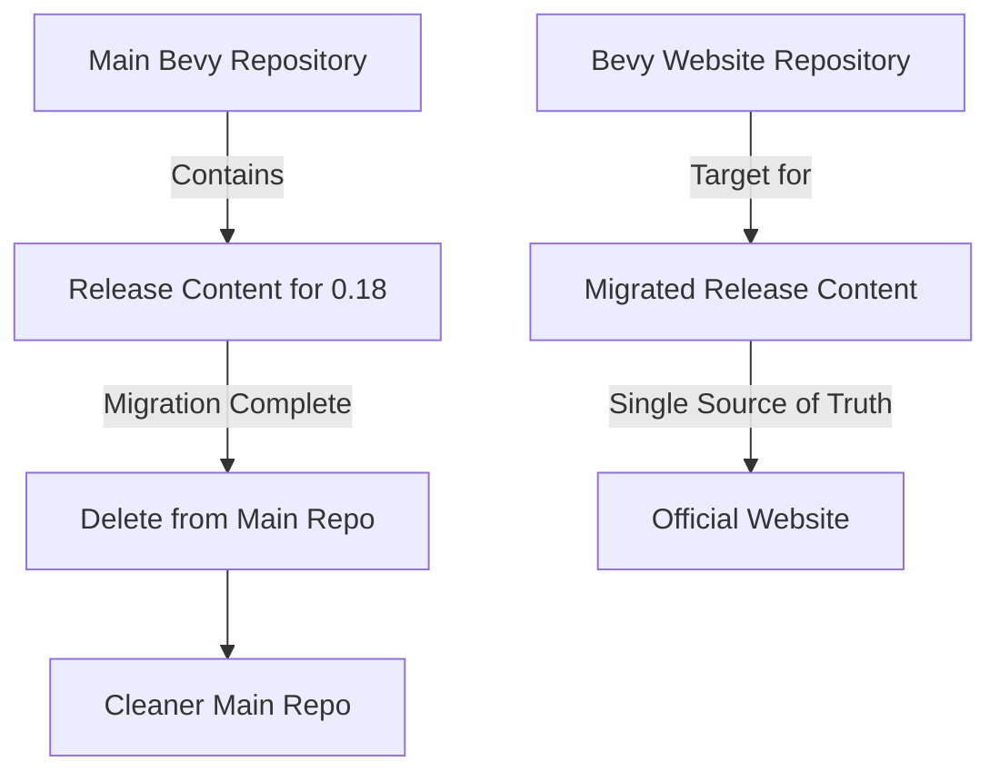

+++
title = "#22442 Remove 0.18 release content from main repo"
date = "2026-01-09T00:00:00"
draft = false
template = "pull_request_page.html"
in_search_index = true

[taxonomies]
list_display = ["show"]

[extra]
current_language = "en"
available_languages = {"en" = { name = "English", url = "/pull_request/bevy/2026-01/pr-22442-en-20260109" }, "zh-cn" = { name = "中文", url = "/pull_request/bevy/2026-01/pr-22442-zh-cn-20260109" }}
labels = ["C-Docs", "D-Trivial", "S-Blocked", "A-Meta"]
+++

# Remove 0.18 release content from main repo

## Basic Information
- **Title**: Remove 0.18 release content from main repo
- **PR Link**: https://github.com/bevyengine/bevy/pull/22442
- **Author**: alice-i-cecile
- **Status**: MERGED
- **Labels**: C-Docs, D-Trivial, S-Blocked, A-Meta
- **Created**: 2026-01-09T00:24:42Z
- **Merged**: 2026-01-09T01:28:39Z
- **Merged By**: cart

## Description Translation
# Objective

@cart is moving the release note content over to the `bevy-website` repo. We should not have two sources of truth.

Note: blocked until that work is done!

## Solution

Delete the old release notes / migration guides on the release-0.18.0 branch.

There's still ongoing work to do on the notes; tracked in https://github.com/bevyengine/bevy-website/issues/2320

## The Story of This Pull Request

This PR addresses a documentation management problem: the Bevy project was transitioning its release notes and migration guides from the main repository to a dedicated website repository. Maintaining two sources of truth for release content creates several issues: confusion about which version is authoritative, duplication of maintenance effort, and risk of inconsistencies between the two locations.

The developer, alice-i-cecile, recognized that once the migration to the `bevy-website` repository was complete, the old files in the main repository would become obsolete. The PR was initially blocked to prevent premature deletion while the migration was still in progress. This blocking ensured that no necessary documentation would be lost during the transition.

The implementation is straightforward: delete 87 files from the `release-content` directory. These files were organized into two subdirectories: `migration-guides` and `release-notes`, each containing markdown files documenting changes for Bevy 0.18. The migration guides provided technical instructions for updating code from previous versions, while the release notes highlighted new features and improvements.

This change is part of a broader documentation strategy to centralize user-facing content on the official website. By moving release content to a dedicated repository, the Bevy team can manage and present this information more effectively, using website-specific tooling and workflows separate from the codebase.

From an engineering perspective, this cleanup offers several benefits. It eliminates the risk of developers referencing outdated documentation in the main repository. It reduces repository size and clutter, making it easier for contributors to navigate the codebase. It also establishes a clear separation between code documentation (which remains in the main repo) and release documentation (which lives on the website).

The PR follows good software maintenance practices by removing obsolete files after their functionality has been migrated elsewhere. The deletion of these markdown files doesn't affect the Bevy engine's functionality since they contain only documentation. The note about ongoing work being tracked in issue #2320 on the website repository ensures accountability for any remaining documentation tasks.

## Visual Representation



## Key Files Changed

The PR deletes 87 files from the `release-content` directory. Here are five of the most significant files based on their content and line count:

1. **`release-content/migration-guides/assets_mesh_try_functions.md`** (+0/-125 lines)
   - This migration guide explained changes to `Assets<Mesh>` handling when dealing with `RenderAssetUsages::RENDER_WORLD`-only meshes. It detailed the transition from direct mesh manipulation methods to `try_*` equivalents that return `Result` types to safely handle extracted meshes.
   - The file was removed because its content has been migrated to the website repository.

2. **`release-content/release-notes/automatic_directional_navigation.md`** (+0/-111 lines)
   - This release note introduced automatic directional navigation for UI elements, which computes navigation connections based on spatial positioning rather than requiring manual configuration.
   - The file was removed as part of the migration of all release notes to the website.

3. **`release-content/release-notes/ring_primitive.md`** (+0/-110 lines)
   - This release note described the new `Ring` primitive for creating hollow 2D shapes and their 3D extrusions, including implementation details and limitations.
   - The file was removed because it is now hosted on the website.

4. **`release-content/migration-guides/gltf-coordinate-conversion.md`** (+0/-103 lines)
   - This migration guide explained changes to glTF coordinate conversion options, transitioning from `use_model_forward_direction` to the more flexible `convert_coordinates` struct with separate options for scene entities and meshes.
   - The file was removed to avoid duplication with the website content.

5. **`release-content/release-notes/generalized_atmosphere.md`** (+0/-74 lines)
   - This release note introduced the new `ScatteringMedium` asset for customizable atmospheric scattering, allowing creation of diverse atmospheric effects beyond Earth-like conditions.
   - The file was removed as part of the migration.

All changes in this PR are deletions. There are no code modifications, only removal of documentation files. The relationship to the overall purpose is that these files represent the release content that has been successfully migrated to the `bevy-website` repository.

## Further Reading

- [Bevy's official website](https://bevyengine.org/) for the latest release notes and migration guides
- [Bevy website repository](https://github.com/bevyengine/bevy-website) where release content is now maintained
- Issue [#2320](https://github.com/bevyengine/bevy-website/issues/2320) tracking ongoing work on the release notes
- [Bevy's documentation guidelines](https://github.com/bevyengine/bevy-website) for understanding the documentation structure

# Full Code Diff

The complete diff shows the deletion of 87 files. Here's a representative snippet showing the pattern for all deletions:

```diff
diff --git a/release-content/migration-guides/BorderRects_fields_are_now_vec2s.md b/release-content/migration-guides/BorderRects_fields_are_now_vec2s.md
deleted file mode 100644
index d9f6407c919c6..0000000000000
--- a/release-content/migration-guides/BorderRects_fields_are_now_vec2s.md
+++ /dev/null
@@ -1,8 +0,0 @@
----
-title: "`BorderRect` now has `Vec2` fields"
-pull_requests: [21581]
----
-
-The directional BorderRect fields (`left`, `right`, `top`, and `bottom`) have been replaced with `min_inset` and `max_inset` `Vec2` fields.
-
-Using `min_inset` and `max_inset` removes the need to interpret `top` or `bottom` relative to the coordinate system, so the same logic will work consistently in both UI and 2D.
```

The remaining 86 files follow the same deletion pattern.