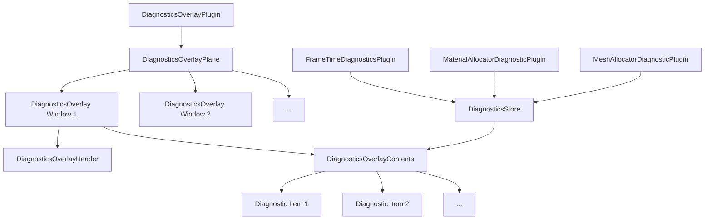

+++
title = "#22486 Adding a Visual Diagnostics Overlay to Bevy"
date = "2026-01-27T00:00:00"
draft = false
template = "pull_request_page.html"
in_search_index = true

[taxonomies]
list_display = ["show"]

[extra]
current_language = "en"
available_languages = {"en" = { name = "English", url = "/pull_request/bevy/2026-01/pr-22486-en-20260127" }, "zh-cn" = { name = "中文", url = "/pull_request/bevy/2026-01/pr-22486-zh-cn-20260127" }}
labels = ["C-Feature", "M-Release-Note", "A-Dev-Tools"]
+++

# Title: Adding a Visual Diagnostics Overlay to Bevy

## Basic Information
- **Title**: Make a little overlay to show diagnostics
- **PR Link**: https://github.com/bevyengine/bevy/pull/22486
- **Author**: hukasu
- **Status**: MERGED
- **Labels**: C-Feature, S-Ready-For-Final-Review, M-Release-Note, A-Dev-Tools
- **Created**: 2026-01-12T23:26:56Z
- **Merged**: 2026-01-27T06:44:28Z
- **Merged By**: alice-i-cecile

## Description Translation

# Objective

`LogDiagnosticsPlugin` prints the values on the `DiagnosticStore` to the console, which is spam-y, create an alternative that is visual

## Solution

Create `RenderAssetsOverlayPlugin` to create an UI that presents the data for the `MaterialAllocatorDiagnosticPlugin::<StandardMaterial>` and `MeshAllocatorDiagnosticPlugin` on a draggable and collapsable window

## Testing

Enabled it on the `many_foxes` example

## Showcase


## The Story of This Pull Request

### The Problem and Context
The Bevy engine includes a `LogDiagnosticsPlugin` that writes diagnostic information from the `DiagnosticStore` to the console. While useful for debugging, this approach has several practical issues. Console output can become cluttered and difficult to read, especially during active development or performance testing where multiple diagnostic values update frequently. The console-based approach also lacks interactive features - developers can't reorganize, hide, or selectively view different diagnostic categories while the application is running. This becomes particularly problematic when working with complex scenes like the `many_foxes` example, where developers need to monitor performance metrics in real-time without visual clutter.

### The Solution Approach
The developer implemented a visual overlay system that renders diagnostic information directly in the game window using Bevy's UI system. This approach provides several key advantages: the overlay is draggable, allowing developers to position it anywhere on screen; it's collapsible, enabling focus on the application when diagnostics aren't needed; and it presents information in a clean, organized format. The implementation builds on Bevy's existing diagnostic infrastructure, creating a new UI-based presentation layer that complements rather than replaces the existing console logging.

### The Implementation
The core of the implementation is the `DiagnosticsOverlayPlugin`, which manages the creation and updating of diagnostic overlay windows. The plugin creates a `DiagnosticsOverlayPlane` as a UI root element with a high z-index to ensure it renders above game content. Each diagnostic window is represented by a `DiagnosticsOverlay` component that specifies which diagnostics to display and how to format them.

```rust
// Key component definition
#[derive(Component)]
pub struct DiagnosticsOverlay {
    pub title: Cow<'static, str>,
    pub diagnostic_overlay_items: Vec<DiagnosticsOverlayItem>,
}
```

The system provides three ways to create diagnostic overlays: from custom diagnostic paths, using preset configurations like `fps()`, or using the `mesh_and_standard_material()` preset for render asset diagnostics. The overlay supports three types of statistical calculations: raw values, moving averages, and smoothed (EMA) values.

The UI updates are handled by a scheduled system that rebuilds the diagnostic display every second:

```rust
app.add_systems(
    Update,
    rebuild_diagnostics_list
        .run_if(on_timer(Duration::from_secs(1)))
        .in_set(DiagnosticsOverlaySystems::Rebuild),
);
```

Interaction features are implemented using Bevy's event system with several observer functions:
- `drag_by_header`: Allows dragging the overlay by its header
- `collapse_on_click_to_header`: Toggles visibility of diagnostic content
- `bring_to_front`: Brings an overlay to the front when clicked

### Technical Insights
The implementation demonstrates several advanced Bevy patterns. The use of `On<T>` observers for handling component addition and UI interactions shows how to implement reactive systems. The overlay uses Bevy's grid-based UI layout to organize diagnostic labels and values in a two-column format. The code also showcases proper parent-child relationship management using the `ChildOf` component.

A particularly interesting technical detail is how the system handles different diagnostic value types. The `DiagnosticsOverlayStatistic` enum provides flexibility in how values are displayed:

```rust
pub enum DiagnosticsOverlayStatistic {
    Value,
    Average,
    #[default]
    Smoothed,
}
```

Each overlay item can specify its own precision for floating-point values, allowing developers to control how much detail is shown. The system gracefully handles missing diagnostics by displaying "Missing" instead of crashing, which improves robustness during development when diagnostic plugins might not be fully configured.

### The Impact
This PR adds a significant quality-of-life improvement for Bevy developers. The visual overlay provides immediate, at-a-glance access to performance metrics without disrupting the game view or cluttering the console. The draggable and collapsible design respects developer workflow, allowing them to position the overlay where it's least intrusive. The preset configurations (`fps()` and `mesh_and_standard_material()`) provide useful starting points that cover common debugging scenarios.

The implementation is modular and extensible - developers can create custom overlays for any diagnostic path in the system. The use of standard Bevy UI components means the overlays integrate seamlessly with existing UI systems and can be styled using Bevy's theming capabilities. The addition of this feature reduces the friction of performance monitoring and debugging, making the development experience more productive.

## Visual Representation



## Key Files Changed

### `crates/bevy_dev_tools/src/diagnostics_overlay.rs` (+485/-0)
This is the main implementation file that didn't previously exist. It contains:
1. The `DiagnosticsOverlay` component definition
2. The `DiagnosticsOverlayPlugin` implementation
3. All systems for building, updating, and interacting with overlay windows
4. Preset configurations for common diagnostic sets

```rust
// Key code snippet: Building an overlay
pub fn mesh_and_standard_material() -> Self {
    Self {
        title: Cow::Owned("Mesh and standard materials".to_owned()),
        diagnostic_overlay_items: vec![
            DiagnosticsOverlayItem {
                path: StandardMaterialAllocator::slabs_diagnostic_path(),
                statistic: DiagnosticsOverlayStatistic::Smoothed,
                precision: 0,
            },
            // ... more diagnostic items
        ],
    }
}
```

### `release-content/release-notes/diagnostics_overlay.md` (+37/-0)
This new file documents the feature for the release notes, providing:
1. Usage examples with code snippets
2. Explanation of configurable options
3. Information about how the system works under the hood

### `crates/bevy_dev_tools/src/lib.rs` (+3/-0)
This file was updated to export the new module:

```rust
// Before:
// No diagnostics_overlay module

// After:
pub mod diagnostics_overlay;
```

The changes also include adding `extern crate alloc` to handle the `Cow` type used in the diagnostics overlay.

## Further Reading

1. **Bevy UI Documentation**: For understanding the UI components and layout system used in the overlay
2. **Bevy Diagnostics System**: To learn about the `DiagnosticStore` and how to create custom diagnostics
3. **Observer Pattern in Bevy**: For understanding the `add_observer` pattern used for event handling
4. **Grid-based UI Layout**: For details on the grid system used to organize diagnostic items
5. **Exponential Moving Average (EMA)**: The smoothing algorithm used by default for diagnostic values