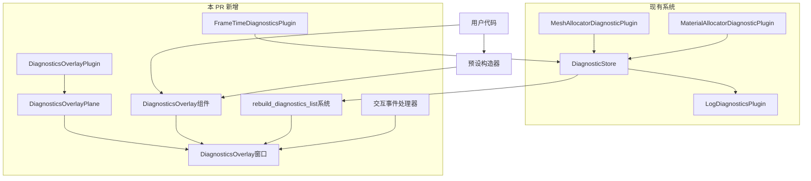

+++
title = "#22486 Make a little overlay to show diagnostics"
date = "2026-01-27T00:00:00"
draft = false
template = "pull_request_page.html"
in_search_index = false

[extra]
current_language = "zh-cn"
available_languages = {"en" = { name = "English", url = "/pull_request/bevy/2026-01/pr-22486-en-20260127" }, "zh-cn" = { name = "中文", url = "/pull_request/bevy/2026-01/pr-22486-zh-cn-20260127" }}
+++

# 分析报告：PR #22486 - 创建诊断数据可视化叠加层

## 基本信息
- **标题**: Make a little overlay to show diagnostics
- **PR链接**: https://github.com/bevyengine/bevy/pull/22486
- **作者**: hukasu
- **状态**: 已合并
- **标签**: C-Feature, S-Ready-For-Final-Review, M-Release-Note, A-Dev-Tools
- **创建时间**: 2026-01-12T23:26:56Z
- **合并时间**: 2026-01-27T06:44:28Z
- **合并者**: alice-i-cecile

## 描述翻译

### 目标
`LogDiagnosticsPlugin` 将 `DiagnosticStore` 中的值打印到控制台，这会生成大量日志信息。本 PR 创建一个可视化的替代方案。

### 解决方案
创建 `RenderAssetsOverlayPlugin`（注：实际实现为 `DiagnosticsOverlayPlugin`）来创建一个 UI，在可拖拽和可折叠的窗口中展示 `MaterialAllocatorDiagnosticPlugin::<StandardMaterial>` 和 `MeshAllocatorDiagnosticPlugin` 的数据。

### 测试
在 `many_foxes` 示例中启用了该功能。

### 展示


## 本 PR 的技术故事

### 问题与背景

在 Bevy 游戏引擎的开发过程中，诊断数据对于性能优化和调试至关重要。Bevy 原有的 `LogDiagnosticsPlugin` 将诊断数据直接输出到控制台，虽然功能完整，但存在几个问题：

1. **日志干扰**：持续输出的诊断信息会淹没控制台，使得其他重要的日志信息难以查找
2. **实时性不足**：需要手动查看控制台输出，无法实时观察数据变化
3. **交互性缺失**：无法与诊断数据进行交互，如暂停查看、调整显示方式等

开发者在调试性能问题时，特别是处理材质和网格内存分配这类复杂问题时，需要一种更直观、更少干扰的观察方式。这就是本 PR 要解决的核心问题。

### 解决方案

开发者选择了创建一个可视化的 UI 叠加层（overlay）来替代控制台输出。这个方案具有几个明显优势：

1. **视觉分离**：诊断信息与日志输出分离，互不干扰
2. **实时更新**：UI 可以实时反映诊断数据的变化
3. **交互功能**：实现了窗口拖拽、折叠、置顶等交互功能
4. **配置灵活**：支持多种数据展示方式和精度设置

技术实现上，这个方案充分利用了 Bevy 现有的 UI 系统和 ECS 架构，通过创建专门的组件和插件来管理诊断叠加层。

### 实现细节

整个实现围绕着 `DiagnosticsOverlayPlugin` 展开，这是一个完整的插件，负责管理诊断叠加层的生命周期和交互。

首先，定义了核心组件 `DiagnosticsOverlay`，作为配置诊断窗口的入口点：

```rust
#[derive(Component)]
pub struct DiagnosticsOverlay {
    /// Title that will appear on the overlay window
    pub title: Cow<'static, str>,
    /// Items that will appear on this overlay window
    pub diagnostic_overlay_items: Vec<DiagnosticsOverlayItem>,
}
```

这个设计很巧妙：通过 ECS 组件的派生，开发者可以简单地通过生成实体来创建诊断窗口。同时，提供了预设构造器，如 `fps()` 和 `mesh_and_standard_material()`，方便常见用例：

```rust
/// Create a [`DiagnosticsOverlay`] with the diagnostcs from [`FrameTimeDiagnosticsPlugin`]
pub fn fps() -> Self {
    Self {
        title: Cow::Owned("Fps".to_owned()),
        diagnostic_overlay_items: vec![
            FrameTimeDiagnosticsPlugin::FPS.into(),
            FrameTimeDiagnosticsPlugin::FRAME_TIME.into(),
            DiagnosticsOverlayItem {
                path: FrameTimeDiagnosticsPlugin::FRAME_COUNT,
                statistic: DiagnosticsOverlayStatistic::Smoothed,
                precision: 0,
            },
        ],
    }
}
```

`DiagnosticsOverlayItem` 结构体定义了如何展示单个诊断项，支持三种统计方式：
- `Value`：最新值
- `Average`：平均值
- `Smoothed`：平滑平均值（默认）

这种设计允许开发者根据需要选择不同的数据聚合方式。例如，FPS 显示可能更适合使用平滑平均值来减少波动，而内存分配计数可能更适合显示最新值。

UI 构建采用了 Bevy 的声明式 UI 系统。`build_plane` 函数创建了容纳所有诊断窗口的平面：

```rust
fn build_plane(mut commands: Commands) {
    commands.spawn((
        DiagnosticsOverlayPlane,
        Node {
            width: Val::Percent(100.),
            height: Val::Percent(100.),
            ..Default::default()
        },
        INITIAL_DIAGNOSTICS_OVERLAY_PLANE_Z_INDEX,
    ));
}
```

数据更新机制采用了定时器触发的方式，每秒更新一次：

```rust
app.add_systems(
    Update,
    rebuild_diagnostics_list
        .run_if(on_timer(Duration::from_secs(1)))
        .in_set(DiagnosticsOverlaySystems::Rebuild),
);
```

这种设计平衡了性能和数据实时性。每秒更新对于大多数诊断数据来说足够快，同时避免了每帧更新可能带来的性能开销。

交互功能的实现展示了 Bevy 事件系统的强大。通过观察者模式（observer pattern）处理拖拽、点击和置顶事件：

```rust
fn drag_by_header(
    mut event: On<Pointer<Drag>>,
    mut diagnostics_overlays: Query<&mut Node, With<DiagnosticsOverlay>>,
    diagnostics_overlay_headers: Query<&ChildOf, With<DiagnosticsOverlayHeader>>,
) {
    // 拖拽实现：通过修改节点的 top 和 left 属性
    *top += delta.y;
    *left += delta.x;
}
```

这种实现方式将交互逻辑与 UI 构建逻辑分离，符合关注点分离（separation of concerns）原则。

### 技术洞察

这个实现有几个值得注意的技术点：

1. **观察者模式的应用**：使用 `app.add_observer()` 注册事件处理器，这是一种响应式编程模式，比轮询更高效

2. **CSS Grid 布局**：在 `DiagnosticsOverlayContents` 中使用 `Display::Grid` 布局，这是现代 UI 布局技术，比传统的浮动布局更灵活

3. **Z-index 管理**：通过 `INITIAL_DIAGNOSTICS_OVERLAY_PLANE_Z_INDEX` 常量管理叠加层的渲染顺序，确保诊断窗口显示在其他 UI 之上

4. **条件系统执行**：使用 `run_if(on_timer(Duration::from_secs(1)))` 确保数据更新系统每秒只执行一次，而不是每帧执行

5. **错误处理**：代码中包含详细的 panic 消息，帮助开发者调试错误的组件配置

### 影响与改进

这个 PR 对 Bevy 开发工具体验有显著改善：

1. **调试体验提升**：开发者现在可以实时观察诊断数据，而无需在控制台日志中搜索

2. **性能优化辅助**：特别是材质和网格分配数据的可视化，为内存优化提供了直观工具

3. **代码组织改善**：通过插件化设计，这个功能可以按需启用，不影响不需要它的项目

4. **可扩展性**：`DiagnosticsOverlayItem` 的设计允许未来轻松添加新的诊断数据类型和展示方式

潜在改进方向包括：
- 支持自定义更新频率
- 添加更多预设（如网络、物理等模块的诊断）
- 支持窗口尺寸调整
- 添加数据图表可视化

## 可视化关系图



## 关键文件变更

### 1. `crates/bevy_dev_tools/src/diagnostics_overlay.rs` (+485/-0)
**新增文件**：实现了诊断叠加层的核心逻辑

这是本 PR 的核心实现文件，包含了：
- `DiagnosticsOverlay` 组件定义和预设构造器
- `DiagnosticsOverlayPlugin` 插件实现
- UI 构建、数据更新和交互处理的所有系统

关键代码示例 - 数据展示配置：
```rust
pub struct DiagnosticsOverlayItem {
    /// The statistic of the diagnostic to display
    pub statistic: DiagnosticsOverlayStatistic,
    /// The diagnostic to display
    pub path: DiagnosticPath,
    /// How many decimal places to show, default is 4
    pub precision: usize,
}
```

关键代码示例 - 数据更新：
```rust
let diagnostic = maybe_diagnostic
    .map(|diagnostic| {
        format!(
            "{}{}",
            diagnostic_overlay_item
                .statistic
                .fetch(diagnostic)
                .map(|sample| format!(
                    "{:.prec$}",
                    sample,
                    prec = diagnostic_overlay_item.precision
                ))
                .unwrap_or("No sample".to_owned()),
            diagnostic.suffix
        )
    })
    .unwrap_or("Missing".to_owned());
```

### 2. `crates/bevy_dev_tools/src/lib.rs` (+3/-0)
**修改文件**：导出新的诊断叠加层模块

添加了 `extern crate alloc;` 导入和模块声明：
```rust
extern crate alloc;

// ... 其他代码 ...

pub mod diagnostics_overlay;
```

这个修改确保新的模块可以被其他代码使用，同时添加了对 `alloc` 的显式依赖，这是 Rust no_std 环境中的常见做法。

### 3. `release-content/release-notes/diagnostics_overlay.md` (+37/-0)
**新增文件**：发布说明文档

这个文件提供了新功能的使用指南和示例代码：
```rust
commands.spawn(DiagnosticsOverlay::new("MyDiagnostics", vec![MyDiagnostics::COUNTER.into()]));
commands.spawn(DiagnosticsOverlay::fps());
commands.spawn(DiagnosticsOverlay::mesh_and_standard_materials());
```

文档清晰地说明了如何创建自定义诊断叠加层和使用预设。

## 延伸阅读

对于想深入了解本 PR 相关技术的开发者，建议阅读：

1. **Bevy UI 系统文档**：了解 Bevy 的声明式 UI 系统和组件
2. **Bevy ECS 架构**：理解实体组件系统如何管理游戏状态
3. **Rust 观察者模式**：学习 Rust 中的事件驱动编程
4. **CSS Grid 布局**：了解现代 UI 布局技术
5. **游戏引擎性能诊断**：研究游戏开发中常见的性能指标和优化技巧

本 PR 展示了如何将控制台功能转化为可视化工具，是改善开发者体验的优秀案例，也为未来 Bevy 开发者工具的开发提供了参考模式。