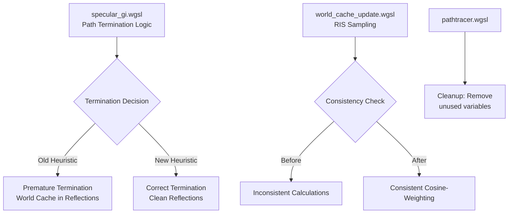

+++
title = "#22570 Solari: Better path termination heuristic"
date = "2026-01-22T00:00:00"
draft = false
template = "pull_request_page.html"
in_search_index = true

[taxonomies]
list_display = ["show"]

[extra]
current_language = "en"
available_languages = {"en" = { name = "English", url = "/pull_request/bevy/2026-01/pr-22570-en-20260122" }, "zh-cn" = { name = "中文", url = "/pull_request/bevy/2026-01/pr-22570-zh-cn-20260122" }}
labels = ["C-Bug", "A-Rendering"]
+++

# Solari: Better path termination heuristic

## Basic Information
- **Title**: Solari: Better path termination heuristic
- **PR Link**: https://github.com/bevyengine/bevy/pull/22570
- **Author**: JMS55
- **Status**: MERGED
- **Labels**: C-Bug, A-Rendering, S-Ready-For-Final-Review
- **Created**: 2026-01-17T18:22:38Z
- **Merged**: 2026-01-22T18:07:20Z
- **Merged By**: alice-i-cecile

## Description Translation
I was using a path termination heuristic designed for a radiance cache, but solari uses an irradiance cache. Whoops.

This new heuristic is inspired by RTXGI, and prevents the world cache from showing up in reflections properly.

To test, move the camera close to a mirror surface.

---

Also contains some bugfixes for bugs introduced in #22468.

## The Story of This Pull Request

The PR addresses a fundamental mismatch in Bevy's Solari global illumination system. The developer discovered that the path termination heuristic being used was originally designed for a radiance cache, but Solari implements an irradiance cache. This mismatch caused visible artifacts where the world cache would incorrectly appear in reflections, particularly noticeable when viewing mirror surfaces up close.

The core issue centered around how the system decides when to terminate a ray path in the world cache versus continuing to trace it. The original approach used a heuristic from research on radiance caches, which wasn't appropriate for the irradiance cache implementation in Solari. This led to premature termination of rays, causing the world cache data to show up where it shouldn't, breaking the visual correctness of reflections.

The solution implements a new termination heuristic inspired by NVIDIA's RTXGI (Real-Time Global Illumination) system. The key insight is to base termination decisions on both the length of the ray and the accumulated spread of the path. The new approach uses two conditions that must both be true before terminating in the world cache:
1. The ray must be longer than the diagonal of a world cache cell
2. The path spread must be larger than the square of the world cache cell size

This dual-condition approach ensures that rays terminate in the world cache only when they've traveled far enough and become diffuse enough, preventing the world cache from appearing in sharp reflections.

The implementation required several coordinated changes across the codebase. In `specular_gi.wgsl`, the developer replaced the old termination logic with the new RTXGI-inspired heuristic. A new `path_spread_heuristic` function was added to calculate how much a ray spreads based on its length and the roughness of the surface it hits. This function uses the formula `distance² × 0.5 × (α² / (1 - α²))` where α is the roughness, which models how quickly a ray diverges based on surface roughness.

During implementation, the developer also fixed a bug introduced in a previous PR (#22468) related to how light contributions were calculated in the world cache update system. The bug was in the RIS (Resampled Importance Sampling) implementation where the target function and selected sample weren't using consistent calculations - one used radiance multiplied by cosine, while the other used just radiance. This was corrected to ensure both calculations use the same cosine-weighted contribution.

Additionally, some cleanup was performed in `pathtracer.wgsl` where an unused `previous_normal` variable was removed, and an unused import was removed from `specular_gi.wgsl`.

The changes demonstrate an important principle in graphics programming: choosing the right algorithm for the specific data structure being used. While both radiance and irradiance caches serve similar high-level purposes, their different internal representations require different termination heuristics. The fix also shows the value of borrowing proven techniques from established industry solutions like RTXGI when appropriate.

From a performance perspective, the new heuristic is slightly more computationally expensive per bounce due to the additional calculations for path spread, but this is offset by more accurate termination decisions that prevent unnecessary ray tracing. The visual improvement is significant - mirror surfaces now show correct reflections without contamination from the world cache data.

## Visual Representation



## Key Files Changed

### `crates/bevy_solari/src/realtime/specular_gi.wgsl` (+21/-18)
This file contains the main changes to the path termination heuristic and related calculations.

**Key Changes:**
1. Replaced the old path termination heuristic with a new RTXGI-inspired one
2. Added `path_spread_heuristic` function to calculate ray spread based on distance and roughness
3. Removed unused import and old termination threshold constant

**Before:**
```wgsl
const TERMINATE_IN_WORLD_CACHE_THRESHOLD: f32 = 0.03;

// Old heuristic calculation
let cos_theta = saturate(dot(wo, surface.world_normal));
var a0 = dot(wo_unnormalized, wo_unnormalized) / (4.0 * PI * cos_theta);
a0 *= TERMINATE_IN_WORLD_CACHE_THRESHOLD;

radiance = trace_glossy_path(global_id.xy, surface, wi, pdf, a0, &rng) / pdf;

// In trace_glossy_path:
path_spread += sqrt((ray.t * ray.t) / (p_bounce * wo_tangent.z));

if path_spread * path_spread > a0 * get_cell_size(ray_hit.world_position, view.world_position) {
    // Terminate in world cache
}
```

**After:**
```wgsl
// New termination conditions
let world_cache_cell_size = get_cell_size(ray_hit.world_position, view.world_position);
let ray_longer_than_cell = ray.t > sqrt(3.0) * world_cache_cell_size;
let path_spread_large_enough = path_spread > world_cache_cell_size * world_cache_cell_size;

if ray_longer_than_cell && path_spread_large_enough {
    // Terminate in world cache
}

// New path spread heuristic function
fn path_spread_heuristic(ray_t: f32, roughness: f32) -> f32 {
    let alpha_squared = min(roughness * roughness, 0.99);
    let distance_squared = ray_t * ray_t;
    return distance_squared * 0.5 * (alpha_squared / (1.0 - alpha_squared));
}
```

### `crates/bevy_solari/src/realtime/world_cache_update.wgsl` (+3/-2)
This file fixes a bug in the RIS (Resampled Importance Sampling) implementation.

**Key Changes:**
Fixed inconsistent calculations between target function evaluation and sample selection in RIS.

**Before:**
```wgsl
let target_function = luminance(light_contribution.radiance * saturate(dot(light_contribution.wi, world_normal)));
// ...
selected_sample_radiance = light_contribution.radiance;
```

**After:**
```wgsl
let contribution = light_contribution.radiance * saturate(dot(light_contribution.wi, world_normal));
let target_function = luminance(contribution);
// ...
selected_sample_radiance = contribution;
```

### `crates/bevy_solari/src/pathtracer/pathtracer.wgsl` (+0/-2)
This file contains minor cleanup by removing an unused variable.

**Key Changes:**
Removed the unused `previous_normal` variable that was declared but never used in the path tracing loop.

**Before:**
```wgsl
var previous_normal = vec3(0.0);
// ...
previous_normal = ray_hit.world_normal;
```

**After:**
```wgsl
// Variable removed entirely
```

## Further Reading

1. **RTXGI Documentation**: NVIDIA's documentation on Real-Time Global Illumination provides context for the termination heuristic used in this PR
2. **"Real-Time Path Tracing and Denoising in Tom Clancy's The Division 2"**: The paper referenced in the comments (mueller21realtime.pdf) discusses advanced path termination techniques
3. **Bevy's Solari Documentation**: For understanding how the irradiance cache system works within Bevy's rendering architecture
4. **WGSL Shader Language Specification**: Useful for understanding the WebGPU Shading Language changes made in this PR
5. **Global Illumination Compendium**: A comprehensive reference for various GI techniques including irradiance caching