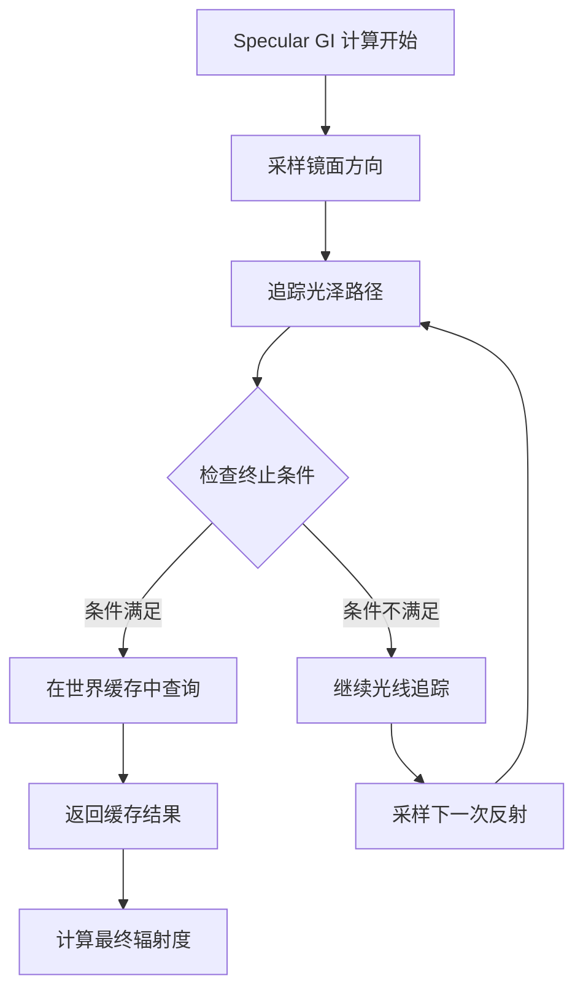

+++
title = "#22570 Solari: Better path termination heuristic"
date = "2026-01-22T00:00:00"
draft = false
template = "pull_request_page.html"
in_search_index = false

[extra]
current_language = "zh-cn"
available_languages = {"en" = { name = "English", url = "/pull_request/bevy/2026-01/pr-22570-en-20260122" }, "zh-cn" = { name = "中文", url = "/pull_request/bevy/2026-01/pr-22570-zh-cn-20260122" }}
labels = ["C-Bug", "A-Rendering"]
+++

# Title

## Basic Information
- **Title**: Solari: Better path termination heuristic
- **PR Link**: https://github.com/bevyengine/bevy/pull/22570
- **Author**: JMS55
- **Status**: MERGED
- **Labels**: C-Bug, A-Rendering, S-Ready-For-Final-Review
- **Created**: 2026-01-17T18:22:38Z
- **Merged**: 2026-01-22T18:07:20Z
- **Merged By**: alice-i-cecile

## Description Translation
我原先使用的是为辐射缓存（radiance cache）设计的路径终止启发式方法，但 solari 使用的是辐照度缓存（irradiance cache）。这是一个错误。

这个新的启发式方法受到 RTXGI 的启发，可以防止世界缓存（world cache）在反射中不恰当地显示出来。

要进行测试，可以将相机靠近镜面表面。

---

同时包含了对 #22468 中引入的一些错误的修复。

## The Story of This Pull Request

### 问题与上下文

这次 PR 的核心问题是修复 Specular GI（镜面全局光照）中的路径终止（path termination）启发式方法。在实时光线追踪的全局光照系统中，需要决定何时停止光线追踪并在世界缓存（world cache）中查找光照值，而不是继续追踪光线。之前的实现使用了一个为辐射缓存设计的启发式方法，但 Solari 实际上使用的是辐照度缓存，这导致了不正确的结果。

具体表现是，当相机靠近镜面表面时，世界缓存的内容会在反射中不恰当地显示出来。这是因为之前的终止条件过于激进，导致路径过早地在世界缓存中终止，而没有充分追踪镜面反射的细节。

### 解决方案方法

开发者 JMS55 采用了从 RTXGI 中获得的灵感，实现了一个更合适的启发式方法。新的方法基于两个条件来判断是否应该在世界缓存中终止路径：

1. 射线长度是否超过世界缓存单元尺寸的阈值（`ray_longer_than_cell`）
2. 路径扩散（path spread）是否足够大（`path_spread_large_enough`）

这个双条件检查确保了只有当光线已经传播了足够远的距离，并且路径已经扩散到足够宽时，才使用世界缓存的近似值，从而避免了在需要精确镜面反射的地方过早使用缓存。

### 实现细节

主要的修改集中在 `specular_gi.wgsl` 文件中。之前的实现使用了一个基于 Müller 等人论文的复杂公式来计算 `a0`，然后通过比较 `path_spread * path_spread > a0 * cell_size` 来决定是否终止。新的实现则更为直观：

```wgsl
// 新条件：射线长于单元格且路径扩散足够大
let world_cache_cell_size = get_cell_size(ray_hit.world_position, view.world_position);
let ray_longer_than_cell = ray.t > sqrt(3.0) * world_cache_cell_size;
let path_spread_large_enough = path_spread > world_cache_cell_size * world_cache_cell_size;

if ray_longer_than_cell && path_spread_large_enough {
    // 在世界缓存中终止路径
    break;
}
```

新的 `path_spread_heuristic` 函数根据射线长度和表面粗糙度来计算路径扩散：
```wgsl
fn path_spread_heuristic(ray_t: f32, roughness: f32) -> f32 {
    let alpha_squared = min(roughness * roughness, 0.99);
    let distance_squared = ray_t * ray_t;
    return distance_squared * 0.5 * (alpha_squared / (1.0 - alpha_squared));
}
```

这个公式基于这样的理解：粗糙的表面会导致光线散射更广，路径扩散更大；而光滑的表面则保持路径更集中。

### 技术洞察

1. **缓存类型匹配的重要性**：这个 PR 强调了为正确的缓存类型（辐照度缓存 vs 辐射缓存）设计适当启发式方法的重要性。不同的缓存类型有不同的假设和使用场景。

2. **路径终止的权衡**：路径终止是实时光线追踪中的关键优化，但需要平衡性能和质量。过早终止会导致artifact（如本PR修复的问题），而过晚终止则会影响性能。

3. **数值稳定性**：在 `path_spread_heuristic` 中，通过 `min(roughness * roughness, 0.99)` 来限制 `alpha_squared` 的值，避免了除以零的问题，确保了数值稳定性。

### 影响

这个修复直接解决了镜面反射中显示不正确世界缓存内容的问题。通过更准确的路径终止条件，镜面反射现在能够更正确地显示细节，特别是在靠近镜面表面时。同时，这个修改保持了实时光线追踪的性能特征，因为新的启发式方法仍然能够在适当的时候终止路径，避免不必要的计算。

此外，PR 中还包含了对之前 PR（#22468）引入的一些错误的修复，包括修正了 `world_cache_update.wgsl` 中的 RIS（Resampled Importance Sampling）权重计算，确保光照贡献正确地考虑了法线点积。

## Visual Representation



## Key Files Changed

### `crates/bevy_solari/src/realtime/specular_gi.wgsl` (+21/-18)
这是最主要的修改文件，包含了路径终止启发式方法的重写。

**关键修改：**
1. 移除了旧的终止阈值常量 `TERMINATE_IN_WORLD_CACHE_THRESHOLD` 和相关的 `a0` 计算
2. 引入了新的 `path_spread_heuristic` 函数
3. 修改了 `trace_glossy_path` 函数的参数和终止逻辑
4. 修正了吞吐量（throughput）更新中的 BRDF 计算

```wgsl
// Before: 旧的终止条件
let cos_theta = saturate(dot(wo, surface.world_normal));
var a0 = dot(wo_unnormalized, wo_unnormalized) / (4.0 * PI * cos_theta);
a0 *= TERMINATE_IN_WORLD_CACHE_THRESHOLD;

// After: 新的终止条件
let world_cache_cell_size = get_cell_size(ray_hit.world_position, view.world_position);
let ray_longer_than_cell = ray.t > sqrt(3.0) * world_cache_cell_size;
let path_spread_large_enough = path_spread > world_cache_cell_size * world_cache_cell_size;

if ray_longer_than_cell && path_spread_large_enough {
    // 在世界缓存中终止路径
    break;
}
```

### `crates/bevy_solari/src/realtime/world_cache_update.wgsl` (+3/-2)
修复了 RIS 采样中的光照贡献计算。

```wgsl
// Before:
let target_function = luminance(light_contribution.radiance * saturate(dot(light_contribution.wi, world_normal)));
// ...
selected_sample_radiance = light_contribution.radiance;

// After:
let contribution = light_contribution.radiance * saturate(dot(light_contribution.wi, world_normal));
let target_function = luminance(contribution);
// ...
selected_sample_radiance = contribution;
```

这个修复确保了对法线点积的考虑在整个计算过程中保持一致。

### `crates/bevy_solari/src/pathtracer/pathtracer.wgsl` (+0/-2)
移除了未使用的 `previous_normal` 变量，这是代码清理的一部分。

## Further Reading

1. [RTXGI: Real-Time Global Illumination](https://developer.nvidia.com/rtxgi) - NVIDIA 的实时全局光照解决方案，启发了本次的路径终止启发式方法
2. [Resampled Importance Sampling (RIS)](https://arxiv.org/abs/1906.04645) - 理解 `world_cache_update.wgsl` 中使用的采样技术
3. [Müller et al. "Real-Time Path Tracing and Denoising in Quake II"](https://diglib.eg.org/handle/10.2312/sr20211059) - 之前启发式方法的来源论文