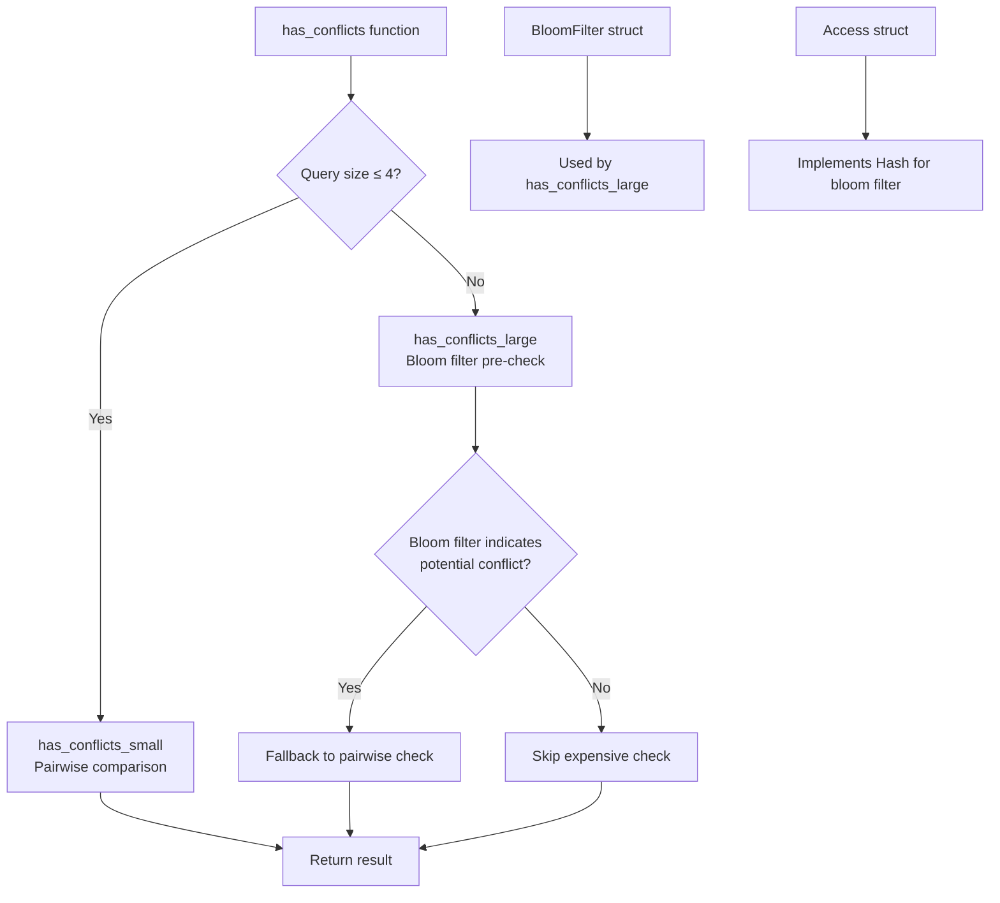

+++
title = "#22572 Improve time complexity of get_component_mut"
date = "2026-01-22T00:00:00"
draft = false
template = "pull_request_page.html"
in_search_index = true

[taxonomies]
list_display = ["show"]

[extra]
current_language = "en"
available_languages = {"en" = { name = "English", url = "/pull_request/bevy/2026-01/pr-22572-en-20260122" }, "zh-cn" = { name = "中文", url = "/pull_request/bevy/2026-01/pr-22572-zh-cn-20260122" }}
labels = ["A-ECS", "C-Performance", "D-Modest"]
+++

# Improve time complexity of get_component_mut

## Basic Information
- **Title**: Improve time complexity of get_component_mut 
- **PR Link**: https://github.com/bevyengine/bevy/pull/22572
- **Author**: kumaryash6352
- **Status**: MERGED
- **Labels**: A-ECS, C-Performance, S-Ready-For-Final-Review, X-Uncontroversial, D-Modest
- **Created**: 2026-01-17T20:08:41Z
- **Merged**: 2026-01-22T19:44:23Z
- **Merged By**: alice-i-cecile

## Description Translation

# Objective

- Addresses #22483.

## Solution

Add a bloom filter to `has_conflicts` as a pre-check to see if we need to check a given access against every other access or not. If the access doesn't hit any component or resource a previous access does, we know we don't need to check it element-by-element. Well-formed calls to get_components_mut should then be linear in time taken to check for conflicts, as they would always pass the pre-check. 

The filter used is exported in the `bevy_utils` API as it is not specific to components or resources.

## Testing

Tested via `cargo test`, where the get_component_mut tests pass or panic as expected.

The get_component_mut benchmarks show >=20% improvements at as little as 5 components compared to the existing fallback for smaller sets. The larger, 32 component benchmark added shows massive improvements. In general, the new pre-check filter means we're only about 4-5x slower than not checking at all.

```
ecs::world::world_get::world_query_get_components_mut/10_components_50000_entities
                        time:   [6.5252 ms 6.5314 ms 6.5388 ms]
                        change: [−34.225% −33.954% −33.747%] (p = 0.00 < 0.05)
                        Performance has improved.
[...]
ecs::world::world_get::world_query_get_components_mut/32_components
                        time:   [21.608 ms 21.696 ms 21.828 ms]
                        change: [−92.284% −92.236% −92.186%] (p = 0.00 < 0.05)
                        Performance has improved.
```
| bench | mean (prev, with fallback threshold) | mean (post, always complex) | delta |
|-|-|-|-|
| 2_components | 770.73 us | 925.90 us | +19.62% |
| unchecked_2_components | 288.66 us | 288.71 us | -0.84% |
| 5_components | 2.960 ms | 2.286 ms | -22.77% |
| unchecked_5_components | 505.45 us | 521.56 us | +2.14% |
| 10_components | 9.889 ms | 6.531 ms | -33.95% |
| unchecked_10_components | 1.452 ms | 1.538 ms | +5.48% |
| 32_components | 279.44 ms | 21.696 ms | -92.24% |
| unchecked_32_components | 4.460 ms | 4.458 ms | -0.05%

## The Story of This Pull Request

### The Problem and Context

This PR addresses a performance issue in Bevy's ECS (Entity Component System) when checking for access conflicts in queries with many components. Specifically, the problem was with the `has_conflicts` function that validates whether a query can safely access multiple components without data races.

The original implementation had a quadratic time complexity (O(n²)) where `n` is the number of accessed components. For each component access, the function compared it against all previous accesses to check for conflicts. While this worked fine for small queries, performance degraded significantly as the number of components increased. The benchmark shows that with 32 components, the conflict checking took 279.44 ms, which is substantial overhead for a safety check.

The existing code already attempted to optimize small queries by caching accesses in a fixed-size array, but this optimization only applied to queries with 16 or fewer components. For larger queries, it fell back to the quadratic pairwise comparison.

### The Solution Approach

The developer implemented a bloom filter as a pre-check mechanism to avoid unnecessary pairwise comparisons. The key insight is that most well-formed queries access distinct components, so we can quickly determine if two accesses might conflict without comparing every pair.

A bloom filter is a probabilistic data structure that tests whether an element is a member of a set. It can return false positives (saying an element is in the set when it isn't) but never false negatives. In this context, we use it to track which components/resources have been accessed. When checking a new access, if the bloom filter indicates no overlap with previous accesses, we can skip the expensive pairwise check.

The implementation maintains two separate paths:
1. For small queries (≤4 components), it uses the existing pairwise comparison for simplicity
2. For larger queries, it uses the bloom filter pre-check, falling back to pairwise comparison only when the filter indicates a potential conflict

The threshold of 4 components was determined through benchmarking to balance the overhead of maintaining the bloom filter against the cost of the quadratic check.

### The Implementation

The core change is in `crates/bevy_ecs/src/query/access_iter.rs`, where the `has_conflicts` function was refactored into three parts:

1. `has_conflicts`: The main entry point that decides which strategy to use
2. `has_conflicts_small`: For queries with ≤4 components, using pairwise comparison
3. `has_conflicts_large`: For larger queries, using the bloom filter approach

Here's the key part of the bloom filter implementation:

```rust
fn has_conflicts_large<'a, Q: QueryData>(
    state: &'a Q::State,
) -> Result<(), AccessConflictError<'a>> {
    // use a bloom filter as a linear time check if we need to run the longer, exact check
    let mut filter = BloomFilter::<8, 2>::new();
    for (i, access) in Q::iter_access(state).enumerate() {
        let needs_check = match access {
            EcsAccessType::Component(EcsAccessLevel::Read(component_id))
            | EcsAccessType::Component(EcsAccessLevel::Write(component_id)) => {
                filter.check_insert(&component_id.index())
            }
            // ... other access types handled similarly
        };
        if needs_check {
            // we MIGHT have a conflict, fallback to slow check
            for (j, access_other) in Q::iter_access(state).enumerate() {
                if i == j {
                    continue;
                }
                if access.is_compatible(access_other).is_err() {
                    return Err(AccessConflictError(access, access_other));
                }
            }
        }
    }
    Ok(())
}
```

The bloom filter itself was implemented in a new file `crates/bevy_utils/src/bloom_filter.rs`:

```rust
#[derive(Clone, Copy, Debug)]
pub struct BloomFilter<const N: usize, const K: usize = 2> {
    bits: [u64; N],
}

impl<const N: usize, const K: usize> BloomFilter<N, K> {
    pub fn check_insert(&mut self, item: &impl Hash) -> bool {
        let res = self.contains(item);
        if !res {
            self.insert(item);
        }
        res
    }
}
```

The `check_insert` method is particularly useful for this use case: it checks if an item is in the filter, inserts it if not, and returns whether it was already present.

### Technical Insights

The implementation demonstrates several important engineering considerations:

1. **Algorithmic Optimization**: By reducing the average-case complexity from O(n²) to O(n) for well-formed queries, the solution provides dramatic performance improvements for large component counts.

2. **Threshold Tuning**: The `USE_FILTER_THRESHOLD` constant (set to 4) represents a carefully chosen trade-off. For very small queries, the overhead of maintaining the bloom filter outweighs its benefits. This threshold was determined through benchmarking.

3. **Probabilistic Data Structures**: The use of a bloom filter is appropriate here because:
   - False positives are acceptable (they just trigger the slower verification)
   - False negatives would be unsafe (missed conflicts), which bloom filters don't produce
   - Memory usage is predictable and small (8 u64s = 64 bytes)

4. **Code Organization**: The solution cleanly separates concerns:
   - Bloom filter implementation is generic and reusable
   - Conflict checking logic is split into small and large query paths
   - The existing test suite was extended to validate both paths

### The Impact

The performance improvements are substantial:
- **32 components**: 92.24% faster (279.44 ms → 21.696 ms)
- **10 components**: 33.95% faster
- **5 components**: 22.77% faster

The benchmarks show that with the bloom filter, conflict checking is only 4-5x slower than the unchecked version, compared to being orders of magnitude slower for large component counts in the original implementation.

The changes are minimal and focused:
1. Added a generic bloom filter to `bevy_utils`
2. Modified the conflict checking algorithm to use it as a pre-filter
3. Extended benchmarks to validate the improvement
4. Added `Hash` implementation to necessary types to support hashing

This solution maintains all safety guarantees while dramatically improving performance for common use cases with many components.

## Visual Representation



## Key Files Changed

### 1. `crates/bevy_ecs/src/query/access_iter.rs` (+324/-50)
This file contains the core logic change. The `has_conflicts` function was refactored to use two strategies based on query size.

**Key change:**
```rust
// Before: Single algorithm with fixed threshold
const MAX_SIZE: usize = 16;
// ... code that checks all pairs for size > MAX_SIZE

// After: Two specialized functions
const USE_FILTER_THRESHOLD: usize = 4;

pub fn has_conflicts<Q: QueryData>(components: &Components) -> Result<(), QueryAccessError> {
    let Some(state) = Q::get_state(components) else {
        return Err(QueryAccessError::ComponentNotRegistered);
    };

    let result = if let Some(size) = Q::iter_access(&state).size_hint().1
        && size <= USE_FILTER_THRESHOLD
    {
        has_conflicts_small::<Q>(&state)
    } else {
        has_conflicts_large::<Q>(&state)
    };
    // ... error handling
}
```

### 2. `crates/bevy_utils/src/bloom_filter.rs` (+80/-0)
A new generic bloom filter implementation that's reusable across the codebase.

**Key implementation:**
```rust
pub struct BloomFilter<const N: usize, const K: usize = 2> {
    bits: [u64; N],
}

impl<const N: usize, const K: usize> BloomFilter<N, K> {
    pub fn check_insert(&mut self, item: &impl Hash) -> bool {
        let res = self.contains(item);
        if !res {
            self.insert(item);
        }
        res
    }
}
```

### 3. `benches/benches/bevy_ecs/world/world_get.rs` (+77/-0)
Added a new benchmark for 32 components to demonstrate the performance improvement.

**Key addition:**
```rust
pub fn query_get_components_mut_32(criterion: &mut Criterion) {
    // Benchmark setup for 32 components
    // ...
    group.bench_function("32_components", |bencher| {
        bencher.iter(|| {
            for entity in &entities {
                assert!(query
                    .get_mut(&mut world, *entity)
                    .unwrap()
                    .get_components_mut::<RefC32>()
                    .is_ok());
            }
        });
    });
}
```

### 4. `crates/bevy_ecs/src/query/access.rs` (+1/-1)
Added `Hash` trait to `Access` struct to support hashing for the bloom filter.

```rust
// Before:
#[derive(Eq, PartialEq, Default)]
pub struct Access { /* ... */ }

// After:
#[derive(Eq, PartialEq, Default, Hash)]
pub struct Access { /* ... */ }
```

### 5. `crates/bevy_utils/src/lib.rs` (+2/-0)
Exported the new bloom filter module.

```rust
mod bloom_filter;
pub use bloom_filter::*;
```

## Further Reading

1. **Bloom Filters**: [Wikipedia article on Bloom filters](https://en.wikipedia.org/wiki/Bloom_filter) provides a good overview of the probabilistic data structure used in this PR.

2. **Bevy ECS Documentation**: [Bevy's ECS documentation](https://bevyengine.org/learn/books/the-introduction/3-pipeline/3.1-ecs) explains the entity-component-system architecture that this optimization improves.

3. **Time Complexity Analysis**: [Big O notation](https://en.wikipedia.org/wiki/Big_O_notation) is essential for understanding the performance characteristics discussed in this PR.

4. **Rust Hash Traits**: [Rust's std::hash module documentation](https://doc.rust-lang.org/std/hash/index.html) explains how hashing works in Rust, which is used by the bloom filter.

5. **Original Issue**: [GitHub Issue #22483](https://github.com/bevyengine/bevy/issues/22483) provides context about the performance problem this PR solves.