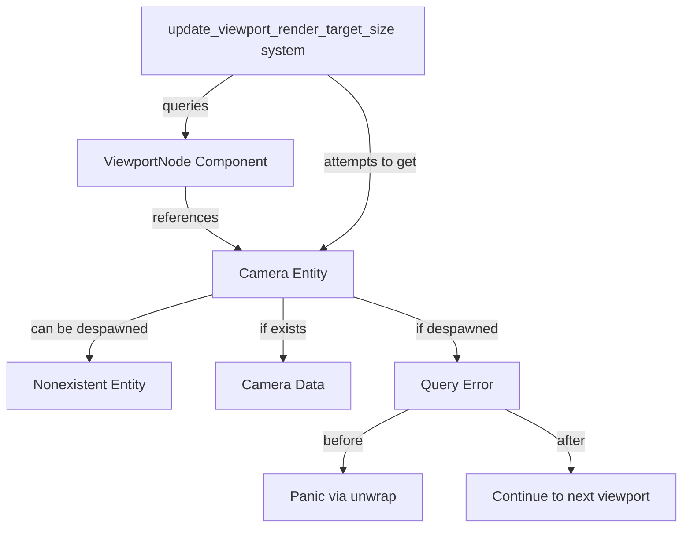

+++
title = "#22575 Fix panic in update_viewport_render_target_size when despawning"
date = "2026-01-22T00:00:00"
draft = false
template = "pull_request_page.html"
in_search_index = true

[taxonomies]
list_display = ["show"]

[extra]
current_language = "en"
available_languages = {"en" = { name = "English", url = "/pull_request/bevy/2026-01/pr-22575-en-20260122" }, "zh-cn" = { name = "中文", url = "/pull_request/bevy/2026-01/pr-22575-zh-cn-20260122" }}
labels = ["C-Bug", "A-UI", "D-Straightforward", "A-Camera"]
+++

# Title: Fix panic in update_viewport_render_target_size when despawning

## Basic Information
- **Title**: Fix panic in update_viewport_render_target_size when despawning
- **PR Link**: https://github.com/bevyengine/bevy/pull/22575
- **Author**: mgi388
- **Status**: MERGED
- **Labels**: C-Bug, A-UI, S-Ready-For-Final-Review, D-Straightforward, A-Camera
- **Created**: 2026-01-18T01:00:42Z
- **Merged**: 2026-01-22T18:15:04Z
- **Merged By**: alice-i-cecile

## Description Translation

# Objective

- Fix a panic when you despawn a camera linked to a `ViewportNode`.
- [In Discord](https://discord.com/channels/691052431525675048/866787577687310356/1461961801250898013) I was asking about why adding `Msaa::Off` to my camera causes a gray screen and it turns out it's related to my inspector egui camera. While trying to work out the cause, I was going through the egui inspector and despawning camera to see if it helped. While despawning one of my cameras which is referenced in a `ViewportNode`, I got this panic due to `unwrap()` being used.

## Solution

- Don't `unwrap` but just ignore the camera if it no longer exists. This can easily happen if the camera entity is despawned, e.g., using `DespawnOnExit` state, or manually despawned in an editor/inspector.
- This means that the `ViewportNode` is left with a dangling/invalid reference. I'm not sure how to solve that though?
- Also update the doc to mention what happens.
- Note: There's another unwrap in the system but I don't want to change it in this PR. I didn't experience that panic so I'd rather leave it out of this PR (it may be a useful panic so should be considered separately).

## Testing

- Tested in my Bevy 0.17 fork that it no longer panics.

## The Story of This Pull Request

The developer was investigating a rendering issue where adding `Msaa::Off` to a camera resulted in a gray screen. During debugging in the egui inspector, they attempted to despawn cameras to isolate the problem. When despawning a camera referenced by a `ViewportNode`, the application panicked due to an `unwrap()` call in the `update_viewport_render_target_size` system.

The issue stems from the Entity Component System's lifecycle management. In Bevy, when an entity is despawned (either manually or through systems like `DespawnOnExit`), its components are removed from the world. However, other entities might still hold references to that despawned entity. In this case, `ViewportNode` stores an `Entity` ID pointing to a camera, but when that camera entity is despawned, the reference becomes invalid.

The system `update_viewport_render_target_size` was using `camera_query.get(viewport.camera).unwrap()` to retrieve camera data. When the camera entity no longer exists, the query returns an error, and the `unwrap()` causes a panic. This is a classic scenario where assumptions about entity existence don't hold in dynamic ECS environments.

The fix is straightforward but important: replace the `unwrap()` with proper error handling using a `let Ok` pattern that continues to the next iteration if the camera no longer exists. This prevents the panic while acknowledging that the viewport node now has a dangling reference. The developer also updated the documentation for `ViewportNode::camera` to clarify this behavior.

One notable design decision was leaving another `unwrap()` in the same system unchanged. The developer reasoned that this particular `unwrap()` might serve as a useful panic for other error conditions and should be evaluated separately. This shows good judgment in scope management - fixing the immediate problem without introducing unnecessary changes.

The solution works but leaves the underlying architectural issue unresolved: `ViewportNode` components can become orphaned with invalid camera references. A more complete solution might involve:
- Automatically removing `ViewportNode` when its camera is despawned
- Using `Option<Entity>` to represent potentially missing cameras
- Adding a cleanup system to remove orphaned viewport nodes

However, those would be more significant changes requiring careful consideration of edge cases and API design. The current fix provides immediate stability while leaving room for future improvements.

## Visual Representation



## Key Files Changed

### `crates/bevy_ui/src/widget/viewport.rs` (+8/-2)

This file contains the `ViewportNode` component and the system that updates viewport render target sizes. The changes fix a panic when despawning cameras referenced by viewport nodes.

1. **Documentation update for `ViewportNode::camera` field**:
   - Added clarification about what happens when the camera entity is despawned
   - Warns that despawning leaves the viewport node with an invalid camera reference

   ```rust
   /// Before:
   /// Note that removing the [`ViewportNode`] component will not despawn this entity.
   
   /// After:
   /// Note: Removing the [`ViewportNode`] component will not despawn this
   /// entity.
   ///
   /// Note: Despawning the camera entity will leave a viewport node with an
   /// invalid camera.
   ```

2. **Error handling in `update_viewport_render_target_size` system**:
   - Replaced `unwrap()` with `let Ok` pattern to gracefully handle missing cameras
   - When camera lookup fails, the system continues to the next viewport instead of panicking

   ```rust
   /// Before:
   let render_target = camera_query.get(viewport.camera).unwrap();
   
   /// After:
   let Ok(render_target) = camera_query.get(viewport.camera) else {
       continue;
   };
   ```

The changes prevent crashes when camera entities are despawned while viewport nodes still reference them, improving the robustness of UI rendering systems that use viewports.

## Further Reading

- [Bevy ECS: Query System](https://bevyengine.org/learn/book/getting-started/ecs/) - Understanding how queries work in Bevy's Entity Component System
- [Bevy UI: Viewports](https://github.com/bevyengine/bevy/blob/main/crates/bevy_ui/src/widget/viewport.rs) - Source code for viewport implementation
- [Rust Error Handling: Result and Option](https://doc.rust-lang.org/book/ch09-00-error-handling.html) - Best practices for error handling in Rust
- [Bevy Discord Discussion](https://discord.com/channels/691052431525675048/866787577687310356/1461961801250898013) - Original conversation that led to discovering this bug

## Full Code Diff
```diff
diff --git a/crates/bevy_ui/src/widget/viewport.rs b/crates/bevy_ui/src/widget/viewport.rs
index 7b59d1dc1ba21..ac13c4ac69a51 100644
--- a/crates/bevy_ui/src/widget/viewport.rs
+++ b/crates/bevy_ui/src/widget/viewport.rs
@@ -42,7 +42,11 @@ use bevy_reflect::Reflect;
 pub struct ViewportNode {
     /// The entity representing the [`Camera`] associated with this viewport.
     ///
-    /// Note that removing the [`ViewportNode`] component will not despawn this entity.
+    /// Note: Removing the [`ViewportNode`] component will not despawn this
+    /// entity.
+    ///
+    /// Note: Despawning the camera entity will leave a viewport node with an
+    /// invalid camera.
     pub camera: Entity,
 }
 
@@ -161,7 +165,9 @@ pub fn update_viewport_render_target_size(
     mut images: ResMut<Assets<Image>>,
 ) {
     for (viewport, computed_node) in &viewport_query {
-        let render_target = camera_query.get(viewport.camera).unwrap();
+        let Ok(render_target) = camera_query.get(viewport.camera) else {
+            continue;
+        };
         let size = computed_node.size();
 
         let Some(image_handle) = render_target.as_image() else {
```