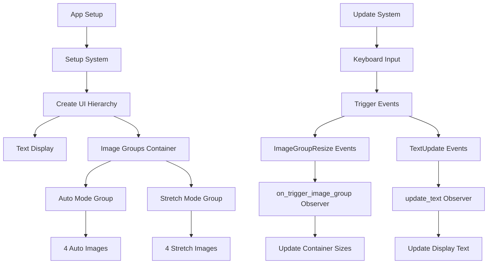

+++
title = "#22606 `ImageNode` resizing example"
date = "2026-01-23T00:00:00"
draft = false
template = "pull_request_page.html"
in_search_index = true

[taxonomies]
list_display = ["show"]

[extra]
current_language = "en"
available_languages = {"en" = { name = "English", url = "/pull_request/bevy/2026-01/pr-22606-en-20260123" }, "zh-cn" = { name = "中文", url = "/pull_request/bevy/2026-01/pr-22606-zh-cn-20260123" }}
labels = ["C-Examples", "A-UI", "D-Straightforward"]
+++

# Title
## Basic Information
- **Title**: `ImageNode` resizing example
- **PR Link**: https://github.com/bevyengine/bevy/pull/22606
- **Author**: Fodesu
- **Status**: MERGED
- **Labels**: C-Examples, A-UI, S-Ready-For-Final-Review, X-Uncontroversial, D-Straightforward
- **Created**: 2026-01-20T13:40:40Z
- **Merged**: 2026-01-23T06:01:52Z
- **Merged By**: alice-i-cecile

## Description Translation
# Objective

#22550 

## Solution
It demonstrates the behavior of `NodeImageMode::Auto` and `NodeImageMode::Stretch` by resizing a group of images using keyboard input

## The Story of This Pull Request

This pull request adds a new UI example to demonstrate the practical differences between `NodeImageMode::Auto` and `NodeImageMode::Stretch` in Bevy's UI system. The core issue is that while Bevy has an existing `image_node` example that shows basic image node usage, developers needed a more interactive demonstration to understand how these two image sizing modes behave when their containers change size.

The problem stems from how different `NodeImageMode` configurations affect image rendering within UI layouts. `NodeImageMode::Auto` sizes images based on their source dimensions while respecting layout constraints, whereas `NodeImageMode::Stretch` forces images to fill their parent nodes regardless of aspect ratio. Without a visual, interactive example, developers might struggle to understand when to use each mode or predict how their UI will respond to dynamic layout changes.

The solution creates an interactive example that lets users resize container nodes with keyboard input while observing how images in both modes respond. The implementation creates two side-by-side containers: one with images using `Auto` mode and another with images using `Stretch` mode. Both containers share the same dimensions and can be resized simultaneously using arrow keys.

The technical implementation leverages Bevy's event system and observer pattern to handle the resizing logic. When arrow keys are pressed, the system triggers `ImageGroupResize` events that update the container nodes' dimensions and `TextUpdate` events that update the display text showing current dimensions. This decoupled approach follows Bevy's ECS patterns while keeping the code organized.

The code uses several interesting techniques. First, it defines custom event types (`ImageGroupResize` and `TextUpdate`) to communicate between systems. Second, it uses the observer pattern via `add_observer` to handle these events reactively. Third, it demonstrates proper UI layout with Bevy's flexbox-like system, creating a grid container with two rows: one for instructions and one for the demonstration area.

The example includes constants for boundary checking, ensuring the containers don't resize beyond reasonable limits. It also uses `UiDebugOptions` to enable visual debugging of UI bounds, which is helpful for understanding how the layout system works.

One key engineering decision was using percentage-based sizing for the containers (`Val::Percent`) rather than absolute pixel values. This choice makes the example more representative of real-world UI development where responsive design is important. The code clamps values between defined minimums and maximums to prevent the UI from becoming unusable.

The implementation also shows how to properly structure UI hierarchies in Bevy. The main container uses grid layout, while the image groups use flexbox layouts with specific `justify_content` settings. This demonstrates how different layout strategies can be combined in a single UI.

The impact of this PR is straightforward: it adds a valuable educational resource to Bevy's examples collection. Developers can now run this example to immediately understand the practical implications of choosing between `Auto` and `Stretch` modes. The interactive nature of the example (keyboard-controlled resizing) makes the differences immediately apparent in a way that static examples cannot.

From a code architecture perspective, this example also serves as a reference for implementing keyboard-controlled UI interactions and reactive UI updates in Bevy. The clean separation between input handling, event triggering, and UI updating follows established Bevy patterns.

## Visual Representation



## Key Files Changed

### 1. `examples/ui/image_node_resizing.rs` (+279/-0)
This new file contains the complete example implementation. It demonstrates resizable image containers with two different `NodeImageMode` settings.

Key code sections:

```rust
// Setup of the two image groups
builder
    .spawn((
        ImageGroup,
        Node {
            display: Display::Flex,
            justify_content: JustifyContent::Start,
            width: Val::Percent(IMAGE_GROUP_BOX_INIT_WIDTH),
            height: Val::Percent(IMAGE_GROUP_BOX_INIT_HEIGHT),
            ..default()
        },
        BackgroundColor(Color::from(tailwind::BLUE_100)),
    ))
    .with_children(|parent| {
        for _ in 0..4 {
            // Auto mode images
            parent.spawn((
                Node::default(),
                ImageNode {
                    image: image_handle.clone(),
                    image_mode: NodeImageMode::Auto,
                    ..default()
                },
            ));
        }
    });
```

```rust
// Event handler for resizing
fn on_trigger_image_group(event: On<ImageGroupResize>, query: Query<&mut Node, With<ImageGroup>>) {
    for mut node in query {
        match event.event() {
            ImageGroupResize::HeightGrow => {
                if let Val::Percent(val) = node.height {
                    let new_val = (val + MIN_RESIZE_VAL).min(IMAGE_GROUP_BOX_MAX_HEIGHT);
                    node.height = Val::Percent(new_val);
                }
            }
            // ... other resize cases
        }
    }
}
```

### 2. `Cargo.toml` (+12/-0)
Added the example to Bevy's workspace configuration.

```toml
[[example]]
name = "image_node_resizing"
path = "examples/ui/image_node_resizing.rs"
# Causes an ICE on docs.rs
doc-scrape-examples = false

[package.metadata.example.image_node_resizing]
name = "Image Node Resizing"
description = "Demonstrates how to resize an image node"
category = "UI (User Interface)"
wasm = true
```

### 3. `examples/README.md` (+1/-0)
Added documentation entry for the new example.

```markdown
[Image Node Resizing](../examples/ui/image_node_resizing.rs) | Demonstrates how to resize an image node
```

## Further Reading

- [Bevy UI Documentation](https://docs.rs/bevy_ui/latest/bevy_ui/) - Official Bevy UI module documentation
- [Bevy Examples Repository](https://github.com/bevyengine/bevy/tree/main/examples#ui) - Other UI examples in Bevy
- [Bevy UI Layout Guide](https://bevy-cheatbook.github.io/fundamentals/ui.html) - Comprehensive guide to Bevy's UI system
- [Observer Pattern in Bevy](https://bevy-cheatbook.github.io/programming/observers.html) - Documentation on Bevy's observer system used in this example