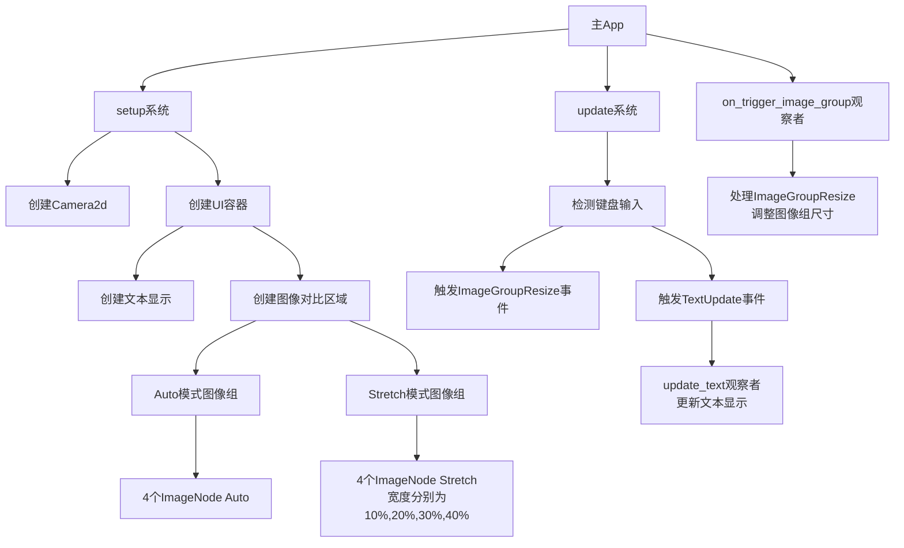

+++
title = "#22606 ImageNode` resizing example"
date = "2026-01-23T00:00:00"
draft = false
template = "pull_request_page.html"
in_search_index = false

[extra]
current_language = "zh-cn"
available_languages = {"en" = { name = "English", url = "/pull_request/bevy/2026-01/pr-22606-en-20260123" }, "zh-cn" = { name = "中文", url = "/pull_request/bevy/2026-01/pr-22606-zh-cn-20260123" }}
+++

# ImageNode resizing example

## 基本信息
- **标题**: `ImageNode` resizing example
- **PR链接**: https://github.com/bevyengine/bevy/pull/22606
- **作者**: Fodesu
- **状态**: 已合并
- **标签**: C-Examples, A-UI, S-Ready-For-Final-Review, X-Uncontroversial, D-Straightforward
- **创建时间**: 2026-01-20T13:40:40Z
- **合并时间**: 2026-01-23T06:01:52Z
- **合并者**: alice-i-cecile

## 描述翻译

# 目标

#22550 

## 解决方案
通过使用键盘输入调整一组图像的大小，来演示 `NodeImageMode::Auto` 和 `NodeImageMode::Stretch` 的行为

## 这个PR的故事

这个PR解决了一个具体的需求：为Bevy引擎的UI系统添加一个展示图像节点（ImageNode）两种不同缩放模式的实际例子。需求源于issue #22550，需要在代码库中补充相应的示例。

问题的核心在于，开发者在实际使用Bevy的UI系统时，需要理解`NodeImageMode::Auto`和`NodeImageMode::Stretch`两种模式的行为差异。`Auto`模式会根据源图像的尺寸和布局约束自动调整大小，而`Stretch`模式会强制图像拉伸以适应其容器的尺寸。虽然文档可能描述了这些概念，但一个交互式的、可视化的示例能更有效地传达这些差异。

开发者采用了创建一个完整、可运行的示例程序的方法。这个示例不是简单的静态演示，而是允许用户通过键盘输入动态调整图像容器的大小，从而实时观察两种模式下的行为差异。这种设计选择很有意义，因为它提供了即时反馈，让开发者能够直观地理解不同模式在动态布局中的表现。

从技术实现角度看，这个示例展示了Bevy引擎的多个核心特性。首先，它使用了观察者模式（Observer pattern）来处理事件：定义了`ImageGroupResize`和`TextUpdate`两个自定义事件，并通过`commands.trigger()`触发，由对应的观察者函数`on_trigger_image_group`和`update_text`处理。这种模式在Bevy中很常见，它实现了组件间的解耦。

示例中使用了网格布局（Grid layout）和弹性盒子布局（Flexbox layout）的组合。外层使用网格将界面分为文本区域和图像区域，内层使用弹性盒子来排列图像。这种分层布局方式展示了Bevy UI系统处理复杂布局的能力。

图像组件的创建方式值得注意。对于`Auto`模式，代码创建了4个具有默认`Node`组件的子节点，每个节点都应用了`ImageNode`组件并设置`image_mode: NodeImageMode::Auto`。对于`Stretch`模式，则创建了4个不同宽度的节点（10%, 20%, 30%, 40%），每个都设置为`image_mode: NodeImageMode::Stretch`。这种设置直观地展示了两种模式的主要区别：`Auto`模式中所有图像保持相同大小，而`Stretch`模式中图像会根据各自的节点尺寸进行拉伸。

键盘输入处理使用了Bevy的`ButtonInput<KeyCode>`资源，通过检测方向键的按压来触发相应的事件。这种方式比使用持续轮询更高效，也符合Bevy的事件驱动架构。

一个技术细节是`UiDebugOptions`的使用。在示例的`setup`函数中，全局启用了UI调试选项（显示轮廓），但对于文本节点又单独禁用了调试。这种细粒度的控制在开发复杂UI时很有用。

这个示例对Bevy代码库的贡献主要体现在教育价值上。它不仅解决了issue中提出的需求，还作为一个高质量的教学资源，展示了如何组合使用Bevy的多个UI相关特性。对于刚接触Bevy UI系统的开发者来说，这个示例提供了一个完整的、可直接运行的参考实现。

从架构角度看，这个示例保持了一致的代码风格和最佳实践。它使用了Bevy推荐的事件系统、组件查询模式，并且代码结构清晰，易于理解。常量的使用（如`IMAGE_GROUP_BOX_MIN_WIDTH`等）使得参数调整更加容易。

## 视觉表示



## 关键文件变更

### 1. `Cargo.toml` (+12/-0)
**变更描述**: 添加了新示例的配置条目，使`image_node_resizing`示例能够被构建和运行。

```toml
# 文件: Cargo.toml
# 新增部分:
[[example]]
name = "image_node_resizing"
path = "examples/ui/image_node_resizing.rs"
# Causes an ICE on docs.rs
doc-scrape-examples = false

[package.metadata.example.image_node_resizing]
name = "Image Node Resizing"
description = "Demonstrates how to resize an image node"
category = "UI (User Interface)"
wasm = true
```

**说明**: 这个配置条目告诉Cargo这是一个示例程序，指定了文件路径、名称、描述和分类。`doc-scrape-examples = false`是为了避免docs.rs构建时出现内部编译器错误。

### 2. `examples/README.md` (+1/-0)
**变更描述**: 在示例列表中添加了新示例的链接和描述。

```markdown
# 文件: examples/README.md
# 新增行:
[Image Node Resizing](../examples/ui/image_node_resizing.rs) | Demonstrates how to resize an image node
```

**说明**: 这个变更使得新示例出现在Bevy的示例文档中，方便开发者查找和运行。

### 3. `examples/ui/image_node_resizing.rs` (+279/-0)
**变更描述**: 创建了全新的示例文件，展示了`NodeImageMode::Auto`和`NodeImageMode::Stretch`的行为差异。

**关键代码片段**:

```rust
// 事件定义
#[derive(Debug, Event)]
enum ImageGroupResize {
    HeightGrow,
    HeightShrink,
    WidthGrow,
    WidthShrink,
}

// 两种模式的图像创建
// Auto模式
parent.spawn((
    Node::default(),
    ImageNode {
        image: image_handle.clone(),
        image_mode: NodeImageMode::Auto,
        ..default()
    },
));

// Stretch模式
parent.spawn((
    Node {
        height: Val::Percent(100.),
        width: Val::Percent(width), // width为10., 20., 30., 40.
        ..default()
    },
    ImageNode {
        image: image_handle.clone(),
        image_mode: NodeImageMode::Stretch,
        ..default()
    },
));

// 键盘输入处理
fn update(
    keycode: Res<ButtonInput<KeyCode>>,
    mut commands: Commands,
    query: Query<Entity, With<TextData>>,
) {
    let entity = query.single().unwrap();
    if keycode.pressed(KeyCode::ArrowUp) {
        commands.trigger(ImageGroupResize::HeightGrow);
        commands.trigger(TextUpdate {
            entity,
            direction: Direction::Height,
            change: MIN_RESIZE_VAL,
        });
    }
    // ... 其他方向键处理
}
```

**说明**: 这个文件是示例的核心实现，包含了完整的UI布局、事件处理和用户交互逻辑。它展示了如何创建响应式UI，以及如何通过键盘输入动态调整UI元素。

## 进一步阅读

1. **Bevy UI 官方文档**: https://bevyengine.org/learn/quick-start/ui/
2. **Bevy 观察者模式**: 查看Bevy的ECS事件系统文档，了解`commands.trigger()`和观察者的使用
3. **Flexbox布局教程**: 理解Bevy UI中弹性盒子布局的工作原理
4. **NodeImageMode API文档**: 查看`NodeImageMode`枚举的详细说明和使用示例