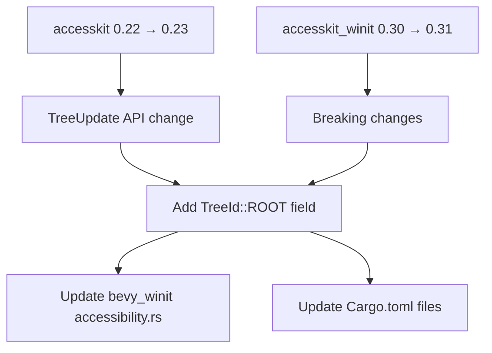

+++
title = "#22613 Bump the accesskit group with 2 updates"
date = "2026-01-21T00:00:00"
draft = false
template = "pull_request_page.html"
in_search_index = true

[taxonomies]
list_display = ["show"]

[extra]
current_language = "en"
available_languages = {"en" = { name = "English", url = "/pull_request/bevy/2026-01/pr-22613-en-20260121" }, "zh-cn" = { name = "中文", url = "/pull_request/bevy/2026-01/pr-22613-zh-cn-20260121" }}
labels = ["C-Dependencies", "A-Accessibility", "D-Straightforward"]
+++

# Title

## Basic Information
- **Title**: Bump the accesskit group with 2 updates
- **PR Link**: https://github.com/bevyengine/bevy/pull/22613
- **Author**: mnmaita
- **Status**: MERGED
- **Labels**: C-Dependencies, A-Accessibility, S-Ready-For-Final-Review, D-Straightforward
- **Created**: 2026-01-20T23:23:45Z
- **Merged**: 2026-01-21T17:55:13Z
- **Merged By**: alice-i-cecile

## Description Translation

# Objective

- Closes #22540.

## Solution

- Updates `accesskit` to 0.23.0.
- Updates `accesskit_winit` to 0.31.0.
- Addressed breaking changes (multiple tree support).

## Testing

- CI checks.

## The Story of This Pull Request

This PR addresses a straightforward but necessary dependency update task. The core issue was that Bevy needed to update its accessibility framework dependencies to newer versions, specifically moving from accesskit 0.22 to 0.23 and accesskit_winit from 0.30 to 0.31. These updates were required to keep the engine current with upstream improvements and bug fixes in the accessibility ecosystem.

The primary technical challenge was handling a breaking change in the accesskit API. Version 0.23 introduced support for multiple accessibility trees, which required adding a new `tree_id` field to `TreeUpdate` structs. Previously, accesskit assumed a single accessibility tree per application, but with the 0.23 release, it gained the ability to manage multiple trees concurrently - a feature that could support more complex applications with multiple independent UI contexts.

The implementation approach was minimal and focused: update the dependency versions in all relevant Cargo.toml files, then make the necessary code changes to accommodate the API changes. The developer identified that the `TreeUpdate` struct construction in two locations needed to include the new `TreeId::ROOT` field, maintaining backward compatibility for applications that only need a single tree.

From an architectural perspective, this change demonstrates how Bevy handles dependency updates that include breaking API changes. The approach is pragmatic: update the dependencies, then make the minimal necessary adjustments to restore functionality. The fact that only two code locations needed modification speaks to the clean abstraction boundaries in Bevy's accessibility implementation.

The impact is primarily maintenance-oriented. Keeping dependencies current reduces technical debt, ensures access to security patches, and maintains compatibility with the broader Rust ecosystem. For users, this update should be transparent unless they're directly working with accessibility APIs, in which case they'll benefit from the new multiple tree support capabilities.

The engineering decision here was straightforward - accept the breaking change and update accordingly. No alternatives were considered because dependency updates of this nature are typically mandatory for long-term maintenance. The implementation shows good practices: checking all usage sites of the updated API and making consistent, minimal changes.

## Visual Representation



## Key Files Changed

### 1. `crates/bevy_winit/Cargo.toml` (+2/-2)
**Purpose**: Update accesskit_winit dependency from 0.30 to 0.31 and accesskit from 0.22 to 0.23.

**Key changes**:
```toml
# Before:
accesskit_winit = { version = "0.30", default-features = false, features = [
  "rwh_06",
] }
accesskit = "0.22"

# After:
accesskit_winit = { version = "0.31", default-features = false, features = [
  "rwh_06",
] }
accesskit = "0.23"
```

### 2. `crates/bevy_winit/src/accessibility.rs` (+3/-1)
**Purpose**: Handle the breaking API change in accesskit 0.23 by adding the required `tree_id` field to `TreeUpdate` structs.

**Key changes**:
```rust
// Updated import
use accesskit::{
    ActionHandler, ActionRequest, ActivationHandler, DeactivationHandler, Node, NodeId, Role, Tree,
    TreeId, TreeUpdate,  // Added TreeId import
};

// In create_window_update function:
TreeUpdate {
    nodes: vec![(accesskit_window_id, root)],
    tree: Some(tree),
    tree_id: TreeId::ROOT,  // Added required field
    focus: accesskit_window_id,
}

// In update_adapter function:
TreeUpdate {
    nodes: to_update,
    tree: None,
    tree_id: TreeId::ROOT,  // Added required field
    focus: NodeId(focus.0.unwrap_or(primary_window_id).to_bits()),
}
```

### 3. `Cargo.toml` (+1/-1) and other crate Cargo.toml files
**Purpose**: Update accesskit dependency version from 0.22 to 0.23 across the entire project.

**Key changes**:
Multiple files updated with the same pattern:
```toml
# Before:
accesskit = "0.22"

# After:
accesskit = "0.23"
```

## Further Reading

1. [AccessKit Documentation](https://docs.rs/accesskit/latest/accesskit/) - The official API documentation for the accesskit crate
2. [AccessKit GitHub Repository](https://github.com/AccessKit/accesskit) - Source code and issue tracking for the accesskit project
3. [Rust Dependency Management](https://doc.rust-lang.org/cargo/reference/specifying-dependencies.html) - Cargo's documentation on managing dependencies
4. [Bevy Accessibility Guide](https://bevyengine.org/learn/quick-start/platform/accessibility/) - Bevy's documentation on implementing accessibility features
5. [WCAG 2.2 Guidelines](https://www.w3.org/TR/WCAG22/) - Web Content Accessibility Guidelines that inform accesskit's design