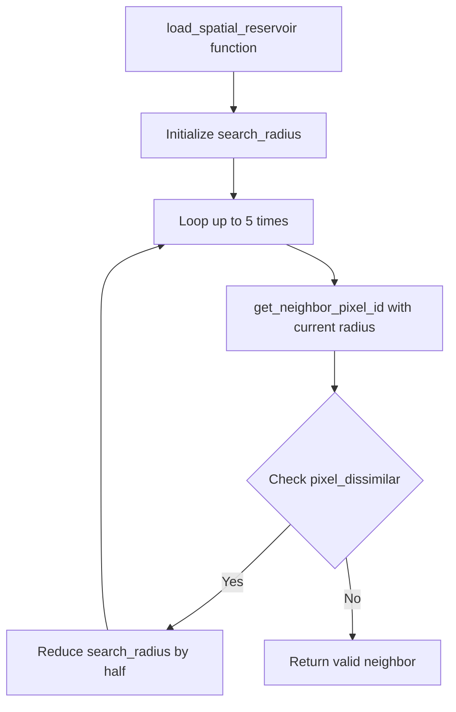

+++
title = "#22617 Solari: Improve spatial sample finding"
date = "2026-01-21T00:00:00"
draft = false
template = "pull_request_page.html"
in_search_index = true

[taxonomies]
list_display = ["show"]

[extra]
current_language = "en"
available_languages = {"en" = { name = "English", url = "/pull_request/bevy/2026-01/pr-22617-en-20260121" }, "zh-cn" = { name = "中文", url = "/pull_request/bevy/2026-01/pr-22617-zh-cn-20260121" }}
labels = ["D-Trivial", "A-Rendering", "C-Refinement"]
+++

# Title
## Basic Information
- **Title**: Solari: Improve spatial sample finding
- **PR Link**: https://github.com/bevyengine/bevy/pull/22617
- **Author**: JMS55
- **Status**: MERGED
- **Labels**: D-Trivial, A-Rendering, S-Ready-For-Final-Review, C-Refinement
- **Created**: 2026-01-21T03:12:32Z
- **Merged**: 2026-01-21T19:11:12Z
- **Merged By**: alice-i-cecile

## Description Translation
Pink is visualizing pixels without a valid spatial sample (for ReSTIR GI).

Before:


After:


## The Story of This Pull Request

This PR addresses a specific optimization problem in the Bevy engine's Solari real-time rendering system, specifically within the ReSTIR (Reservoir-based Spatio-Temporal Importance Resampling) implementation for both direct illumination (DI) and global illumination (GI). The core issue was that the spatial sample finding algorithm had a fixed search radius, which wasn't adapting effectively to different geometric situations.

In the original implementation, the `load_spatial_reservoir` function attempted to find valid neighboring pixels for sample reuse by randomly sampling within a fixed radius defined by `SPATIAL_REUSE_RADIUS_PIXELS`. When a sampled neighbor was rejected due to geometric dissimilarity (different depth, world position, or surface normal), the algorithm would simply continue searching with the same radius. This approach wasted search iterations on potentially invalid regions and could lead to more pink pixels in the visualization, indicating failed spatial sample reuse.

The solution implements an adaptive radius reduction strategy. When a sampled neighbor is found to be dissimilar, the search radius is halved for subsequent iterations within the same search loop. This creates a more efficient search pattern: if the initial random sample in the larger radius fails, the algorithm progressively focuses on closer pixels, which are more likely to share similar geometric properties.

The technical implementation required modifying both the DI and GI shaders identically. The key changes were:
1. Introducing a local `search_radius` variable initialized to the global constant `SPATIAL_REUSE_RADIUS_PIXELS`
2. Modifying the `get_neighbor_pixel_id` function to accept this radius as a parameter
3. Adding radius halving logic (`search_radius /= 2.0`) when `pixel_dissimilar` returns true

This adaptive approach makes intuitive sense from a geometric perspective. Surfaces with discontinuities (edges, depth boundaries) often have dissimilar neighbors at larger distances but may have similar neighbors at closer proximity. By reducing the search radius after each failure, the algorithm becomes more likely to find valid samples near the original pixel, especially in complex geometric regions.

The visual results confirm the improvement. The "after" image shows significantly fewer pink pixels, particularly noticeable in areas with complex geometry or depth variations. This translates directly to better sample reuse, reduced noise, and potentially improved performance since fewer pixels need to fall back to more expensive sampling methods.

From an engineering perspective, this change demonstrates a common optimization pattern in real-time graphics: adapting sampling strategies based on local conditions. The implementation is minimal, focused, and maintains backward compatibility while significantly improving the algorithm's effectiveness.

## Visual Representation



## Key Files Changed

**1. `crates/bevy_solari/src/realtime/restir_di.wgsl` (+5/-3)**

This file contains the direct illumination implementation of ReSTIR. The changes implement adaptive spatial search radius for DI.

Key modification in `load_spatial_reservoir` function:
```wgsl
// Before:
fn load_spatial_reservoir(pixel_id: vec2<u32>, depth: f32, world_position: vec3<f32>, world_normal: vec3<f32>, rng: ptr<function, u32>) -> NeighborInfo {
    for (var i = 0u; i < 5u; i++) {
        let spatial_pixel_id = get_neighbor_pixel_id(pixel_id, rng);
        // ...
        if pixel_dissimilar(depth, world_position, spatial_surface.world_position, world_normal, spatial_surface.world_normal, view) {
            continue;
        }
        // ...
    }
    // ...
}

// After:
fn load_spatial_reservoir(pixel_id: vec2<u32>, depth: f32, world_position: vec3<f32>, world_normal: vec3<f32>, rng: ptr<function, u32>) -> NeighborInfo {
    var search_radius = SPATIAL_REUSE_RADIUS_PIXELS;  // New variable
    for (var i = 0u; i < 5u; i++) {
        let spatial_pixel_id = get_neighbor_pixel_id(pixel_id, search_radius, rng);  // Pass radius
        // ...
        if pixel_dissimilar(depth, world_position, spatial_surface.world_position, world_normal, spatial_surface.world_normal, view) {
            search_radius /= 2.0;  // Adaptive reduction
            continue;
        }
        // ...
    }
    // ...
}
```

Corresponding change to `get_neighbor_pixel_id`:
```wgsl
// Before:
fn get_neighbor_pixel_id(center_pixel_id: vec2<u32>, rng: ptr<function, u32>) -> vec2<u32> {
    var spatial_id = vec2<f32>(center_pixel_id) + sample_disk(SPATIAL_REUSE_RADIUS_PIXELS, rng);
    // ...
}

// After:
fn get_neighbor_pixel_id(center_pixel_id: vec2<u32>, search_radius: f32, rng: ptr<function, u32>) -> vec2<u32> {
    var spatial_id = vec2<f32>(center_pixel_id) + sample_disk(search_radius, rng);  // Use parameter
    // ...
}
```

**2. `crates/bevy_solari/src/realtime/restir_gi.wgsl` (+5/-3)**

This file contains the global illumination implementation of ReSTIR. The changes are identical to those in the DI shader, ensuring consistent behavior across both illumination types.

```wgsl
// The exact same modifications as shown above for restir_di.wgsl
// were applied to restir_gi.wgsl
```

## Further Reading

1. **ReSTIR Paper**: "Spatiotemporal reservoir resampling for real-time ray tracing with dynamic direct lighting" by Bitterli et al. (2020) - The foundational paper for the ReSTIR algorithm
2. **WGSL Specification**: https://www.w3.org/TR/WGSL/ - WebGPU Shading Language documentation
3. **Bevy Rendering Architecture**: Bevy's rendering engine documentation for understanding how shaders integrate with the ECS system
4. **Importance Sampling in Real-Time Rendering**: General concepts of Monte Carlo methods and importance sampling as applied to real-time graphics