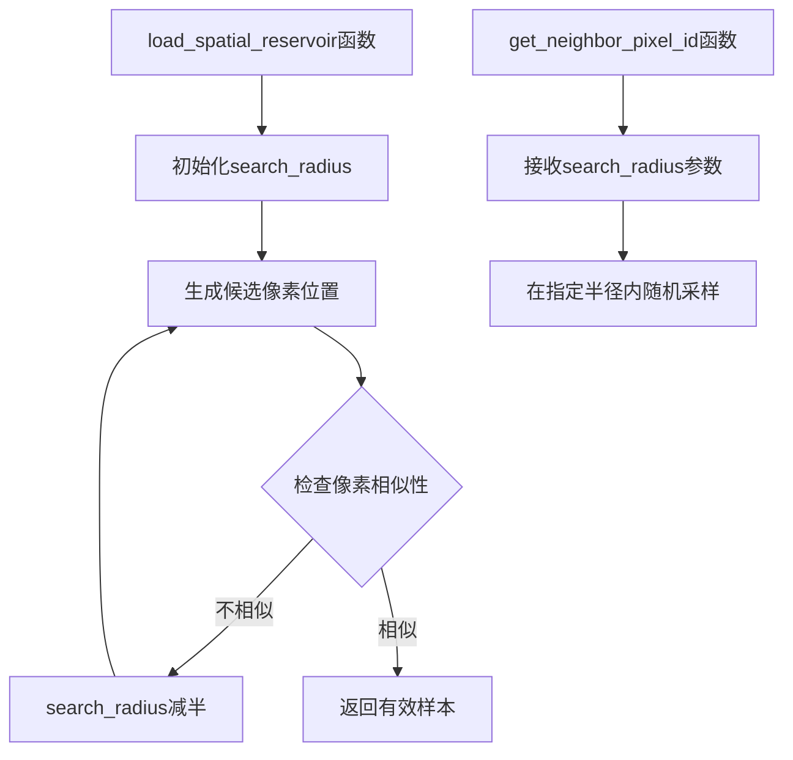

+++
title = "#22617 Solari: Improve spatial sample finding"
date = "2026-01-21T00:00:00"
draft = false
template = "pull_request_page.html"
in_search_index = false

[extra]
current_language = "zh-cn"
available_languages = {"en" = { name = "English", url = "/pull_request/bevy/2026-01/pr-22617-en-20260121" }, "zh-cn" = { name = "中文", url = "/pull_request/bevy/2026-01/pr-22617-zh-cn-20260121" }}
labels = ["D-Trivial", "A-Rendering", "C-Refinement"]
+++

# Solari: Improve spatial sample finding

## Basic Information
- **Title**: Solari: Improve spatial sample finding
- **PR Link**: https://github.com/bevyengine/bevy/pull/22617
- **Author**: JMS55
- **Status**: MERGED
- **Labels**: D-Trivial, A-Rendering, S-Ready-For-Final-Review, C-Refinement
- **Created**: 2026-01-21T03:12:32Z
- **Merged**: 2026-01-21T19:11:12Z
- **Merged By**: alice-i-cecile

## Description Translation
粉色区域显示了没有有效空间采样的像素（用于ReSTIR GI）。

之前：


之后：


## The Story of This Pull Request

这个PR解决了一个关于Bevy的Solari渲染系统中ReSTIR GI（ReSTIR全局光照）实现的具体问题。问题的核心是在空间重采样过程中，当找到的相邻像素样本不兼容时，算法会继续在同一较大的搜索半径内寻找新样本，这可能导致无效样本或次优结果。

在ReSTIR（Reservoir-based Spatio-Temporal Importance Resampling）算法的空间重采样阶段，系统会从当前像素周围一定半径内随机选择相邻像素，尝试重用它们的光照样本。然而，当相邻像素的表面特征（如深度、世界位置、法线）与当前像素差异过大时，该样本被认为"不相似"（dissimilar），不应被重用。

在原有实现中，算法使用固定的`SPATIAL_REUSE_RADIUS_PIXELS`作为搜索半径。当发现不相似的样本时，它只是跳过该样本并继续尝试，但下一次尝试仍然使用相同的较大搜索半径。这意味着后续尝试可能仍然选择距离过远的像素，而这些像素很可能同样不兼容。

PR的解决方案是引入自适应的搜索半径调整机制。当检测到不相似的样本时，系统会将搜索半径减半，然后继续尝试。这种逐步缩小搜索区域的策略更符合直觉：如果远处的像素不兼容，那么更近的像素可能更兼容。这本质上是一种"二分搜索"思想在空间采样中的应用。

具体实现中，`load_spatial_reservoir`函数现在维护一个局部变量`search_radius`，初始化为`SPATIAL_REUSE_RADIUS_PIXELS`。每次发现不相似样本时，半径减半。这个调整后的半径被传递给`get_neighbor_pixel_id`函数，用于生成下一个候选样本位置。

这种方法有几个技术优势：

1. **提高采样质量**：通过优先搜索更近的像素，增加了找到兼容样本的概率
2. **减少无效样本**：视觉比较显示，粉色区域（无效空间样本）显著减少
3. **算法鲁棒性**：在场景几何变化剧烈的区域，自适应机制能更好地处理不连续性

值得注意的是，这个修改同时应用于两个独立的ReSTIR实现：直接光照（DI）和全局光照（GI），因为两者共享相同的空间重采样逻辑。这体现了代码重复模式在图形学中的常见实践，也说明了这种改进的普适性。

从性能角度看，这个修改的计算开销可以忽略不计——只是增加了一个除法操作和变量传递。但它在图像质量上带来了明显的改进，这是典型的"小改动，大影响"优化。

这个PR展示了一个重要的图形学原则：采样策略的质量直接影响渲染结果的收敛速度和质量。自适应采样技术，无论是在路径追踪中的重要性采样，还是在ReSTIR中的空间重采样，都是现代实时渲染系统的核心优化手段。

## Visual Representation



## Key Files Changed

### `crates/bevy_solari/src/realtime/restir_di.wgsl`
这个文件包含了ReSTIR直接光照的实现。修改引入了自适应搜索半径机制。

**关键修改：**
```wgsl
// Before:
fn load_spatial_reservoir(pixel_id: vec2<u32>, depth: f32, world_position: vec3<f32>, world_normal: vec3<f32>, rng: ptr<function, u32>) -> NeighborInfo {
    for (var i = 0u; i < 5u; i++) {
        let spatial_pixel_id = get_neighbor_pixel_id(pixel_id, rng);
        // ...
        if pixel_dissimilar(...) {
            continue;
        }
        // ...
    }
}

fn get_neighbor_pixel_id(center_pixel_id: vec2<u32>, rng: ptr<function, u32>) -> vec2<u32> {
    var spatial_id = vec2<f32>(center_pixel_id) + sample_disk(SPATIAL_REUSE_RADIUS_PIXELS, rng);
    // ...
}

// After:
fn load_spatial_reservoir(pixel_id: vec2<u32>, depth: f32, world_position: vec3<f32>, world_normal: vec3<f32>, rng: ptr<function, u32>) -> NeighborInfo {
    var search_radius = SPATIAL_REUSE_RADIUS_PIXELS;
    for (var i = 0u; i < 5u; i++) {
        let spatial_pixel_id = get_neighbor_pixel_id(pixel_id, search_radius, rng);
        // ...
        if pixel_dissimilar(...) {
            search_radius /= 2.0;
            continue;
        }
        // ...
    }
}

fn get_neighbor_pixel_id(center_pixel_id: vec2<u32>, search_radius: f32, rng: ptr<function, u32>) -> vec2<u32> {
    var spatial_id = vec2<f32>(center_pixel_id) + sample_disk(search_radius, rng);
    // ...
}
```

### `crates/bevy_solari/src/realtime/restir_gi.wgsl`
这个文件包含了ReSTIR全局光照的实现。修改与`restir_di.wgsl`完全相同，体现了代码重复模式。

**关键修改：**
```wgsl
// Before:
fn load_spatial_reservoir(pixel_id: vec2<u32>, depth: f32, world_position: vec3<f32>, world_normal: vec3<f32>, rng: ptr<function, u32>) -> NeighborInfo {
    for (var i = 0u; i < 5u; i++) {
        let spatial_pixel_id = get_neighbor_pixel_id(pixel_id, rng);
        // ...
        if pixel_dissimilar(...) {
            continue;
        }
        // ...
    }
}

fn get_neighbor_pixel_id(center_pixel_id: vec2<u32>, rng: ptr<function, u32>) -> vec2<u32> {
    var spatial_id = vec2<f32>(center_pixel_id) + sample_disk(SPATIAL_REUSE_RADIUS_PIXELS, rng);
    // ...
}

// After:
fn load_spatial_reservoir(pixel_id: vec2<u32>, depth: f32, world_position: vec3<f32>, world_normal: vec3<f32>, rng: ptr<function, u32>) -> NeighborInfo {
    var search_radius = SPATIAL_REUSE_RADIUS_PIXELS;
    for (var i = 0u; i < 5u; i++) {
        let spatial_pixel_id = get_neighbor_pixel_id(pixel_id, search_radius, rng);
        // ...
        if pixel_dissimilar(...) {
            search_radius /= 2.0;
            continue;
        }
        // ...
    }
}

fn get_neighbor_pixel_id(center_pixel_id: vec2<u32>, search_radius: f32, rng: ptr<function, u32>) -> vec2<u32> {
    var spatial_id = vec2<f32>(center_pixel_id) + sample_disk(search_radius, rng);
    // ...
}
```

## Further Reading

1. **ReSTIR原论文**：Bitterli, Benedikt, et al. "ReSTIR: Path Resampling for Real-Time Path Tracing." ACM Transactions on Graphics (TOG) 39.4 (2020): 148-1.
2. **WGSL规范**：WebGPU Shading Language (WGSL) 规范，了解着色器语言细节
3. **空间重采样技术**：关于蒙特卡洛方法中重要性采样和重采样的基础知识
4. **Bevy渲染架构**：Bevy游戏引擎的渲染系统设计文档，了解Solari在整体架构中的位置
5. **自适应采样技术**：计算机图形学中的自适应采样方法，包括光线追踪和实时渲染中的应用