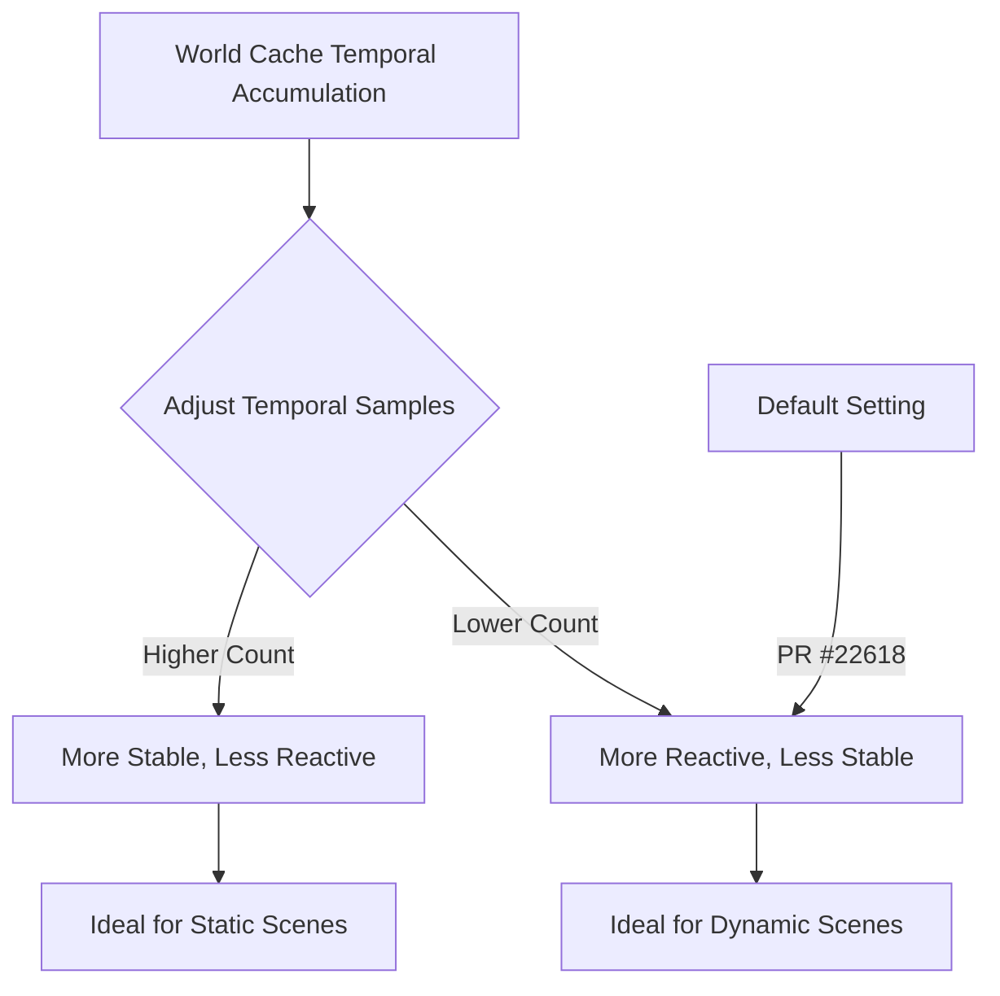

+++
title = "#22618 Solari: More reactive world cache by default"
date = "2026-01-21T00:00:00"
draft = false
template = "pull_request_page.html"
in_search_index = true

[taxonomies]
list_display = ["show"]

[extra]
current_language = "en"
available_languages = {"en" = { name = "English", url = "/pull_request/bevy/2026-01/pr-22618-en-20260121" }, "zh-cn" = { name = "中文", url = "/pull_request/bevy/2026-01/pr-22618-zh-cn-20260121" }}
labels = ["D-Trivial", "A-Rendering", "C-Refinement"]
+++

# Title

## Basic Information
- **Title**: Solari: More reactive world cache by default
- **PR Link**: https://github.com/bevyengine/bevy/pull/22618
- **Author**: JMS55
- **Status**: MERGED
- **Labels**: D-Trivial, A-Rendering, S-Ready-For-Final-Review, C-Refinement
- **Created**: 2026-01-21T03:18:17Z
- **Merged**: 2026-01-21T17:41:56Z
- **Merged By**: alice-i-cecile

## Description Translation
Helps lessen https://github.com/bevyengine/bevy/issues/22577 without much loss of overall stability for diffuse surfaces (mid-rough specular is still very tricky, might need to hash roughness in the WC key or something.)

Yes, I still need to make all these numbers configurable, probably sometime towards the end of this dev cycle.

## The Story of This Pull Request

This pull request addresses a specific performance-reactivity tradeoff in Bevy's Solari rendering system. The issue at hand was that the world cache—a critical component for efficient global illumination—was reacting too slowly to lighting changes in certain scenarios, as documented in issue #22577.

The world cache system uses temporal accumulation to reduce noise in global illumination calculations. By accumulating samples across multiple frames, it can achieve higher quality results with fewer artifacts. However, this temporal accumulation comes with a tradeoff: the more frames you accumulate, the slower the cache reacts to changes in the scene's lighting conditions. This is particularly problematic in dynamic scenes where lights move or change intensity, as the cached values can lag behind, causing visual artifacts.

The developer identified that the current default of 32 temporal samples was too conservative for many real-world scenarios. While 32 samples provided excellent stability and noise reduction for diffuse surfaces, it created noticeable lag in dynamic lighting scenarios. The solution was straightforward: reduce the maximum temporal samples from 32 to 20, making the world cache more responsive by default.

This change represents a calculated engineering tradeoff. By reducing the temporal sample count, the cache updates approximately 37.5% faster (32 → 20 samples). For diffuse surfaces—which are generally more forgiving and less prone to high-frequency noise—this reduction comes with minimal quality degradation. However, the developer notes that mid-roughness specular surfaces remain challenging and might require more sophisticated solutions, such as hashing roughness values into the world cache key to maintain quality while improving reactivity.

The implementation itself is minimal—a single constant change in a WGSL shader file. But this simplicity belies the careful consideration behind the change. The developer is balancing multiple factors: responsiveness for dynamic scenes, stability for diffuse materials, and the specific challenges of specular reflections. The comment in the PR description acknowledges that these values should eventually become configurable, allowing users to tune the system based on their specific needs and performance requirements.

From an architectural perspective, this change fits into Bevy's philosophy of providing sensible defaults that work well for common use cases while allowing customization for advanced scenarios. The developer recognizes that a one-size-fits-all solution isn't optimal, hence the note about making these values configurable in the future. This approach allows the engine to ship with good defaults while giving power users the tools to optimize for their specific workloads.

The impact of this change is immediate: scenes with dynamic lighting will see more responsive global illumination updates with only minimal increases in noise for diffuse surfaces. This improves the user experience in games and applications where lighting changes frequently, while maintaining visual quality for static or slowly changing scenes.

## Visual Representation



## Key Files Changed

### `crates/bevy_solari/src/realtime/world_cache_query.wgsl`

**What changed**: The `WORLD_CACHE_MAX_TEMPORAL_SAMPLES` constant was reduced from 32.0 to 20.0 to make the world cache more responsive to lighting changes.

**Why it changed**: This adjustment helps address issue #22577 where the world cache was too slow to update in dynamic lighting scenarios, while maintaining reasonable stability for diffuse surfaces.

**Code diff**:
```wgsl
// File: crates/bevy_solari/src/realtime/world_cache_query.wgsl
// Before:
const WORLD_CACHE_MAX_TEMPORAL_SAMPLES: f32 = 32.0;

// After:
const WORLD_CACHE_MAX_TEMPORAL_SAMPLES: f32 = 20.0;
```

**How it relates to the PR**: This single constant change implements the core functionality of the PR—making the world cache more reactive by default. The reduced temporal sample count allows the cache to update faster, improving responsiveness to lighting changes in dynamic scenes.

## Further Reading

1. **Bevy Solari Documentation**: For understanding the world cache system and its role in global illumination
2. **Temporal Anti-Aliasing (TAA) Principles**: Many of the same concepts apply to temporal accumulation in rendering
3. **Global Illumination Techniques**: Understanding the tradeoffs between real-time GI methods
4. **WGSL Shader Language**: For developers unfamiliar with WebGPU Shading Language used in Bevy
5. **Dynamic Lighting in Real-Time Rendering**: Background on why responsive lighting updates are important for interactive applications