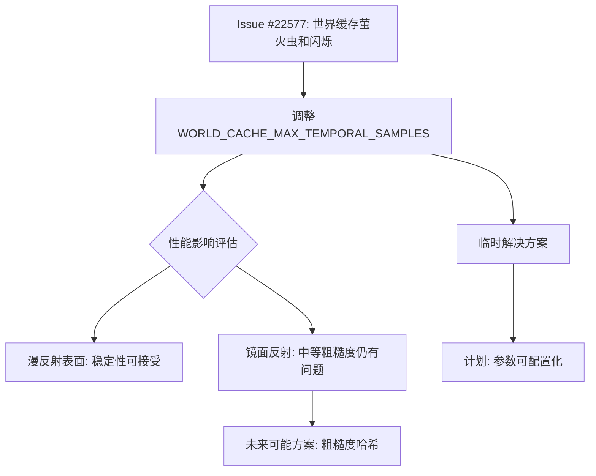

+++
title = "#22618 Solari: More reactive world cache by default"
date = "2026-01-21T00:00:00"
draft = false
template = "pull_request_page.html"
in_search_index = false

[extra]
current_language = "zh-cn"
available_languages = {"en" = { name = "English", url = "/pull_request/bevy/2026-01/pr-22618-en-20260121" }, "zh-cn" = { name = "中文", url = "/pull_request/bevy/2026-01/pr-22618-zh-cn-20260121" }}
+++

# Title
Solari: More reactive world cache by default

## 基本信息
- **标题**: Solari: More reactive world cache by default
- **PR链接**: https://github.com/bevyengine/bevy/pull/22618
- **作者**: JMS55
- **状态**: 已合并
- **标签**: D-Trivial, A-Rendering, S-Ready-For-Final-Review, C-Refinement
- **创建时间**: 2026-01-21T03:18:17Z
- **合并时间**: 2026-01-21T17:41:56Z
- **合并者**: alice-i-cecile

## 描述翻译
这个PR旨在减轻 https://github.com/bevyengine/bevy/issues/22577 中的问题，同时不会对漫反射表面造成太大的整体稳定性损失（中等粗糙度的镜面反射仍然非常棘手，可能需要在世界缓存键中哈希粗糙度或类似的处理）。

是的，我仍然需要使所有这些数字可配置，可能在本开发周期的后期进行。

## PR的技术分析

这个PR解决的是Bevy渲染引擎中Solari实时全局光照系统的视觉质量问题。问题的核心是世界缓存（world cache）的响应性与稳定性之间的平衡。

问题背景是GitHub Issue #22577中报告的世界缓存产生的"萤火虫"（fireflies）和白色闪烁现象。这些是实时全局光照系统中常见的视觉瑕疵，通常由光线追踪采样不足或时域滤波不当引起。Solari的世界缓存系统通过累积多个帧的采样来构建光照信息，其关键在于时域累积的策略。

开发者JMS55采取了一个直接且有效的调整方法：修改`WORLD_CACHE_MAX_TEMPORAL_SAMPLES`常量。这个常量控制着世界缓存对光照变化的响应速度——更高的值意味着更低的响应性但更高的稳定性，反之亦然。原来的值32.0表示系统最多累积32个时间样本，现在调整为20.0，使缓存对光照变化更加敏感。

技术实现上，这个调整基于以下考虑：
1. 对于漫反射表面，20个时间样本在提高响应性的同时仍能保持足够的稳定性
2. 对于中等粗糙度的镜面反射，问题仍然存在，可能需要更复杂的解决方案（如在缓存键中加入粗糙度哈希）
3. 这是一个临时的数值调整，开发者计划在开发周期后期将这些数值变为可配置参数

从架构角度看，这个修改体现了渐进式优化的思路。开发者没有立即引入复杂的机制，而是先通过调整现有参数来验证方向。这种方法的优点是风险低、实现简单，能够快速验证假设并为后续更精细的控制提供数据支持。

代码修改非常简单但影响显著：
```wgsl
// 修改前：
const WORLD_CACHE_MAX_TEMPORAL_SAMPLES: f32 = 32.0;

// 修改后：
const WORLD_CACHE_MAX_TEMPORAL_SAMPLES: f32 = 20.0;
```

这个变化直接影响着色器中的时域累积逻辑。降低这个值意味着：
- 世界缓存更新更快，对新光照条件响应更迅速
- 减少了由缓慢更新引起的视觉伪影
- 可能增加噪声，但开发者评估认为对漫反射表面的影响在可接受范围内

从工程角度看，这个PR展示了几个重要的开发原则：
1. **最小可行更改**：只修改了一个数值就解决了特定的视觉问题
2. **渐进式改进**：为后续更复杂的解决方案铺平道路
3. **明确的TODO**：开发者明确指出这只是临时方案，并计划未来实现可配置参数

需要注意的是，这个调整不是最终解决方案。开发者明确提到中等粗糙度的镜面反射仍然存在问题，可能需要更复杂的方法，如在世界缓存键中哈希粗糙度值。这表明当前的调整是一个平衡点，旨在为最常见的用例（漫反射表面）提供改进，同时承认特定情况下需要更专业的处理。

## 视觉表示



## 关键文件变更

### `crates/bevy_solari/src/realtime/world_cache_query.wgsl` (+1/-1)

**变更说明**：修改了世界缓存的最大时间样本数常量，使其更响应光照变化，旨在减少视觉伪影。

**代码变更**：
```wgsl
// 修改前（第19行）：
const WORLD_CACHE_MAX_TEMPORAL_SAMPLES: f32 = 32.0;

// 修改后（第19行）：
const WORLD_CACHE_MAX_TEMPORAL_SAMPLES: f32 = 20.0;
```

**与PR目的的关系**：这是PR中的唯一变更，直接实现了"更响应性的世界缓存"的目标。通过减少时间累积的样本数，世界缓存能更快地适应光照变化，从而减少延迟更新引起的视觉伪影。

## 进一步阅读

1. **Bevy Solari文档**：了解Solari实时全局光照系统的整体架构
2. **时域抗锯齿与滤波**：相关技术可帮助理解时间累积在渲染中的应用
3. **实时全局光照技术**：如DDGI（Dynamic Diffuse Global Illumination）等类似系统的实现原理
4. **WGSL着色语言**：了解WebGPU着色语言的基本语法和常量定义

# 完整代码差异
```diff
diff --git a/crates/bevy_solari/src/realtime/world_cache_query.wgsl b/crates/bevy_solari/src/realtime/world_cache_query.wgsl
index 3bdeedcb36e64..018b79ad7c9f7 100644
--- a/crates/bevy_solari/src/realtime/world_cache_query.wgsl
+++ b/crates/bevy_solari/src/realtime/world_cache_query.wgsl
@@ -16,7 +16,7 @@
 }
 
 /// How responsive the world cache is to changes in lighting (higher is less responsive, lower is more responsive)
-const WORLD_CACHE_MAX_TEMPORAL_SAMPLES: f32 = 32.0;
+const WORLD_CACHE_MAX_TEMPORAL_SAMPLES: f32 = 20.0;
 /// How many direct light samples each cell takes when updating each frame
 const WORLD_CACHE_DIRECT_LIGHT_SAMPLE_COUNT: u32 = 32u;
 /// Maximum amount of distance to trace GI rays between two cache cells
```