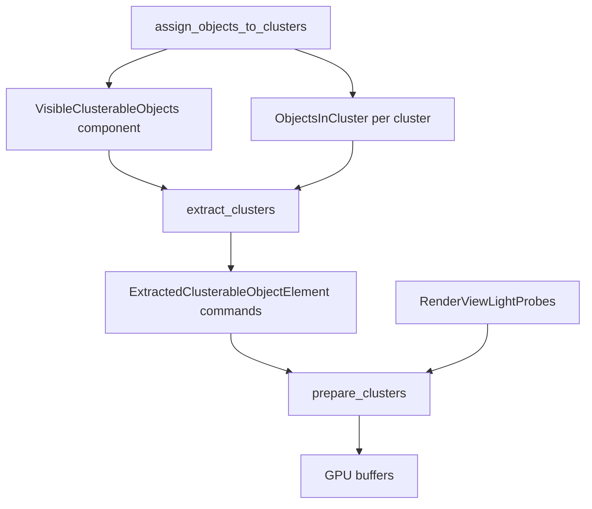

+++
title = "#22621 Assign indices to light probes in the clustered objects list, and refactor the clustering code."
date = "2026-01-22T00:00:00"
draft = false
template = "pull_request_page.html"
in_search_index = true

[taxonomies]
list_display = ["show"]

[extra]
current_language = "en"
available_languages = {"en" = { name = "English", url = "/pull_request/bevy/2026-01/pr-22621-en-20260122" }, "zh-cn" = { name = "中文", url = "/pull_request/bevy/2026-01/pr-22621-zh-cn-20260122" }}
labels = ["C-Bug", "A-Rendering"]
+++

# Title: Assign indices to light probes in the clustered objects list, and refactor the clustering code.

## Basic Information
- **Title**: Assign indices to light probes in the clustered objects list, and refactor the clustering code.
- **PR Link**: https://github.com/bevyengine/bevy/pull/22621
- **Author**: pcwalton
- **Status**: MERGED
- **Labels**: C-Bug, A-Rendering, S-Ready-For-Final-Review
- **Created**: 2026-01-21T07:56:08Z
- **Merged**: 2026-01-22T17:58:24Z
- **Merged By**: alice-i-cecile

## Description Translation

At the moment, clustering is a three-step process:

1. `assign_objects_to_clusters` runs on all clusterable objects during the `PostUpdate` schedule, creating lists of all clusterable objects in each view.

2. During the extraction phase, `extract_clusters` runs on all views that had clusters created for them, linearizing the clusters into a list of `ExtractedClusterableObjectElement::ClusterHeader` commands followed by other `ExtractedClusterableObjectElement`s, one for each object in the cluster. Each `ExtractedClusterableObjectElement` specifies the render world entity for the clusterable object.

3. In the render world, `prepare_clusters` processes all `ExtractedClusterableObjectElement` commands to create the GPU buffers, looking up each clustered object in the `GlobalClusterableObjectMeta` table in order to translate from entity to index.

Unfortunately, there are two main problems with this:

a. Light probes don't have render world entities at all and are instead tracked in `RenderViewLightProbes` components in the render world. Thus step (2) silently fails for them.

b. The `GlobalClusterableObjectMeta` table only contains clustered lights and decals, so even if light probes had render-world entities, step (3) would still fail.

The end result is that the GPU ends up consulting bogus out-of-bounds indices that may or may not actually refer to the light probe when traversing clusters.

This PR fixes the issues:

* I extended `extract_clusters` to support light probes, by adding `ExtractedClusterableObjectElement::ReflectionProbe` and `ExtractedClusterableObjectElement::IrradianceVolume` variants. These variants reference the *main* world entities for light probes, since no render-world entities exist for them.

* When processing the new `ExtractedClusterableObjectElement` commands, `prepare_clusters` uses the `RenderViewLightProbes` to find the index in the reflection probe or irradiance volume table as appropriate and supply it to the GPU. Note that this step might fail if a texture that the light probe needs hasn't been loaded yet. In this case, an index of -1 is stored, and the shader skips it. This isn't the optimum behavior; ideally we wouldn't cluster such objects at all. However, it was a minimally-invasive change.

* I renamed types that referenced clusterable objects to refer to clusterable *lights* specifically if the types only dealt with lights, to reduce confusion in the future.

* The `VisibleClusterableObjects` type is currently overloaded to both serve as a component, in which case it contains *all* clusterable objects associated with a view, and to serve as a container for the objects associated with a cluster. Not only is this confusing, but it's also wasteful, as there's bookkeeping that the type does that's not needed when it's serving as a component. I split the type into the component `VisibleClusterableObjects` and the helper structure `ObjectsInCluster`, and encapsulated logic within each type in order to make `assign_objects_to_clusters` easier to understand.

* The `gather_light_probes` system performed its own frustum culling on light probes separately from the frustum culling that `assign_objects_to_clusters` also does. This was wasteful and confusing, especially since the frustum culling algorithms differed between the two systems, so I simplified the logic so that `assign_objects_to_clusters` fills out a table for `gather_light_probes` to use.

* `compute_radiances` in `environment_map.wgsl` was broken, as it neglected to set `light_from_world` to the identity matrix when falling back to the view environment map when a reflection probe wasn't found. This would cause specular to vanish in some cases (e.g. in the `reflection_probes` example). I fixed the problem.

This commit is a prerequisite for #22610, as multiple light probes are too broken without it.

## The Story of This Pull Request

This PR addresses a critical bug in Bevy's clustered forward rendering system where light probes were not being properly assigned indices in the clustered objects list. The issue stemmed from architectural mismatches between how lights and light probes are managed in the rendering pipeline.

The problem manifested in two specific ways. First, light probes don't have render-world entities—they're tracked in separate `RenderViewLightProbes` components instead. The existing `extract_clusters` system only handled entities that existed in both the main and render worlds, causing it to silently skip light probes. Second, even if light probes had render-world entities, the `GlobalClusterableObjectMeta` table only contained mappings for lights and decals, so the subsequent index lookup would fail.

The consequence was that shaders would access out-of-bounds memory when trying to use clustered light probes, leading to undefined behavior and rendering artifacts. This was particularly problematic for scenes with multiple light probes, making the feature essentially unusable.

The solution involved modifying the data flow through the clustering pipeline. Instead of forcing light probes into the entity-based paradigm used by lights, the implementation now handles them through dedicated data paths. In the extraction phase, `extract_clusters` was extended to emit new command variants (`ReflectionProbe` and `IrradianceVolume`) that reference main-world entities directly. During preparation, `prepare_clusters` now consults the appropriate `RenderViewLightProbes` component to map these main-world entities to their GPU buffer indices.

A key design decision was how to handle light probes whose textures haven't finished loading. The simplest approach was to store an index of -1 (via `push_dummy_index()`) and let the shader skip them. This is suboptimal but minimally invasive; a better solution would avoid clustering unloaded probes entirely, but that would require more extensive changes to the clustering logic.

While fixing the core bug, the PR also included several refactoring improvements to make the codebase more maintainable. The `VisibleClusterableObjects` type was split into two distinct structures: `VisibleClusterableObjects` as a component storing all visible clusterable objects per view, and `ObjectsInCluster` as a helper for objects within individual clusters. This separation eliminated unnecessary bookkeeping and clarified responsibilities.

The PR also removed duplicate frustum culling logic. Previously, `gather_light_probes` performed its own culling separate from `assign_objects_to_clusters`, using different algorithms. Now, `assign_objects_to_clusters` populates a table that `gather_light_probes` consults, ensuring consistent culling and eliminating redundant work.

Finally, a bug was fixed in the environment map shader where the `light_from_world` matrix wasn't properly set to identity when falling back to the view environment map, which caused specular reflections to disappear in certain cases.

These changes collectively fix the immediate bug while improving the codebase's structure, setting the stage for further improvements to light probe clustering.

## Visual Representation



## Key Files Changed

### `crates/bevy_light/src/cluster/assign.rs` (+278/-295)
This file contains the core clustering algorithm. The main changes involve refactoring to use the new `ObjectsInCluster` type and integrating light probe handling.

Key changes:
- Split `VisibleClusterableObjects` usage into separate component and per-cluster structures
- Added proper type-based tracking for light probes in the visible objects list
- Removed duplicate entity list management

```rust
// Before: Using a single type for both purposes
for clusterable_objects in &mut clusters.clusterable_objects {
    clusterable_objects.entities.clear();
    clusterable_objects.counts = default();
}

// After: Clear using dedicated method
for clusterable_objects in &mut clusters.clusterable_objects {
    clusterable_objects.clear();
}

// Before: Manual entity and count tracking
clusters.clusterable_objects[cluster_index]
    .entities
    .push(clusterable_object.entity);
clusters.clusterable_objects[cluster_index]
    .counts
    .spot_lights += 1;

// After: Encapsulated in methods
clusters.clusterable_objects[cluster_index]
    .add_spot_light(clusterable_object.entity);
```

### `crates/bevy_pbr/src/cluster.rs` (+199/-50)
This file handles the extraction and preparation of clustered objects for GPU consumption. The changes add support for light probes through new command variants and index resolution.

Key changes:
- Added new `ExtractedClusterableObjectElement` variants for light probes
- Modified `prepare_clusters` to resolve light probe indices from `RenderViewLightProbes`
- Renamed light-specific types to clarify their purpose (`GpuClusterableObject` → `GpuClusteredLight`)

```rust
// New variants for light probes
enum ExtractedClusterableObjectElement {
    ClusterHeader(ClusterableObjectCounts),
    Light(Entity),                    // For point/spot lights
    ReflectionProbe(MainEntity),      // New: for environment maps
    IrradianceVolume(MainEntity),     // New: for irradiance volumes
    Decal(Entity),
}

// Index resolution for light probes in prepare_clusters
ExtractedClusterableObjectElement::ReflectionProbe(main_entity) => {
    match maybe_environment_maps.and_then(|environment_maps| {
        environment_maps
            .main_entity_to_render_light_probe_index
            .get(main_entity)
    }) {
        Some(render_light_probe_index) => {
            view_clusters_bindings.push_index(*render_light_probe_index as usize);
        }
        None => {
            view_clusters_bindings.push_dummy_index();
        }
    }
}
```

### `crates/bevy_pbr/src/light_probe/mod.rs` (+105/-64)
This file manages light probe gathering and preparation. The changes remove duplicate frustum culling and integrate with the clustering system.

Key changes:
- `gather_light_probes` now uses the visible light probes list from `assign_objects_to_clusters`
- Added entity-to-index mapping in `RenderViewLightProbes` for cluster index resolution
- Removed standalone frustum culling logic

```rust
// Before: Separate frustum culling in gather_light_probes
view_reflection_probes.extend(
    reflection_probes
        .iter()
        .filter(|light_probe_info| light_probe_info.frustum_cull(view_frustum))
        .cloned(),
);

// After: Use pre-culled list from VisibleClusterableObjects
if let Some(visible_light_probes) = visible_clusterable_objects
    .light_probes
    .get(&TypeId::of::<C>())
{
    for &main_entity in visible_light_probes {
        // Look up and process light probe
    }
}
```

### `crates/bevy_light/src/cluster/mod.rs` (+98/-12)
This file defines the data structures for clustering. The changes split `VisibleClusterableObjects` and add the `ObjectsInCluster` helper.

Key changes:
- Added `ObjectsInCluster` struct for per-cluster object tracking
- Refactored `VisibleClusterableObjects` to separate light types
- Added type-safe methods for adding different object types

```rust
// New structure for objects within a single cluster
pub struct ObjectsInCluster {
    clusterables: Vec<Entity>,
    pub counts: ClusterableObjectCounts,
}

impl ObjectsInCluster {
    pub fn add_spot_light(&mut self, entity: Entity) {
        self.clusterables.push(entity);
        self.counts.spot_lights += 1;
    }
    // ... similar methods for other types
}

// Revised component for all visible clusterable objects in a view
pub struct VisibleClusterableObjects {
    pub point_and_spot_lights: Vec<Entity>,
    pub light_probes: TypeIdMap<Vec<Entity>>,
}
```

### `crates/bevy_pbr/src/render/light.rs` (+19/-13)
This file prepares lights for rendering. The changes are minimal but important for consistency.

Key changes:
- Updated variable names from `global_light_meta` to `global_clusterable_object_meta` to reflect broader responsibility
- Updated comments to acknowledge that clusterable objects include more than just lights

```rust
// Before: Specifically about lights
global_light_meta.entity_to_index.insert(entity, index);

// After: More general naming
global_clusterable_object_meta.entity_to_index.insert(entity, index);
```

## Further Reading

1. **Practical Clustered Shading** (Persson et al.): The original paper describing the clustering algorithm used in Bevy. Available at: http://newq.net/dl/pub/s2015_practical.pdf

2. **Bevy Rendering Architecture**: The Bevy engine's documentation on its ECS-based rendering architecture provides context for understanding how extraction and preparation systems work.

3. **WebGPU Shader Language (WGSL)**: Understanding WGSL is essential for following the shader changes in this PR, particularly the fixes in `environment_map.wgsl`.

4. **Spatial Data Structures for Real-Time Rendering**: Resources on frustum culling, spatial partitioning, and clustering algorithms would help understand the optimization aspects of this PR.

5. **Bevy Light Probes Documentation**: The Bevy book's sections on environment maps and irradiance volumes explain the light probe system this PR fixes.