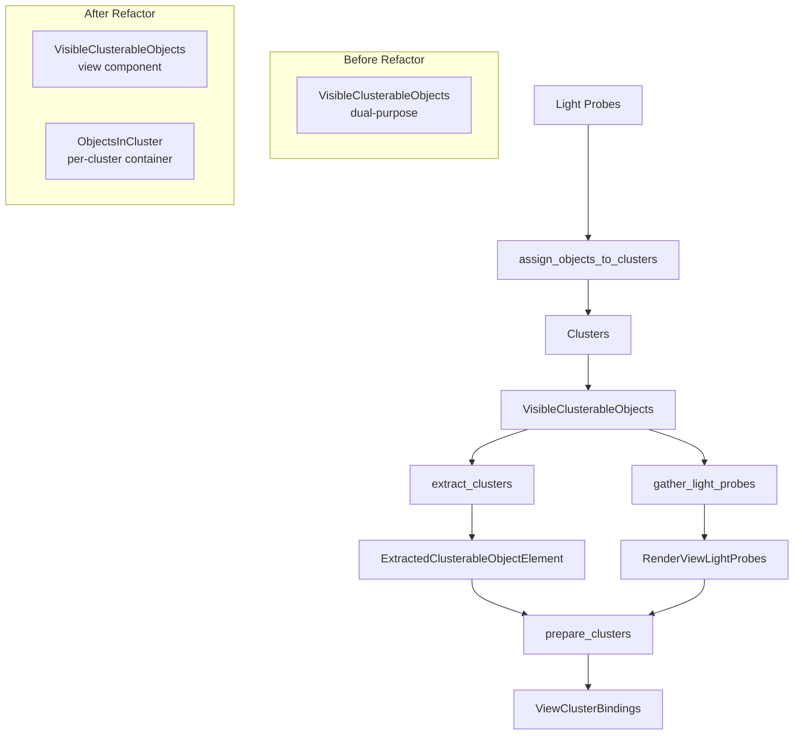

+++
title = "#22621 Assign indices to light probes in the clustered objects list, and refactor the clustering code."
date = "2026-01-22T00:00:00"
draft = false
template = "pull_request_page.html"
in_search_index = false

[extra]
current_language = "zh-cn"
available_languages = {"en" = { name = "English", url = "/pull_request/bevy/2026-01/pr-22621-en-20260122" }, "zh-cn" = { name = "中文", url = "/pull_request/bevy/2026-01/pr-22621-zh-cn-20260122" }}
labels = ["C-Bug", "A-Rendering"]
+++

# Title
Assign indices to light probes in the clustered objects list, and refactor the clustering code.

## Basic Information
- **Title**: Assign indices to light probes in the clustered objects list, and refactor the clustering code.
- **PR Link**: https://github.com/bevyengine/bevy/pull/22621
- **Author**: pcwalton
- **Status**: MERGED
- **Labels**: C-Bug, A-Rendering, S-Ready-For-Final-Review
- **Created**: 2026-01-21T07:56:08Z
- **Merged**: 2026-01-22T17:58:24Z
- **Merged By**: alice-i-cecile

## Description Translation
目前，聚类（clustering）是一个三步过程：

1. `assign_objects_to_clusters` 在主世界的 `PostUpdate` 调度中运行，为每个视图（view）创建所有可聚类对象的列表。

2. 在提取阶段，`extract_clusters` 在所有已创建聚类的视图上运行，将聚类线性化为一个列表，包含 `ExtractedClusterableObjectElement::ClusterHeader` 命令，后跟其他 `ExtractedClusterableObjectElement`（每个对象一个）。每个 `ExtractedClusterableObjectElement` 指定可聚类对象的渲染世界实体。

3. 在渲染世界中，`prepare_clusters` 处理所有 `ExtractedClusterableObjectElement` 命令以创建 GPU 缓冲区，通过查询 `GlobalClusterableObjectMeta` 表将实体转换为索引。

不幸的是，这存在两个主要问题：

a. 光照探针（light probe）根本没有渲染世界实体，而是通过渲染世界中的 `RenderViewLightProbes` 组件进行跟踪。因此步骤（2）对它们静默失败。

b. `GlobalClusterableObjectMeta` 表仅包含聚类的光源和贴花（decal），因此即使光照探针有渲染世界实体，步骤（3）仍然会失败。

最终结果是 GPU 在遍历聚类时使用可能越界的无效索引，这些索引可能指向也可能不指向光照探针。

此 PR 修复了这些问题：

* 我扩展了 `extract_clusters` 以支持光照探针，添加了 `ExtractedClusterableObjectElement::ReflectionProbe` 和 `ExtractedClusterableObjectElement::IrradianceVolume` 变体。这些变体引用光照探针的*主*世界实体，因为它们在渲染世界中没有实体。

* 在处理新的 `ExtractedClusterableObjectElement` 命令时，`prepare_clusters` 使用 `RenderViewLightProbes` 来查找在反射探针或辐照体积表中的相应索引并提供给 GPU。注意，如果光照探针所需的纹理尚未加载，此步骤可能失败。在这种情况下，存储索引 -1，着色器会跳过它。这不是最优行为；理想情况下我们根本不会聚类此类对象。然而，这是一个侵入性最小的更改。

* 我重命名了仅处理光源的类型，使其专门引用可聚类的*光源*，以减少未来的混淆。

* `VisibleClusterableObjects` 类型目前被重载，既用作组件（此时它包含与视图关联的*所有*可聚类对象），又用作与聚类关联的对象的容器。这不仅令人困惑，而且浪费，因为该类型进行的一些簿记在用作组件时并不需要。我将该类型拆分为组件 `VisibleClusterableObjects` 和辅助结构 `ObjectsInCluster`，并将逻辑封装在每种类型内部，以使 `assign_objects_to_clusters` 更易理解。

* `gather_light_probes` 系统单独对光照探针执行自己的视锥体剔除（frustum culling），与 `assign_objects_to_clusters` 也执行的视锥体剔除分开。这既浪费又令人困惑，特别是因为两个系统之间的视锥体剔除算法不同，因此我简化了逻辑，使 `assign_objects_to_clusters` 填充一个供 `gather_light_probes` 使用的表。

* `environment_map.wgsl` 中的 `compute_radiances` 存在错误，因为在未找到反射探针而回退到视图环境贴图时，它忽略了将 `light_from_world` 设置为单位矩阵。这会导致在某些情况下（例如在 `reflection_probes` 示例中）高光消失。我修复了这个问题。

此提交是 #22610 的先决条件，因为没有它，多个光照探针会严重损坏。

## The Story of This Pull Request

在 Bevy 的渲染系统中，空间聚类（spatial clustering）是一种优化技术，用于高效地处理大量光源、贴花和光照探针。然而，原有的实现存在一个关键缺陷：光照探针（包括反射探针和辐照体积）没有被正确地集成到聚类流水线中。

问题的根源在于光照探针的实体管理方式与其他可聚类对象不同。点光源和聚光灯在渲染世界中有对应的实体，但光照探针没有。它们的数据存储在 `RenderViewLightProbes` 组件中。原有的聚类流水线假设所有可聚类对象都有渲染世界实体，这导致光照探针在提取和准备阶段被忽略，最终 GPU 会访问无效的索引。

开发者识别到两个具体问题：首先，`extract_clusters` 系统无法处理没有渲染世界实体的光照探针；其次，`GlobalClusterableObjectMeta` 表不包含光照探针的索引映射。结果是光照探针要么完全不被聚类，要么在着色器中导致未定义行为。

解决方案采用了分阶段的方法。首先，扩展了提取系统，使其能够识别光照探针。这通过向 `ExtractedClusterableObjectElement` 枚举添加新的变体 `ReflectionProbe` 和 `IrradianceVolume` 来实现。这些变体存储主世界实体，因为光照探针在渲染世界中没有实体。

```rust
enum ExtractedClusterableObjectElement {
    ClusterHeader(ClusterableObjectCounts),
    Light(Entity),
    ReflectionProbe(MainEntity),
    IrradianceVolume(MainEntity),
    Decal(Entity),
}
```

在准备阶段，`prepare_clusters` 系统现在需要查询 `RenderViewLightProbes` 组件来获取光照探针的索引。如果光照探针的纹理尚未加载，系统会存储一个占位符索引 -1，着色器会安全地跳过这些探针。虽然这不是最理想的处理方式（理想情况下不应聚类未加载的对象），但这是一个最小化的修复，避免了更复杂的改动。

除了修复核心问题，这个 PR 还进行了重要的代码重构。`VisibleClusterableObjects` 类型原本承担双重职责：既作为视图组件存储所有可见的可聚类对象，又作为单个聚类的容器存储该聚类中的对象。这种设计导致混淆和性能浪费。重构将其拆分为两个独立的类型：`VisibleClusterableObjects` 组件和 `ObjectsInCluster` 结构体。

```rust
#[derive(Clone, Component, Debug, Default)]
pub struct VisibleClusterableObjects {
    pub point_and_spot_lights: Vec<Entity>,
    pub light_probes: TypeIdMap<Vec<Entity>>,
}

#[derive(Default, Debug)]
pub struct ObjectsInCluster {
    clusterables: Vec<Entity>,
    pub counts: ClusterableObjectCounts,
}
```

这种分离使职责更清晰：`VisibleClusterableObjects` 只负责按类型组织视图级别的可见对象，而 `ObjectsInCluster` 只负责管理单个聚类中的对象。`ObjectsInCluster` 还提供了类型安全的方法来添加不同种类的对象，如 `add_spot_light`、`add_reflection_probe` 等。

另一个优化是消除了重复的视锥体剔除。原本 `gather_light_probes` 系统会独立地对光照探针执行视锥体剔除，而 `assign_objects_to_clusters` 已经进行了相同的计算。这不仅浪费性能，而且两个系统使用的剔除算法可能存在差异。重构后，`assign_objects_to_clusters` 将可见的光照探针填充到 `VisibleClusterableObjects` 的 `light_probes` 字段中，`gather_light_probes` 只需直接使用这个预计算的结果。

在着色器层面，修复了一个重要的 bug。在 `environment_map.wgsl` 中，当回退到视图环境贴图时，`light_from_world` 矩阵没有被正确设置为单位矩阵，导致变换错误。修复确保在这种情况下使用单位矩阵，避免高光消失。

这个 PR 还进行了命名清理，将一些仅适用于光源的类型重命名，例如 `GpuClusterableObject` 改为 `GpuClusteredLight`，使意图更明确。这有助于防止未来的开发者错误地将这些类型用于非光源的聚类对象。

这些改动共同解决了光照探针在聚类流水线中的集成问题，为支持多个光照探针的功能铺平了道路。代码结构变得更清晰，职责分离更明确，性能通过消除重复计算得到改善，同时修复了着色器中的渲染错误。

## Visual Representation



## Key Files Changed

### `crates/bevy_light/src/cluster/assign.rs` (+278/-295)

这是聚类分配的主要逻辑文件。改动主要集中在重构 `VisibleClusterableObjects` 的使用方式，将其拆分为 `VisibleClusterableObjects` 组件和 `ObjectsInCluster` 结构体。

**关键修改：**
```rust
// Before:
for clusterable_objects in &mut clusters.clusterable_objects {
    clusterable_objects.entities.clear();
    clusterable_objects.counts = default();
}

// After:
for clusterable_objects in &mut clusters.clusterable_objects {
    clusterable_objects.clear();
}
```

```rust
// 添加对象的方法从直接操作字段改为调用类型安全的方法
// Before:
clusters.clusterable_objects[cluster_index]
    .entities
    .push(clusterable_object.entity);
clusters.clusterable_objects[cluster_index]
    .counts
    .spot_lights += 1;

// After:
clusters.clusterable_objects[cluster_index]
    .add_spot_light(clusterable_object.entity);
```

**为什么重要：** 这个文件包含了聚类分配的核心算法。重构使代码更清晰，减少了错误的可能性，并为光照探针的正确处理奠定了基础。

### `crates/bevy_pbr/src/cluster.rs` (+199/-50)

这个文件处理聚类的提取和准备阶段。主要改动是扩展了对光照探针的支持。

**关键修改：**
```rust
// 扩展了提取的元素类型，支持光照探针
enum ExtractedClusterableObjectElement {
    ClusterHeader(ClusterableObjectCounts),
    Light(Entity),
    ReflectionProbe(MainEntity),
    IrradianceVolume(MainEntity),
    Decal(Entity),
}
```

```rust
// 在 prepare_clusters 中处理光照探针
ExtractedClusterableObjectElement::ReflectionProbe(main_entity) => {
    match maybe_environment_maps.and_then(|environment_maps| {
        environment_maps
            .main_entity_to_render_light_probe_index
            .get(main_entity)
    }) {
        Some(render_light_probe_index) => {
            view_clusters_bindings.push_index(*render_light_probe_index as usize);
        }
        None => {
            // 光照探针尚未加载时的处理
            view_clusters_bindings.push_dummy_index();
        }
    }
}
```

**为什么重要：** 这个文件是连接主世界和渲染世界聚类数据的关键桥梁。添加对光照探针的支持是修复的核心。

### `crates/bevy_pbr/src/light_probe/mod.rs` (+105/-64)

这个文件管理光照探针的收集和准备。主要改动是简化了 `gather_light_probes` 系统，使其重用 `assign_objects_to_clusters` 的视锥体剔除结果。

**关键修改：**
```rust
// Before: 独立执行视锥体剔除
view_reflection_probes.clear();
view_reflection_probes.extend(
    reflection_probes
        .iter()
        .filter(|light_probe_info| light_probe_info.frustum_cull(view_frustum))
        .cloned(),
);

// After: 重用 VisibleClusterableObjects 中的结果
if let Some(visible_light_probes) = visible_clusterable_objects
    .light_probes
    .get(&TypeId::of::<C>())
{
    for &main_entity in visible_light_probes {
        // 直接使用预计算的可见光照探针列表
    }
}
```

**为什么重要：** 消除了重复的视锥体剔除计算，提高了性能，并确保了一致的剔除逻辑。

### `crates/bevy_light/src/cluster/mod.rs` (+98/-12)

这个文件定义了聚类相关的数据结构。主要改动是拆分 `VisibleClusterableObjects` 并添加了 `ObjectsInCluster`。

**关键修改：**
```rust
// 新的数据结构定义
#[derive(Clone, Component, Debug, Default)]
pub struct VisibleClusterableObjects {
    pub point_and_spot_lights: Vec<Entity>,
    pub light_probes: TypeIdMap<Vec<Entity>>,
}

#[derive(Default, Debug)]
pub struct ObjectsInCluster {
    clusterables: Vec<Entity>,
    pub counts: ClusterableObjectCounts,
}
```

**为什么重要：** 这些数据结构是整个聚类系统的基础。清晰的分离使代码更易理解和维护。

### `crates/bevy_pbr/src/render/light.rs` (+19/-13)

这个文件准备光源数据。主要改动是更新了类型名称以反映其实际用途。

**关键修改：**
```rust
// 更新类型名称以更准确地反映用途
// Before: gpu_point_lights
// After: gpu_clustered_lights
let mut gpu_clustered_lights = Vec::new();
// ...
global_clusterable_object_meta
    .gpu_clustered_lights
    .set(gpu_clustered_lights);
```

**为什么重要：** 保持命名一致性有助于理解代码，防止将仅适用于光源的类型误用于其他可聚类对象。

## Further Reading

1. **Practical Clustered Shading** by Persson et al. - 聚类算法的原始论文，介绍了迭代球体细化算法。
   http://newq.net/dl/pub/s2015_practical.pdf

2. **Bevy Rendering Architecture** - Bevy 官方文档中关于渲染管线的部分，了解提取、准备和排队阶段。
   https://bevyengine.org/learn/architecture/render/

3. **Spatial Data Structures for Real-Time Rendering** - 实时渲染中空间数据结构的概述，有助于理解聚类技术的背景。
   https://developer.nvidia.com/gpugems/gpugems2/part-i-geometric-complexity/chapter-7-spatial-data-structures-real-time-rendering

4. **WGSL Shader Language** - WebGPU 着色语言规范，用于理解着色器代码的修改。
   https://www.w3.org/TR/WGSL/

5. **Entity Component System Pattern** - 了解 ECS 模式如何用于组织渲染系统。
   https://en.wikipedia.org/wiki/Entity_component_system