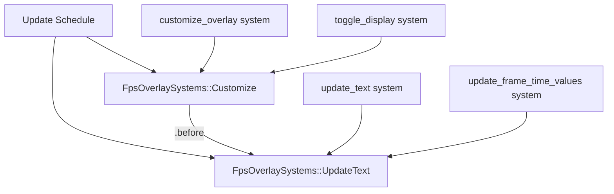

+++
title = "#22629 Fix FPS overlay system ordering ambiguity"
date = "2026-01-22T00:00:00"
draft = false
template = "pull_request_page.html"
in_search_index = true

[taxonomies]
list_display = ["show"]

[extra]
current_language = "en"
available_languages = {"en" = { name = "English", url = "/pull_request/bevy/2026-01/pr-22629-en-20260122" }, "zh-cn" = { name = "中文", url = "/pull_request/bevy/2026-01/pr-22629-zh-cn-20260122" }}
labels = ["C-Bug", "A-Diagnostics", "D-Straightforward"]
+++

# Title

## Basic Information
- **Title**: Fix FPS overlay system ordering ambiguity
- **PR Link**: https://github.com/bevyengine/bevy/pull/22629
- **Author**: JWSong
- **Status**: MERGED
- **Labels**: C-Bug, A-Diagnostics, X-Uncontroversial, D-Straightforward, S-Needs-Review
- **Created**: 2026-01-21T17:33:58Z
- **Merged**: 2026-01-22T19:01:23Z
- **Merged By**: alice-i-cecile

## Description Translation

# Objective

Fixes #22571 

## Solution

Added `FpsOverlaySystems` system set and explicitly ordered `customize_overlay` to run before `update_text`. This gets rid of the internal ambiguity warnings and also gives users a way to order their own systems against the overlay.

## Testing

Ran locally with ambiguity warnings enabled - no more internal overlay warnings. Didn't add a unit test since scheduling order is tricky to test in isolation.
To verify:
- Enable `ScheduleBuildSettings` ambiguity warnings.
- Add a user system that uses `TextUiWriter`.
- Run an app with `FpsOverlayPlugin` and confirm no overlay-related ambiguity warnings.

## The Story of This Pull Request

This PR addresses a system ordering ambiguity in Bevy's FPS overlay functionality. The issue surfaced when developers enabled ambiguity warnings in their Bevy applications, revealing that the FPS overlay systems didn't have explicit ordering constraints, causing the scheduler to issue warnings about potential nondeterministic execution.

The root problem was in the FPS overlay plugin's system scheduling. Two key systems - `customize_overlay` and `update_text` - both write to UI text components using `TextUiWriter`. Without explicit ordering, Bevy's scheduler couldn't guarantee which system would run first when both were eligible to execute. While this might not cause obvious bugs in practice, it violates the determinism guarantees that explicit system ordering aims to provide in ECS architectures.

The solution implements a straightforward but important pattern in Bevy's scheduling system: defining a dedicated system set for related systems. The developer created a new `FpsOverlaySystems` enum with two variants: `Customize` and `UpdateText`. This approach serves dual purposes: it resolves the immediate ambiguity warning by providing explicit ordering constraints, and it provides a public API endpoint for users to order their own systems relative to the overlay systems.

The implementation follows Bevy's standard pattern for system ordering:

```rust
app.configure_sets(
    Update,
    FpsOverlaySystems::Customize.before(FpsOverlaySystems::UpdateText),
)
```

This configuration establishes that `Customize` systems must run before `UpdateText` systems within the `Update` schedule. The individual systems are then assigned to their respective sets:

```rust
(toggle_display, customize_overlay)
    .run_if(resource_changed::<FpsOverlayConfig>)
    .in_set(FpsOverlaySystems::Customize),
update_text
    .run_if(on_timer(self.config.refresh_interval))
    .in_set(FpsOverlaySystems::UpdateText),
```

This structure makes the dependencies explicit and clear: configuration changes (handled by `customize_overlay`) must be applied before the text is updated (handled by `update_text`). The logical flow here is that you want to apply any styling or formatting changes from the config before computing and displaying the actual FPS values.

A secondary but important change was made in the frame time graph module. The `update_frame_time_values` system was also added to the `FpsOverlaySystems::UpdateText` set. This ensures that both text-updating systems (FPS overlay and frame time graph) are grouped together in the same execution phase, maintaining consistency in how they interact with the UI text components.

The PR author made a pragmatic decision not to include unit tests for the scheduling changes, noting that "scheduling order is tricky to test in isolation." This is a reasonable trade-off given that the primary validation method is enabling ambiguity warnings and verifying they disappear. The testing instructions provided are practical and sufficient for verifying the fix works as intended.

This fix demonstrates an important pattern in Bevy development: when multiple systems access the same resources (in this case, UI text components), explicit ordering is necessary to guarantee deterministic behavior. The solution is minimal and focused, adding just enough structure to resolve the ambiguity without over-engineering or introducing unnecessary complexity.

## Visual Representation



## Key Files Changed

### `crates/bevy_dev_tools/src/fps_overlay.rs` (+19/-3)

This file contains the main changes to fix the system ordering ambiguity. The changes introduce a new system set and reorganize how systems are scheduled.

**Key changes:**

1. **Added `FpsOverlaySystems` enum**:
```rust
/// System sets for FPS overlay updates.
#[derive(SystemSet, Debug, Hash, PartialEq, Eq, Clone)]
pub enum FpsOverlaySystems {
    /// Applies config changes to the overlay UI.
    Customize,
    /// Updates the overlay contents.
    UpdateText,
}
```

2. **Configured system ordering**:
```rust
app.configure_sets(
    Update,
    FpsOverlaySystems::Customize.before(FpsOverlaySystems::UpdateText),
)
```

3. **Assigned systems to appropriate sets**:
```rust
.add_systems(
    Update,
    (
        (toggle_display, customize_overlay)
            .run_if(resource_changed::<FpsOverlayConfig>)
            .in_set(FpsOverlaySystems::Customize),
        update_text
            .run_if(on_timer(self.config.refresh_interval))
            .in_set(FpsOverlaySystems::UpdateText),
    ),
);
```

### `crates/bevy_dev_tools/src/frame_time_graph/mod.rs` (+9/-3)

This file ensures the frame time graph system is properly ordered with the FPS overlay systems.

**Key changes:**

1. **Added necessary imports**:
```rust
use bevy_ecs::{
    schedule::IntoScheduleConfigs,
    system::{Res, ResMut},
};
use crate::fps_overlay::{FpsOverlayConfig, FpsOverlaySystems};
```

2. **Added the frame time graph system to the UpdateText set**:
```rust
.add_systems(
    Update,
    update_frame_time_values.in_set(FpsOverlaySystems::UpdateText),
);
```

## Further Reading

- [Bevy ECS System Ordering Documentation](https://docs.rs/bevy/latest/bevy/ecs/schedule/index.html) - Official documentation on Bevy's system scheduling and ordering
- [Bevy System Sets Guide](https://bevy-cheatbook.github.io/programming/system-sets.html) - Comprehensive guide to using system sets for organization and ordering
- [ECS Scheduling and Ambiguity Detection](https://github.com/bevyengine/bevy/blob/main/examples/ecs/schedule.rs) - Example demonstrating system ordering patterns
- [TextUiWriter Documentation](https://docs.rs/bevy/latest/bevy/text/struct.TextUiWriter.html) - API reference for the text component writer that was causing the ambiguity