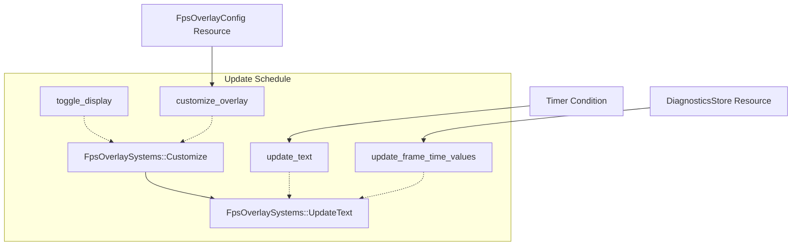

+++
title = "#22629 Fix FPS overlay system ordering ambiguity"
date = "2026-01-22T00:00:00"
draft = false
template = "pull_request_page.html"
in_search_index = false

[extra]
current_language = "zh-cn"
available_languages = {"en" = { name = "English", url = "/pull_request/bevy/2026-01/pr-22629-en-20260122" }, "zh-cn" = { name = "中文", url = "/pull_request/bevy/2026-01/pr-22629-zh-cn-20260122" }}
labels = ["C-Bug", "A-Diagnostics", "D-Straightforward"]
+++

# Title
## Basic Information
- **Title**: Fix FPS overlay system ordering ambiguity
- **PR Link**: https://github.com/bevyengine/bevy/pull/22629
- **Author**: JWSong
- **Status**: MERGED
- **Labels**: C-Bug, A-Diagnostics, X-Uncontroversial, D-Straightforward, S-Needs-Review
- **Created**: 2026-01-21T17:33:58Z
- **Merged**: 2026-01-22T19:01:23Z
- **Merged By**: alice-i-cecile

## Description Translation

# Objective
修复问题 #22571

## 解决方案

添加了 `FpsOverlaySystems` 系统集，并明确指定 `customize_overlay` 在 `update_text` 之前运行。这消除了内部的歧义性警告，并为用户提供了将其自身系统与overlay系统排序的方法。

## 测试

在本地运行并启用歧义性警告——不再出现与overlay相关的内部警告。没有添加单元测试，因为在隔离环境中测试调度顺序较为困难。
验证方法：
- 启用 `ScheduleBuildSettings` 的歧义性警告。
- 添加一个使用 `TextUiWriter` 的用户系统。
- 运行一个包含 `FpsOverlayPlugin` 的应用，并确认没有出现与overlay相关的歧义性警告。

## The Story of This Pull Request

这个PR始于一个运行时警告。在Bevy中，当引擎无法确定两个系统（system）之间的执行顺序，而这两个系统又访问了相同的资源时，调度器（scheduler）会检测到潜在的“歧义性”（ambiguity）并发出警告。这是一个重要的安全机制，旨在防止数据竞争和不一致的状态。在PR #22629中，问题是`FpsOverlayPlugin`内部的两个系统——`customize_overlay`和`update_text`——都写入了`TextUiWriter`资源，但它们之间的执行顺序未被明确定义。这触发了引擎的歧义性检测，虽然在当前实现中可能不会导致实际的bug（因为两个系统在不同条件下运行），但警告本身会干扰开发，并且从架构上看，这是一种不良的模式。

问题的核心在于缺乏明确的排序契约。`customize_overlay`系统负责根据`FpsOverlayConfig`的变更来调整overlay的UI样式（如位置、颜色），而`update_text`系统则以固定间隔更新overlay上显示的FPS数值文本。虽然它们理论上可以通过运行条件（run condition）错开执行（一个响应配置变化，一个响应定时器），但从调度器的角度看，它们都被注册在`Update`阶段，且都修改`TextUiWriter`，因此必须定义明确的先后关系，否则调度器无法保证哪个系统先执行其写入操作，这理论上可能导致文本的短暂不一致。

开发者JWSong采用的解决方案直接且符合Bevy的最佳实践：引入一个系统集（SystemSet）。系统集是Bevy中用于分组和排序系统的主要抽象。在`crates/bevy_dev_tools/src/fps_overlay.rs`中，他定义了一个新的公共枚举`FpsOverlaySystems`，包含两个变体：`Customize`和`UpdateText`。

```rust
/// System sets for FPS overlay updates.
#[derive(SystemSet, Debug, Hash, PartialEq, Eq, Clone)]
pub enum FpsOverlaySystems {
    /// Applies config changes to the overlay UI.
    Customize,
    /// Updates the overlay contents.
    UpdateText,
}
```

这个定义不仅仅是添加了两个标签；它创建了一个正式的、可供其他系统引用的排序锚点。紧接着，在插件构建方法中，他使用`configure_sets`来建立这两个集合之间的顺序关系：`Customize`在`UpdateText`之前运行。这是解决歧义的关键一步，它为调度器提供了明确的排序指令。

```rust
app.insert_resource(self.config.clone())
    .configure_sets(
        Update,
        FpsOverlaySystems::Customize.before(FpsOverlaySystems::UpdateText),
    )
```

然后，开发者将原有的系统分别放入对应的集合中。`customize_overlay`系统（以及与其链在一起的`toggle_display`）被放入`FpsOverlaySystems::Customize`集，而`update_text`系统被放入`FpsOverlaySystems::UpdateText`集。这一步将系统与已定义好顺序的集合绑定，从而继承了`Customize`在`UpdateText`之前运行的约束。

```rust
.add_systems(
    Update,
    (
        (toggle_display, customize_overlay)
            .run_if(resource_changed::<FpsOverlayConfig>())
            .in_set(FpsOverlaySystems::Customize), // 分配到Customize集
        update_text
            .run_if(on_timer(self.config.refresh_interval))
            .in_set(FpsOverlaySystems::UpdateText), // 分配到UpdateText集
    ),
);
```

值得注意的是，这个修复的影响范围超出了`fps_overlay.rs`文件本身。在`crates/bevy_dev_tools/src/frame_time_graph/mod.rs`中，`FrameTimeGraphPlugin`也有一个系统`update_frame_time_values`，它同样需要更新UI来显示帧时间图表。为了确保这个系统的更新不会与FPS文本更新产生新的歧义，开发者也将这个系统加入了`FpsOverlaySystems::UpdateText`集合。这体现了良好的设计思维：扩展了新建的系统集的使用范围，确保了整个`bevy_dev_tools`模块内部UI更新逻辑的一致性。

```rust
.add_systems(
    Update,
    update_frame_time_values.in_set(FpsOverlaySystems::UpdateText),
);
```

从技术角度看，这个解决方案有几个优点：
1.  **消除警告**：最直接的效果是消除了恼人的歧义性警告，使开发输出更清晰。
2.  **定义明确契约**：它在代码中清晰地记录了“配置变更应用”必须在“内容更新”之前执行的逻辑依赖关系，提高了代码的可读性和可维护性。
3.  **提供扩展点**：通过将系统集（`FpsOverlaySystems`）定义为`pub`，这个PR为插件的使用者提供了一个官方“挂钩”。如果用户有自定义系统也需要与FPS Overlay交互（例如，在特定事件后修改overlay），他们现在可以明确地使用`before(FpsOverlaySystems::UpdateText)`或`after(FpsOverlaySystems::Customize)`来排序自己的系统，从而避免引入新的歧义。这是一个典型的面向接口而非实现的改进。

总之，这个PR是一个教科书式的“消除歧义性警告”的修复。它没有改变任何功能逻辑，但通过引入一个简单的、结构化的排序抽象（系统集），解决了潜在的调度问题，并提升了相关代码的API设计质量。这是一种低成本、高收益的维护性改进。

## Visual Representation


*图示说明*：在`Update`调度阶段，`FpsOverlaySystems::Customize`集被明确安排在`FpsOverlaySystems::UpdateText`集之前执行。`toggle_display`和`customize_overlay`系统属于`Customize`集，`update_text`和`update_frame_time_values`系统属于`UpdateText`集。虚线表示系统与集合的归属关系，实线表示集合间的执行顺序。下方的资源箭头表示系统所依赖的外部条件或数据。

## Key Files Changed

### 1. `crates/bevy_dev_tools/src/fps_overlay.rs` (+19/-3)
**修改目的**：定义FPS Overlay专用的系统集，并配置系统间的明确顺序以消除歧义。

**关键修改**：
1.  引入新的公共系统集`FpsOverlaySystems`。
```rust
// After (新增部分):
/// System sets for FPS overlay updates.
#[derive(SystemSet, Debug, Hash, PartialEq, Eq, Clone)]
pub enum FpsOverlaySystems {
    /// Applies config changes to the overlay UI.
    Customize,
    /// Updates the overlay contents.
    UpdateText,
}
```
2.  配置系统集顺序，并将现有系统分配到对应集合。
```rust
// Before (相关部分):
app.insert_resource(self.config.clone())
    .add_systems(Startup, setup)
    .add_systems(
        Update,
        (
            (toggle_display, customize_overlay)
                .run_if(resource_changed::<FpsOverlayConfig>),
            update_text.run_if(on_timer(self.config.refresh_interval)),
        ),
    );

// After (相关部分):
app.insert_resource(self.config.clone())
    .configure_sets(
        Update,
        FpsOverlaySystems::Customize.before(FpsOverlaySystems::UpdateText),
    )
    .add_systems(Startup, setup)
    .add_systems(
        Update,
        (
            (toggle_display, customize_overlay)
                .run_if(resource_changed::<FpsOverlayConfig>)
                .in_set(FpsOverlaySystems::Customize),
            update_text
                .run_if(on_timer(self.config.refresh_interval))
                .in_set(FpsOverlaySystems::UpdateText),
        ),
    );
```

### 2. `crates/bevy_dev_tools/src/frame_time_graph/mod.rs` (+9/-3)
**修改目的**：将帧时间图表的更新系统与FPS文本更新系统置于同一有序集合中，以保持整个调试工具UI更新逻辑的一致性，避免新的歧义。

**关键修改**：
1.  调整导入，以使用`IntoScheduleConfigs` trait（用于`.in_set()`方法）。
```rust
// Before:
use bevy_ecs::system::{Res, ResMut};

// After:
use bevy_ecs::{
    schedule::IntoScheduleConfigs,
    system::{Res, ResMut},
};
```
2.  导入`FpsOverlaySystems`系统集，并将`update_frame_time_values`系统加入`UpdateText`集。
```rust
// Before:
use crate::fps_overlay::FpsOverlayConfig;

// After:
use crate::fps_overlay::{FpsOverlayConfig, FpsOverlaySystems};

// ... 在 Plugin 实现中 ...
// Before:
app.add_plugins(UiMaterialPlugin::<FrametimeGraphMaterial>::default())
    .add_systems(Update, update_frame_time_values);

// After:
app.add_plugins(UiMaterialPlugin::<FrametimeGraphMaterial>::default())
    .add_systems(
        Update,
        update_frame_time_values.in_set(FpsOverlaySystems::UpdateText),
    );
```

## Further Reading
1.  **Bevy官方文档 - 系统排序 (System Ordering)**: 了解Bevy中系统执行顺序的不同控制方法，如`.before()`、`.after()`以及系统集（SystemSet）。
2.  **Bevy官方文档 - 歧义性检测 (Ambiguity Detection)**: 深入理解歧义性检测的工作原理、何时会触发警告以及解决策略。
3.  **Entity Component System (ECS) 模式**: 了解ECS架构的基本原理，理解系统如何通过查询和修改组件/资源来协作，以及为什么明确的执行顺序对数据一致性至关重要。